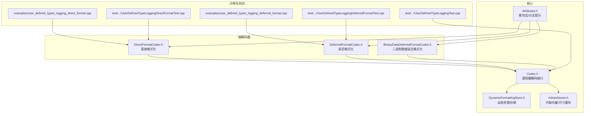
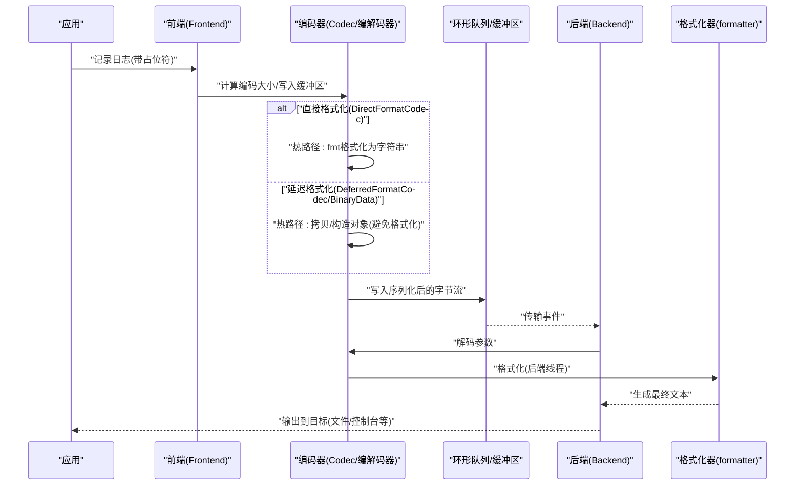
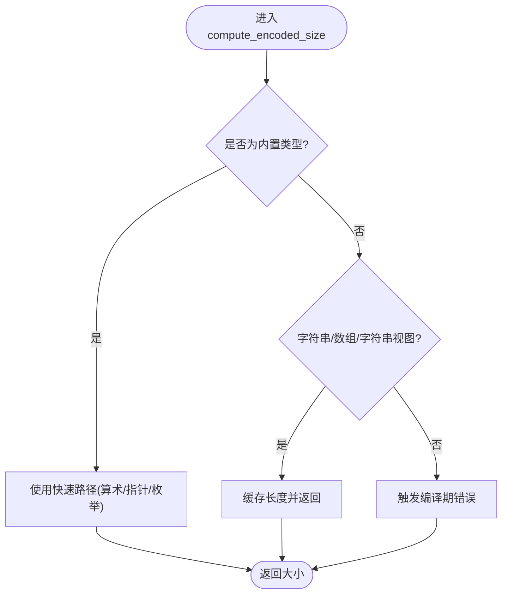
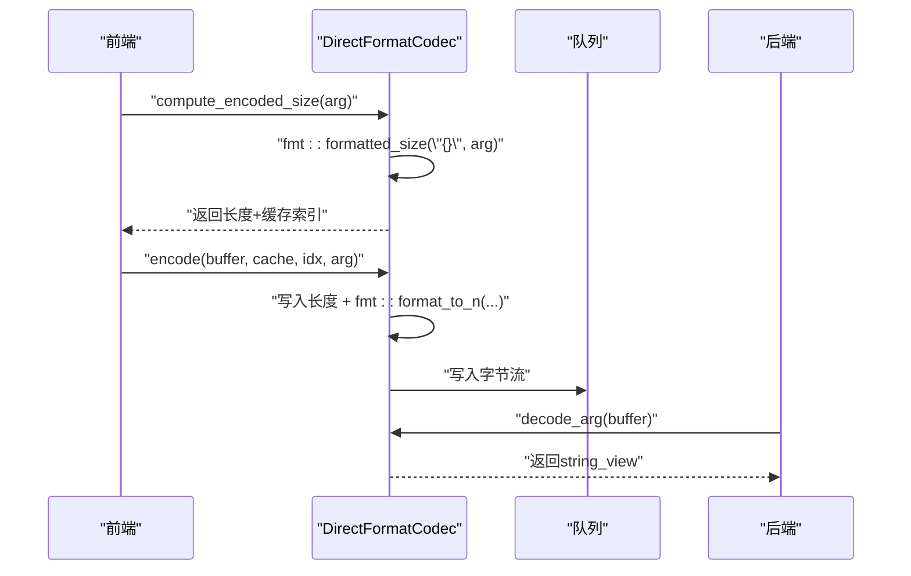
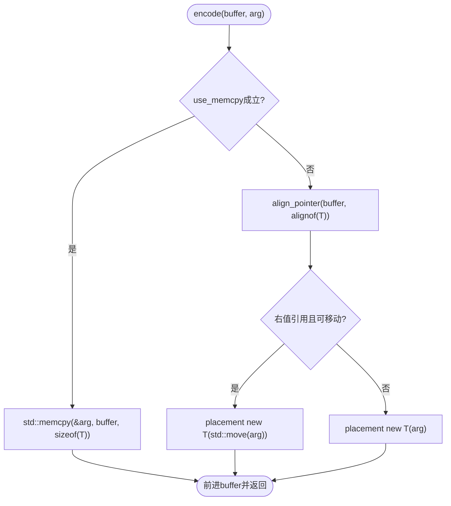
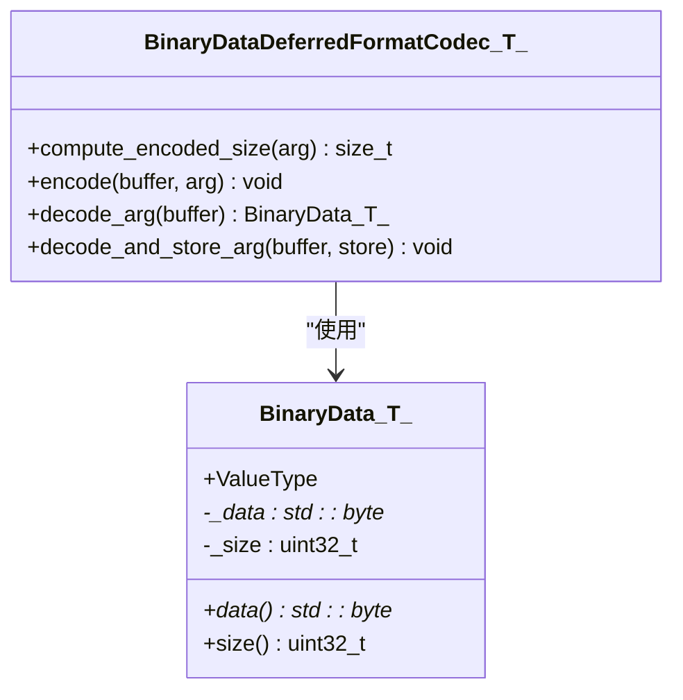
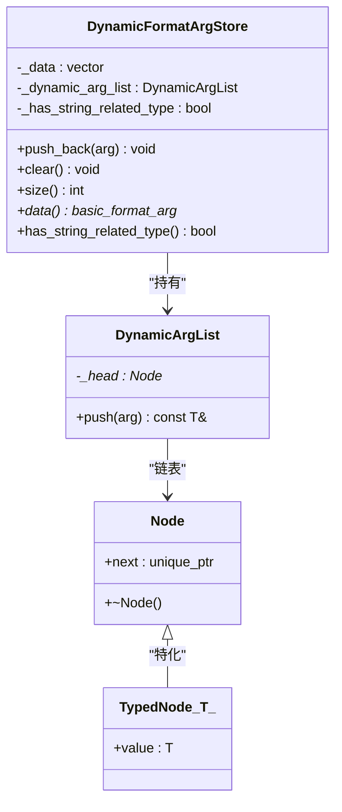
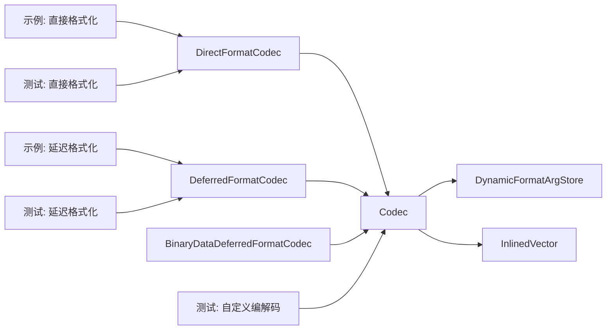

# 编码器系统

<cite>
**本文引用的文件**
- [DirectFormatCodec.h](file://include/quill/DirectFormatCodec.h)
- [DeferredFormatCodec.h](file://include/quill/DeferredFormatCodec.h)
- [BinaryDataDeferredFormatCodec.h](file://include/quill/BinaryDataDeferredFormatCodec.h)
- [Codec.h](file://include/quill/core/Codec.h)
- [DynamicFormatArgStore.h](file://include/quill/core/DynamicFormatArgStore.h)
- [InlinedVector.h](file://include/quill/core/InlinedVector.h)
- [Attributes.h](file://include/quill/core/Attributes.h)
- [user_defined_types_logging_direct_format.cpp](file://examples/user_defined_types_logging_direct_format.cpp)
- [user_defined_types_logging_deferred_format.cpp](file://examples/user_defined_types_logging_deferred_format.cpp)
- [UserDefinedTypeLoggingDirectFormatTest.cpp](file://test/integration_tests/UserDefinedTypeLoggingDirectFormatTest.cpp)
- [UserDefinedTypeLoggingDeferredFormatTest.cpp](file://test/integration_tests/UserDefinedTypeLoggingDeferredFormatTest.cpp)
- [UserDefinedTypeLoggingTest.cpp](file://test/integration_tests/UserDefinedTypeLoggingTest.cpp)
</cite>

## 目录
1. [简介](#简介)
2. [项目结构](#项目结构)
3. [核心组件](#核心组件)
4. [架构总览](#架构总览)
5. [详细组件分析](#详细组件分析)
6. [依赖关系分析](#依赖关系分析)
7. [性能考量](#性能考量)
8. [故障排查指南](#故障排查指南)
9. [结论](#结论)
10. [附录](#附录)

## 简介
本文件面向Quill的编码器系统，系统性阐述消息编码与解码的实现原理，区分“直接格式化”与“延迟格式化”的设计取舍、适用场景与性能特征；详解用户自定义类型的编码支持（含复制/移动语义、二进制数据序列化）；解释动态参数存储机制与内存管理策略；并提供自定义编码器的开发指南与最佳实践，覆盖性能优化与内存使用优化。

## 项目结构
围绕编码器系统的关键文件组织如下：
- 核心编解码接口与默认编解码：Codec.h
- 直接格式化编解码器：DirectFormatCodec.h
- 延迟格式化编解码器：DeferredFormatCodec.h
- 二进制数据延迟格式化编解码器：BinaryDataDeferredFormatCodec.h
- 动态参数存储：DynamicFormatArgStore.h
- 内存与缓存工具：InlinedVector.h、Attributes.h
- 示例与集成测试：examples与test目录中与用户自定义类型相关的示例与测试

图表来源
- [Codec.h:1-438](file://include/quill/core/Codec.h#L1-L438)
- [DirectFormatCodec.h:1-117](file://include/quill/DirectFormatCodec.h#L1-L117)
- [DeferredFormatCodec.h:1-229](file://include/quill/DeferredFormatCodec.h#L1-L229)
- [BinaryDataDeferredFormatCodec.h:1-165](file://include/quill/BinaryDataDeferredFormatCodec.h#L1-L165)
- [DynamicFormatArgStore.h:1-157](file://include/quill/core/DynamicFormatArgStore.h#L1-L157)
- [InlinedVector.h:1-183](file://include/quill/core/InlinedVector.h#L1-L183)
- [Attributes.h:1-181](file://include/quill/core/Attributes.h#L1-L181)

章节来源
- [Codec.h:1-438](file://include/quill/core/Codec.h#L1-L438)
- [DirectFormatCodec.h:1-117](file://include/quill/DirectFormatCodec.h#L1-L117)
- [DeferredFormatCodec.h:1-229](file://include/quill/DeferredFormatCodec.h#L1-L229)
- [BinaryDataDeferredFormatCodec.h:1-165](file://include/quill/BinaryDataDeferredFormatCodec.h#L1-L165)
- [DynamicFormatArgStore.h:1-157](file://include/quill/core/DynamicFormatArgStore.h#L1-L157)
- [InlinedVector.h:1-183](file://include/quill/core/InlinedVector.h#L1-L183)
- [Attributes.h:1-181](file://include/quill/core/Attributes.h#L1-L181)

## 核心组件
- 通用编解码接口Codec<T>：为内置类型（算术、枚举、指针、字符串、字符串视图等）提供编解码与长度缓存逻辑；对未知类型抛出明确的编译期错误引导。
- 直接格式化编解码器DirectFormatCodec<T>：在热路径上通过fmt进行字符串格式化，适合需要即时可读文本的用户自定义类型。
- 延迟格式化编解码器DeferredFormatCodec<T>：在热路径上直接拷贝或构造对象，避免格式化开销，将格式化推迟到后端线程；支持memcpy路径与placement new路径，并处理对齐与析构。
- 二进制数据延迟格式化编解码器BinaryDataDeferredFormatCodec<T>：对原始二进制数据进行轻量拷贝，配合formatter在后端完成可读化输出。
- 动态参数存储DynamicFormatArgStore：按需存储非内置于basic_format_arg的参数，支持字符串相关类型检测与无重分配增长策略。
- 尺寸缓存与内联向量InlinedVector<uint32_t, 12>：用于缓存字符串长度等信息，容量适配缓存行以提升性能。
- 属性宏与分支提示Attributes：提供编译期优化提示（如hot/cold、likely/unlikely），减少分支惩罚。

章节来源
- [Codec.h:144-438](file://include/quill/core/Codec.h#L144-L438)
- [DirectFormatCodec.h:86-117](file://include/quill/DirectFormatCodec.h#L86-L117)
- [DeferredFormatCodec.h:90-229](file://include/quill/DeferredFormatCodec.h#L90-L229)
- [BinaryDataDeferredFormatCodec.h:121-165](file://include/quill/BinaryDataDeferredFormatCodec.h#L121-L165)
- [DynamicFormatArgStore.h:77-157](file://include/quill/core/DynamicFormatArgStore.h#L77-L157)
- [InlinedVector.h:35-173](file://include/quill/core/InlinedVector.h#L35-L173)
- [Attributes.h:104-148](file://include/quill/core/Attributes.h#L104-L148)

## 架构总览
下图展示从日志调用到后端格式化的整体流程，以及不同编解码器在热路径上的差异：

图表来源
- [Codec.h:353-406](file://include/quill/core/Codec.h#L353-L406)
- [DirectFormatCodec.h:89-114](file://include/quill/DirectFormatCodec.h#L89-L114)
- [DeferredFormatCodec.h:96-180](file://include/quill/DeferredFormatCodec.h#L96-L180)
- [BinaryDataDeferredFormatCodec.h:127-162](file://include/quill/BinaryDataDeferredFormatCodec.h#L127-L162)

## 详细组件分析

### 组件A：通用编解码接口Codec<T>
- 设计要点
  - 针对内置类型提供高效路径（memcpy、长度缓存、字符串视图安全读取）。
  - 对未知类型触发编译期错误并给出修复建议（包含STL类型与用户自定义类型指引）。
  - 提供compute_encoded_size_and_cache_string_lengths、encode/decode辅助函数族，确保顺序处理与缓存一致性。
- 关键行为
  - 字符串与数组：使用条件长度缓存，避免重复strlen。
  - 字符串视图与std::string：先写长度再写内容，保证可逆。
  - 解码时区分仅解码与同时存入DynamicFormatArgStore两种模式，便于嵌套类型处理。
- 复杂度
  - 计算编码大小：O(N)，N为参数个数；字符串长度缓存避免重复计算。
  - 编码/解码：O(总字节数)，memcpy为主。

图表来源
- [Codec.h:147-189](file://include/quill/core/Codec.h#L147-L189)
- [Codec.h:354-372](file://include/quill/core/Codec.h#L354-L372)

章节来源
- [Codec.h:144-438](file://include/quill/core/Codec.h#L144-L438)

### 组件B：直接格式化编解码器 DirectFormatCodec<T>
- 设计要点
  - 在热路径上使用fmt::format生成字符串，适合需要即时可读文本的用户自定义类型。
  - 先计算长度并缓存，再写入长度与内容，解码时转为string_view并推入DynamicFormatArgStore。
- 适用场景
  - 用户自定义类型已具备fmt::formatter特化。
  - 对日志可读性要求高且格式化成本可接受。
- 性能特征
  - 热路径存在字符串格式化开销；但简化了后端工作（无需二次格式化）。
  - 适合小对象或不频繁的日志点。

图表来源
- [DirectFormatCodec.h:89-114](file://include/quill/DirectFormatCodec.h#L89-L114)
- [DirectFormatCodec.h:106-114](file://include/quill/DirectFormatCodec.h#L106-L114)

章节来源
- [DirectFormatCodec.h:22-117](file://include/quill/DirectFormatCodec.h#L22-L117)
- [user_defined_types_logging_direct_format.cpp:14-102](file://examples/user_defined_types_logging_direct_format.cpp#L14-L102)
- [UserDefinedTypeLoggingDirectFormatTest.cpp:213-506](file://test/integration_tests/UserDefinedTypeLoggingDirectFormatTest.cpp#L213-L506)

### 组件C：延迟格式化编解码器 DeferredFormatCodec<T>
- 设计要点
  - 热路径避免格式化：对可平凡拷贝且默认可构造的类型走memcpy；否则通过对齐的placement new构造。
  - 解码时根据可移动/可拷贝特性选择移动或拷贝，并在必要时手动析构。
  - 支持use_memcpy编译期判断，自动选择最优路径。
- 适用场景
  - 用户自定义类型具备fmt::formatter特化，但希望在热路径避免格式化开销。
  - 对象较大或格式化昂贵，或需要在后端线程进行复杂格式化。
- 性能特征
  - 热路径极低开销；格式化推迟至后端线程。
  - 需要确保对象的线程安全性（若包含共享资源）。

图表来源
- [DeferredFormatCodec.h:96-133](file://include/quill/DeferredFormatCodec.h#L96-L133)
- [DeferredFormatCodec.h:135-180](file://include/quill/DeferredFormatCodec.h#L135-L180)

章节来源
- [DeferredFormatCodec.h:29-229](file://include/quill/DeferredFormatCodec.h#L29-L229)
- [user_defined_types_logging_deferred_format.cpp:13-71](file://examples/user_defined_types_logging_deferred_format.cpp#L13-L71)
- [UserDefinedTypeLoggingDeferredFormatTest.cpp:389-1197](file://test/integration_tests/UserDefinedTypeLoggingDeferredFormatTest.cpp#L389-L1197)

### 组件D：二进制数据延迟格式化 BinaryDataDeferredFormatCodec<T>
- 设计要点
  - 使用BinaryData<T>作为非拥有型视图承载原始二进制数据，携带长度与数据指针。
  - 热路径仅拷贝长度与数据本身；后端formatter负责解析与可读化（如十六进制）。
  - 通过模板特化限制只能用于BinaryData类型。
- 适用场景
  - 协议报文、网络帧、图像/音频片段等原始二进制数据的高效记录。
- 性能特征
  - 热路径零格式化开销；后端格式化可按需选择解析策略。

图表来源
- [BinaryDataDeferredFormatCodec.h:28-165](file://include/quill/BinaryDataDeferredFormatCodec.h#L28-L165)

章节来源
- [BinaryDataDeferredFormatCodec.h:22-165](file://include/quill/BinaryDataDeferredFormatCodec.h#L22-L165)

### 组件E：动态参数存储 DynamicFormatArgStore
- 设计要点
  - 以连续容器保存basic_format_arg，额外参数通过链式节点列表存储，避免重新定位。
  - 对字符串相关类型进行标记，便于后端格式化器选择合适策略。
  - 提供push_back统一入口，内部根据类型映射决定是否进入动态列表。
- 内存管理
  - 连续容器用于基本类型，链表用于大/复杂类型，减少扩容带来的指针失效风险。
  - 清空时同时清理动态列表，保持状态一致。

图表来源
- [DynamicFormatArgStore.h:22-157](file://include/quill/core/DynamicFormatArgStore.h#L22-L157)

章节来源
- [DynamicFormatArgStore.h:77-157](file://include/quill/core/DynamicFormatArgStore.h#L77-L157)

### 组件F：尺寸缓存与内联向量 InlinedVector<uint32_t, 12>
- 设计要点
  - 为特定操作（如字符串长度）提供紧凑缓存，容量12适配单缓存行，降低内存占用与提升局部性。
  - 当容量超过内联上限时切换到堆分配，仍保持O(1)扩容策略。
- 与编解码的关系
  - Codec在处理字符串/数组时使用该缓存避免重复计算长度，提高编码效率。

章节来源
- [InlinedVector.h:35-173](file://include/quill/core/InlinedVector.h#L35-L173)
- [Codec.h:354-372](file://include/quill/core/Codec.h#L354-L372)

### 组件G：属性宏与分支提示 Attributes
- 设计要点
  - 提供hot/cold、likely/unlikely、export等跨平台宏，帮助编译器优化关键路径与分支预测。
- 影响范围
  - DirectFormatCodec、DeferredFormatCodec等热点函数均标注hot属性，减少分支惩罚与提升指令级并行。

章节来源
- [Attributes.h:104-148](file://include/quill/core/Attributes.h#L104-L148)
- [DirectFormatCodec.h:89-114](file://include/quill/DirectFormatCodec.h#L89-L114)
- [DeferredFormatCodec.h:96-180](file://include/quill/DeferredFormatCodec.h#L96-L180)

## 依赖关系分析
- 编解码器依赖关系
  - DirectFormatCodec/DeferredFormatCodec/BinaryDataDeferredFormatCodec均依赖Codec接口与DynamicFormatArgStore。
  - DeferredFormatCodec内部依赖对齐与placement new机制，需满足类型约束。
- 工具类依赖
  - Codec依赖InlinedVector<uint32_t, 12>进行长度缓存；Attributes提供编译期优化提示。
- 测试与示例
  - 示例展示如何为用户自定义类型提供DirectFormatCodec或DeferredFormatCodec特化。
  - 集成测试覆盖多种STL容器与自定义类型组合，验证编解码正确性与异常路径。

图表来源
- [Codec.h:144-438](file://include/quill/core/Codec.h#L144-L438)
- [DirectFormatCodec.h:86-117](file://include/quill/DirectFormatCodec.h#L86-L117)
- [DeferredFormatCodec.h:90-229](file://include/quill/DeferredFormatCodec.h#L90-L229)
- [BinaryDataDeferredFormatCodec.h:121-165](file://include/quill/BinaryDataDeferredFormatCodec.h#L121-L165)
- [DynamicFormatArgStore.h:77-157](file://include/quill/core/DynamicFormatArgStore.h#L77-L157)
- [InlinedVector.h:167-173](file://include/quill/core/InlinedVector.h#L167-L173)

章节来源
- [Codec.h:144-438](file://include/quill/core/Codec.h#L144-L438)
- [DirectFormatCodec.h:86-117](file://include/quill/DirectFormatCodec.h#L86-L117)
- [DeferredFormatCodec.h:90-229](file://include/quill/DeferredFormatCodec.h#L90-L229)
- [BinaryDataDeferredFormatCodec.h:121-165](file://include/quill/BinaryDataDeferredFormatCodec.h#L121-L165)
- [DynamicFormatArgStore.h:77-157](file://include/quill/core/DynamicFormatArgStore.h#L77-L157)
- [InlinedVector.h:167-173](file://include/quill/core/InlinedVector.h#L167-L173)

## 性能考量
- 热路径优化
  - DirectFormatCodec：在热路径执行字符串格式化，适合小对象与可读性优先场景。
  - DeferredFormatCodec：热路径避免格式化，采用memcpy或placement new，适合大对象与高吞吐场景。
  - BinaryDataDeferredFormatCodec：热路径仅拷贝二进制头与数据，后端格式化，适合协议/媒体数据。
- 缓存与内存
  - 使用InlinedVector<uint32_t, 12>缓存字符串长度，减少重复计算与分支。
  - DynamicFormatArgStore的动态列表避免扩容导致的指针失效，提升稳定性。
- 编译期优化
  - Attributes提供hot/cold、likely/unlikely等提示，帮助编译器优化关键路径。
- 最佳实践
  - 优先为昂贵类型选择DeferredFormatCodec；为简单类型可选DirectFormatCodec。
  - 对二进制数据使用BinaryDataDeferredFormatCodec并在formatter中做可读化。
  - 控制日志频率与格式化复杂度，避免在高频路径产生大量临时对象。

[本节为通用性能指导，不直接分析具体文件]

## 故障排查指南
- 编译期错误：未找到类型Codec
  - 现象：编译报错提示缺少Codec。
  - 排查：确认已包含对应类型头文件；为用户自定义类型提供DirectFormatCodec或DeferredFormatCodec特化；或转换为字符串后再记录。
  - 参考：编译期错误引导信息位于通用Codec接口中。
- 延迟格式化异常
  - 现象：日志后端抛出异常。
  - 排查：检查用户自定义类型是否满足copy/move构造要求；确保对象在线程间安全（如包含shared_ptr时避免并发修改）。
- 二进制数据格式化问题
  - 现象：日志输出不可读或截断。
  - 排查：确认formatter正确解析BinaryData视图并进行可读化（如十六进制）；注意长度上限处理。
- 动态参数存储溢出
  - 现象：运行时异常或内存问题。
  - 排查：检查push_back调用次数与类型映射；避免在单次日志中传入过多大对象。

章节来源
- [Codec.h:59-86](file://include/quill/core/Codec.h#L59-L86)
- [DeferredFormatCodec.h:39-43](file://include/quill/DeferredFormatCodec.h#L39-L43)
- [BinaryDataDeferredFormatCodec.h:43-49](file://include/quill/BinaryDataDeferredFormatCodec.h#L43-L49)
- [DynamicFormatArgStore.h:115-157](file://include/quill/core/DynamicFormatArgStore.h#L115-L157)

## 结论
Quill的编码器系统通过“直接格式化”和“延迟格式化”两条路径平衡了可读性与性能；结合BinaryData延迟格式化与DynamicFormatArgStore的动态存储，实现了对用户自定义类型与二进制数据的高效、灵活支持。借助InlinedVector与Attributes等工具，系统在内存占用与编译期优化方面也做了细致考虑。实践中应依据对象规模、格式化成本与可读性需求选择合适的编解码策略，并遵循复制/移动语义与线程安全约束。

[本节为总结性内容，不直接分析具体文件]

## 附录
- 开发自定义编解码器的步骤
  - 为用户自定义类型提供fmt::formatter特化。
  - 选择编解码器：
    - DirectFormatCodec：适合需要即时可读文本的小对象。
    - DeferredFormatCodec：适合大对象或格式化昂贵的对象。
    - BinaryDataDeferredFormatCodec：适合二进制数据。
  - 在命名空间quill中为类型提供Codec特化，实现compute_encoded_size/encode/decode_arg/decode_and_store_arg。
  - 在formatter中实现可读化输出（特别是二进制数据）。
- 示例参考
  - 直接格式化示例与测试：examples与integration_tests中对应文件。
  - 延迟格式化示例与测试：examples与integration_tests中对应文件。
  - 自定义编解码示例与测试：integration_tests中对应文件。

章节来源
- [user_defined_types_logging_direct_format.cpp:14-102](file://examples/user_defined_types_logging_direct_format.cpp#L14-L102)
- [user_defined_types_logging_deferred_format.cpp:13-71](file://examples/user_defined_types_logging_deferred_format.cpp#L13-L71)
- [UserDefinedTypeLoggingDirectFormatTest.cpp:213-506](file://test/integration_tests/UserDefinedTypeLoggingDirectFormatTest.cpp#L213-L506)
- [UserDefinedTypeLoggingDeferredFormatTest.cpp:389-1197](file://test/integration_tests/UserDefinedTypeLoggingDeferredFormatTest.cpp#L389-L1197)
- [UserDefinedTypeLoggingTest.cpp:58-91](file://test/integration_tests/UserDefinedTypeLoggingTest.cpp#L58-L91)