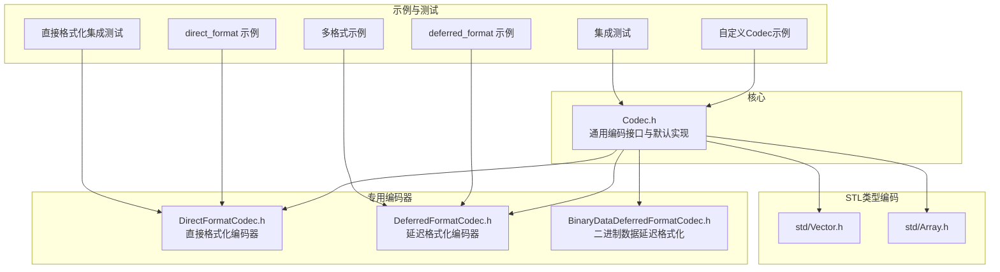
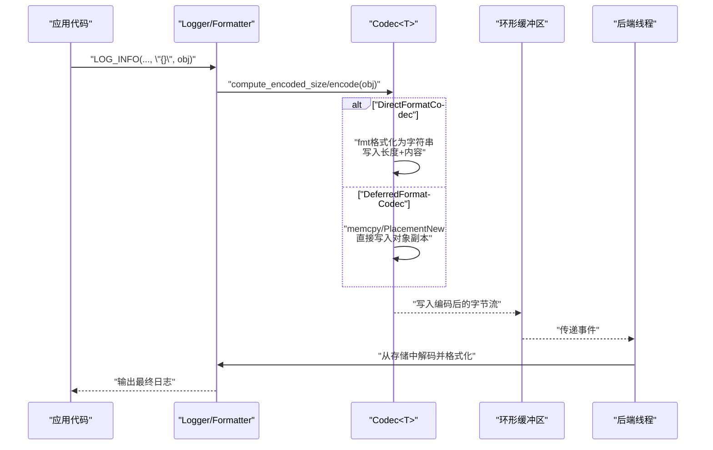
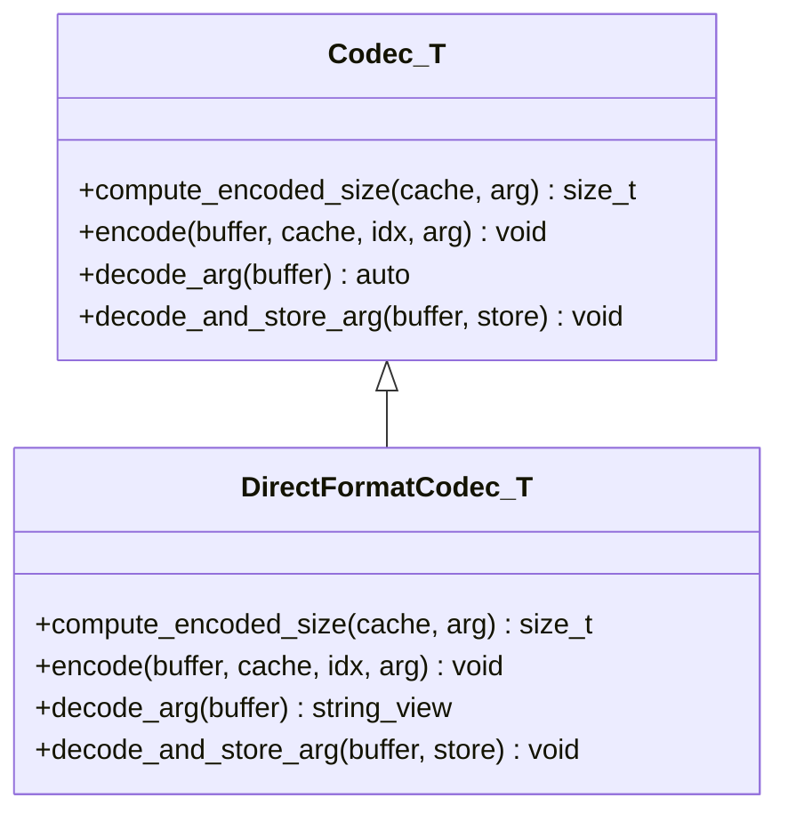
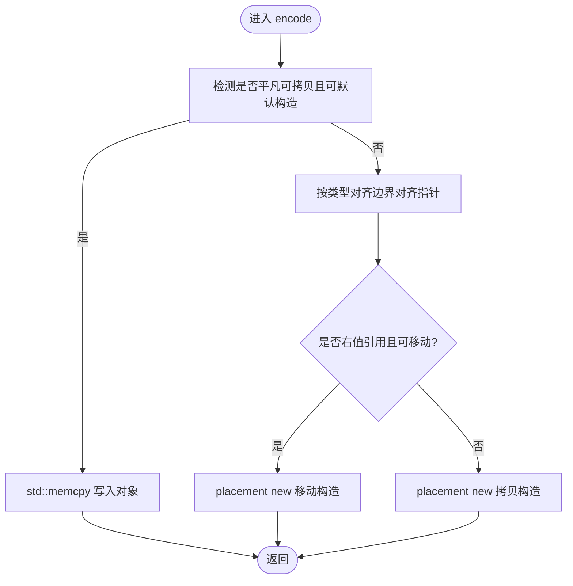
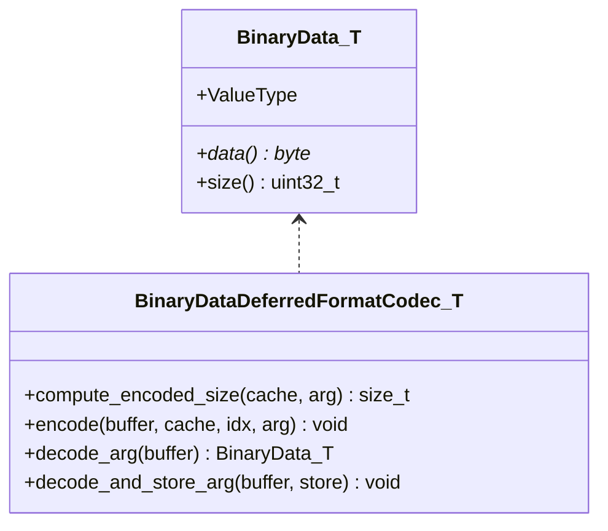
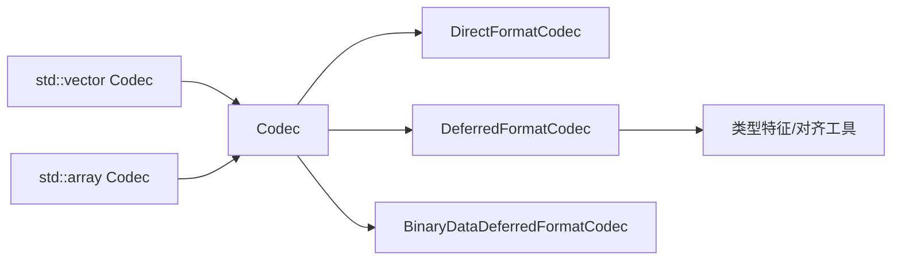

# 自定义类型编码支持

<cite>
**本文引用的文件**
- [DirectFormatCodec.h](file://include/quill/DirectFormatCodec.h)
- [DeferredFormatCodec.h](file://include/quill/DeferredFormatCodec.h)
- [BinaryDataDeferredFormatCodec.h](file://include/quill/BinaryDataDeferredFormatCodec.h)
- [Codec.h](file://include/quill/core/Codec.h)
- [Vector.h](file://include/quill/std/Vector.h)
- [Array.h](file://include/quill/std/Array.h)
- [user_defined_types_logging_direct_format.cpp](file://examples/user_defined_types_logging_direct_format.cpp)
- [user_defined_types_logging_deferred_format.cpp](file://examples/user_defined_types_logging_deferred_format.cpp)
- [user_defined_types_logging_custom_codec.cpp](file://examples/user_defined_types_logging_custom_codec.cpp)
- [user_defined_types_multi_format.cpp](file://examples/user_defined_types_multi_format.cpp)
- [UserDefinedTypeLoggingTest.cpp](file://test/integration_tests/UserDefinedTypeLoggingTest.cpp)
- [UserDefinedTypeLoggingDirectFormatTest.cpp](file://test/integration_tests/UserDefinedTypeLoggingDirectFormatTest.cpp)
</cite>

## 目录
1. [简介](#简介)
2. [项目结构](#项目结构)
3. [核心组件](#核心组件)
4. [架构总览](#架构总览)
5. [组件详解](#组件详解)
6. [依赖关系分析](#依赖关系分析)
7. [性能考量](#性能考量)
8. [故障排查指南](#故障排查指南)
9. [结论](#结论)
10. [附录](#附录)

## 简介
本文件系统性阐述 Quill 的“自定义类型编码支持”，重点覆盖两类专用编码器：DirectFormatCodec（直接格式化）与 DeferredFormatCodec（延迟格式化），并说明 BinaryDataDeferredFormatCodec（二进制数据延迟格式化）的使用场景。文档将解释类型特化模板的编写方法、编译期类型检查与运行时类型安全、编码器注册与使用流程（含宏与模板实例化）、以及针对简单值类型、复杂对象与 STL 容器的完整示例路径，并分析性能影响与优化策略。

## 项目结构
围绕自定义类型编码的关键代码位于以下模块：
- 核心编码框架：Codec.h
- 专用编码器：DirectFormatCodec.h、DeferredFormatCodec.h、BinaryDataDeferredFormatCodec.h
- 常用 STL 类型编码：std/Vector.h、std/Array.h
- 示例与测试：examples 下的用户自定义类型日志示例；test/integration_tests 中的集成测试

**图示来源**
- [Codec.h:144-437](file://include/quill/core/Codec.h#L144-L437)
- [DirectFormatCodec.h:86-115](file://include/quill/DirectFormatCodec.h#L86-L115)
- [DeferredFormatCodec.h:90-223](file://include/quill/DeferredFormatCodec.h#L90-L223)
- [BinaryDataDeferredFormatCodec.h:121-163](file://include/quill/BinaryDataDeferredFormatCodec.h#L121-L163)
- [Vector.h:25-145](file://include/quill/std/Vector.h#L25-L145)
- [Array.h:30-228](file://include/quill/std/Array.h#L30-L228)
- [user_defined_types_logging_direct_format.cpp:1-102](file://examples/user_defined_types_logging_direct_format.cpp#L1-L102)
- [user_defined_types_logging_deferred_format.cpp:1-71](file://examples/user_defined_types_logging_deferred_format.cpp#L1-L71)
- [user_defined_types_logging_custom_codec.cpp:1-130](file://examples/user_defined_types_logging_custom_codec.cpp#L1-L130)
- [user_defined_types_multi_format.cpp:1-73](file://examples/user_defined_types_multi_format.cpp#L1-L73)
- [UserDefinedTypeLoggingTest.cpp:1-153](file://test/integration_tests/UserDefinedTypeLoggingTest.cpp#L1-L153)
- [UserDefinedTypeLoggingDirectFormatTest.cpp:1-506](file://test/integration_tests/UserDefinedTypeLoggingDirectFormatTest.cpp#L1-L506)

**章节来源**
- [Codec.h:144-437](file://include/quill/core/Codec.h#L144-L437)
- [DirectFormatCodec.h:22-115](file://include/quill/DirectFormatCodec.h#L22-L115)
- [DeferredFormatCodec.h:29-223](file://include/quill/DeferredFormatCodec.h#L29-L223)
- [BinaryDataDeferredFormatCodec.h:22-163](file://include/quill/BinaryDataDeferredFormatCodec.h#L22-L163)
- [Vector.h:25-145](file://include/quill/std/Vector.h#L25-L145)
- [Array.h:30-228](file://include/quill/std/Array.h#L30-L228)

## 核心组件
- 通用编码接口与默认实现：Codec<T> 模板提供 compute_encoded_size/encode/decode_arg/decode_and_store_arg 等函数族，内置对基础类型、字符串、数组等的处理分支，并在未匹配时触发静态断言提示缺失 Codec。
- DirectFormatCodec<T>：在热路径上通过 fmt 库进行格式化，适合需要即时可读文本输出的场景；编码包含长度前缀，解码返回字符串视图。
- DeferredFormatCodec<T>：在热路径上直接拷贝或构造对象到环形缓冲区，避免格式化开销；在后端线程再执行格式化；对非平凡可拷贝类型要求具备合适的拷贝/移动构造与对齐。
- BinaryDataDeferredFormatCodec<T>：用于高效记录二进制数据，编码阶段仅复制原始字节，格式化阶段由用户自定义 formatter 负责可读化（如十六进制）。
- STL 类型编码：std::vector、std::array 等通过特化 Codec 提供高效的序列化/反序列化，支持算术类型快速路径与复杂元素逐个编码。

**章节来源**
- [Codec.h:144-437](file://include/quill/core/Codec.h#L144-L437)
- [DirectFormatCodec.h:86-115](file://include/quill/DirectFormatCodec.h#L86-L115)
- [DeferredFormatCodec.h:90-223](file://include/quill/DeferredFormatCodec.h#L90-L223)
- [BinaryDataDeferredFormatCodec.h:121-163](file://include/quill/BinaryDataDeferredFormatCodec.h#L121-L163)
- [Vector.h:25-145](file://include/quill/std/Vector.h#L25-L145)
- [Array.h:30-228](file://include/quill/std/Array.h#L30-L228)

## 架构总览
下图展示从日志调用到编码、入队、再到后端格式化的整体流程，突出 DirectFormatCodec 与 DeferredFormatCodec 在热路径上的不同策略。

**图示来源**
- [Codec.h:353-405](file://include/quill/core/Codec.h#L353-L405)
- [DirectFormatCodec.h:89-104](file://include/quill/DirectFormatCodec.h#L89-L104)
- [DeferredFormatCodec.h:96-133](file://include/quill/DeferredFormatCodec.h#L96-L133)

## 组件详解

### DirectFormatCodec<T> 实现与使用
- 设计要点
  - 热路径：使用 fmt::format 计算并写入字符串表示，编码包含长度前缀，便于后续读取。
  - 解码：返回字符串视图，解码与存储分离，便于嵌套类型处理。
- 使用方式
  - 需要为自定义类型提供 fmtquill::formatter 特化。
  - 在 quill::Codec<T> 中以 DirectFormatCodec<T> 作为基类完成特化。
- 示例参考
  - 直接格式化示例：[user_defined_types_logging_direct_format.cpp:1-102](file://examples/user_defined_types_logging_direct_format.cpp#L1-L102)
  - 多格式示例（同一类型不同格式）：[user_defined_types_multi_format.cpp:1-73](file://examples/user_defined_types_multi_format.cpp#L1-L73)

**图示来源**
- [DirectFormatCodec.h:86-115](file://include/quill/DirectFormatCodec.h#L86-L115)
- [Codec.h:144-342](file://include/quill/core/Codec.h#L144-L342)

**章节来源**
- [DirectFormatCodec.h:22-115](file://include/quill/DirectFormatCodec.h#L22-L115)
- [user_defined_types_logging_direct_format.cpp:1-102](file://examples/user_defined_types_logging_direct_format.cpp#L1-L102)
- [user_defined_types_multi_format.cpp:1-73](file://examples/user_defined_types_multi_format.cpp#L1-L73)

### DeferredFormatCodec<T> 实现与使用
- 设计要点
  - 热路径：优先使用 memcpy（若类型平凡可拷贝且可默认构造）；否则按对齐边界使用 placement new 进行构造。
  - 对非平凡类型，需保证线程安全（例如共享资源只读或无并发修改）。
  - 解码：根据是否可移动/拷贝构造进行对象重建，并在必要时手动析构。
- 使用方式
  - 同样需要 fmtquill::formatter 特化。
  - 在 quill::Codec<T> 中以 DeferredFormatCodec<T> 作为基类完成特化。
- 示例参考
  - 延迟格式化示例：[user_defined_types_logging_deferred_format.cpp:1-71](file://examples/user_defined_types_logging_deferred_format.cpp#L1-L71)

**图示来源**
- [DeferredFormatCodec.h:90-133](file://include/quill/DeferredFormatCodec.h#L90-L133)

**章节来源**
- [DeferredFormatCodec.h:29-223](file://include/quill/DeferredFormatCodec.h#L29-L223)
- [user_defined_types_logging_deferred_format.cpp:1-71](file://examples/user_defined_types_logging_deferred_format.cpp#L1-L71)

### BinaryDataDeferredFormatCodec<T> 与 BinaryData 视图
- 设计要点
  - 以 BinaryData<T> 作为非拥有型二进制视图，携带数据指针与长度。
  - 编码阶段写入长度+原始字节；解码阶段生成视图对象，避免额外拷贝。
  - 用户在 formatter 中负责将二进制数据转换为可读文本（如十六进制）。
- 使用方式
  - 为 BinaryData<TagType> 提供 fmtquill::formatter。
  - 在 quill::Codec<BinaryData<TagType>> 中以 BinaryDataDeferredFormatCodec<...> 完成特化。
- 示例参考
  - 二进制数据记录示例（见头文件注释中的示例片段）

**图示来源**
- [BinaryDataDeferredFormatCodec.h:28-163](file://include/quill/BinaryDataDeferredFormatCodec.h#L28-L163)

**章节来源**
- [BinaryDataDeferredFormatCodec.h:22-163](file://include/quill/BinaryDataDeferredFormatCodec.h#L22-L163)

### 自定义类型编码器的注册与使用流程
- 注册步骤
  - 为自定义类型 T 提供 fmtquill::formatter 特化。
  - 在 quill::Codec<T> 中声明特化，选择 DirectFormatCodec 或 DeferredFormatCodec 作为基类。
  - 若类型成员包含复杂类型（如 std::string、STL 容器），确保相应 Codec 已存在或自行实现。
- 模板实例化与宏
  - 可使用 QUILL_LOGGABLE_DIRECT_FORMAT 等宏简化枚举等类型的直接格式化注册（参见测试中对枚举的宏使用）。
- 最佳实践
  - 尽量保持类型成员的可拷贝/可移动特性，以获得更好的延迟格式化性能。
  - 对于包含共享状态的对象，确保在拷贝后仍满足线程安全约束。
  - 对于大型对象，优先考虑 DeferredFormatCodec 以降低热路径开销。

**章节来源**
- [Codec.h:60-86](file://include/quill/core/Codec.h#L60-L86)
- [UserDefinedTypeLoggingDirectFormatTest.cpp:210-211](file://test/integration_tests/UserDefinedTypeLoggingDirectFormatTest.cpp#L210-L211)

### 类型特化模板与编译期/运行期安全
- 编译期检查
  - Codec<T> 默认分支在未找到匹配时触发静态断言，提示缺少 Codec 或未包含对应 std/xxx.h。
  - DeferredFormatCodec<T> 使用类型特征检测平凡可拷贝、默认构造、拷贝/移动构造能力，不满足条件时在编译期报错。
- 运行期安全
  - DirectFormatCodec<T> 通过长度前缀与缓存机制避免越界读写。
  - DeferredFormatCodec<T> 通过对齐与 placement new 保证内存布局正确；解码时根据类型特性选择移动/拷贝，必要时手动析构。
- 示例参考
  - 自定义类型与 STl 容器组合的集成测试：[UserDefinedTypeLoggingTest.cpp:1-153](file://test/integration_tests/UserDefinedTypeLoggingTest.cpp#L1-L153)
  - 复杂容器与多种类型组合的直接格式化测试：[UserDefinedTypeLoggingDirectFormatTest.cpp:1-506](file://test/integration_tests/UserDefinedTypeLoggingDirectFormatTest.cpp#L1-L506)

**章节来源**
- [Codec.h:60-86](file://include/quill/core/Codec.h#L60-L86)
- [DeferredFormatCodec.h:182-223](file://include/quill/DeferredFormatCodec.h#L182-L223)
- [UserDefinedTypeLoggingTest.cpp:1-153](file://test/integration_tests/UserDefinedTypeLoggingTest.cpp#L1-L153)
- [UserDefinedTypeLoggingDirectFormatTest.cpp:1-506](file://test/integration_tests/UserDefinedTypeLoggingDirectFormatTest.cpp#L1-L506)

### 完整自定义类型编码示例（路径）
- 简单值类型（直接格式化）
  - 示例路径：[user_defined_types_logging_direct_format.cpp:1-102](file://examples/user_defined_types_logging_direct_format.cpp#L1-L102)
- 复杂对象（延迟格式化）
  - 示例路径：[user_defined_types_logging_deferred_format.cpp:1-71](file://examples/user_defined_types_logging_deferred_format.cpp#L1-L71)
- 自定义 Codec（成员逐一编码/解码）
  - 示例路径：[user_defined_types_logging_custom_codec.cpp:1-130](file://examples/user_defined_types_logging_custom_codec.cpp#L1-L130)
- 多格式（同一类型不同格式化）
  - 示例路径：[user_defined_types_multi_format.cpp:1-73](file://examples/user_defined_types_multi_format.cpp#L1-L73)
- STL 容器（向量、数组等）
  - 实现路径：[Vector.h:25-145](file://include/quill/std/Vector.h#L25-L145)、[Array.h:30-228](file://include/quill/std/Array.h#L30-L228)
- 集成测试（覆盖多种类型与容器）
  - 测试路径：[UserDefinedTypeLoggingTest.cpp:1-153](file://test/integration_tests/UserDefinedTypeLoggingTest.cpp#L1-L153)、[UserDefinedTypeLoggingDirectFormatTest.cpp:1-506](file://test/integration_tests/UserDefinedTypeLoggingDirectFormatTest.cpp#L1-L506)

**章节来源**
- [user_defined_types_logging_direct_format.cpp:1-102](file://examples/user_defined_types_logging_direct_format.cpp#L1-L102)
- [user_defined_types_logging_deferred_format.cpp:1-71](file://examples/user_defined_types_logging_deferred_format.cpp#L1-L71)
- [user_defined_types_logging_custom_codec.cpp:1-130](file://examples/user_defined_types_logging_custom_codec.cpp#L1-L130)
- [user_defined_types_multi_format.cpp:1-73](file://examples/user_defined_types_multi_format.cpp#L1-L73)
- [Vector.h:25-145](file://include/quill/std/Vector.h#L25-L145)
- [Array.h:30-228](file://include/quill/std/Array.h#L30-L228)
- [UserDefinedTypeLoggingTest.cpp:1-153](file://test/integration_tests/UserDefinedTypeLoggingTest.cpp#L1-L153)
- [UserDefinedTypeLoggingDirectFormatTest.cpp:1-506](file://test/integration_tests/UserDefinedTypeLoggingDirectFormatTest.cpp#L1-L506)

## 依赖关系分析
- Codec<T> 是所有自定义类型编码的基础接口，其他专用编码器均基于它扩展。
- DirectFormatCodec<T> 依赖 fmt 库进行格式化，适合需要即时可读文本的场景。
- DeferredFormatCodec<T> 依赖类型特征与对齐工具，适合对热路径性能敏感的场景。
- STL 类型编码（Vector、Array）依赖 Codec<T> 对成员类型的编码能力，形成递归编码链路。

**图示来源**
- [Codec.h:144-437](file://include/quill/core/Codec.h#L144-L437)
- [DirectFormatCodec.h:86-115](file://include/quill/DirectFormatCodec.h#L86-L115)
- [DeferredFormatCodec.h:90-223](file://include/quill/DeferredFormatCodec.h#L90-L223)
- [Vector.h:25-145](file://include/quill/std/Vector.h#L25-L145)
- [Array.h:30-228](file://include/quill/std/Array.h#L30-L228)

**章节来源**
- [Codec.h:144-437](file://include/quill/core/Codec.h#L144-L437)
- [DirectFormatCodec.h:86-115](file://include/quill/DirectFormatCodec.h#L86-L115)
- [DeferredFormatCodec.h:90-223](file://include/quill/DeferredFormatCodec.h#L90-L223)
- [Vector.h:25-145](file://include/quill/std/Vector.h#L25-L145)
- [Array.h:30-228](file://include/quill/std/Array.h#L30-L228)

## 性能考量
- DirectFormatCodec
  - 优点：热路径仅一次格式化，日志可读性强。
  - 成本：每次日志调用都会进行字符串格式化，可能引入 CPU 开销与临时分配。
  - 适用：格式化成本低、对可读性要求高、热路径压力适中的场景。
- DeferredFormatCodec
  - 优点：热路径避免格式化，仅进行内存拷贝/构造，显著降低 CPU 占用。
  - 成本：需要在后端线程进行格式化，增加队列与线程间通信开销；对非平凡类型需注意线程安全。
  - 适用：格式化成本高、热路径压力大、可接受后端延迟的场景。
- BinaryDataDeferredFormatCodec
  - 优点：仅复制原始字节，格式化完全在后端完成，极致减少热路径开销。
  - 成本：需要用户自定义 formatter，确保可读性与可维护性。
- STL 容器编码
  - 算术类型：快速路径 memcpy，避免遍历。
  - 复杂元素：逐元素计算大小并编码，注意容器规模对热路径的影响。
- 优化建议
  - 优先使用 DeferredFormatCodec 处理复杂对象与大型容器。
  - 对频繁出现的简单类型，可结合 DirectFormatCodec 以提升可读性。
  - 合理拆分日志消息，避免单条日志过大导致队列拥塞。
  - 对共享资源对象，确保拷贝后仍满足线程安全。

[本节为通用性能讨论，无需列出具体文件来源]

## 故障排查指南
- 缺失 Codec 错误
  - 现象：编译时报错提示“缺少 Codec”。
  - 排查：确认已包含对应 std/xxx.h（如 Vector.h、Array.h），或为自定义类型提供 Codec 特化。
  - 参考：[Codec.h:60-86](file://include/quill/core/Codec.h#L60-L86)
- DirectFormatCodec 运行时异常
  - 现象：格式化过程中抛出异常（如 runtime 格式化错误）。
  - 排查：检查 fmtquill::formatter 的 parse/format 实现，确保格式字符串合法。
  - 参考：[UserDefinedTypeLoggingDirectFormatTest.cpp:240-254](file://test/integration_tests/UserDefinedTypeLoggingDirectFormatTest.cpp#L240-L254)
- DeferredFormatCodec 线程安全问题
  - 现象：日志输出异常或崩溃。
  - 排查：确认对象在拷贝后仍满足线程安全；避免在拷贝后修改共享状态。
  - 参考：[DeferredFormatCodec.h:39-43](file://include/quill/DeferredFormatCodec.h#L39-L43)
- STL 容器编码异常
  - 现象：容器元素无法正确序列化或反序列化。
  - 排查：确保容器元素类型具备相应的 Codec 特化；检查元素类型是否可拷贝/可移动。
  - 参考：[Vector.h:25-145](file://include/quill/std/Vector.h#L25-L145)、[Array.h:30-228](file://include/quill/std/Array.h#L30-L228)

**章节来源**
- [Codec.h:60-86](file://include/quill/core/Codec.h#L60-L86)
- [UserDefinedTypeLoggingDirectFormatTest.cpp:240-254](file://test/integration_tests/UserDefinedTypeLoggingDirectFormatTest.cpp#L240-L254)
- [DeferredFormatCodec.h:39-43](file://include/quill/DeferredFormatCodec.h#L39-L43)
- [Vector.h:25-145](file://include/quill/std/Vector.h#L25-L145)
- [Array.h:30-228](file://include/quill/std/Array.h#L30-L228)

## 结论
Quill 的自定义类型编码体系通过 Codec<T> 抽象与 DirectFormatCodec/DeferredFormatCodec/BinaryDataDeferredFormatCodec 三类专用编码器，实现了从简单值类型到复杂对象与 STL 容器的全栈支持。开发者只需为自定义类型提供 fmtquill::formatter 特化，并在 quill::Codec<T> 中选择合适的编码器基类即可完成注册。在性能敏感场景，推荐使用 DeferredFormatCodec 或 BinaryDataDeferredFormatCodec 以降低热路径开销；在可读性优先场景，DirectFormatCodec 更为便捷。配合完善的示例与测试，可快速构建稳定、高性能的日志系统。

[本节为总结性内容，无需列出具体文件来源]

## 附录
- 快速参考
  - 直接格式化：为类型提供 DirectFormatCodec 特化 + fmtquill::formatter。
  - 延迟格式化：为类型提供 DeferredFormatCodec 特化 + fmtquill::formatter。
  - 二进制数据：为 BinaryData<Tag> 提供 BinaryDataDeferredFormatCodec 特化 + formatter。
  - STL 容器：确保包含对应 std/xxx.h，或自行实现相应 Codec。

[本节为补充信息，无需列出具体文件来源]