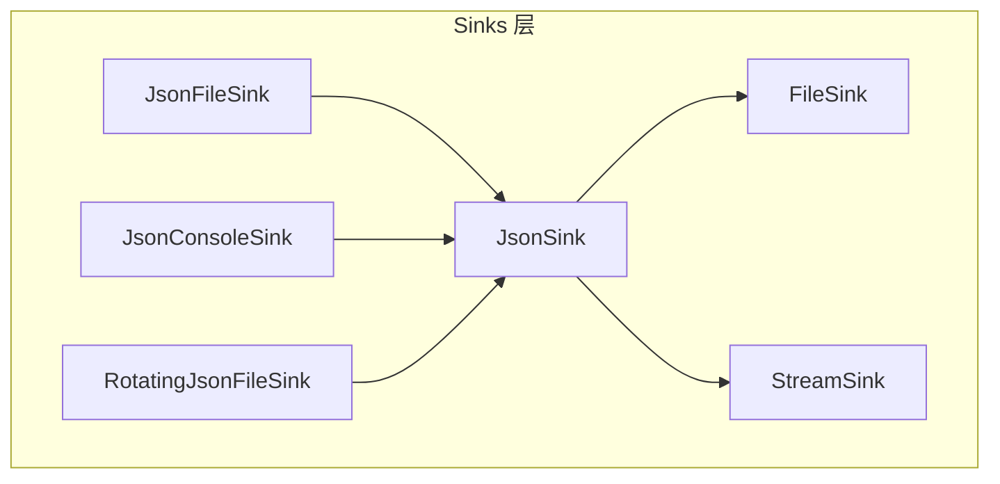
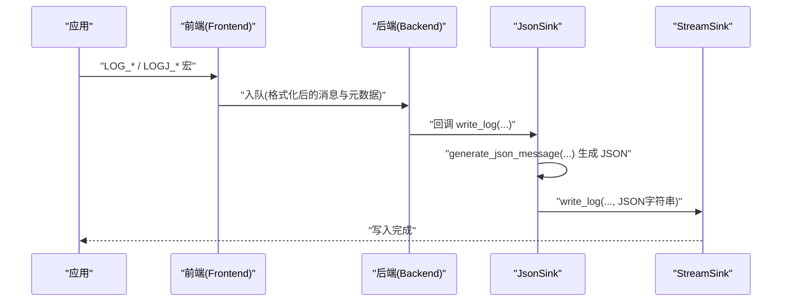
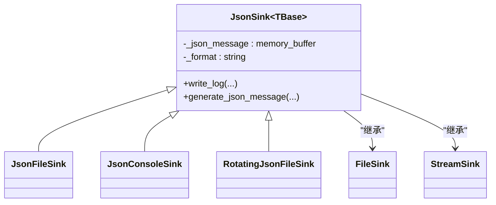

# JSON Sinks

<cite>
**本文引用的文件**
- [JsonSink.h](file://include/quill/sinks/JsonSink.h)
- [RotatingJsonFileSink.h](file://include/quill/sinks/RotatingJsonFileSink.h)
- [FileSink.h](file://include/quill/sinks/FileSink.h)
- [StreamSink.h](file://include/quill/sinks/StreamSink.h)
- [json_console_logging.cpp](file://examples/json_console_logging.cpp)
- [json_file_logging.cpp](file://examples/json_file_logging.cpp)
- [rotating_json_file_logging.cpp](file://examples/rotating_json_file_logging.cpp)
- [json_console_logging_custom_json.cpp](file://examples/json_console_logging_custom_json.cpp)
- [rotating_json_file_logging_custom_json.cpp](file://examples/rotating_json_file_logging_custom_json.cpp)
- [JsonConsoleLoggingTest.cpp](file://test/integration_tests/JsonConsoleLoggingTest.cpp)
- [JsonFileLoggingTest.cpp](file://test/integration_tests/JsonFileLoggingTest.cpp)
- [json_logging.rst](file://docs/json_logging.rst)
- [TransitEventBufferTest.cpp](file://test/unit_tests/TransitEventBufferTest.cpp)
- [format.h](file://include/quill/bundled/fmt/format.h)
</cite>

## 目录
1. [简介](#简介)
2. [项目结构](#项目结构)
3. [核心组件](#核心组件)
4. [架构总览](#架构总览)
5. [组件详解](#组件详解)
6. [依赖关系分析](#依赖关系分析)
7. [性能与内存优化](#性能与内存优化)
8. [故障排查指南](#故障排查指南)
9. [结论](#结论)
10. [附录](#附录)

## 简介
本文件面向使用 Quill 的 JSON Sinks 进行结构化日志输出的开发者，系统性阐述 JsonSink 的工作机制、JSON 格式化选项、字段映射与嵌套对象支持、性能优化与内存管理策略、大消息处理能力，以及如何通过继承扩展实现自定义 JSON 配置（字段重命名、条件输出、数组处理等）。同时提供 JSON 日志解析建议、工具集成方案与与其他系统的数据交换格式实践。

## 项目结构
围绕 JSON Sinks 的关键代码位于 sinks 子目录，并配套示例与测试用例：
- 核心类：JsonSink 模板基类、JsonFileSink、JsonConsoleSink、RotatingJsonFileSink
- 基类链路：JsonSink 继承自 FileSink 或 StreamSink，最终委托给 StreamSink::write_log 完成写入
- 示例与测试：覆盖控制台与文件 JSON 输出、轮转 JSON 文件、自定义 JSON 格式、多线程与混合格式等场景



图表来源
- [JsonSink.h:140-162](file://include/quill/sinks/JsonSink.h#L140-L162)
- [RotatingJsonFileSink.h:14-14](file://include/quill/sinks/RotatingJsonFileSink.h#L14-L14)

章节来源
- [JsonSink.h:1-165](file://include/quill/sinks/JsonSink.h#L1-L165)
- [RotatingJsonFileSink.h:1-16](file://include/quill/sinks/RotatingJsonFileSink.h#L1-L16)

## 核心组件
- JsonSink<TBase>：模板化的 JSON 输出基类，负责生成 JSON 文本并调用底层写入接口
- JsonFileSink：面向文件的 JSON 输出
- JsonConsoleSink：面向标准输出的 JSON 输出
- RotatingJsonFileSink：带轮转能力的 JSON 文件输出
- StreamSink：通用流写入器，负责实际的 fwrite 调用与刷新
- FileSinkConfig：文件写入缓冲、fsync、打开模式等配置项

章节来源
- [JsonSink.h:140-162](file://include/quill/sinks/JsonSink.h#L140-L162)
- [FileSink.h:64-200](file://include/quill/sinks/FileSink.h#L64-L200)
- [StreamSink.h:67-200](file://include/quill/sinks/StreamSink.h#L67-L200)

## 架构总览
下图展示了从应用日志宏到 JSON 输出的关键路径：前端格式化后进入后端队列，JsonSink 在后端线程中生成 JSON 字符串，再由 StreamSink 写入目标（文件或控制台）。



图表来源
- [JsonSink.h:58-93](file://include/quill/sinks/JsonSink.h#L58-L93)
- [StreamSink.h:152-180](file://include/quill/sinks/StreamSink.h#L152-L180)

## 组件详解

### JsonSink 模板类与 JSON 生成流程
- 新行处理：若消息格式包含换行符，则替换为空格，确保单行 JSON 结构
- JSON 生成：默认字段包含时间戳、文件名、行号、线程信息、logger 名称、日志级别、消息内容；随后追加命名参数键值对
- 写入路径：在末尾追加闭合花括号与换行，然后调用 StreamSink::write_log 将 JSON 字符串写入

```mermaid
flowchart TD
Start(["进入 write_log"]) --> CheckNL["检测消息格式中的换行符"]
CheckNL --> HasNL{"存在换行?"}
HasNL --> |是| Replace["替换换行为空格并缓存"]
HasNL --> |否| KeepFmt["使用原格式"]
Replace --> Build["清空 JSON 缓冲并生成 JSON"]
KeepFmt --> Build
Build --> Append["追加 \"}\\n\""]
Append --> Write["调用 StreamSink::write_log 写入"]
Write --> End(["结束"])
```

图表来源
- [JsonSink.h:66-93](file://include/quill/sinks/JsonSink.h#L66-L93)
- [JsonSink.h:104-129](file://include/quill/sinks/JsonSink.h#L104-L129)

章节来源
- [JsonSink.h:58-129](file://include/quill/sinks/JsonSink.h#L58-L129)

### 默认 JSON 字段与字段映射机制
- 默认字段：时间戳、文件名、行号、线程标识、logger 名称、日志级别描述、消息内容
- 命名参数映射：将命名占位符与其值映射为键值对，自动转义与拼接
- 自定义扩展：通过派生类重写 generate_json_message 可添加额外字段或调整字段顺序

章节来源
- [JsonSink.h:104-129](file://include/quill/sinks/JsonSink.h#L104-L129)
- [JsonConsoleLoggingTest.cpp:69-75](file://test/integration_tests/JsonConsoleLoggingTest.cpp#L69-L75)
- [JsonFileLoggingTest.cpp:151-158](file://test/integration_tests/JsonFileLoggingTest.cpp#L151-L158)

### 嵌套对象与数组支持
- 嵌套对象：可在命名参数中传递可格式化类型（如用户自定义类型），由底层格式化库进行序列化
- 数组处理：通过命名参数逐个传入数组元素，或在消息体中使用格式化库提供的数组/容器格式化能力
- 注意事项：避免在 JSON 中直接嵌入非打印字符，必要时由格式化库自动转义

章节来源
- [JsonFileLoggingTest.cpp:19-46](file://test/integration_tests/JsonFileLoggingTest.cpp#L19-L46)
- [JsonFileLoggingTest.cpp:151-158](file://test/integration_tests/JsonFileLoggingTest.cpp#L151-L158)

### 自定义 JSON 配置与高级功能
- 字段重命名：在 generate_json_message 中使用自定义键名替代默认键名
- 条件输出：在 generate_json_message 中根据日志级别、线程信息等条件决定是否追加某些字段
- 数组处理：在 generate_json_message 中遍历命名参数集合，按需构造数组或对象形式的字段
- 时间格式定制：在 generate_json_message 中将纳秒时间戳转换为本地时间字符串或其他格式

示例参考
- 控制台自定义 JSON：[json_console_logging_custom_json.cpp:12-40](file://examples/json_console_logging_custom_json.cpp#L12-L40)
- 轮转文件自定义 JSON：[rotating_json_file_logging_custom_json.cpp:21-64](file://examples/rotating_json_file_logging_custom_json.cpp#L21-L64)

章节来源
- [json_console_logging_custom_json.cpp:12-40](file://examples/json_console_logging_custom_json.cpp#L12-L40)
- [rotating_json_file_logging_custom_json.cpp:21-64](file://examples/rotating_json_file_logging_custom_json.cpp#L21-L64)

### JSON 输出与多格式混合
- 单一 JSON 输出：仅使用 JsonFileSink/JsonConsoleSink
- 混合格式输出：同一 Logger 同时绑定多个 Sink（例如 JSON 文件 + 控制台格式化输出）
- 示例参考：[json_file_logging.cpp:49-69](file://examples/json_file_logging.cpp#L49-L69)

章节来源
- [json_file_logging.cpp:49-69](file://examples/json_file_logging.cpp#L49-L69)

### 轮转 JSON 文件
- 使用 RotatingJsonFileSink 实现基于时间或大小的轮转
- 示例参考：[rotating_json_file_logging.cpp:21-32](file://examples/rotating_json_file_logging.cpp#L21-L32)

章节来源
- [RotatingJsonFileSink.h:14-14](file://include/quill/sinks/RotatingJsonFileSink.h#L14-L14)
- [rotating_json_file_logging.cpp:21-32](file://examples/rotating_json_file_logging.cpp#L21-L32)

## 依赖关系分析
- JsonSink 依赖于 fmtquill 的格式化能力与内存缓冲
- JsonFileSink/JsonConsoleSink 分别继承自 FileSink/StreamSink，最终统一走 StreamSink::write_log
- FileSinkConfig 提供文件写入缓冲、fsync、打开模式等配置，影响写入性能与可靠性



图表来源
- [JsonSink.h:140-162](file://include/quill/sinks/JsonSink.h#L140-L162)
- [RotatingJsonFileSink.h:14-14](file://include/quill/sinks/RotatingJsonFileSink.h#L14-L14)

章节来源
- [JsonSink.h:1-165](file://include/quill/sinks/JsonSink.h#L1-L165)
- [FileSink.h:64-200](file://include/quill/sinks/FileSink.h#L64-L200)
- [StreamSink.h:67-200](file://include/quill/sinks/StreamSink.h#L67-L200)

## 性能与内存优化
- 内存管理
  - 使用 fmtquill::basic_memory_buffer 作为 JSON 缓冲，减少频繁分配与拷贝
  - 大消息场景下，缓冲区会动态扩容，测试覆盖了多次重分配后的数据完整性
- 写入优化
  - FileSink 支持自定义 fwrite 缓冲区大小，最小 4096 字节，提升吞吐
  - 可配置 fsync 策略与最小 fsync 间隔，平衡一致性与磁盘磨损
- 大消息处理
  - TransitEventBuffer 测试验证了在高并发下，消息大小从极小到极大范围波动时的稳定性与正确性
- 建议
  - 对高频 JSON 日志，优先使用 JsonFileSink 并设置合适的 write_buffer_size
  - 需要强一致性的场景启用 fsync，但注意频率控制
  - 自定义 generate_json_message 时尽量复用已格式化字符串，避免重复拼接

章节来源
- [format.h:907-949](file://include/quill/bundled/fmt/format.h#L907-L949)
- [FileSink.h:146-149](file://include/quill/sinks/FileSink.h#L146-L149)
- [FileSink.h:170-173](file://include/quill/sinks/FileSink.h#L170-L173)
- [TransitEventBufferTest.cpp:133-169](file://test/unit_tests/TransitEventBufferTest.cpp#L133-L169)

## 故障排查指南
- JSON 不完整或跨行问题
  - 现象：JSON 跨行导致解析失败
  - 处理：JsonSink 已自动将换行替换为空格；检查消息格式是否包含换行
- 命名参数未显示
  - 现象：期望的键值对未出现在 JSON 中
  - 处理：确认使用命名占位符（如 {var}）而非位置占位符（{}），并确保参数数量与占位符一致
- 非打印字符与转义
  - 现象：日志中出现不可见字符或转义异常
  - 处理：底层格式化库会自动处理转义；如仍异常，检查自定义 generate_json_message 的拼接逻辑
- 多线程与混合格式
  - 现象：同时输出 JSON 与普通格式时顺序错乱
  - 处理：确保每个 Sink 的 PatternFormatterOptions 正确配置；JSON Sink 使用内部格式，不影响其他 Sink 的格式化

章节来源
- [JsonSink.h:66-80](file://include/quill/sinks/JsonSink.h#L66-L80)
- [JsonFileLoggingTest.cpp:172-180](file://test/integration_tests/JsonFileLoggingTest.cpp#L172-L180)
- [json_file_logging.cpp:56-64](file://examples/json_file_logging.cpp#L56-L64)

## 结论
Quill 的 JSON Sinks 提供了高性能、可扩展的结构化日志输出能力。通过 JsonSink 模板类与 StreamSink 的组合，既能满足基础 JSON 输出需求，又可通过派生类灵活定制字段、格式与条件输出。配合 FileSink 的写入优化与轮转能力，适合在生产环境中稳定运行。建议结合本文的性能与故障排查建议，按业务场景选择合适的配置与扩展策略。

## 附录

### 快速上手示例
- 控制台 JSON 日志：[json_console_logging.cpp:17-33](file://examples/json_console_logging.cpp#L17-L33)
- 文件 JSON 日志：[json_file_logging.cpp:28-47](file://examples/json_file_logging.cpp#L28-L47)
- 轮转 JSON 文件：[rotating_json_file_logging.cpp:21-32](file://examples/rotating_json_file_logging.cpp#L21-L32)

### 文档与规范
- JSON 日志文档：[json_logging.rst:1-44](file://docs/json_logging.rst#L1-L44)