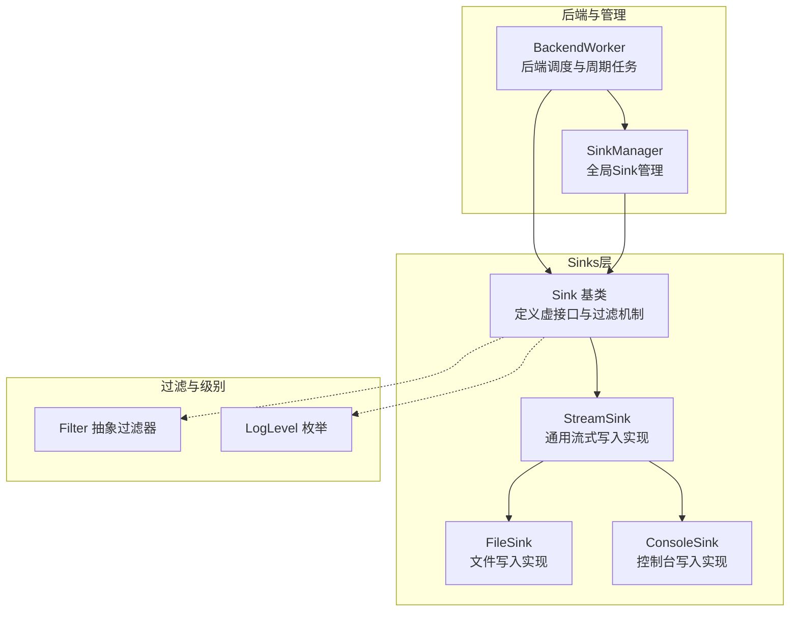
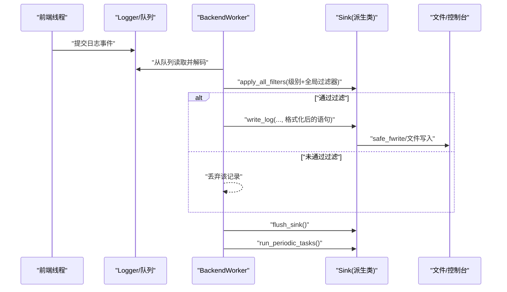
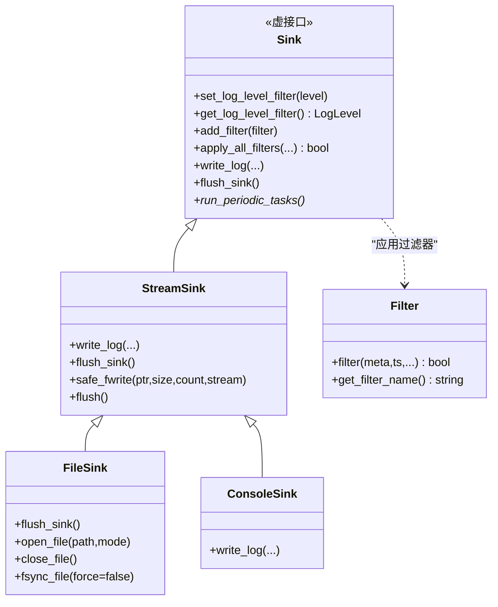
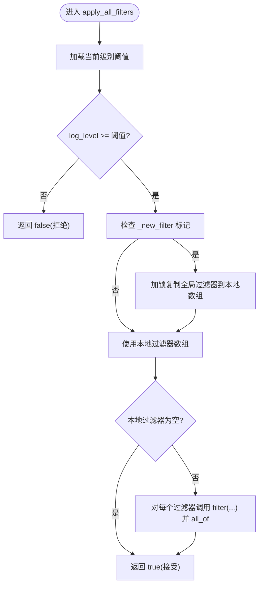
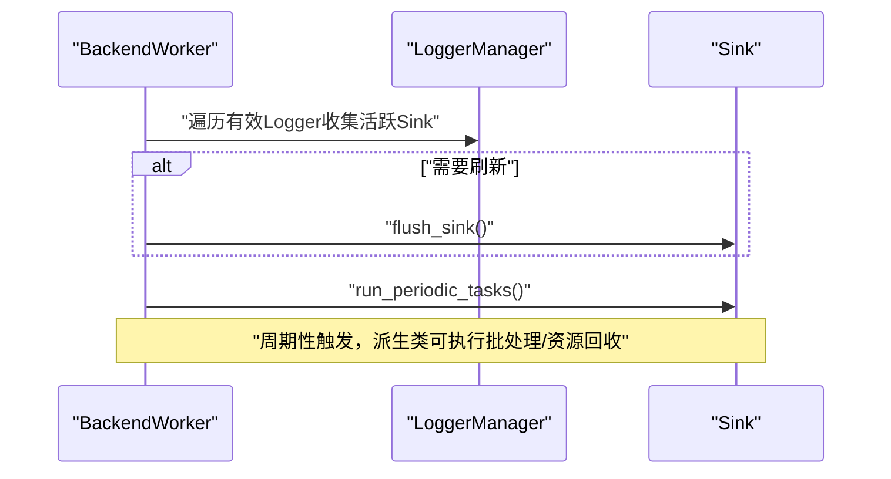
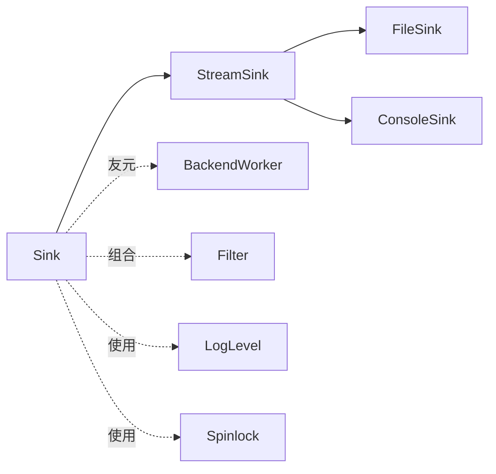

# Sink基类架构

<cite>
**本文档引用的文件**
- [Sink.h](file://include/quill/sinks/Sink.h)
- [StreamSink.h](file://include/quill/sinks/StreamSink.h)
- [FileSink.h](file://include/quill/sinks/FileSink.h)
- [ConsoleSink.h](file://include/quill/sinks/ConsoleSink.h)
- [Filter.h](file://include/quill/filters/Filter.h)
- [LogLevel.h](file://include/quill/core/LogLevel.h)
- [Spinlock.h](file://include/quill/core/Spinlock.h)
- [SinkManager.h](file://include/quill/core/SinkManager.h)
- [BackendWorker.h](file://include/quill/backend/BackendWorker.h)
</cite>

## 目录
1. [简介](#简介)
2. [项目结构](#项目结构)
3. [核心组件](#核心组件)
4. [架构总览](#架构总览)
5. [详细组件分析](#详细组件分析)
6. [依赖关系分析](#依赖关系分析)
7. [性能考量](#性能考量)
8. [故障排查指南](#故障排查指南)
9. [结论](#结论)
10. [附录](#附录)

## 简介
本文件面向Quill日志库中的Sink基类，系统化阐述其设计模式与架构原理，重点解析以下关键点：
- 虚函数接口：write_log（格式化日志写入）、flush_sink（刷新输出缓冲）、run_periodic_tasks（周期性任务）
- 日志级别过滤机制与全局过滤器注册系统
- 线程安全保证与后端调度集成
- 继承指南与扩展开发最佳实践
目标是帮助开发者理解Sinks系统的统一接口设计，并在不直接阅读源码的情况下掌握其使用与扩展方法。

## 项目结构
围绕Sink体系的关键文件组织如下：
- 基类与通用设施：sinks/Sink.h、sinks/StreamSink.h、filters/Filter.h、core/LogLevel.h、core/Spinlock.h
- 具体实现示例：sinks/FileSink.h、sinks/ConsoleSink.h
- 后端调度与生命周期：backend/BackendWorker.h
- 全局管理：core/SinkManager.h

**图表来源**
- [Sink.h:40-218](file://include/quill/sinks/Sink.h#L40-L218)
- [StreamSink.h:67-314](file://include/quill/sinks/StreamSink.h#L67-L314)
- [FileSink.h:226-527](file://include/quill/sinks/FileSink.h#L226-L527)
- [ConsoleSink.h:331-412](file://include/quill/sinks/ConsoleSink.h#L331-L412)
- [Filter.h:26-72](file://include/quill/filters/Filter.h#L26-L72)
- [LogLevel.h:22-35](file://include/quill/core/LogLevel.h#L22-L35)
- [BackendWorker.h:1283-1362](file://include/quill/backend/BackendWorker.h#L1283-L1362)
- [SinkManager.h:28-157](file://include/quill/core/SinkManager.h#L28-L157)

**章节来源**
- [Sink.h:40-218](file://include/quill/sinks/Sink.h#L40-L218)
- [StreamSink.h:67-314](file://include/quill/sinks/StreamSink.h#L67-L314)
- [FileSink.h:226-527](file://include/quill/sinks/FileSink.h#L226-L527)
- [ConsoleSink.h:331-412](file://include/quill/sinks/ConsoleSink.h#L331-L412)
- [Filter.h:26-72](file://include/quill/filters/Filter.h#L26-L72)
- [LogLevel.h:22-35](file://include/quill/core/LogLevel.h#L22-L35)
- [BackendWorker.h:1283-1362](file://include/quill/backend/BackendWorker.h#L1283-L1362)
- [SinkManager.h:28-157](file://include/quill/core/SinkManager.h#L28-L157)

## 核心组件
- Sink基类：定义虚接口write_log、flush_sink、run_periodic_tasks；内置日志级别过滤与全局过滤器注册系统；通过友元BackendWorker访问内部状态。
- StreamSink：实现通用流式写入，负责safe_fwrite、flush、文件大小统计等基础能力。
- FileSink/ConsoleSink：基于StreamSink的特化实现，分别面向文件与控制台输出。
- Filter：抽象过滤器接口，支持按名称唯一注册与批量应用。
- LogLevel：日志级别枚举，用于级别过滤判断。
- BackendWorker：后端调度线程，负责周期性触发run_periodic_tasks并统一flush_sink。
- SinkManager：全局Sink管理器，提供创建/获取、清理过期实例的能力。

**章节来源**
- [Sink.h:123-197](file://include/quill/sinks/Sink.h#L123-L197)
- [StreamSink.h:152-299](file://include/quill/sinks/StreamSink.h#L152-L299)
- [FileSink.h:264-288](file://include/quill/sinks/FileSink.h#L264-L288)
- [ConsoleSink.h:375-405](file://include/quill/sinks/ConsoleSink.h#L375-L405)
- [Filter.h:54-66](file://include/quill/filters/Filter.h#L54-L66)
- [LogLevel.h:22-35](file://include/quill/core/LogLevel.h#L22-L35)
- [BackendWorker.h:1283-1362](file://include/quill/backend/BackendWorker.h#L1283-L1362)
- [SinkManager.h:69-94](file://include/quill/core/SinkManager.h#L69-L94)

## 架构总览
Sink体系采用“基类+多态+后端调度”的分层设计：
- 前端线程通过Logger将日志事件放入无锁队列
- 后端线程BackendWorker从队列读取、格式化、缓存为TransitEvent
- BackendWorker统一调用每个活跃Sink的flush_sink与run_periodic_tasks
- Sink内部根据日志级别与过滤器决定是否写入

**图表来源**
- [BackendWorker.h:1283-1362](file://include/quill/backend/BackendWorker.h#L1283-L1362)
- [Sink.h:156-197](file://include/quill/sinks/Sink.h#L156-L197)
- [StreamSink.h:152-193](file://include/quill/sinks/StreamSink.h#L152-L193)
- [FileSink.h:264-288](file://include/quill/sinks/FileSink.h#L264-L288)
- [ConsoleSink.h:375-405](file://include/quill/sinks/ConsoleSink.h#L375-L405)

## 详细组件分析

### Sink基类：虚函数与过滤机制
- 虚函数接口
  - write_log：接收宏元数据、时间戳、线程/进程信息、日志级别与格式化后的消息，由派生类实现具体写入逻辑
  - flush_sink：刷新输出缓冲，确保数据持久化或可见
  - run_periodic_tasks：周期性任务入口，默认空实现，供派生类覆盖以执行批处理、资源回收等
- 日志级别过滤
  - set_log_level_filter/get_log_level_filter：原子存储当前Sink的级别阈值
  - apply_all_filters：先进行级别比较，再检查全局过滤器集合，使用局部缓存减少锁竞争
- 全局过滤器注册系统
  - add_filter：线程安全地添加过滤器，避免同名冲突；内部使用自旋锁保护全局集合
  - _new_filter标记：当新增过滤器时，延迟复制到本地数组，降低每次过滤的开销
- 线程安全
  - 级别阈值与新过滤器标志使用原子类型
  - 过滤器集合使用自旋锁保护，配合局部数组读路径最小化锁持有时间
- 友元与后端协作
  - BackendWorker被声明为友元，以便在调度循环中调用flush_sink与run_periodic_tasks

**图表来源**
- [Sink.h:65-197](file://include/quill/sinks/Sink.h#L65-L197)
- [StreamSink.h:152-299](file://include/quill/sinks/StreamSink.h#L152-L299)
- [FileSink.h:264-485](file://include/quill/sinks/FileSink.h#L264-L485)
- [ConsoleSink.h:375-405](file://include/quill/sinks/ConsoleSink.h#L375-L405)
- [Filter.h:54-66](file://include/quill/filters/Filter.h#L54-L66)

**章节来源**
- [Sink.h:65-197](file://include/quill/sinks/Sink.h#L65-L197)
- [Spinlock.h:18-75](file://include/quill/core/Spinlock.h#L18-L75)
- [Filter.h:54-66](file://include/quill/filters/Filter.h#L54-L66)
- [LogLevel.h:22-35](file://include/quill/core/LogLevel.h#L22-L35)

### 过滤流程与算法
apply_all_filters的执行路径如下：

**图表来源**
- [Sink.h:156-197](file://include/quill/sinks/Sink.h#L156-L197)
- [Spinlock.h:58-72](file://include/quill/core/Spinlock.h#L58-L72)

**章节来源**
- [Sink.h:156-197](file://include/quill/sinks/Sink.h#L156-L197)
- [Spinlock.h:58-72](file://include/quill/core/Spinlock.h#L58-L72)

### 后端调度与周期任务
BackendWorker在主循环中统一管理所有活跃Sink：
- 定期调用_flush_and_run_active_sinks，按配置决定是否强制刷新与执行周期任务
- 对每个活跃Sink依次调用flush_sink与run_periodic_tasks
- 使用缓存避免重复查找，异常被捕获并上报，不中断后端线程

**图表来源**
- [BackendWorker.h:1283-1362](file://include/quill/backend/BackendWorker.h#L1283-L1362)

**章节来源**
- [BackendWorker.h:1283-1362](file://include/quill/backend/BackendWorker.h#L1283-L1362)

### 具体Sink实现要点
- StreamSink
  - write_log：调用safe_fwrite写入，支持before_write回调与文件大小统计
  - flush：调用fflush并重置写入状态
  - safe_fwrite：跨平台写入封装，Windows下优先使用WriteFile避免CRLF问题
- FileSink
  - 在StreamSink基础上增加fsync策略、重试打开、缓冲区设置、文件事件通知
  - flush_sink：先调用父类flush，再条件性fsync
- ConsoleSink
  - 在StreamSink基础上支持颜色输出与输出流选择(stdout/stderr)

**章节来源**
- [StreamSink.h:152-299](file://include/quill/sinks/StreamSink.h#L152-L299)
- [FileSink.h:264-485](file://include/quill/sinks/FileSink.h#L264-L485)
- [ConsoleSink.h:375-405](file://include/quill/sinks/ConsoleSink.h#L375-L405)

## 依赖关系分析
- 继承关系
  - Sink为抽象基类，StreamSink继承Sink，FileSink/ConsoleSink继承StreamSink
- 友元与协作
  - Sink将BackendWorker声明为友元，以便后端线程调用flush与周期任务
- 过滤与级别
  - Sink内部组合Filter集合，结合LogLevel进行两级过滤
- 线程同步
  - 自旋锁保护全局过滤器集合；原子类型保护级别阈值与新过滤器标记

**图表来源**
- [Sink.h:200-216](file://include/quill/sinks/Sink.h#L200-L216)
- [StreamSink.h:67-314](file://include/quill/sinks/StreamSink.h#L67-L314)
- [FileSink.h:226-527](file://include/quill/sinks/FileSink.h#L226-L527)
- [ConsoleSink.h:331-412](file://include/quill/sinks/ConsoleSink.h#L331-L412)
- [Filter.h:26-72](file://include/quill/filters/Filter.h#L26-L72)
- [LogLevel.h:22-35](file://include/quill/core/LogLevel.h#L22-L35)
- [Spinlock.h:18-75](file://include/quill/core/Spinlock.h#L18-L75)
- [BackendWorker.h:1283-1362](file://include/quill/backend/BackendWorker.h#L1283-L1362)

**章节来源**
- [Sink.h:200-216](file://include/quill/sinks/Sink.h#L200-L216)
- [BackendWorker.h:1283-1362](file://include/quill/backend/BackendWorker.h#L1283-L1362)

## 性能考量
- 过滤优化
  - 局部过滤器数组减少锁持有时间，仅在新增过滤器时复制一次
  - 级别过滤在前，避免不必要的过滤器调用
- 写入路径
  - safe_fwrite在Windows下使用WriteFile，减少换行转换开销
  - 文件写入支持用户自定义缓冲区大小，平衡吞吐与延迟
- 刷新策略
  - FileSink可配置fsync间隔，缓解频繁fsync导致的磁盘磨损
  - BackendWorker按最小刷新间隔批量刷新，降低系统调用次数

**章节来源**
- [Sink.h:156-197](file://include/quill/sinks/Sink.h#L156-L197)
- [StreamSink.h:214-278](file://include/quill/sinks/StreamSink.h#L214-L278)
- [FileSink.h:146-173](file://include/quill/sinks/FileSink.h#L146-L173)
- [BackendWorker.h:1314-1330](file://include/quill/backend/BackendWorker.h#L1314-L1330)

## 故障排查指南
- 过滤器重复注册
  - 现象：添加同名过滤器抛出异常
  - 处理：确保过滤器名称唯一；或在添加前查询现有名称
- 文件写入失败
  - 现象：safe_fwrite/fflush抛出异常
  - 处理：检查文件权限、磁盘空间、句柄有效性；必要时启用重试与错误回调
- fsync策略不当
  - 现象：磁盘磨损严重或数据持久性不足
  - 处理：调整fsync开关与最小间隔；在高吞吐场景适当放宽fsync频率
- 控制台颜色输出异常
  - 现象：颜色代码未生效或终端不支持
  - 处理：检查终端类型与环境变量；必要时切换到Never或Always模式

**章节来源**
- [Sink.h:85-104](file://include/quill/sinks/Sink.h#L85-L104)
- [StreamSink.h:252-278](file://include/quill/sinks/StreamSink.h#L252-L278)
- [FileSink.h:418-433](file://include/quill/sinks/FileSink.h#L418-L433)
- [ConsoleSink.h:154-250](file://include/quill/sinks/ConsoleSink.h#L154-L250)

## 结论
Sink基类通过清晰的虚函数接口与高效的过滤/刷新机制，为Quill提供了统一且高性能的日志输出抽象。结合BackendWorker的周期调度与全局管理器的生命周期控制，开发者可以以最小成本扩展新的输出目标，并在保证线程安全的前提下获得稳定的性能表现。

## 附录

### 继承指南与扩展最佳实践
- 新增Sink步骤
  - 继承Sink或StreamSink，实现write_log与flush_sink
  - 如需周期性任务，在run_periodic_tasks中实现批处理/资源回收
  - 通过add_filter注册过滤器，注意命名唯一性
- 性能建议
  - 将昂贵操作移至run_periodic_tasks，避免阻塞后端主循环
  - 合理设置日志级别阈值，减少无效过滤器调用
  - 对文件写入启用合适的缓冲区大小与fsync策略
- 线程安全
  - 写入路径尽量避免阻塞；如需阻塞操作，放在run_periodic_tasks中
  - 使用全局过滤器时，避免在高频路径中频繁修改集合

**章节来源**
- [Sink.h:123-141](file://include/quill/sinks/Sink.h#L123-L141)
- [StreamSink.h:152-193](file://include/quill/sinks/StreamSink.h#L152-L193)
- [FileSink.h:264-288](file://include/quill/sinks/FileSink.h#L264-L288)
- [ConsoleSink.h:375-405](file://include/quill/sinks/ConsoleSink.h#L375-L405)
- [BackendWorker.h:1348-1352](file://include/quill/backend/BackendWorker.h#L1348-L1352)