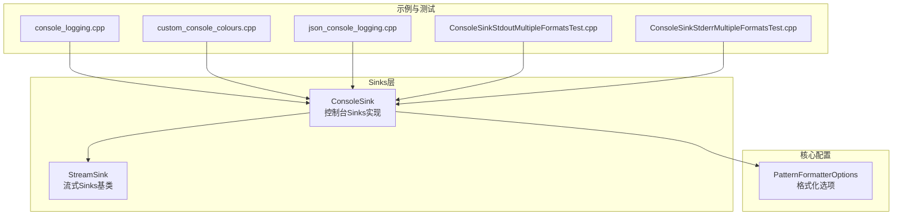
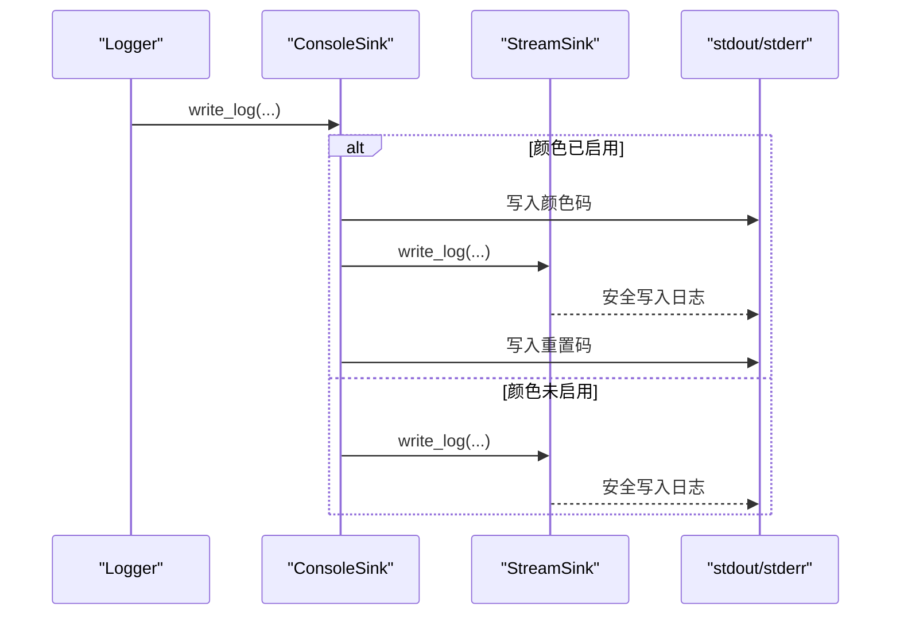
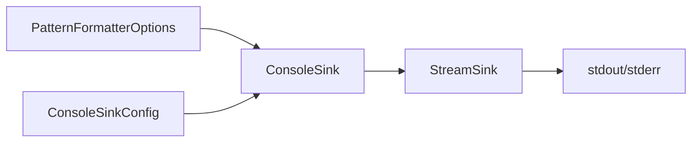

# 控制台Sinks

<cite>
**本文引用的文件列表**
- [ConsoleSink.h](file://include/quill/sinks/ConsoleSink.h)
- [StreamSink.h](file://include/quill/sinks/StreamSink.h)
- [PatternFormatterOptions.h](file://include/quill/core/PatternFormatterOptions.h)
- [console_logging.cpp](file://examples/console_logging.cpp)
- [custom_console_colours.cpp](file://examples/custom_console_colours.cpp)
- [json_console_logging.cpp](file://examples/json_console_logging.cpp)
- [ConsoleSinkStdoutMultipleFormatsTest.cpp](file://test/integration_tests/ConsoleSinkStdoutMultipleFormatsTest.cpp)
- [ConsoleSinkStderrMultipleFormatsTest.cpp](file://test/integration_tests/ConsoleSinkStderrMultipleFormatsTest.cpp)
- [quill_docs_example_console.cpp](file://docs/examples/quill_docs_example_console.cpp)
</cite>

## 目录
1. [简介](#简介)
2. [项目结构](#项目结构)
3. [核心组件](#核心组件)
4. [架构总览](#架构总览)
5. [详细组件分析](#详细组件分析)
6. [依赖关系分析](#依赖关系分析)
7. [性能考量](#性能考量)
8. [故障排查指南](#故障排查指南)
9. [结论](#结论)
10. [附录](#附录)

## 简介
本技术文档聚焦于Quill的控制台Sinks，系统性阐述ConsoleSink的功能特性与使用场景，涵盖颜色支持机制、格式化选项配置、输出目标选择（stdout/stderr），以及跨平台兼容性与性能优化策略。文档同时提供完整的配置示例与最佳实践，帮助开发者在不同运行环境下实现稳定高效的控制台日志输出。

## 项目结构
Quill的控制台Sinks位于`sinks`子目录中，核心实现由ConsoleSink与StreamSink共同构成，并通过PatternFormatterOptions进行格式化定制。示例与测试覆盖了多种使用场景，包括标准输出/错误输出、彩色输出、自定义格式模板、多格式组合等。

图表来源
- [ConsoleSink.h:331-410](file://include/quill/sinks/ConsoleSink.h#L331-L410)
- [StreamSink.h:67-145](file://include/quill/sinks/StreamSink.h#L67-L145)
- [PatternFormatterOptions.h:23-170](file://include/quill/core/PatternFormatterOptions.h#L23-L170)

章节来源
- [ConsoleSink.h:1-412](file://include/quill/sinks/ConsoleSink.h#L1-L412)
- [StreamSink.h:1-314](file://include/quill/sinks/StreamSink.h#L1-L314)
- [PatternFormatterOptions.h:1-170](file://include/quill/core/PatternFormatterOptions.h#L1-L170)

## 核心组件
- ConsoleSinkConfig：控制台Sinks配置对象，负责颜色模式、输出流、格式化选项覆盖等。
- ConsoleSink：控制台Sinks实现，继承自StreamSink，负责将格式化后的日志写入stdout或stderr，并在需要时插入ANSI颜色码。
- StreamSink：通用流式Sinks基类，封装文件/流打开、安全写入、刷新等通用逻辑。
- PatternFormatterOptions：格式化选项，用于定义日志消息的格式、时间戳样式、时区、换行符等。

章节来源
- [ConsoleSink.h:44-328](file://include/quill/sinks/ConsoleSink.h#L44-L328)
- [ConsoleSink.h:331-410](file://include/quill/sinks/ConsoleSink.h#L331-L410)
- [StreamSink.h:67-308](file://include/quill/sinks/StreamSink.h#L67-L308)
- [PatternFormatterOptions.h:23-170](file://include/quill/core/PatternFormatterOptions.h#L23-L170)

## 架构总览
ConsoleSink在构造时根据配置决定是否启用颜色输出，并在写入日志前后分别注入与重置ANSI颜色码；底层通过StreamSink的安全写入接口完成实际输出。PatternFormatterOptions可按需覆盖默认格式化规则，以满足不同场景下的输出需求。

```mermaid
classDiagram
class ConsoleSinkConfig {
+ColourMode colour_mode
+string stream
+set_colour_mode(mode)
+set_stream(name)
+set_override_pattern_formatter_options(opts)
+colours()
}
class Colours {
+apply_default_colours()
+assign_colour_to_log_level(level, code)
+log_level_colour(level) string_view
+colours_enabled() bool
+reset,bold,dark,underline,blink,reverse,concealed
+black,red,green,yellow,blue,magenta,cyan,white
+on_black,on_red,on_green,on_yellow,on_blue,on_magenta,on_cyan,on_white
+white_bold,yellow_bold,red_bold,bold_on_red
}
class ConsoleSink {
+write_log(...)
-_config : ConsoleSinkConfig
}
class StreamSink {
+write_log(...)
+flush_sink()
+safe_fwrite(ptr,size,count,stream)
+get_filename()
}
ConsoleSinkConfig o--> Colours
ConsoleSink --|> StreamSink
ConsoleSink --> ConsoleSinkConfig
```

图表来源
- [ConsoleSink.h:44-328](file://include/quill/sinks/ConsoleSink.h#L44-L328)
- [ConsoleSink.h:331-410](file://include/quill/sinks/ConsoleSink.h#L331-L410)
- [StreamSink.h:67-180](file://include/quill/sinks/StreamSink.h#L67-L180)

## 详细组件分析

### ConsoleSinkConfig与颜色系统
- 颜色模式（ColourMode）：
  - Always：始终启用颜色输出。
  - Automatic：自动检测终端与环境变量，仅在支持ANSI颜色的环境中启用。
  - Never：禁用颜色输出。
- 默认颜色映射：为各日志级别预设了默认颜色，可通过自定义Colours覆盖。
- 颜色启用判定：
  - Windows：默认认为支持ANSI颜色。
  - 非Windows：检查环境变量TERM是否包含常见终端类型。
- 终端检测：通过_isatty或isatty判断输出是否为终端。
- Windows控制台颜色激活：在支持的环境下启用虚拟终端处理与处理后输出模式。

章节来源
- [ConsoleSink.h:47-52](file://include/quill/sinks/ConsoleSink.h#L47-L52)
- [ConsoleSink.h:67-112](file://include/quill/sinks/ConsoleSink.h#L67-L112)
- [ConsoleSink.h:154-189](file://include/quill/sinks/ConsoleSink.h#L154-L189)
- [ConsoleSink.h:192-199](file://include/quill/sinks/ConsoleSink.h#L192-L199)
- [ConsoleSink.h:203-227](file://include/quill/sinks/ConsoleSink.h#L203-L227)
- [ConsoleSink.h:231-250](file://include/quill/sinks/ConsoleSink.h#L231-L250)

### 输出目标选择（stdout/stderr）
- 支持将日志输出到stdout或stderr。
- 构造时对stream参数进行断言校验，确保值为"stdout"或"stderr"。
- StreamSink内部将字符串"stdout"/"stderr"映射到对应的FILE指针。

章节来源
- [ConsoleSink.h:344-345](file://include/quill/sinks/ConsoleSink.h#L344-L345)
- [ConsoleSink.h:296](file://include/quill/sinks/ConsoleSink.h#L296)
- [StreamSink.h:87-94](file://include/quill/sinks/StreamSink.h#L87-L94)

### 格式化选项配置
- 覆盖格式化器：ConsoleSinkConfig允许为该Sink单独设置PatternFormatterOptions，优先级高于全局Logger的格式化器。
- 常用字段：
  - format_pattern：日志格式模板。
  - timestamp_pattern：时间戳格式。
  - timestamp_timezone：时区。
  - add_metadata_to_multi_line_logs：多行日志是否为每行添加元数据。
  - pattern_suffix：每条格式化后的日志末尾追加字符，默认为换行符。
- 多格式组合：同一Logger可绑定多个Sinks，每个Sinks可拥有独立的格式化选项，从而实现“同一消息、不同格式”的输出。

章节来源
- [ConsoleSink.h:307-310](file://include/quill/sinks/ConsoleSink.h#L307-L310)
- [PatternFormatterOptions.h:27-40](file://include/quill/core/PatternFormatterOptions.h#L27-L40)
- [PatternFormatterOptions.h:68-81](file://include/quill/core/PatternFormatterOptions.h#L68-L81)
- [PatternFormatterOptions.h:122-128](file://include/quill/core/PatternFormatterOptions.h#L122-L128)
- [PatternFormatterOptions.h:141-147](file://include/quill/core/PatternFormatterOptions.h#L141-L147)
- [ConsoleSinkStdoutMultipleFormatsTest.cpp:46](file://test/integration_tests/ConsoleSinkStdoutMultipleFormatsTest.cpp#L46)

### 写入流程与颜色注入
- ConsoleSink::write_log在调用父类StreamSink::write_log前后，条件性地写入ANSI颜色码与重置码。
- 当颜色未启用时，直接走父类写入路径，避免额外开销。

图表来源
- [ConsoleSink.h:375-405](file://include/quill/sinks/ConsoleSink.h#L375-L405)
- [StreamSink.h:152-180](file://include/quill/sinks/StreamSink.h#L152-L180)

章节来源
- [ConsoleSink.h:375-405](file://include/quill/sinks/ConsoleSink.h#L375-L405)
- [StreamSink.h:152-180](file://include/quill/sinks/StreamSink.h#L152-L180)

### 跨平台兼容性
- Windows：
  - 使用WriteFile替代fwrite以避免非二进制流导致的换行问题。
  - 启用虚拟终端处理与处理后输出模式以支持ANSI颜色。
- 非Windows：
  - 检查TERM环境变量以判断是否支持ANSI颜色。
  - 使用isatty判断输出是否为终端。

章节来源
- [StreamSink.h:224-250](file://include/quill/sinks/StreamSink.h#L224-L250)
- [ConsoleSink.h:203-227](file://include/quill/sinks/ConsoleSink.h#L203-L227)
- [ConsoleSink.h:154-189](file://include/quill/sinks/ConsoleSink.h#L154-L189)
- [ConsoleSink.h:192-199](file://include/quill/sinks/ConsoleSink.h#L192-L199)

### 配置示例与最佳实践
- 启用彩色输出：
  - 使用ConsoleSinkConfig::set_colour_mode设置为Always或Automatic。
  - 可通过ConsoleSinkConfig::Colours::assign_colour_to_log_level为特定级别设置颜色。
- 自定义格式化模板：
  - 通过ConsoleSinkConfig::set_override_pattern_formatter_options为该Sink设置独立的PatternFormatterOptions。
  - 多格式组合：为不同Logger或同一Logger的不同Sinks设置不同的格式化选项。
- 输出目标选择：
  - 将stream设置为"stdout"或"stderr"，满足不同场景的输出分流。
- 示例参考：
  - 基础控制台输出：[console_logging.cpp:20-71](file://examples/console_logging.cpp#L20-L71)
  - 自定义控制台颜色：[custom_console_colours.cpp:14-47](file://examples/custom_console_colours.cpp#L14-L47)
  - JSON控制台输出（对比理解格式化差异）：[json_console_logging.cpp:9-53](file://examples/json_console_logging.cpp#L9-L53)
  - 文档示例：[quill_docs_example_console.cpp:12-49](file://docs/examples/quill_docs_example_console.cpp#L12-L49)

章节来源
- [ConsoleSink.h:282-296](file://include/quill/sinks/ConsoleSink.h#L282-L296)
- [ConsoleSink.h:307-310](file://include/quill/sinks/ConsoleSink.h#L307-L310)
- [ConsoleSinkStdoutMultipleFormatsTest.cpp:46](file://test/integration_tests/ConsoleSinkStdoutMultipleFormatsTest.cpp#L46)
- [ConsoleSinkStderrMultipleFormatsTest.cpp:41](file://test/integration_tests/ConsoleSinkStderrMultipleFormatsTest.cpp#L41)

## 依赖关系分析
ConsoleSink依赖于StreamSink提供的通用流式能力，并通过ConsoleSinkConfig管理颜色与格式化配置。PatternFormatterOptions作为格式化层的配置载体，既可全局应用，也可被ConsoleSinkConfig覆盖。

图表来源
- [ConsoleSink.h:338-356](file://include/quill/sinks/ConsoleSink.h#L338-L356)
- [StreamSink.h:78-145](file://include/quill/sinks/StreamSink.h#L78-L145)

章节来源
- [ConsoleSink.h:338-356](file://include/quill/sinks/ConsoleSink.h#L338-L356)
- [StreamSink.h:78-145](file://include/quill/sinks/StreamSink.h#L78-L145)

## 性能考量
- 安全写入与缓冲：
  - StreamSink::safe_fwrite在Windows上优先使用WriteFile避免换行问题，在非Windows上使用fwrite。
  - 对部分写与错误状态进行循环重试与异常抛出，保证写入完整性。
- 刷新策略：
  - ConsoleSink不直接管理刷新，而是委托给StreamSink::flush_sink与底层BackendWorker的周期性刷新。
  - BackendWorker会根据最小刷新间隔策略批量刷新活跃Sinks，减少频繁IO。
- 颜色开销：
  - 颜色启用时会在每次写入前后追加颜色码与重置码，建议在不需要彩色输出时设置为Never以降低开销。
- 多格式组合：
  - 为不同Sinks设置独立格式化选项时，注意避免过度复杂的模板导致格式化成本上升。

章节来源
- [StreamSink.h:214-278](file://include/quill/sinks/StreamSink.h#L214-L278)
- [StreamSink.h:185-193](file://include/quill/sinks/StreamSink.h#L185-L193)
- [BackendWorker.h:1284-1362](file://include/quill/backend/BackendWorker.h#L1284-L1362)
- [ConsoleSink.h:383-404](file://include/quill/sinks/ConsoleSink.h#L383-L404)

## 故障排查指南
- 颜色未生效：
  - 检查ConsoleSinkConfig::set_colour_mode是否为Never。
  - 在非Windows平台确认TERM环境变量是否包含支持ANSI的颜色终端类型。
  - Windows平台确认控制台是否支持虚拟终端处理。
- 输出到stderr但无内容：
  - 确认ConsoleSinkConfig::set_stream设置为"stderr"。
  - 检查测试或捕获stdout/stderr的工具是否正确捕获stderr。
- 格式化异常：
  - 检查PatternFormatterOptions中的format_pattern是否合法，避免重复占位符。
  - 若使用多格式组合，确认每个Sinks的格式化选项互不冲突。
- 写入失败：
  - safe_fwrite在部分写或错误时会抛出异常，检查底层错误码与系统状态。

章节来源
- [ConsoleSink.h:282-296](file://include/quill/sinks/ConsoleSink.h#L282-L296)
- [ConsoleSink.h:154-189](file://include/quill/sinks/ConsoleSink.h#L154-L189)
- [ConsoleSinkStderrMultipleFormatsTest.cpp:35-36](file://test/integration_tests/ConsoleSinkStderrMultipleFormatsTest.cpp#L35-L36)
- [PatternFormatterOptions.h:67-67](file://include/quill/core/PatternFormatterOptions.h#L67-L67)
- [StreamSink.h:254-277](file://include/quill/sinks/StreamSink.h#L254-L277)

## 结论
ConsoleSink提供了灵活且高性能的控制台日志输出能力，结合StreamSink的通用流式处理与PatternFormatterOptions的格式化定制，能够满足从基础彩色输出到复杂多格式组合的多样化需求。通过合理配置颜色模式、输出目标与格式化模板，并遵循性能优化建议，可在不同平台上获得一致、稳定的日志体验。

## 附录
- 示例与测试参考：
  - 基础控制台输出：[console_logging.cpp:20-71](file://examples/console_logging.cpp#L20-L71)
  - 自定义控制台颜色：[custom_console_colours.cpp:14-47](file://examples/custom_console_colours.cpp#L14-L47)
  - JSON控制台输出：[json_console_logging.cpp:9-53](file://examples/json_console_logging.cpp#L9-L53)
  - 多格式组合（stdout）：[ConsoleSinkStdoutMultipleFormatsTest.cpp:19-107](file://test/integration_tests/ConsoleSinkStdoutMultipleFormatsTest.cpp#L19-L107)
  - 多格式组合（stderr）：[ConsoleSinkStderrMultipleFormatsTest.cpp:19-102](file://test/integration_tests/ConsoleSinkStderrMultipleFormatsTest.cpp#L19-L102)
  - 文档示例：[quill_docs_example_console.cpp:12-49](file://docs/examples/quill_docs_example_console.cpp#L12-L49)