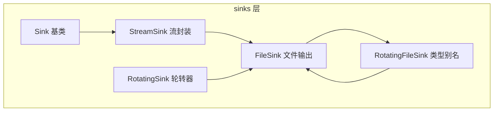
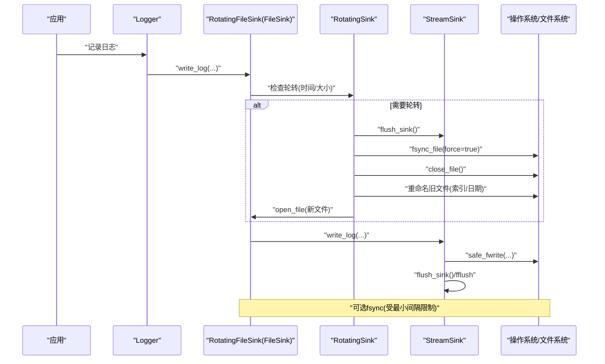
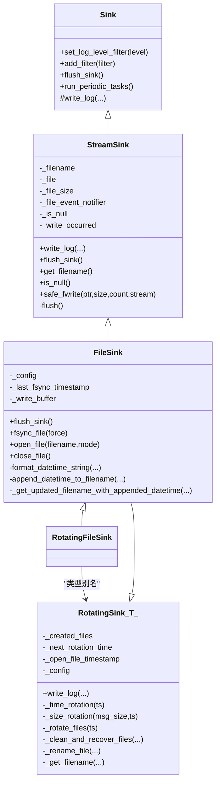

# 文件Sinks

<cite>
**本文引用的文件**
- [FileSink.h](file://include/quill/sinks/FileSink.h)
- [RotatingFileSink.h](file://include/quill/sinks/RotatingFileSink.h)
- [RotatingSink.h](file://include/quill/sinks/RotatingSink.h)
- [StreamSink.h](file://include/quill/sinks/StreamSink.h)
- [Sink.h](file://include/quill/sinks/Sink.h)
- [FileSinkTest.cpp](file://test/unit_tests/FileSinkTest.cpp)
- [RotatingFileSinkTest.cpp](file://test/unit_tests/RotatingFileSinkTest.cpp)
- [rotating_file_logging.cpp](file://examples/rotating_file_logging.cpp)
</cite>

## 目录
1. [简介](#简介)
2. [项目结构](#项目结构)
3. [核心组件](#核心组件)
4. [架构总览](#架构总览)
5. [详细组件分析](#详细组件分析)
6. [依赖关系分析](#依赖关系分析)
7. [性能考量](#性能考量)
8. [故障排查指南](#故障排查指南)
9. [结论](#结论)
10. [附录](#附录)

## 简介
本文件面向Quill的日志系统，聚焦“文件Sinks”子系统，系统性阐述以下内容：
- FileSink：基础文件输出能力（文件打开模式、缓冲策略、fsync与最小间隔、文件事件通知、路径与目录处理、跨平台文件句柄/锁策略）。
- RotatingFileSink：基于FileSink的轮转机制（按大小轮转、按时间轮转、命名策略、保留策略、覆盖策略、启动时强制轮转、清理旧文件）。
- 使用指南：如何正确配置与使用，常见问题与异常处理建议。

## 项目结构
围绕文件Sinks的关键头文件与测试/示例如下：
- sinks层：Sink基类、StreamSink通用流封装、FileSink文件输出、RotatingSink模板轮转器、RotatingFileSink类型别名。
- 测试：FileSinkTest.cpp、RotatingFileSinkTest.cpp覆盖配置、轮转、命名、保留策略等。
- 示例：rotating_file_logging.cpp展示典型用法。

图表来源
- [Sink.h:40-218](file://include/quill/sinks/Sink.h#L40-L218)
- [StreamSink.h:67-314](file://include/quill/sinks/StreamSink.h#L67-L314)
- [FileSink.h:226-527](file://include/quill/sinks/FileSink.h#L226-L527)
- [RotatingSink.h:262-845](file://include/quill/sinks/RotatingSink.h#L262-L845)
- [RotatingFileSink.h:13-15](file://include/quill/sinks/RotatingFileSink.h#L13-L15)

章节来源
- [Sink.h:40-218](file://include/quill/sinks/Sink.h#L40-L218)
- [StreamSink.h:67-314](file://include/quill/sinks/StreamSink.h#L67-L314)
- [FileSink.h:226-527](file://include/quill/sinks/FileSink.h#L226-L527)
- [RotatingSink.h:262-845](file://include/quill/sinks/RotatingSink.h#L262-L845)
- [RotatingFileSink.h:13-15](file://include/quill/sinks/RotatingFileSink.h#L13-L15)

## 核心组件
- Sink：所有sink的抽象基类，定义日志过滤、过滤器注册、刷新接口等。
- StreamSink：通用流封装，负责文件/控制台/空设备的统一管理，包含安全写入、刷新、目录创建、文件事件通知等。
- FileSink：在StreamSink基础上实现文件打开、关闭、缓冲、fsync与最小间隔、文件名追加日期/时间、重试打开等。
- RotatingSink<T>：模板轮转器，基于FileSinkConfig扩展出时间/大小/命名/保留/覆盖等策略，并在写入前触发轮转检查。
- RotatingFileSink：FileSink的类型别名，便于直接使用。

章节来源
- [Sink.h:40-218](file://include/quill/sinks/Sink.h#L40-L218)
- [StreamSink.h:67-314](file://include/quill/sinks/StreamSink.h#L67-L314)
- [FileSink.h:226-527](file://include/quill/sinks/FileSink.h#L226-L527)
- [RotatingSink.h:262-845](file://include/quill/sinks/RotatingSink.h#L262-L845)
- [RotatingFileSink.h:13-15](file://include/quill/sinks/RotatingFileSink.h#L13-L15)

## 架构总览
下图展示了从应用到后端线程的调用链路，以及轮转器在写入前的决策流程。

图表来源
- [RotatingSink.h:335-369](file://include/quill/sinks/RotatingSink.h#L335-L369)
- [FileSink.h:264-288](file://include/quill/sinks/FileSink.h#L264-L288)
- [StreamSink.h:152-193](file://include/quill/sinks/StreamSink.h#L152-L193)

## 详细组件分析

### FileSink：基础文件输出
- 文件打开与关闭
  - 打开：支持Windows共享读取与非继承句柄、Unix O_CLOEXEC；失败自动重试多次；可设置自定义缓冲区大小；成功后回调after_open。
  - 关闭：回调before_close/after_close；确保资源释放。
- 缓冲策略
  - 可通过set_write_buffer_size设置用户缓冲区大小（最小4KB），否则使用默认64KB；内部使用setvbuf设置全缓冲。
- 写入与刷新
  - safe_fwrite循环写入，避免部分写；fflush后清空写标记；flush_sink会根据fsync_enabled决定是否fsync。
- fsync与最小间隔
  - fsync_file支持force强制同步或受最小间隔限制；当最小间隔非零但fsync禁用时构造即抛错。
- 文件名追加
  - 支持追加开始日期、开始日期+时间、自定义strftime格式；与timezone配合生成文件名。
- 路径与目录
  - 自动创建父目录并转换为规范路径；支持/./../等相对路径解析。
- 事件通知
  - FileEventNotifier在open/close/before_write阶段回调，便于外部监控或预处理。
- 错误处理
  - fopen/setvbuf失败抛出QuillError；fwrite/fflush失败抛出QuillError；Windows控制台写入使用WriteFile优化。

章节来源
- [FileSink.h:226-527](file://include/quill/sinks/FileSink.h#L226-L527)
- [StreamSink.h:67-314](file://include/quill/sinks/StreamSink.h#L67-L314)
- [FileSinkTest.cpp:15-185](file://test/unit_tests/FileSinkTest.cpp#L15-L185)

### RotatingFileSink：轮转机制
- 配置项（继承自FileSinkConfig）
  - 按大小轮转：set_rotation_max_file_size(字节)，最小值512B。
  - 按时间轮转：set_rotation_frequency_and_interval('M'|'H', interval)；或set_rotation_time_daily("HH:MM")。
  - 命名策略：Index、Date、DateAndTime；可通过set_rotation_naming_scheme设置。
  - 保留策略：set_max_backup_files；set_overwrite_rolled_files控制达到上限后是否覆盖最旧文件。
  - 启动轮转：set_rotation_on_creation在创建时强制轮转一次。
  - 清理旧文件：set_remove_old_files控制w模式下启动时清理历史同名文件。
- 写入流程
  - 在write_log中先检查时间轮转，再检查大小轮转；必要时调用_rotate_files执行重命名与打开新文件。
- 文件清理与恢复
  - _clean_and_recover_files在w模式下清理冲突文件，在a模式下恢复索引/日期信息并排序。
- 重命名与防病毒锁定
  - _rename_file在失败时重试一次并短暂延迟，缓解Windows杀毒软件锁定导致的临时占用。

章节来源
- [RotatingSink.h:39-257](file://include/quill/sinks/RotatingSink.h#L39-L257)
- [RotatingSink.h:278-487](file://include/quill/sinks/RotatingSink.h#L278-L487)
- [RotatingSink.h:490-654](file://include/quill/sinks/RotatingSink.h#L490-L654)
- [RotatingSink.h:729-807](file://include/quill/sinks/RotatingSink.h#L729-L807)
- [RotatingFileSink.h:13-15](file://include/quill/sinks/RotatingFileSink.h#L13-L15)
- [RotatingFileSinkTest.cpp:13-800](file://test/unit_tests/RotatingFileSinkTest.cpp#L13-L800)

### 类关系图（代码级）

图表来源
- [Sink.h:40-218](file://include/quill/sinks/Sink.h#L40-L218)
- [StreamSink.h:67-314](file://include/quill/sinks/StreamSink.h#L67-L314)
- [FileSink.h:226-527](file://include/quill/sinks/FileSink.h#L226-L527)
- [RotatingSink.h:262-845](file://include/quill/sinks/RotatingSink.h#L262-L845)
- [RotatingFileSink.h:13-15](file://include/quill/sinks/RotatingFileSink.h#L13-L15)

## 依赖关系分析
- 继承关系
  - Sink是所有sink的抽象基类；StreamSink继承Sink，提供通用流能力；FileSink继承StreamSink，实现文件细节；RotatingSink<T>模板继承T（如FileSink），增加轮转逻辑。
- 外部依赖
  - 文件系统：std::filesystem用于路径解析、目录创建、文件状态查询与重命名。
  - 平台差异：Windows使用共享读取与非继承句柄，Unix使用O_CLOEXEC；fsync/FlushFileBuffers分别对应不同平台。
- 事件通知
  - FileEventNotifier在关键节点回调，便于外部监控或预处理（如加密、压缩）。

章节来源
- [StreamSink.h:101-144](file://include/quill/sinks/StreamSink.h#L101-L144)
- [FileSink.h:362-439](file://include/quill/sinks/FileSink.h#L362-L439)
- [RotatingSink.h:490-654](file://include/quill/sinks/RotatingSink.h#L490-L654)

## 性能考量
- 缓冲策略
  - 自定义缓冲区可减少系统调用次数，建议结合业务吞吐量调整；0表示使用默认。
- fsync频率
  - 通过set_minimum_fsync_interval限制fsync频率，降低磁盘磨损；仅在fsync启用时生效。
- 安全写入
  - safe_fwrite循环写入，避免部分写导致的重复写入；在Windows控制台使用WriteFile提升稳定性。
- 轮转时机
  - 时间轮转在写入前计算下次轮转时间点，避免频繁检查；大小轮转在写入前累加当前文件大小。

章节来源
- [FileSink.h:146-173](file://include/quill/sinks/FileSink.h#L146-L173)
- [StreamSink.h:214-278](file://include/quill/sinks/StreamSink.h#L214-L278)
- [RotatingSink.h:729-807](file://include/quill/sinks/RotatingSink.h#L729-L807)

## 故障排查指南
- fopen失败
  - 现象：构造FileSink/RotatingFileSink抛出QuillError。
  - 排查：确认路径存在且有写权限；检查open_mode是否合法；Windows可能被杀软锁定，稍后重试通常可解决。
- set_minimum_fsync_interval无效
  - 现象：fsync未按预期节流。
  - 排查：必须同时启用fsync；若仅设置了最小间隔而fsync禁用，构造即抛错。
- 文件被删除或被外部程序占用
  - 现象：flush后文件不存在或写入失败。
  - 处理：FileSink会在flush后检测文件是否存在，若不存在则自动重新打开；避免在运行时手动删除日志文件。
- 轮转命名冲突
  - 现象：同名文件过多导致索引混乱。
  - 处理：合理设置max_backup_files与overwrite_rolled_files；w模式下可启用remove_old_files清理历史文件。
- 跨平台兼容
  - Windows：共享读取与非继承句柄；fsync使用FlushFileBuffers。
  - Unix：O_CLOEXEC防止子进程继承FD；fsync使用::fsync。

章节来源
- [FileSink.h:418-423](file://include/quill/sinks/FileSink.h#L418-L423)
- [FileSink.h:247-251](file://include/quill/sinks/FileSink.h#L247-L251)
- [FileSink.h:279-287](file://include/quill/sinks/FileSink.h#L279-L287)
- [RotatingSink.h:490-561](file://include/quill/sinks/RotatingSink.h#L490-L561)
- [RotatingSink.h:679-700](file://include/quill/sinks/RotatingSink.h#L679-L700)

## 结论
- FileSink提供了稳定、跨平台的文件输出能力，支持缓冲、fsync、事件通知与路径处理。
- RotatingFileSink在FileSink之上实现了灵活的轮转策略，涵盖大小/时间/命名/保留/覆盖等配置，满足生产环境对日志管理的需求。
- 建议在高吞吐场景下合理配置缓冲与fsync间隔，在需要严格持久化的场景下启用fsync并设置合理的最小间隔。

## 附录

### 使用指南与最佳实践
- 基础文件输出
  - 设置open_mode为'a'或'w'；如需原子性写入，启用fsync并设置最小间隔。
  - 使用set_write_buffer_size优化吞吐；0表示使用默认。
  - 如需在文件名中加入启动时间，使用set_filename_append_option与set_timezone。
- 轮转策略
  - 按大小轮转：设置合理的rotation_max_file_size（≥512B）。
  - 按时间轮转：选择Minutely/Hourly/Daily，或指定每日具体时间点。
  - 命名策略：Index适合简单计数；Date/DateAndTime避免文件名冲突。
  - 保留策略：max_backup_files限制数量；overwrite_rolled_files控制是否覆盖最旧文件。
  - 启动轮转：rotation_on_creation在每次启动时强制轮转一次，避免同名冲突。
  - 清理旧文件：remove_old_files在w模式下启动时清理历史同名文件。
- 实战示例
  - 参考示例程序展示如何创建RotatingFileSink并配置每日轮转与按大小轮转。

章节来源
- [rotating_file_logging.cpp:21-32](file://examples/rotating_file_logging.cpp#L21-L32)
- [RotatingFileSinkTest.cpp:13-800](file://test/unit_tests/RotatingFileSinkTest.cpp#L13-L800)
- [FileSinkTest.cpp:15-185](file://test/unit_tests/FileSinkTest.cpp#L15-L185)