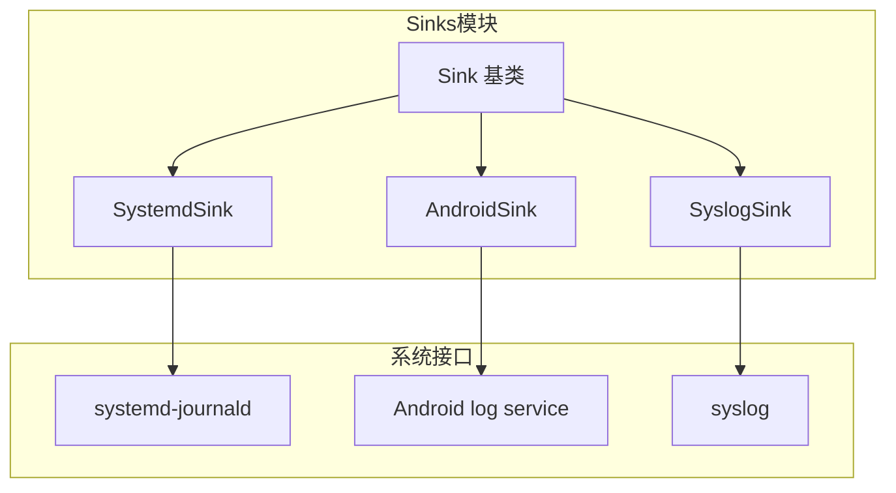
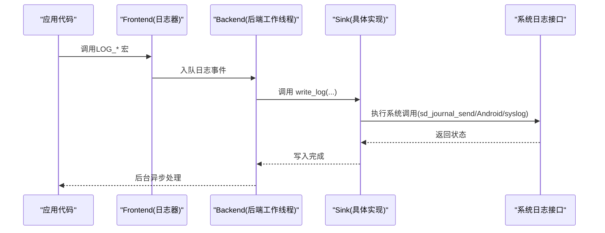
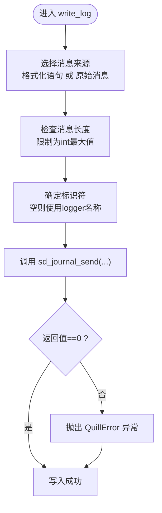
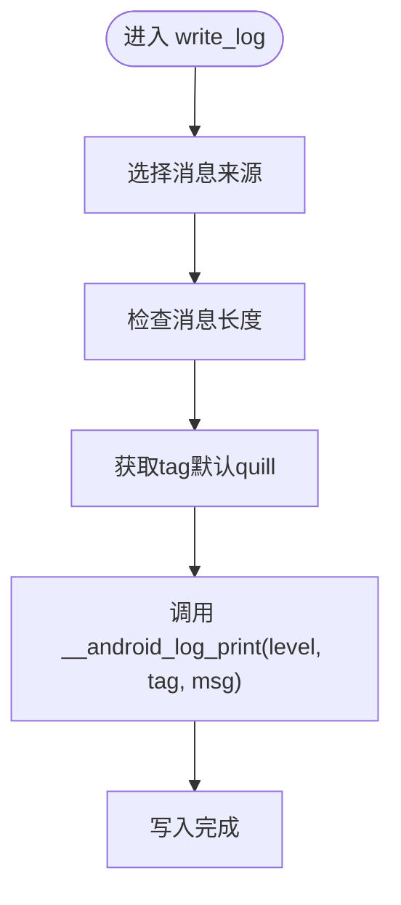
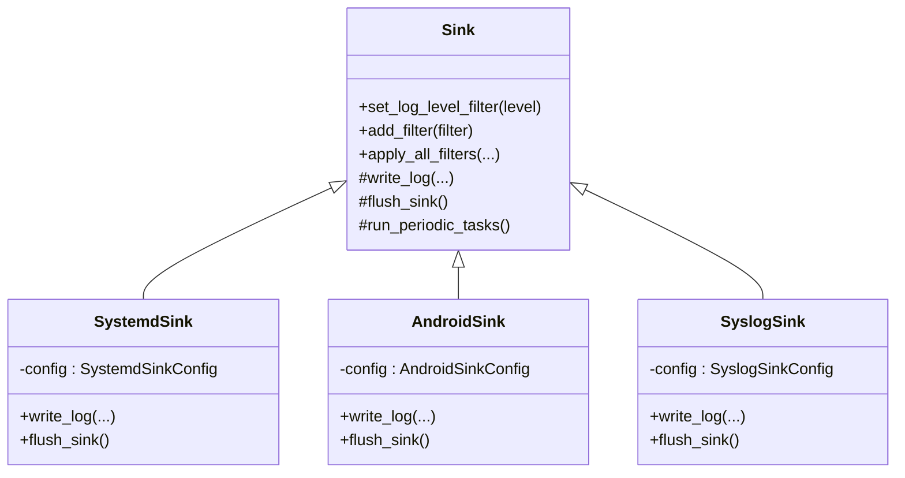

# 系统集成Sinks

<cite>
**本文引用的文件**
- [SystemdSink.h](file://include/quill/sinks/SystemdSink.h)
- [AndroidSink.h](file://include/quill/sinks/AndroidSink.h)
- [SyslogSink.h](file://include/quill/sinks/SyslogSink.h)
- [Sink.h](file://include/quill/sinks/Sink.h)
- [QuillError.h](file://include/quill/core/QuillError.h)
- [Common.h](file://include/quill/core/Common.h)
- [sink_types.rst](file://docs/sink_types.rst)
- [sinks.rst](file://docs/sinks.rst)
- [CMakeLists.txt](file://CMakeLists.txt)
</cite>

## 目录
1. [简介](#简介)
2. [项目结构](#项目结构)
3. [核心组件](#核心组件)
4. [架构总览](#架构总览)
5. [组件详解](#组件详解)
6. [依赖关系分析](#依赖关系分析)
7. [性能考量](#性能考量)
8. [故障排除指南](#故障排除指南)
9. [结论](#结论)
10. [附录](#附录)

## 简介
本技术文档聚焦于Quill的系统集成Sinks：SystemdSink（systemd-journald）、AndroidSink（Android日志服务）与SyslogSink（标准syslog协议）。文档从架构、数据流、配置参数、权限与连接建立、跨平台兼容、错误恢复与性能优化、部署与排障等方面进行系统化阐述，并提供可操作的配置示例与最佳实践，帮助开发者在Linux、Android等环境下正确集成系统日志服务。

## 项目结构
- SystemdSink、AndroidSink、SyslogSink均继承自通用基类Sink，遵循统一的写入与刷新接口约定。
- 配置类分别提供标识符、格式化开关、日志级别映射等能力，确保与目标系统语义对齐。
- 文档侧提供了针对各Sink的使用示例与注意事项，包括宏冲突规避与构建链接建议。



**图示来源**
- [Sink.h:40-218](file://include/quill/sinks/Sink.h#L40-L218)
- [SystemdSink.h:119-179](file://include/quill/sinks/SystemdSink.h#L119-L179)
- [AndroidSink.h:88-125](file://include/quill/sinks/AndroidSink.h#L88-L125)
- [SyslogSink.h:137-182](file://include/quill/sinks/SyslogSink.h#L137-L182)

**章节来源**
- [Sink.h:40-218](file://include/quill/sinks/Sink.h#L40-L218)
- [sinks.rst:1-66](file://docs/sinks.rst#L1-L66)

## 核心组件
- Sink基类：定义了日志写入、刷新、过滤与周期任务的统一接口；派生类仅需实现write_log与flush_sink。
- SystemdSink：通过sd_journal_send向systemd-journald发送结构化日志，支持标识符、线程ID、源码位置等字段注入。
- AndroidSink：通过__android_log_print向logcat输出，支持标签tag与级别映射。
- SyslogSink：通过openlog/syslog向系统syslog服务发送，支持标识符、facility、options与级别映射。

**章节来源**
- [Sink.h:123-133](file://include/quill/sinks/Sink.h#L123-L133)
- [SystemdSink.h:119-179](file://include/quill/sinks/SystemdSink.h#L119-L179)
- [AndroidSink.h:88-125](file://include/quill/sinks/AndroidSink.h#L88-L125)
- [SyslogSink.h:137-182](file://include/quill/sinks/SyslogSink.h#L137-L182)

## 架构总览
下图展示了从前端日志宏到后端工作线程，再到具体系统日志接口的调用链路。每个Sink在write_log中完成消息格式化与系统调用，flush_sink用于同步或收尾操作（部分实现为空）。



**图示来源**
- [Sink.h:123-133](file://include/quill/sinks/Sink.h#L123-L133)
- [SystemdSink.h:137-172](file://include/quill/sinks/SystemdSink.h#L137-L172)
- [AndroidSink.h:105-118](file://include/quill/sinks/AndroidSink.h#L105-L118)
- [SyslogSink.h:157-175](file://include/quill/sinks/SyslogSink.h#L157-L175)

## 组件详解

### SystemdSink（systemd-journald）
- 功能概述
  - 将日志消息写入systemd-journald，支持结构化字段（如优先级、线程ID、源文件/行号/函数名、标识符等）。
  - 可选择发送原始消息或经PatternFormatter格式化的语句。
- 关键配置
  - 标识符：设置journal条目的SYSLOG_IDENTIFIER，默认使用logger名称。
  - 是否格式化：控制发送原始消息或格式化后的语句。
  - 日志级别映射：将Quill日志级别映射到systemd的LOG_DEBUG/LOG_INFO/...等。
- 连接与调用
  - 构造时不建立持久连接；每次写入通过sd_journal_send触发。
  - 写入前会限制消息长度不超过int最大值，避免截断问题。
- 错误处理
  - sd_journal_send返回非零时抛出QuillError异常；可通过禁用异常或捕获处理。
- 宏冲突与编译
  - 包含systemd头文件可能导致LOG_*宏冲突，文档建议在.cpp中包含或启用QUILL_DISABLE_NON_PREFIXED_MACROS。
  - 构建时需要libsystemd开发包并链接相应库。
- 权限与运行环境
  - 需要systemd-journald可用且具备写入journal的权限（通常由进程上下文决定）。
  - 建议在容器或受限环境中确认journal访问策略。



**图示来源**
- [SystemdSink.h:137-172](file://include/quill/sinks/SystemdSink.h#L137-L172)
- [QuillError.h:45-55](file://include/quill/core/QuillError.h#L45-L55)

**章节来源**
- [SystemdSink.h:58-111](file://include/quill/sinks/SystemdSink.h#L58-L111)
- [SystemdSink.h:119-179](file://include/quill/sinks/SystemdSink.h#L119-L179)
- [sink_types.rst:130-192](file://docs/sink_types.rst#L130-L192)

### AndroidSink（Android日志服务）
- 功能概述
  - 通过__android_log_print将日志写入logcat，支持tag与级别映射。
  - 可选择发送原始消息或格式化后的语句。
- 关键配置
  - tag：logcat中的日志标签，默认“quill”。
  - 是否格式化：同上。
  - 日志级别映射：将Quill级别映射到ANDROID_LOG_*。
- 运行环境
  - 需要在Android NDK环境下编译与运行，目标设备或模拟器需支持logcat。
- 错误处理
  - 当前实现未显式检查返回值，若需强健性可在上层封装自定义Sink进行校验与重试。



**图示来源**
- [AndroidSink.h:105-118](file://include/quill/sinks/AndroidSink.h#L105-L118)

**章节来源**
- [AndroidSink.h:30-80](file://include/quill/sinks/AndroidSink.h#L30-L80)
- [AndroidSink.h:88-125](file://include/quill/sinks/AndroidSink.h#L88-L125)

### SyslogSink（标准syslog协议）
- 功能概述
  - 通过openlog/syslog向系统syslog服务发送日志，支持标识符、facility、options与级别映射。
  - 可选择发送原始消息或格式化后的语句。
- 关键配置
  - 标识符：传递给openlog，作为消息前缀。
  - options：传递给openlog的选项位。
  - facility：syslog设施码。
  - 是否格式化：同上。
  - 日志级别映射：将Quill级别映射到LOG_*。
- 连接与调用
  - 构造时调用openlog初始化；析构时调用closelog释放。
  - 每次写入调用syslog，内部可能涉及内核/守护进程交互。
- 宏冲突与编译
  - 包含syslog.h可能导致LOG_*宏冲突，文档建议在.cpp中包含或启用QUILL_DISABLE_NON_PREFIXED_MACROS。
- 权限与运行环境
  - 需要系统具备syslog服务（常见于Unix-like系统），并具备相应写入权限。

```mermaid
flowchart TD
Start(["构造 SyslogSink"]) --> Open["调用 openlog(identifier, options, facility)"]
Open --> Write["进入 write_log"]
Write --> Choose["选择消息来源"]
Choose --> Len["检查消息长度"]
Len --> Call["调用 syslog(level, \"%.*s\", len, msg)"]
Call --> Close["析构时调用 closelog()"]
Close --> End(["结束"])
```

**图示来源**
- [SyslogSink.h:145-149](file://include/quill/sinks/SyslogSink.h#L145-L149)
- [SyslogSink.h:157-175](file://include/quill/sinks/SyslogSink.h#L157-L175)
- [SyslogSink.h:151-152](file://include/quill/sinks/SyslogSink.h#L151-L152)

**章节来源**
- [SyslogSink.h:54-129](file://include/quill/sinks/SyslogSink.h#L54-L129)
- [SyslogSink.h:137-182](file://include/quill/sinks/SyslogSink.h#L137-L182)
- [sink_types.rst:47-129](file://docs/sink_types.rst#L47-L129)

## 依赖关系分析
- 继承关系
  - SystemdSink/AndroidSink/SyslogSink均继承自Sink，复用过滤、格式化与后端调度机制。
- 外部系统接口
  - SystemdSink依赖systemd-journald API（sd_journal_send等）。
  - AndroidSink依赖Android NDK的log.h（__android_log_print等）。
  - SyslogSink依赖标准syslog API（openlog/syslog/closelog等）。
- 构建与链接
  - SystemdSink：需要libsystemd开发包与链接库。
  - AndroidSink：需要Android NDK与目标平台工具链。
  - SyslogSink：依赖系统提供的syslog实现（常见于Linux/Unix）。



**图示来源**
- [Sink.h:40-218](file://include/quill/sinks/Sink.h#L40-L218)
- [SystemdSink.h:119-179](file://include/quill/sinks/SystemdSink.h#L119-L179)
- [AndroidSink.h:88-125](file://include/quill/sinks/AndroidSink.h#L88-L125)
- [SyslogSink.h:137-182](file://include/quill/sinks/SyslogSink.h#L137-L182)

**章节来源**
- [CMakeLists.txt:1-200](file://CMakeLists.txt#L1-L200)

## 性能考量
- 写入路径
  - 三者均为轻量系统调用，避免在高频路径中做昂贵的格式化；可通过配置选择发送已格式化语句以减少后端负担。
- 消息长度限制
  - SystemdSink与SyslogSink在写入前对消息长度进行上限检查，防止溢出与截断。
- 过滤与并发
  - Sink基类内置按级别过滤与全局过滤器集合，派生类无需重复实现；后端单线程处理保证顺序一致性。
- I/O特性
  - systemd-journald与syslog通常由内核/守护进程处理，延迟与吞吐受系统配置影响；Android logcat受设备性能与缓冲区影响。
- 建议
  - 在高吞吐场景下，优先使用已格式化语句，减少后端重复格式化成本。
  - 对Android平台，避免在UI线程直接调用日志，必要时结合队列或批处理。

**章节来源**
- [Sink.h:156-197](file://include/quill/sinks/Sink.h#L156-L197)
- [SystemdSink.h:144-152](file://include/quill/sinks/SystemdSink.h#L144-L152)
- [SyslogSink.h:164-172](file://include/quill/sinks/SyslogSink.h#L164-L172)

## 故障排除指南
- 宏冲突
  - 症状：包含syslog.h或systemd.h后，LOG_*被重定义导致编译错误。
  - 解决：在.cpp中包含相关头文件，或启用QUILL_DISABLE_NON_PREFIXED_MACROS以切换到QUILL_LOG_*宏。
- systemd-journald不可用
  - 症状：sd_journal_send返回非零，抛出QuillError。
  - 排查：确认systemd-journald运行状态、进程权限与journal访问策略；在容器中检查挂载与capabilities。
- Android日志无输出
  - 症状：logcat不显示日志。
  - 排查：确认目标设备/模拟器支持logcat、tag是否正确、日志级别过滤是否过严。
- syslog未见日志
  - 症状：系统日志中无对应消息。
  - 排查：确认syslog服务运行、facility与options配置正确、SELinux/AppArmor策略允许写入。
- 异常模式
  - 若构建启用了QUILL_NO_EXCEPTIONS，错误将以致命方式报告；建议在生产环境启用异常或在上层捕获并降级处理。

**章节来源**
- [SystemdSink.h:28-50](file://include/quill/sinks/SystemdSink.h#L28-L50)
- [SyslogSink.h:24-46](file://include/quill/sinks/SyslogSink.h#L24-L46)
- [QuillError.h:15-38](file://include/quill/core/QuillError.h#L15-L38)
- [sink_types.rst:77-129](file://docs/sink_types.rst#L77-L129)

## 结论
SystemdSink、AndroidSink与SyslogSink为Quill提供了与主流系统日志服务的无缝集成能力。通过统一的Sink接口与灵活的配置项，开发者可以在不同平台与运行环境中高效地输出结构化日志。建议在工程实践中：
- 明确宏冲突规避策略；
- 正确配置标识符、级别映射与格式化策略；
- 结合系统日志服务的权限与策略进行部署；
- 在高吞吐场景下优化格式化与I/O路径。

## 附录

### 配置参数速查
- SystemdSinkConfig
  - set_identifier：设置journal标识符
  - set_format_message：是否发送格式化语句
  - set_log_level_mapping：级别映射数组
- AndroidSinkConfig
  - set_tag：logcat标签
  - set_format_message：是否发送格式化语句
  - set_log_level_mapping：级别映射数组
- SyslogSinkConfig
  - set_identifier：openlog标识符
  - set_options：openlog选项
  - set_facility：syslog设施码
  - set_format_message：是否发送格式化语句
  - set_log_level_mapping：级别映射数组

**章节来源**
- [SystemdSink.h:58-111](file://include/quill/sinks/SystemdSink.h#L58-L111)
- [AndroidSink.h:30-80](file://include/quill/sinks/AndroidSink.h#L30-L80)
- [SyslogSink.h:54-129](file://include/quill/sinks/SyslogSink.h#L54-L129)

### 部署与示例参考
- systemd-journald
  - 构建：链接libsystemd；在.cpp中包含SystemdSink头文件或启用宏禁用标志。
  - 示例：参见文档示例，展示如何创建SystemdSink并记录日志。
- Android
  - 构建：使用Android NDK；在.cpp中包含AndroidSink头文件或启用宏禁用标志。
  - 示例：参见文档示例，展示如何创建AndroidSink并记录日志。
- syslog
  - 构建：在Unix-like系统中使用标准syslog；在.cpp中包含SyslogSink头文件或启用宏禁用标志。
  - 示例：参见文档示例，展示如何创建SyslogSink并记录日志。

**章节来源**
- [sink_types.rst:47-192](file://docs/sink_types.rst#L47-L192)
- [CMakeLists.txt:1-200](file://CMakeLists.txt#L1-L200)