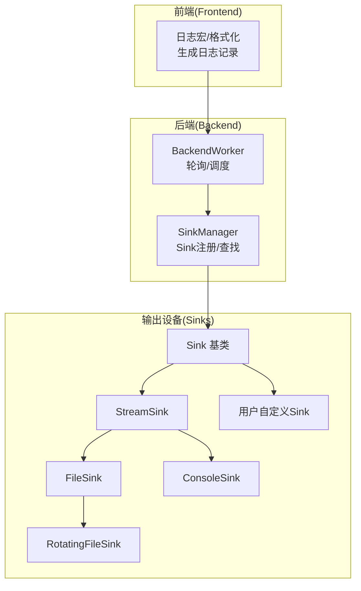
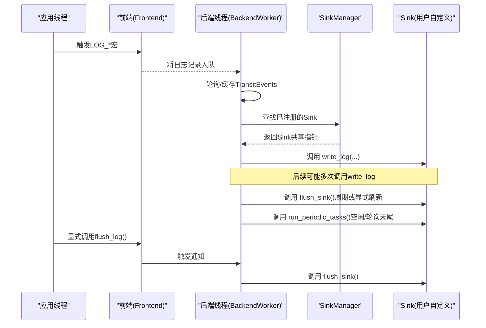
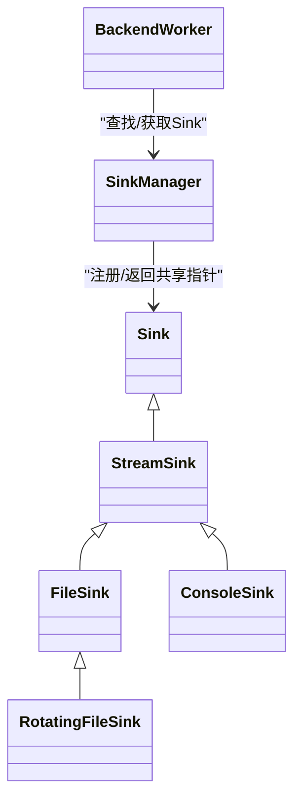
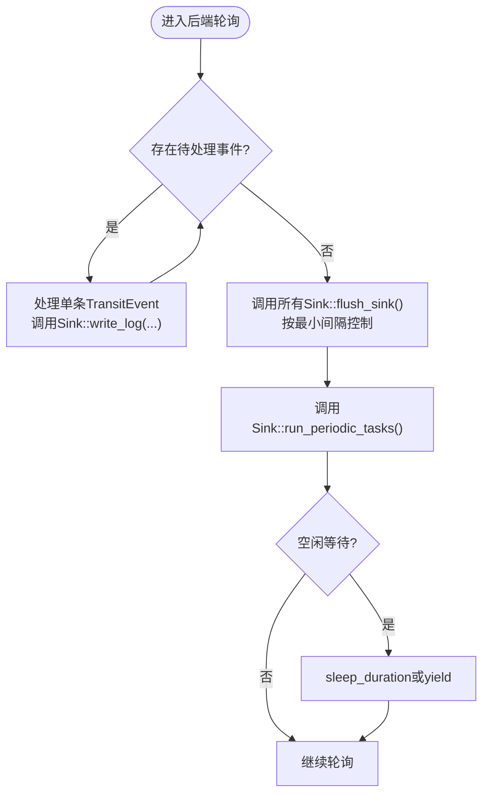

# 自定义Sinks开发

<cite>
**本文引用的文件**
- [Sink.h](file://include/quill/sinks/Sink.h)
- [StreamSink.h](file://include/quill/sinks/StreamSink.h)
- [FileSink.h](file://include/quill/sinks/FileSink.h)
- [ConsoleSink.h](file://include/quill/sinks/ConsoleSink.h)
- [RotatingFileSink.h](file://include/quill/sinks/RotatingFileSink.h)
- [BackendWorker.h](file://include/quill/backend/BackendWorker.h)
- [SinkManager.h](file://include/quill/core/SinkManager.h)
- [user_defined_sink.cpp](file://examples/user_defined_sink.cpp)
- [UserSinkTest.cpp](file://test/integration_tests/UserSinkTest.cpp)
</cite>

## 目录
1. [简介](#简介)
2. [项目结构](#项目结构)
3. [核心组件](#核心组件)
4. [架构总览](#架构总览)
5. [详细组件分析](#详细组件分析)
6. [依赖关系分析](#依赖关系分析)
7. [性能考量](#性能考量)
8. [故障排查指南](#故障排查指南)
9. [结论](#结论)
10. [附录](#附录)

## 简介
本技术文档面向希望基于Quill框架开发自定义输出设备（Sink）的工程师，系统讲解如何继承Sink基类实现自定义输出设备，明确必须实现的虚函数接口、线程安全与并发注意事项、性能优化要点，并深入解析以下关键方法的行为与实现策略：
- write_log：日志记录写入流程与参数语义
- flush_sink：刷新策略与触发时机
- run_periodic_tasks：周期性任务的使用场景与注意事项

同时，提供可直接参考的完整开发示例路径，覆盖网络输出、数据库批量写入、消息队列发送等常见应用场景；并给出调试技巧、测试方法与性能基准测试建议。

## 项目结构
围绕自定义Sink开发，本仓库中与之相关的核心目录与文件如下：
- sinks层：提供Sink基类与多种内置Sink实现，是自定义Sink的直接参考与扩展点
- backend层：后端工作线程负责从前端队列取事件、调用Sink的write_log/flush_sink/run_periodic_tasks
- core层：SinkManager负责Sink实例的生命周期管理与查找
- examples与test：包含用户自定义Sink示例与集成测试，便于对照学习

图示来源
- [Sink.h:40-218](file://include/quill/sinks/Sink.h#L40-L218)
- [StreamSink.h:67-314](file://include/quill/sinks/StreamSink.h#L67-L314)
- [FileSink.h:226-527](file://include/quill/sinks/FileSink.h#L226-L527)
- [ConsoleSink.h:331-412](file://include/quill/sinks/ConsoleSink.h#L331-L412)
- [RotatingFileSink.h:13-13](file://include/quill/sinks/RotatingFileSink.h#L13-L13)
- [BackendWorker.h:305-395](file://include/quill/backend/BackendWorker.h#L305-L395)
- [SinkManager.h:28-154](file://include/quill/core/SinkManager.h#L28-L154)

章节来源
- [Sink.h:40-218](file://include/quill/sinks/Sink.h#L40-L218)
- [StreamSink.h:67-314](file://include/quill/sinks/StreamSink.h#L67-L314)
- [FileSink.h:226-527](file://include/quill/sinks/FileSink.h#L226-L527)
- [ConsoleSink.h:331-412](file://include/quill/sinks/ConsoleSink.h#L331-L412)
- [RotatingFileSink.h:13-13](file://include/quill/sinks/RotatingFileSink.h#L13-L13)
- [BackendWorker.h:305-395](file://include/quill/backend/BackendWorker.h#L305-L395)
- [SinkManager.h:28-154](file://include/quill/core/SinkManager.h#L28-L154)

## 核心组件
- Sink基类：定义了自定义Sink必须实现的虚函数接口，以及过滤器、模式格式化选项、日志级别过滤等通用能力
- StreamSink：在Sink之上封装流式写入，提供统一的安全写入与刷新机制
- FileSink/ConsoleSink：基于StreamSink的具体实现，分别面向文件与控制台输出
- RotatingFileSink：滚动文件的便捷类型别名
- BackendWorker：后端线程，负责轮询、调度与调用Sink的虚函数
- SinkManager：管理Sink实例的注册、查找与清理

章节来源
- [Sink.h:40-218](file://include/quill/sinks/Sink.h#L40-L218)
- [StreamSink.h:67-314](file://include/quill/sinks/StreamSink.h#L67-L314)
- [FileSink.h:226-527](file://include/quill/sinks/FileSink.h#L226-L527)
- [ConsoleSink.h:331-412](file://include/quill/sinks/ConsoleSink.h#L331-L412)
- [RotatingFileSink.h:13-13](file://include/quill/sinks/RotatingFileSink.h#L13-L13)
- [BackendWorker.h:305-395](file://include/quill/backend/BackendWorker.h#L305-L395)
- [SinkManager.h:28-154](file://include/quill/core/SinkManager.h#L28-L154)

## 架构总览
下图展示了从日志宏到后端线程再到Sink的调用链路，以及刷新与周期任务的触发时机。

图示来源
- [BackendWorker.h:305-395](file://include/quill/backend/BackendWorker.h#L305-L395)
- [SinkManager.h:53-94](file://include/quill/core/SinkManager.h#L53-L94)
- [Sink.h:123-141](file://include/quill/sinks/Sink.h#L123-L141)

章节来源
- [BackendWorker.h:305-395](file://include/quill/backend/BackendWorker.h#L305-L395)
- [SinkManager.h:53-94](file://include/quill/core/SinkManager.h#L53-L94)
- [Sink.h:123-141](file://include/quill/sinks/Sink.h#L123-L141)

## 详细组件分析

### Sink基类与接口规范
- 必须实现的虚函数
  - write_log：接收格式化后的日志记录，执行具体输出
  - flush_sink：执行刷新/提交操作
  - 可选重写：run_periodic_tasks（用于周期性任务）
- 内置能力
  - 日志级别过滤：set_log_level_filter/get_log_level_filter
  - 过滤器链：add_filter，apply_all_filters内部调用
  - 模式格式化选项覆盖：构造时传入PatternFormatterOptions

参数语义（write_log）：
- log_metadata：宏元数据
- log_timestamp：纳秒级时间戳
- thread_id/thread_name/process_id：线程标识与进程标识
- logger_name/log_level/log_level_description/log_level_short_code：日志器名称与级别信息
- named_args：命名参数键值对（当格式串使用命名占位符时才非空）
- log_message/log_statement：格式化后的消息体与带换行的完整记录

线程安全与并发：
- Sink对象由后端线程单线程调用，无需在write_log/flush_sink中加锁
- 过滤器集合通过全局锁保护，apply_all_filters内部有局部缓存与原子标记
- run_periodic_tasks在后端线程主循环中被频繁调用，应避免重操作

章节来源
- [Sink.h:65-78](file://include/quill/sinks/Sink.h#L65-L78)
- [Sink.h:85-104](file://include/quill/sinks/Sink.h#L85-L104)
- [Sink.h:123-128](file://include/quill/sinks/Sink.h#L123-L128)
- [Sink.h:156-197](file://include/quill/sinks/Sink.h#L156-L197)

### StreamSink：流式写入与刷新
- write_log：将log_statement写入底层FILE*，支持before_write回调
- flush_sink：调用内部flush，重置写入状态
- safe_fwrite：跨平台安全写入，Windows下针对控制台使用WriteFile
- is_null/get_filename：辅助查询

章节来源
- [StreamSink.h:152-180](file://include/quill/sinks/StreamSink.h#L152-L180)
- [StreamSink.h:185-193](file://include/quill/sinks/StreamSink.h#L185-L193)
- [StreamSink.h:214-278](file://include/quill/sinks/StreamSink.h#L214-L278)
- [StreamSink.h:199-205](file://include/quill/sinks/StreamSink.h#L199-L205)

### FileSink：文件写入与fsync
- 继承StreamSink，提供文件打开/关闭、缓冲区设置、fsync间隔控制
- flush_sink：先调用父类刷新，再按配置决定是否fsync
- open_file/close_file：跨平台文件句柄管理与权限设置
- fsync_file：最小间隔控制，避免频繁同步

章节来源
- [FileSink.h:226-288](file://include/quill/sinks/FileSink.h#L226-L288)
- [FileSink.h:362-439](file://include/quill/sinks/FileSink.h#L362-L439)
- [FileSink.h:444-463](file://include/quill/sinks/FileSink.h#L444-L463)
- [FileSink.h:468-485](file://include/quill/sinks/FileSink.h#L468-L485)

### ConsoleSink：控制台彩色输出
- 在StreamSink基础上，根据配置选择stdout/stderr与颜色模式
- write_log：在写入前后插入/复位颜色码

章节来源
- [ConsoleSink.h:338-356](file://include/quill/sinks/ConsoleSink.h#L338-L356)
- [ConsoleSink.h:375-405](file://include/quill/sinks/ConsoleSink.h#L375-L405)

### RotatingFileSink：滚动文件
- 类型别名，等价于RotatingSink<FileSink>

章节来源
- [RotatingFileSink.h:13-13](file://include/quill/sinks/RotatingFileSink.h#L13-L13)

### BackendWorker：调用调度与触发时机
- 主循环：轮询前端队列、处理缓存事件、必要时睡眠/让出CPU
- 刷新与周期任务：
  - 当无更多待处理事件时，调用_sinks的flush_sink（最小间隔控制）
  - 在轮询开始/结束钩子处调用run_periodic_tasks
- 通知机制：notify唤醒后端线程

章节来源
- [BackendWorker.h:305-395](file://include/quill/backend/BackendWorker.h#L305-L395)
- [BackendWorker.h:346-346](file://include/quill/backend/BackendWorker.h#L346-L346)
- [BackendWorker.h:362-366](file://include/quill/backend/BackendWorker.h#L362-L366)

### SinkManager：Sink生命周期管理
- create_or_get_sink：模板工厂，按名称创建或获取Sink实例
- get_sink：按名称查找Sink
- cleanup_unused_sinks：清理失效弱引用

章节来源
- [SinkManager.h:69-94](file://include/quill/core/SinkManager.h#L69-L94)
- [SinkManager.h:53-66](file://include/quill/core/SinkManager.h#L53-L66)
- [SinkManager.h:97-118](file://include/quill/core/SinkManager.h#L97-L118)

### 开发示例与参考
- 用户自定义Sink示例：展示缓存+批量输出+周期任务的典型模式
- 集成测试：验证write_log/flush_sink/run_periodic_tasks的调用次数与顺序

章节来源
- [user_defined_sink.cpp:18-73](file://examples/user_defined_sink.cpp#L18-L73)
- [UserSinkTest.cpp:16-41](file://test/integration_tests/UserSinkTest.cpp#L16-L41)

## 依赖关系分析
- Sink派生体系
  - Sink为抽象基类
  - StreamSink继承Sink，提供通用流式能力
  - FileSink/ConsoleSink继承StreamSink，分别面向文件与控制台
  - RotatingFileSink为类型别名
- BackendWorker依赖SinkManager进行Sink查找，并在主循环中调用Sink虚函数
- 用户自定义Sink遵循相同接口，即可无缝接入现有框架

图示来源
- [Sink.h:40-218](file://include/quill/sinks/Sink.h#L40-L218)
- [StreamSink.h:67-314](file://include/quill/sinks/StreamSink.h#L67-L314)
- [FileSink.h:226-527](file://include/quill/sinks/FileSink.h#L226-L527)
- [ConsoleSink.h:331-412](file://include/quill/sinks/ConsoleSink.h#L331-L412)
- [RotatingFileSink.h:13-13](file://include/quill/sinks/RotatingFileSink.h#L13-L13)
- [BackendWorker.h:305-395](file://include/quill/backend/BackendWorker.h#L305-L395)
- [SinkManager.h:28-154](file://include/quill/core/SinkManager.h#L28-L154)

章节来源
- [Sink.h:40-218](file://include/quill/sinks/Sink.h#L40-L218)
- [StreamSink.h:67-314](file://include/quill/sinks/StreamSink.h#L67-L314)
- [FileSink.h:226-527](file://include/quill/sinks/FileSink.h#L226-L527)
- [ConsoleSink.h:331-412](file://include/quill/sinks/ConsoleSink.h#L331-L412)
- [RotatingFileSink.h:13-13](file://include/quill/sinks/RotatingFileSink.h#L13-L13)
- [BackendWorker.h:305-395](file://include/quill/backend/BackendWorker.h#L305-L395)
- [SinkManager.h:28-154](file://include/quill/core/SinkManager.h#L28-L154)

## 性能考量
- write_log
  - 尽量减少系统调用次数，优先批量写入
  - 使用StreamSink::safe_fwrite以保证跨平台稳定性
  - 对于文件输出，合理设置写缓冲大小（见FileSinkConfig::set_write_buffer_size）
- flush_sink
  - 控制刷新频率，避免每次写入都强制刷新
  - 文件场景可结合fsync最小间隔（FileSinkConfig::set_minimum_fsync_interval），平衡一致性与性能
- run_periodic_tasks
  - 避免重计算/重IO；适合做轻量的批处理提交、心跳上报等
- BackendWorker
  - 合理设置sleep_duration/enable_yield_when_idle，降低空闲CPU占用
  - Transit事件软/硬限制影响批处理策略，避免长时间阻塞

章节来源
- [StreamSink.h:214-278](file://include/quill/sinks/StreamSink.h#L214-L278)
- [FileSink.h:146-173](file://include/quill/sinks/FileSink.h#L146-L173)
- [FileSink.h:170-173](file://include/quill/sinks/FileSink.h#L170-L173)
- [BackendWorker.h:370-387](file://include/quill/backend/BackendWorker.h#L370-L387)

## 故障排查指南
- 写入失败
  - 检查safe_fwrite返回与错误码；确认文件句柄有效性
  - 文件被外部删除导致句柄失效时，FileSink会在flush阶段尝试重新打开
- 刷新不生效
  - 确认flush_sink是否被调用（显式flush_log或后台轮询触发）
  - 文件场景需检查fsync_enabled与最小间隔设置
- 周期任务未执行
  - 确认BackendWorker处于运行态且轮询正常
  - run_periodic_tasks在轮询开始/结束钩子处调用，注意避免阻塞
- 并发问题
  - Sink对象本身由后端线程单线程访问，无需额外锁
  - 若需要跨线程共享状态，请使用原子或受控同步

章节来源
- [StreamSink.h:252-277](file://include/quill/sinks/StreamSink.h#L252-L277)
- [FileSink.h:274-287](file://include/quill/sinks/FileSink.h#L274-L287)
- [BackendWorker.h:346-394](file://include/quill/backend/BackendWorker.h#L346-L394)

## 结论
通过继承Sink基类并遵循其虚函数接口，开发者可以快速构建自定义输出设备，并与Quill的后端调度、刷新与周期任务机制无缝衔接。在实现过程中，应重点关注：
- write_log的参数语义与输出策略
- flush_sink的刷新时机与频率控制
- run_periodic_tasks的轻量化与高频调用特性
- 文件/控制台等具体Sink的实现细节与配置项

## 附录

### 实现步骤与最佳实践
- 步骤
  - 继承Sink，实现write_log/flush_sink（可选实现run_periodic_tasks）
  - 在Frontend侧通过SinkManager::create_or_get_sink注册/获取实例
  - 在Logger侧绑定该Sink并启动BackendWorker
- 最佳实践
  - 输出前先评估是否需要缓存/批处理，减少系统调用
  - 文件输出时启用合适的缓冲与fsync策略
  - 控制run_periodic_tasks的工作强度，避免影响后端线程吞吐

章节来源
- [Sink.h:123-141](file://include/quill/sinks/Sink.h#L123-L141)
- [SinkManager.h:69-94](file://include/quill/core/SinkManager.h#L69-L94)
- [BackendWorker.h:305-395](file://include/quill/backend/BackendWorker.h#L305-L395)

### 开发示例参考路径
- 用户自定义Sink示例（缓存+批量输出+周期任务）
  - [user_defined_sink.cpp:18-73](file://examples/user_defined_sink.cpp#L18-L73)
- 集成测试（验证调用次数与顺序）
  - [UserSinkTest.cpp:16-41](file://test/integration_tests/UserSinkTest.cpp#L16-L41)

### 关键流程图：write_log/flush_sink/run_periodic_tasks

图示来源
- [BackendWorker.h:317-394](file://include/quill/backend/BackendWorker.h#L317-L394)
- [Sink.h:123-141](file://include/quill/sinks/Sink.h#L123-L141)