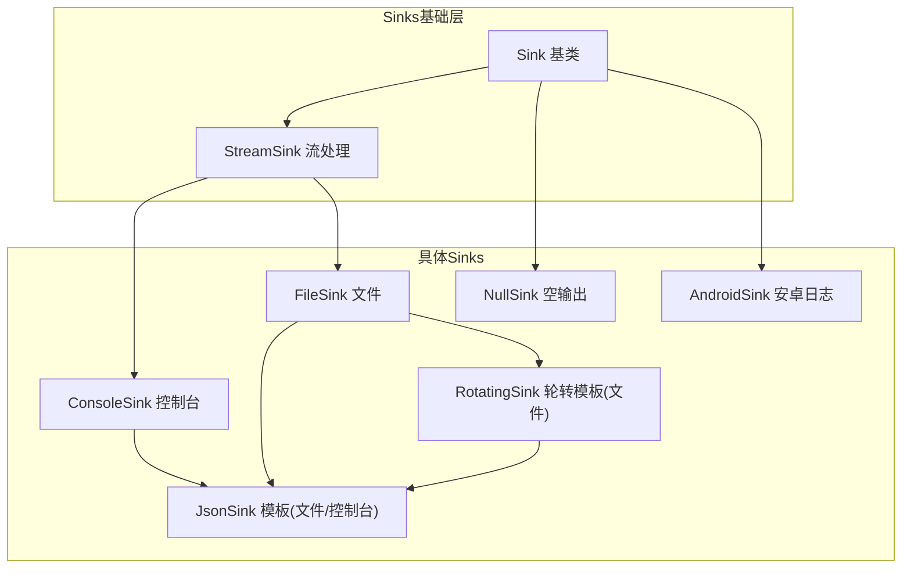
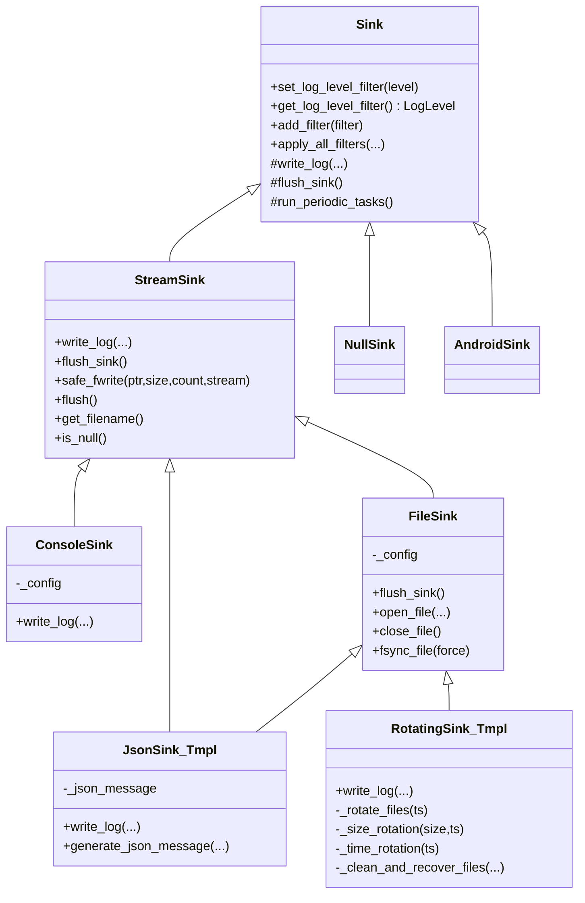
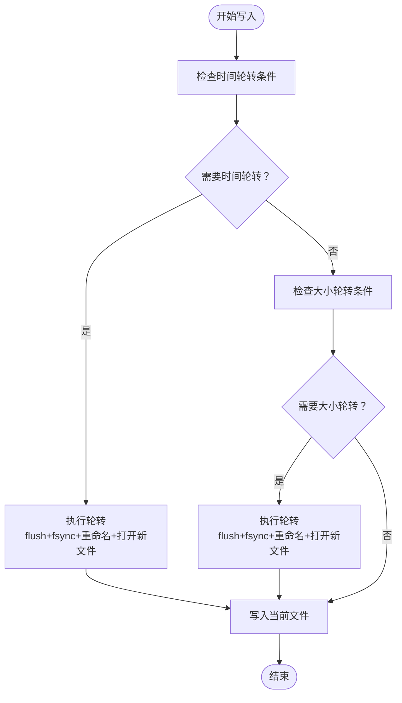
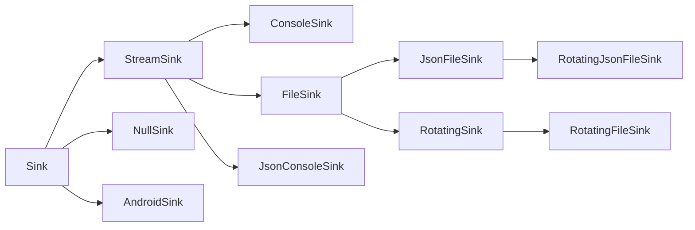

# 输出Sinks系统

<cite>
**本文引用的文件**
- [Sink.h](file://include/quill/sinks/Sink.h)
- [StreamSink.h](file://include/quill/sinks/StreamSink.h)
- [ConsoleSink.h](file://include/quill/sinks/ConsoleSink.h)
- [FileSink.h](file://include/quill/sinks/FileSink.h)
- [JsonSink.h](file://include/quill/sinks/JsonSink.h)
- [RotatingSink.h](file://include/quill/sinks/RotatingSink.h)
- [RotatingFileSink.h](file://include/quill/sinks/RotatingFileSink.h)
- [RotatingJsonFileSink.h](file://include/quill/sinks/RotatingJsonFileSink.h)
- [NullSink.h](file://include/quill/sinks/NullSink.h)
- [AndroidSink.h](file://include/quill/sinks/AndroidSink.h)
- [console_logging.cpp](file://examples/console_logging.cpp)
- [json_console_logging.cpp](file://examples/json_console_logging.cpp)
- [rotating_file_logging.cpp](file://examples/rotating_file_logging.cpp)
- [rotating_json_file_logging.cpp](file://examples/rotating_json_file_logging.cpp)
- [user_defined_sink.cpp](file://examples/user_defined_sink.cpp)
</cite>

## 目录
1. [简介](#简介)
2. [项目结构](#项目结构)
3. [核心组件](#核心组件)
4. [架构总览](#架构总览)
5. [详细组件分析](#详细组件分析)
6. [依赖关系分析](#依赖关系分析)
7. [性能考量](#性能考量)
8. [故障排查指南](#故障排查指南)
9. [结论](#结论)
10. [附录](#附录)

## 简介
本文件系统性地解析Quill的输出Sinks体系，覆盖Sink基类设计与扩展机制、内置Sinks（控制台、文件、JSON、轮转文件、空Sink、Android Sink）的功能与配置要点，并提供自定义Sinks的开发流程与最佳实践，帮助开发者在不同场景下选择合适的输出方式。

## 项目结构
Sinks位于include/quill/sinks目录，按职责分为：
- 基类与通用流处理：Sink、StreamSink
- 具体Sinks实现：ConsoleSink、FileSink、JsonSink、RotatingSink系列、NullSink、AndroidSink
- 示例代码：examples目录下的控制台、JSON控制台、轮转文件、轮转JSON文件、用户自定义Sink示例

图表来源
- [Sink.h:40-218](file://include/quill/sinks/Sink.h#L40-L218)
- [StreamSink.h:67-314](file://include/quill/sinks/StreamSink.h#L67-L314)
- [ConsoleSink.h:331-412](file://include/quill/sinks/ConsoleSink.h#L331-L412)
- [FileSink.h:226-527](file://include/quill/sinks/FileSink.h#L226-L527)
- [JsonSink.h:29-165](file://include/quill/sinks/JsonSink.h#L29-L165)
- [RotatingSink.h:262-800](file://include/quill/sinks/RotatingSink.h#L262-L800)
- [NullSink.h:24-40](file://include/quill/sinks/NullSink.h#L24-L40)
- [AndroidSink.h:88-128](file://include/quill/sinks/AndroidSink.h#L88-L128)

章节来源
- [Sink.h:40-218](file://include/quill/sinks/Sink.h#L40-L218)
- [StreamSink.h:67-314](file://include/quill/sinks/StreamSink.h#L67-L314)

## 核心组件
- Sink基类：定义统一的写入接口、刷新接口、过滤器链路、周期任务钩子，以及可选的PatternFormatter覆盖。
- StreamSink：封装通用的文件/标准流写入、缓冲、事件通知、安全写入与刷新逻辑。
- ConsoleSink：在StreamSink基础上增加颜色模式、自动检测终端能力、按级别着色输出。
- FileSink：在StreamSink基础上增加文件打开/关闭、fsync策略、自定义缓冲区大小、时间戳追加到文件名。
- JsonSink：通过模板将JSON结构化输出注入到FileSink或StreamSink，支持生成JSON消息体与命名参数键值对。
- RotatingSink：在FileSink基础上实现基于大小与时间的轮转、命名策略、备份数量控制、覆盖策略、启动时强制轮转。
- NullSink：丢弃所有日志，用于禁用输出或性能测试。
- AndroidSink：桥接Android log系统，支持标签、消息格式化开关与级别映射。

章节来源
- [Sink.h:40-218](file://include/quill/sinks/Sink.h#L40-L218)
- [StreamSink.h:67-314](file://include/quill/sinks/StreamSink.h#L67-L314)
- [ConsoleSink.h:331-412](file://include/quill/sinks/ConsoleSink.h#L331-L412)
- [FileSink.h:226-527](file://include/quill/sinks/FileSink.h#L226-L527)
- [JsonSink.h:29-165](file://include/quill/sinks/JsonSink.h#L29-L165)
- [RotatingSink.h:262-800](file://include/quill/sinks/RotatingSink.h#L262-L800)
- [NullSink.h:24-40](file://include/quill/sinks/NullSink.h#L24-L40)
- [AndroidSink.h:88-128](file://include/quill/sinks/AndroidSink.h#L88-L128)

## 架构总览
Sinks采用“基类抽象 + 组合/继承复用”的设计：
- Sink定义统一接口与过滤/格式化框架
- StreamSink封装底层I/O细节
- 具体Sinks在StreamSink之上叠加功能（如颜色、轮转、JSON结构化）
- JsonSink以模板形式复用到FileSink/StreamSink，避免重复实现

图表来源
- [Sink.h:40-218](file://include/quill/sinks/Sink.h#L40-L218)
- [StreamSink.h:67-314](file://include/quill/sinks/StreamSink.h#L67-L314)
- [ConsoleSink.h:331-412](file://include/quill/sinks/ConsoleSink.h#L331-L412)
- [FileSink.h:226-527](file://include/quill/sinks/FileSink.h#L226-L527)
- [JsonSink.h:29-165](file://include/quill/sinks/JsonSink.h#L29-L165)
- [RotatingSink.h:262-800](file://include/quill/sinks/RotatingSink.h#L262-L800)
- [NullSink.h:24-40](file://include/quill/sinks/NullSink.h#L24-L40)
- [AndroidSink.h:88-128](file://include/quill/sinks/AndroidSink.h#L88-L128)

## 详细组件分析

### Sink基类与扩展机制
- 设计要点
  - 写入接口与刷新接口由派生类实现，保证线程安全与高性能
  - 过滤器链：支持全局过滤器注册、本地副本缓存、原子标志指示更新；apply_all_filters在后端线程调用
  - 可选PatternFormatter覆盖：前端设置，后端初始化
  - 周期任务钩子run_periodic_tasks供派生类执行轻量任务
- 扩展建议
  - 若需结构化输出，可参考JsonSink::generate_json_message的可重载点
  - 若需I/O缓冲/同步策略，可参考StreamSink::safe_fwrite与FileSink::fsync_file

章节来源
- [Sink.h:40-218](file://include/quill/sinks/Sink.h#L40-L218)

### StreamSink：流式写入与事件通知
- 功能
  - 支持stdout/stderr与文件路径；当路径为/dev/null时进入空输出模式
  - 安全写入：跨平台兼容，Windows控制台使用WriteFile，非控制台回退到fwrite
  - 文件事件通知：before_open/after_open/before_close/after_close/before_write回调
  - 刷新：fflush封装，标记_write_occurred
- 性能
  - 提供静态safe_fwrite循环写，避免部分写导致的死循环
  - is_null快速分支，避免无效I/O

章节来源
- [StreamSink.h:67-314](file://include/quill/sinks/StreamSink.h#L67-L314)

### ConsoleSink：控制台颜色与格式化
- 颜色支持
  - 支持Always/Automatic/Never三种颜色模式
  - 自动检测终端与TERM环境变量，Windows启用ANSI支持
  - 按日志级别分配颜色，支持自定义颜色映射
- 写入流程
  - 在写入前输出颜色码，结束后输出重置码
  - 通过StreamSink::write_log完成实际输出
- 配置项
  - set_stream("stdout"|"stderr")
  - set_override_pattern_formatter_options
  - set_colour_mode、set_colours

章节来源
- [ConsoleSink.h:44-328](file://include/quill/sinks/ConsoleSink.h#L44-L328)
- [ConsoleSink.h:331-412](file://include/quill/sinks/ConsoleSink.h#L331-L412)

### FileSink：文件写入与缓冲策略
- 文件管理
  - 支持OpenMode('w'|'a')与多次重试打开，Windows共享读取、Unix O_CLOEXEC
  - 文件事件通知：打开/关闭前后回调
- 缓冲与同步
  - 自定义fwrite缓冲区大小（最小4KB），默认64KB
  - 可选fsync，支持最小fsync间隔，避免频繁刷盘
- 时间戳追加到文件名
  - 支持StartDate/StartDateTime/StartCustomTimestampFormat，结合LocalTime/GmtTime
- 刷新流程
  - flush_sink中先调用父类刷新，再根据配置fsync
  - 若文件被删除则尝试重新打开

章节来源
- [FileSink.h:64-220](file://include/quill/sinks/FileSink.h#L64-L220)
- [FileSink.h:226-527](file://include/quill/sinks/FileSink.h#L226-L527)

### JsonSink：结构化JSON输出
- 结构
  - detail::JsonSink<TBase>模板，适配FileSink或StreamSink
  - write_log中清理换行符，构造JSON消息体，追加换行后委托给StreamSink::write_log
- 可定制点
  - generate_json_message可重载，自定义字段与格式
- 使用
  - JsonFileSink：文件JSON输出
  - JsonConsoleSink：控制台JSON输出

章节来源
- [JsonSink.h:29-165](file://include/quill/sinks/JsonSink.h#L29-L165)

### RotatingSink：轮转机制
- 轮转触发条件
  - 基于大小：当前文件大小 + 日志长度超过阈值
  - 基于时间：Minutely/Hourly/Daily，支持指定每日轮转时刻
- 命名策略
  - Index（默认）、Date、DateAndTime
  - 重命名时自动递增索引，必要时附加日期后缀
- 备份与覆盖
  - 最大备份数限制；可配置是否覆盖最旧文件
  - 启动时可强制轮转（rotation_on_creation）
- 清理与恢复
  - 支持启动时清理旧文件（remove_old_files）
  - 从现有文件恢复索引/日期信息

图表来源
- [RotatingSink.h:335-487](file://include/quill/sinks/RotatingSink.h#L335-L487)

章节来源
- [RotatingSink.h:39-257](file://include/quill/sinks/RotatingSink.h#L39-L257)
- [RotatingSink.h:262-800](file://include/quill/sinks/RotatingSink.h#L262-L800)
- [RotatingFileSink.h:13-15](file://include/quill/sinks/RotatingFileSink.h#L13-L15)
- [RotatingJsonFileSink.h:14-16](file://include/quill/sinks/RotatingJsonFileSink.h#L14-L16)

### NullSink与AndroidSink
- NullSink：空输出，适合性能测试或禁用输出
- AndroidSink：将日志映射到Android log系统，支持标签、消息格式化开关与级别映射数组

章节来源
- [NullSink.h:24-40](file://include/quill/sinks/NullSink.h#L24-L40)
- [AndroidSink.h:30-128](file://include/quill/sinks/AndroidSink.h#L30-L128)

### 自定义Sinks开发流程与接口规范
- 开发步骤
  - 继承Sink，实现write_log与flush_sink
  - 如需结构化输出，可参考JsonSink::generate_json_message的可重载点
  - 如需I/O缓冲/事件通知，可参考StreamSink/JsonSink的实现
- 接口规范
  - write_log签名严格遵循Sink定义，包含元数据、时间戳、线程/进程信息、日志级别、命名参数、消息与完整语句
  - flush_sink负责同步与资源回收
  - run_periodic_tasks用于轻量周期任务
- 示例参考
  - 用户自定义Sink示例展示了缓存与批量提交的思路

章节来源
- [user_defined_sink.cpp:18-73](file://examples/user_defined_sink.cpp#L18-L73)
- [Sink.h:123-141](file://include/quill/sinks/Sink.h#L123-L141)

## 依赖关系分析
- 继承关系
  - Sink为所有Sinks的基类
  - StreamSink继承Sink，ConsoleSink/FileSink在此基础上扩展
  - JsonSink以模板组合到FileSink/StreamSink
  - RotatingSink模板继承FileSink，JsonFileSink/JsonConsoleSink分别组合JsonSink与FileSink/StreamSink
- 关键耦合点
  - Sink与PatternFormatterOptions的耦合（可选覆盖）
  - StreamSink与FileEventNotifier的耦合（事件通知）
  - RotatingSink与Filesystem的时间/命名/重命名逻辑

图表来源
- [ConsoleSink.h:331-412](file://include/quill/sinks/ConsoleSink.h#L331-L412)
- [FileSink.h:226-527](file://include/quill/sinks/FileSink.h#L226-L527)
- [JsonSink.h:140-165](file://include/quill/sinks/JsonSink.h#L140-L165)
- [RotatingSink.h:262-316](file://include/quill/sinks/RotatingSink.h#L262-L316)
- [RotatingFileSink.h:13-15](file://include/quill/sinks/RotatingFileSink.h#L13-L15)
- [RotatingJsonFileSink.h:14-16](file://include/quill/sinks/RotatingJsonFileSink.h#L14-L16)
- [NullSink.h:24-40](file://include/quill/sinks/NullSink.h#L24-L40)
- [AndroidSink.h:88-128](file://include/quill/sinks/AndroidSink.h#L88-L128)

## 性能考量
- 写入路径
  - safe_fwrite循环写确保完整性，避免部分写死循环
  - Windows控制台优先使用WriteFile，减少CRLF转换开销
- 缓冲与同步
  - FileSink支持自定义fwrite缓冲区大小，默认64KB，最小4KB
  - fsync可选且支持最小间隔，降低磁盘磨损与抖动
- 过滤与格式化
  - apply_all_filters使用本地副本与原子标志，减少锁竞争
  - 可选PatternFormatter覆盖，避免不必要的格式化
- 轮转成本
  - 轮转前先flush+fsync，确保数据落盘
  - 命名策略与重命名在后台线程执行，尽量减少阻塞

章节来源
- [StreamSink.h:214-278](file://include/quill/sinks/StreamSink.h#L214-L278)
- [FileSink.h:146-173](file://include/quill/sinks/FileSink.h#L146-L173)
- [FileSink.h:468-485](file://include/quill/sinks/FileSink.h#L468-L485)
- [Sink.h:156-197](file://include/quill/sinks/Sink.h#L156-L197)
- [RotatingSink.h:396-487](file://include/quill/sinks/RotatingSink.h#L396-L487)

## 故障排查指南
- 打开文件失败
  - FileSink在Windows使用共享读取、Unix使用O_CLOEXEC，若仍失败会抛出异常
  - 建议检查路径权限、父目录存在性与Canonical路径
- 文件被外部程序删除
  - FileSink::flush_sink检测文件不存在后会尝试重新打开
- 写入异常
  - safe_fwrite遇到ferror会抛出异常，注意errno与错误信息
- 轮转冲突
  - Windows防病毒软件可能锁定文件，重命名失败时会短暂等待后重试
- 颜色输出异常
  - ConsoleSink在Windows启用ANSI支持，在非终端或不支持的环境会降级

章节来源
- [FileSink.h:362-439](file://include/quill/sinks/FileSink.h#L362-L439)
- [FileSink.h:279-288](file://include/quill/sinks/FileSink.h#L279-L288)
- [StreamSink.h:252-278](file://include/quill/sinks/StreamSink.h#L252-L278)
- [RotatingSink.h:679-700](file://include/quill/sinks/RotatingSink.h#L679-L700)
- [ConsoleSink.h:231-250](file://include/quill/sinks/ConsoleSink.h#L231-L250)

## 结论
Quill的Sinks系统以Sink为核心抽象，通过StreamSink复用I/O细节，配合JsonSink模板与RotatingSink模板实现高内聚低耦合的扩展。内置Sinks覆盖了控制台、文件、JSON、轮转、空输出与平台特定输出（Android）。开发者可依据性能与运维需求选择合适Sinks，并通过模板与可重载点快速扩展自定义输出。

## 附录

### 配置选项速查
- ConsoleSinkConfig
  - set_stream("stdout"|"stderr")
  - set_override_pattern_formatter_options
  - set_colour_mode(Always|Automatic|Never)
  - set_colours(Colours)
- FileSinkConfig
  - set_open_mode('w'|'a')
  - set_filename_append_option(StartDate|StartDateTime|StartCustomTimestampFormat)
  - set_timezone(LocalTime|GmtTime)
  - set_write_buffer_size(bytes)
  - set_minimum_fsync_interval(ms)
  - set_fsync_enabled(bool)
  - set_override_pattern_formatter_options
- RotatingFileSinkConfig（继承FileSinkConfig）
  - set_rotation_max_file_size(bytes)
  - set_rotation_frequency_and_interval('M'|'H', interval)
  - set_rotation_time_daily("HH:MM")
  - set_max_backup_files(n)
  - set_overwrite_rolled_files(bool)
  - set_remove_old_files(bool)
  - set_rotation_naming_scheme(Index|Date|DateAndTime)
  - set_rotation_on_creation(bool)

章节来源
- [ConsoleSink.h:282-319](file://include/quill/sinks/ConsoleSink.h#L282-L319)
- [FileSink.h:106-220](file://include/quill/sinks/FileSink.h#L106-L220)
- [RotatingSink.h:67-190](file://include/quill/sinks/RotatingSink.h#L67-L190)

### 使用示例路径
- 控制台日志：[console_logging.cpp:26-28](file://examples/console_logging.cpp#L26-L28)
- JSON控制台日志：[json_console_logging.cpp:18-24](file://examples/json_console_logging.cpp#L18-L24)
- 轮转文件日志：[rotating_file_logging.cpp:21-32](file://examples/rotating_file_logging.cpp#L21-L32)
- 轮转JSON文件日志：[rotating_json_file_logging.cpp:21-32](file://examples/rotating_json_file_logging.cpp#L21-L32)
- 自定义Sinks：[user_defined_sink.cpp:18-73](file://examples/user_defined_sink.cpp#L18-L73)