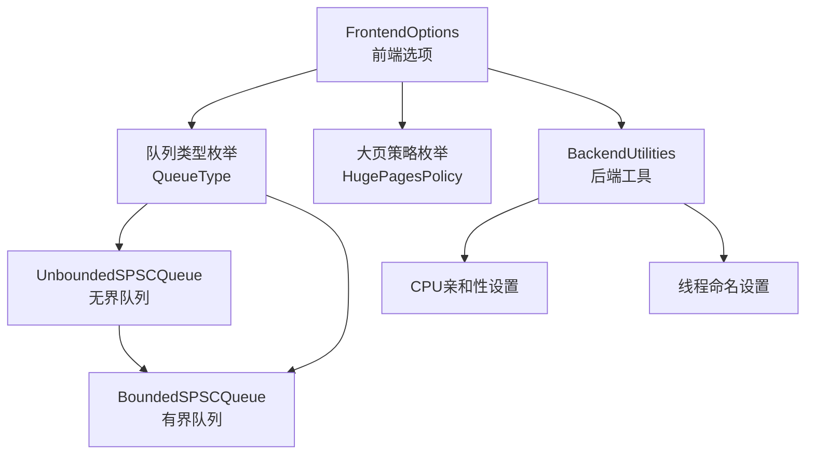
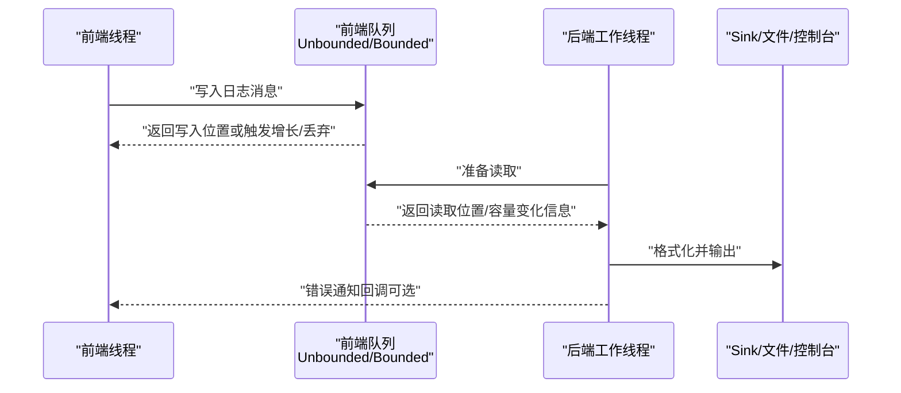
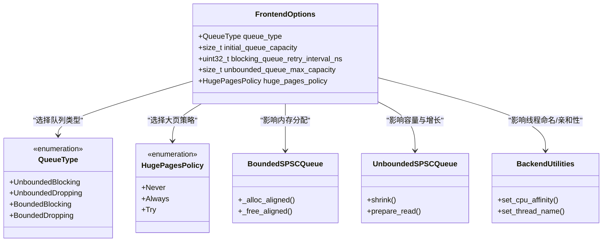

# 前端配置选项

<cite>
**本文引用的文件**
- [FrontendOptions.h](file://include/quill/core/FrontendOptions.h)
- [Common.h](file://include/quill/core/Common.h)
- [BoundedSPSCQueue.h](file://include/quill/core/BoundedSPSCQueue.h)
- [UnboundedSPSCQueue.h](file://include/quill/core/UnboundedSPSCQueue.h)
- [BackendUtilities.h](file://include/quill/backend/BackendUtilities.h)
- [frontend_options.rst](file://docs/frontend_options.rst)
- [custom_frontend_options.cpp](file://examples/custom_frontend_options.cpp)
- [README.md](file://README.md)
</cite>

## 目录
1. [简介](#简介)
2. [项目结构](#项目结构)
3. [核心组件](#核心组件)
4. [架构总览](#架构总览)
5. [详细组件分析](#详细组件分析)
6. [依赖关系分析](#依赖关系分析)
7. [性能考量](#性能考量)
8. [故障排查指南](#故障排查指南)
9. [结论](#结论)
10. [附录](#附录)

## 简介
本指南面向需要在Quill中进行前端（Frontend）配置的工程师与架构师，系统性讲解FrontendOptions结构体的配置参数、线程本地队列容量与内存预分配策略、缓冲区管理选项、线程命名与调试支持、编译期优化与模板实例化策略，以及CPU亲和性与调度优先级配置。同时提供高吞吐量日志、低延迟响应、内存受限等场景的最佳实践建议，并通过图示与路径引用帮助读者快速定位实现细节。

## 项目结构
Quill的前端配置主要集中在核心头文件中，配合后端工具与文档示例共同构成完整的配置体系：
- 核心配置：FrontendOptions、队列类型与内存策略
- 队列实现：有界/无界SPSC队列及其内存对齐与大页策略
- 后端工具：线程亲和性设置、线程名设置
- 文档与示例：前端选项文档与自定义示例

图表来源
- [FrontendOptions.h:16-50](file://include/quill/core/FrontendOptions.h#L16-L50)
- [Common.h:145-180](file://include/quill/core/Common.h#L145-L180)
- [UnboundedSPSCQueue.h:42-85](file://include/quill/core/UnboundedSPSCQueue.h#L42-L85)
- [BoundedSPSCQueue.h:331-346](file://include/quill/core/BoundedSPSCQueue.h#L331-L346)
- [BackendUtilities.h:55-128](file://include/quill/backend/BackendUtilities.h#L55-L128)

章节来源
- [FrontendOptions.h:16-50](file://include/quill/core/FrontendOptions.h#L16-L50)
- [Common.h:145-180](file://include/quill/core/Common.h#L145-L180)
- [BoundedSPSCQueue.h:246-303](file://include/quill/core/BoundedSPSCQueue.h#L246-L303)
- [UnboundedSPSCQueue.h:42-85](file://include/quill/core/UnboundedSPSCQueue.h#L42-L85)
- [BackendUtilities.h:55-128](file://include/quill/backend/BackendUtilities.h#L55-L128)

## 核心组件
本节聚焦FrontendOptions结构体的关键字段与行为，涵盖：
- 队列类型与容量控制
- 内存预分配与大页策略
- 阻塞重试间隔与最大容量
- 错误通知与队列收缩

章节来源
- [FrontendOptions.h:16-50](file://include/quill/core/FrontendOptions.h#L16-L50)
- [frontend_options.rst:10-31](file://docs/frontend_options.rst#L10-L31)
- [frontend_options.rst:33-94](file://docs/frontend_options.rst#L33-L94)

## 架构总览
前端线程拥有独立的队列，后端工作线程从各前端队列读取数据并处理。FrontendOptions统一决定队列类型、初始容量、最大容量、阻塞重试间隔与大页策略；后端工具负责线程亲和性与命名，辅助提升性能与可诊断性。

图表来源
- [UnboundedSPSCQueue.h:115-149](file://include/quill/core/UnboundedSPSCQueue.h#L115-L149)
- [BoundedSPSCQueue.h:331-346](file://include/quill/core/BoundedSPSCQueue.h#L331-L346)
- [BackendUtilities.h:119-128](file://include/quill/backend/BackendUtilities.h#L119-L128)

## 详细组件分析

### FrontendOptions 结构体与队列策略
- 队列类型
  - UnboundedBlocking：动态扩容至最大容量后阻塞调用线程
  - UnboundedDropping：动态扩容至最大容量后丢弃新消息
  - BoundedBlocking：固定容量，满载时阻塞
  - BoundedDropping：固定容量，满载时丢弃
- 初始容量与最大容量
  - initial_queue_capacity：初始队列容量
  - unbounded_queue_max_capacity：无界队列最大容量
- 阻塞重试间隔
  - blocking_queue_retry_interval_ns：Bounded/Unbounded阻塞模式下重试间隔
- 大页策略
  - huge_pages_policy：Linux可用，支持Never/Always/Try三种策略

章节来源
- [FrontendOptions.h:16-50](file://include/quill/core/FrontendOptions.h#L16-L50)
- [Common.h:145-180](file://include/quill/core/Common.h#L145-L180)
- [frontend_options.rst:10-17](file://docs/frontend_options.rst#L10-L17)

### 队列内存管理与大页策略
- 有界队列内存分配
  - 使用对齐分配与元数据存储，支持Linux大页映射标志
  - 失败回退策略：Try模式下失败则回退到普通页
- 无界队列链式节点
  - 节点内嵌有界队列，容量按倍数增长
  - 支持显式收缩，降低峰值内存占用
- 队列收缩
  - 提供接口允许在热路径线程上主动收缩队列容量
  - 后端根据收缩请求同步调整传输缓冲

章节来源
- [BoundedSPSCQueue.h:246-303](file://include/quill/core/BoundedSPSCQueue.h#L246-L303)
- [UnboundedSPSCQueue.h:166-183](file://include/quill/core/UnboundedSPSCQueue.h#L166-L183)
- [frontend_options.rst:33-94](file://docs/frontend_options.rst#L33-L94)

### 线程命名与调试支持
- 线程命名
  - 支持跨平台线程名设置，部分平台禁用或不支持
- 调试支持
  - 错误通知回调用于报告队列扩容、丢弃与阻塞事件
  - 可自定义通知目标，便于生产监控

章节来源
- [BackendUtilities.h:119-128](file://include/quill/backend/BackendUtilities.h#L119-L128)
- [frontend_options.rst:23-31](file://docs/frontend_options.rst#L23-L31)

### 编译时优化与模板实例化
- 宏定义与编译期开关
  - 文件/函数信息宏可按需禁用，减少日志上下文开销
  - 断言宏可在调试构建启用
- 模板实例化
  - FrontendOptions作为模板参数，确保队列类型与内存策略在编译期确定
  - 自定义FrontendOptions需与自定义FrontendImpl/LoggerImpl配套使用

章节来源
- [Common.h:27-81](file://include/quill/core/Common.h#L27-L81)
- [custom_frontend_options.cpp:14-27](file://examples/custom_frontend_options.cpp#L14-L27)

### CPU亲和性与调度优先级
- CPU亲和性
  - 支持在Windows、Linux、macOS等平台设置线程亲和掩码
  - 失败时抛出异常，便于在启动阶段发现配置问题
- 调度优先级
  - 当前代码库未提供直接的调度优先级设置接口；可通过平台特定API在应用层扩展

章节来源
- [BackendUtilities.h:55-116](file://include/quill/backend/BackendUtilities.h#L55-L116)

### 配置流程与最佳实践
- 自定义FrontendOptions
  - 定义结构体并指定队列类型、容量、重试间隔与大页策略
  - 使用FrontendImpl/LoggerImpl模板别名，确保全应用一致
- 不同场景配置建议
  - 高吞吐量日志：UnboundedBlocking或BoundedBlocking，较大initial_queue_capacity，必要时启用大页
  - 低延迟响应：BoundedDropping或BoundedBlocking，较小initial_queue_capacity，降低尾延迟
  - 内存受限环境：UnboundedDropping，结合队列收缩与较小初始容量，避免峰值内存过高

章节来源
- [custom_frontend_options.cpp:14-27](file://examples/custom_frontend_options.cpp#L14-L27)
- [frontend_options.rst:72-94](file://docs/frontend_options.rst#L72-L94)

## 依赖关系分析
FrontendOptions通过枚举与常量影响队列实现与后端工具的行为，形成清晰的依赖链：

图表来源
- [FrontendOptions.h:16-50](file://include/quill/core/FrontendOptions.h#L16-L50)
- [Common.h:145-180](file://include/quill/core/Common.h#L145-L180)
- [BoundedSPSCQueue.h:246-303](file://include/quill/core/BoundedSPSCQueue.h#L246-L303)
- [UnboundedSPSCQueue.h:166-183](file://include/quill/core/UnboundedSPSCQueue.h#L166-L183)
- [BackendUtilities.h:55-128](file://include/quill/backend/BackendUtilities.h#L55-L128)

## 性能考量
- 队列类型选择
  - 无界队列适合突发流量，但需关注内存增长与TLB抖动
  - 有界队列适合严格延迟与内存预算场景，需合理设置容量与丢弃策略
- 大页策略
  - Linux下启用大页可降低TLB缺失，提高缓存命中率
  - Try模式在资源不足时自动回退，增强稳定性
- 队列收缩
  - 在线程空闲或任务切换时收缩队列，降低峰值内存占用
- 线程亲和性
  - 将前端/后端线程绑定到特定CPU核，减少跨核迁移与缓存失效

章节来源
- [frontend_options.rst:33-94](file://docs/frontend_options.rst#L33-L94)
- [BoundedSPSCQueue.h:267-283](file://include/quill/core/BoundedSPSCQueue.h#L267-L283)
- [BackendUtilities.h:55-116](file://include/quill/backend/BackendUtilities.h#L55-L116)

## 故障排查指南
- 队列扩容通知
  - 默认通过后端错误通知回调打印扩容信息，可用于生产监控
  - 可自定义回调或禁用通知
- 丢弃与阻塞
  - 有界队列满载时会丢弃消息或阻塞，可通过回调统计丢弃数量
- 大页分配失败
  - Try模式下自动回退；Always模式下分配失败会抛出异常
- 线程亲和性失败
  - 设置失败会抛出异常，检查权限与平台支持情况

章节来源
- [frontend_options.rst:23-31](file://docs/frontend_options.rst#L23-L31)
- [frontend_options.rst:45-71](file://docs/frontend_options.rst#L45-L71)
- [BoundedSPSCQueue.h:277-289](file://include/quill/core/BoundedSPSCQueue.h#L277-L289)
- [BackendUtilities.h:62-70](file://include/quill/backend/BackendUtilities.h#L62-L70)

## 结论
FrontendOptions为Quill前端提供了强大的编译期配置能力，覆盖队列类型、容量、内存策略与大页支持。结合后端工具的线程亲和性与命名能力，可在不同应用场景下实现高吞吐、低延迟与内存受限的平衡。建议在项目初期明确配置策略，并通过回调与监控持续验证运行时表现。

## 附录
- 快速参考
  - 队列类型：UnboundedBlocking/UnboundedDropping/BoundedBlocking/BoundedDropping
  - 初始容量：建议根据峰值QPS与消息大小估算
  - 最大容量：无界队列上限，避免无限增长
  - 阻塞重试间隔：仅对阻塞型队列生效
  - 大页策略：Linux可用，Try模式更稳健
  - 线程亲和性：跨平台支持，失败抛异常
  - 线程命名：部分平台禁用或不支持

章节来源
- [FrontendOptions.h:16-50](file://include/quill/core/FrontendOptions.h#L16-L50)
- [Common.h:145-180](file://include/quill/core/Common.h#L145-L180)
- [BackendUtilities.h:55-128](file://include/quill/backend/BackendUtilities.h#L55-L128)
- [README.md:87-200](file://README.md#L87-L200)