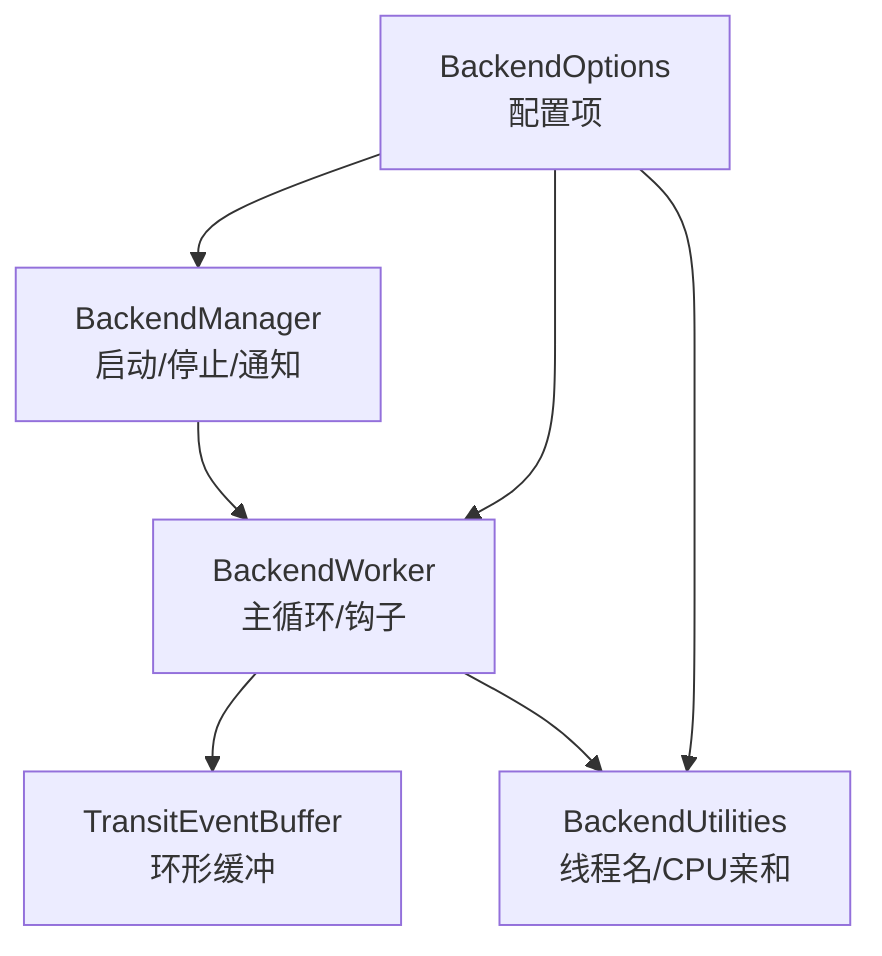
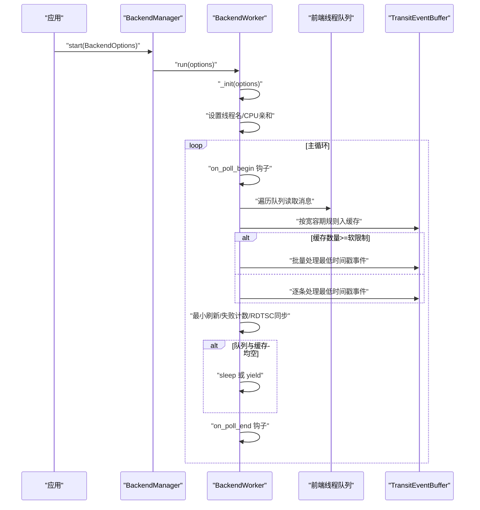
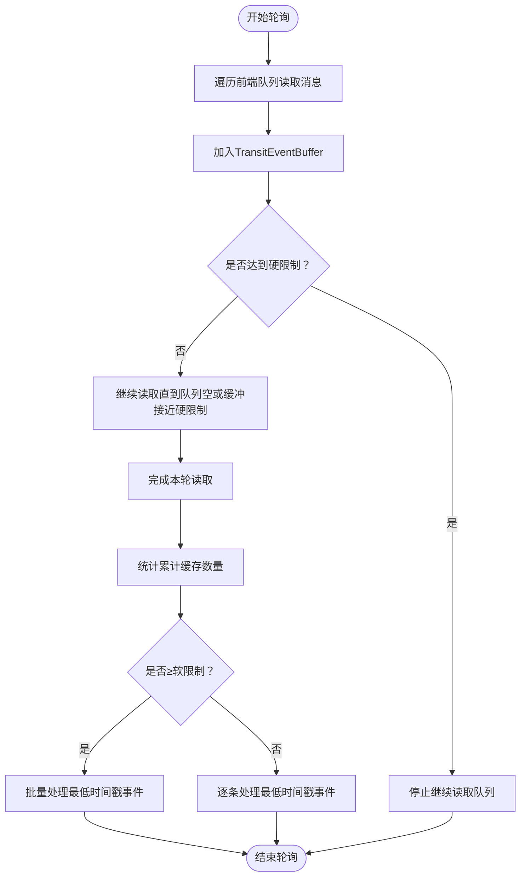
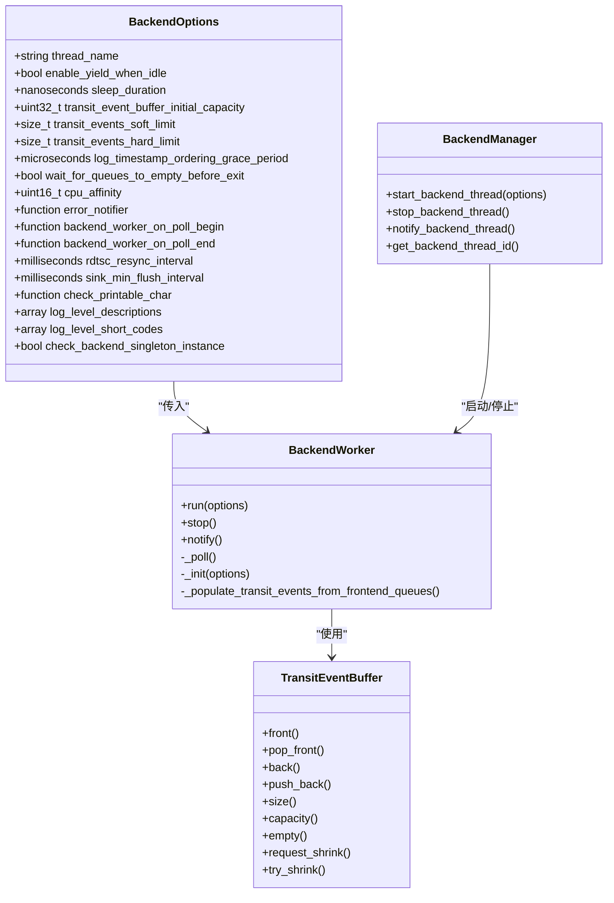

# 后端配置选项

<cite>
**本文引用的文件**
- [BackendOptions.h](file://include/quill/backend/BackendOptions.h)
- [BackendWorker.h](file://include/quill/backend/BackendWorker.h)
- [TransitEventBuffer.h](file://include/quill/backend/TransitEventBuffer.h)
- [BackendManager.h](file://include/quill/backend/BackendManager.h)
- [BackendUtilities.h](file://include/quill/backend/BackendUtilities.h)
- [Backend.h](file://include/quill/Backend.h)
- [quill_docs_example_backend_options.cpp](file://docs/examples/quill_docs_example_backend_options.cpp)
- [BackendTransitBufferSoftLimitTest.cpp](file://test/integration_tests/BackendTransitBufferSoftLimitTest.cpp)
- [BackendTransitBufferHardLimitTest.cpp](file://test/integration_tests/BackendTransitBufferHardLimitTest.cpp)
- [BackendLongSleepAndNotifyTest.cpp](file://test/integration_tests/BackendLongSleepAndNotifyTest.cpp)
- [BackendExceptionNotifierTest.cpp](file://test/integration_tests/BackendExceptionNotifierTest.cpp)
</cite>

## 目录
1. [简介](#简介)
2. [项目结构](#项目结构)
3. [核心组件](#核心组件)
4. [架构总览](#架构总览)
5. [详细组件分析](#详细组件分析)
6. [依赖关系分析](#依赖关系分析)
7. [性能考量](#性能考量)
8. [故障排查指南](#故障排查指南)
9. [结论](#结论)
10. [附录：配置示例与最佳实践](#附录配置示例与最佳实践)

## 简介
本文件面向需要精细调优Quill后端行为的工程师，系统化解读BackendOptions结构体中与后端线程运行、事件缓冲、时间戳排序、CPU亲和性、错误通知回调以及后端工作线程钩子等关键配置项，并结合源码实现与测试用例，给出不同使用场景下的配置建议与性能优化策略。

## 项目结构
围绕后端配置的关键代码位于以下头文件：
- 配置定义：include/quill/backend/BackendOptions.h
- 后端线程主循环与钩子：include/quill/backend/BackendWorker.h
- 传输事件环形缓冲：include/quill/backend/TransitEventBuffer.h
- 后端管理器（启动/停止/通知）：include/quill/backend/BackendManager.h
- 线程工具与CPU亲和性：include/quill/backend/BackendUtilities.h
- 公共入口：include/quill/Backend.h
- 示例与测试：docs/examples/quill_docs_example_backend_options.cpp、多个integration test

图表来源
- [BackendOptions.h:30-281](file://include/quill/backend/BackendOptions.h#L30-L281)
- [BackendManager.h:61-96](file://include/quill/backend/BackendManager.h#L61-L96)
- [BackendWorker.h:138-207](file://include/quill/backend/BackendWorker.h#L138-L207)
- [TransitEventBuffer.h:19-157](file://include/quill/backend/TransitEventBuffer.h#L19-L157)
- [BackendUtilities.h:55-116](file://include/quill/backend/BackendUtilities.h#L55-L116)

章节来源
- [BackendOptions.h:30-281](file://include/quill/backend/BackendOptions.h#L30-L281)
- [BackendWorker.h:138-207](file://include/quill/backend/BackendWorker.h#L138-L207)
- [BackendManager.h:61-96](file://include/quill/backend/BackendManager.h#L61-L96)
- [TransitEventBuffer.h:19-157](file://include/quill/backend/TransitEventBuffer.h#L19-L157)
- [BackendUtilities.h:55-116](file://include/quill/backend/BackendUtilities.h#L55-L116)

## 核心组件
- BackendOptions：定义后端线程的所有可配置项，包括线程名、空闲让出CPU、睡眠时长、传输事件缓冲容量与限制、时间戳排序宽容期、CPU亲和、错误通知回调、后端工作线程钩子、RDTSC同步间隔、sink最小刷新间隔、可打印字符检查、日志级别描述与短码、后端单例检测等。
- BackendWorker：后端线程主循环，负责从前端队列读取消息、缓存为TransitEvent、按时间戳排序输出、处理钩子、睡眠或让出CPU、错误通知转发、退出流程等。
- TransitEventBuffer：每个前端线程对应的环形缓冲，支持动态扩容（2倍），用于临时缓存从队列取出的事件，配合软/硬限制控制吞吐与内存占用。
- BackendManager：统一管理后端生命周期（start/stop/notify），并暴露后端线程ID、手动后端工作器等能力。
- BackendUtilities：线程名设置、CPU亲和性设置、进程ID获取等底层工具。

章节来源
- [BackendOptions.h:30-281](file://include/quill/backend/BackendOptions.h#L30-L281)
- [BackendWorker.h:305-395](file://include/quill/backend/BackendWorker.h#L305-L395)
- [TransitEventBuffer.h:19-157](file://include/quill/backend/TransitEventBuffer.h#L19-L157)
- [BackendManager.h:61-96](file://include/quill/backend/BackendManager.h#L61-L96)
- [BackendUtilities.h:55-116](file://include/quill/backend/BackendUtilities.h#L55-L116)

## 架构总览
后端线程在启动时根据BackendOptions初始化，随后进入主循环：
- 执行轮询开始钩子
- 从所有活跃前端线程队列读取消息，按“时间戳排序宽容期”规则决定是否加入缓存
- 当缓存数量达到软限制时批量处理；否则逐条处理
- 若无事件且满足条件，执行最小刷新、失败计数检查、RDTSC同步、清理无效上下文与日志器
- 根据sleep_duration或enable_yield_when_idle选择睡眠或让出CPU
- 执行轮询结束钩子

图表来源
- [BackendManager.h:61-96](file://include/quill/backend/BackendManager.h#L61-L96)
- [BackendWorker.h:138-207](file://include/quill/backend/BackendWorker.h#L138-L207)
- [BackendWorker.h:305-395](file://include/quill/backend/BackendWorker.h#L305-L395)
- [BackendWorker.h:479-506](file://include/quill/backend/BackendWorker.h#L479-L506)
- [BackendWorker.h:515-573](file://include/quill/backend/BackendWorker.h#L515-L573)
- [TransitEventBuffer.h:72-98](file://include/quill/backend/TransitEventBuffer.h#L72-L98)

## 详细组件分析

### 线程名称设置
- 配置项：thread_name，默认值为“QuillBackend”
- 行为：后端线程启动后会设置线程名，便于调试器识别与系统监控
- 平台差异：Windows通过内核API设置；类Unix平台通过pthread_setname_np设置，存在长度截断
- 参考实现：BackendWorker在run中调用set_thread_name；BackendUtilities提供跨平台实现

章节来源
- [BackendOptions.h:36](file://include/quill/backend/BackendOptions.h#L36)
- [BackendWorker.h:167-175](file://include/quill/backend/BackendWorker.h#L167-L175)
- [BackendUtilities.h:119-170](file://include/quill/backend/BackendUtilities.h#L119-L170)

### 空闲时让出CPU选项
- 配置项：enable_yield_when_idle
- 行为：当sleep_duration为0且启用该选项时，后端线程在空闲时调用std::this_thread::yield()让出CPU，避免被系统调度降权
- 注意：仅在sleep_duration为0时生效

章节来源
- [BackendOptions.h:44](file://include/quill/backend/BackendOptions.h#L44)
- [BackendWorker.h:383-386](file://include/quill/backend/BackendWorker.h#L383-L386)

### 睡眠持续时间配置
- 配置项：sleep_duration，默认100微秒
- 行为：当队列与缓存均为空时，后端线程等待指定时长或被唤醒；若为0则采用忙等+让出CPU策略
- 唤醒方式：Backend::notify()会触发条件变量唤醒
- 测试验证：长时间睡眠下，消息不会立即写入文件，调用notify后才处理

章节来源
- [BackendOptions.h:49](file://include/quill/backend/BackendOptions.h#L49)
- [BackendWorker.h:370-382](file://include/quill/backend/BackendWorker.h#L370-L382)
- [BackendLongSleepAndNotifyTest.cpp:25-68](file://test/integration_tests/BackendLongSleepAndNotifyTest.cpp#L25-L68)

### 传输事件缓冲区：初始容量与软/硬限制
- 初始容量：transit_event_buffer_initial_capacity，默认256
- 软限制：transit_events_soft_limit，默认8192
- 硬限制：transit_events_hard_limit，默认65536
- 容量要求：必须为2的幂次（源码校验）
- 行为说明：
  - 每个前端线程维护独立的TransitEventBuffer
  - 初始容量按2的幂次向上取整
  - 当缓存满时自动扩容（2倍），但不会缩小
  - 硬限制决定“停止从队列读取”的阈值（每线程独立）
  - 软限制决定“是否批量处理”的阈值（全局累计所有线程的缓存数量）

图表来源
- [BackendWorker.h:479-506](file://include/quill/backend/BackendWorker.h#L479-L506)
- [BackendWorker.h:515-573](file://include/quill/backend/BackendWorker.h#L515-L573)
- [TransitEventBuffer.h:19-157](file://include/quill/backend/TransitEventBuffer.h#L19-L157)

章节来源
- [BackendOptions.h:58](file://include/quill/backend/BackendOptions.h#L58)
- [BackendOptions.h:75](file://include/quill/backend/BackendOptions.h#L75)
- [BackendOptions.h:92](file://include/quill/backend/BackendOptions.h#L92)
- [BackendWorker.h:400-438](file://include/quill/backend/BackendWorker.h#L400-L438)
- [TransitEventBuffer.h:22-28](file://include/quill/backend/TransitEventBuffer.h#L22-L28)
- [TransitEventBuffer.h:128-148](file://include/quill/backend/TransitEventBuffer.h#L128-L148)

### 时间戳排序宽容期
- 配置项：log_timestamp_ordering_grace_period，默认5微秒
- 作用机制：
  - 在每次轮询开始前记录当前系统时间减去宽容期
  - 将前端队列中消息的时间戳与该“截止时间”比较，仅当消息时间戳≤截止时间时才入缓存
  - 保证多线程并发写入时，后端按严格时间顺序处理，避免“延迟线程先入队导致乱序”的问题
  - 该检查以微秒精度进行
- 性能影响：开启宽容期会轻微增加轮询开销，但能显著提升时间顺序正确性
- 配置建议：
  - 0μs：最快处理，可能乱序
  - 1-5μs：默认推荐，极小延迟，偶尔乱序风险
  - 10-20μs：更严格的顺序，适合线程队列到达时间差异较大
  - ≥100μs：严格顺序，高吞吐下有队列填满风险

章节来源
- [BackendOptions.h:132](file://include/quill/backend/BackendOptions.h#L132)
- [BackendWorker.h:481-484](file://include/quill/backend/BackendWorker.h#L481-L484)
- [BackendWorker.h:657-668](file://include/quill/backend/BackendWorker.h#L657-L668)

### CPU亲和性设置
- 配置项：cpu_affinity，默认未设置（使用最大值作为未定义标记）
- 行为：后端线程启动时根据配置设置CPU亲和，避免频繁迁移带来的缓存抖动
- 平台差异：Windows使用SetThreadAffinityMask；类Unix使用pthread_setaffinity_np或类似接口；部分平台不支持
- 建议：将后端线程绑定到非关键业务CPU，减少对前台线程的影响

章节来源
- [BackendOptions.h:154](file://include/quill/backend/BackendOptions.h#L154)
- [BackendWorker.h:156-160](file://include/quill/backend/BackendWorker.h#L156-L160)
- [BackendUtilities.h:55-116](file://include/quill/backend/BackendUtilities.h#L55-L116)

### 错误通知回调函数
- 配置项：error_notifier，默认输出到stderr（Windows下使用cerr）
- 行为：后端线程在异常时调用此回调，可用于自定义日志、告警或上报
- 使用注意：回调在后端线程内执行，避免在回调中调用需要等待自身的flush操作
- 测试验证：异常场景下回调会被触发，可据此验证配置

章节来源
- [BackendOptions.h:170](file://include/quill/backend/BackendOptions.h#L170)
- [BackendWorker.h:162-165](file://include/quill/backend/BackendWorker.h#L162-L165)
- [BackendWorker.h:262-267](file://include/quill/backend/BackendWorker.h#L262-L267)
- [BackendExceptionNotifierTest.cpp:42-84](file://test/integration_tests/BackendExceptionNotifierTest.cpp#L42-L84)

### 后端工作线程钩子函数
- 配置项：
  - backend_worker_on_poll_begin：每轮轮询开始时调用
  - backend_worker_on_poll_end：每轮轮询结束时调用
- 行为：钩子异常会被转发至error_notifier；适用于外部工具集成（如Tracy）或周期性统计
- 使用建议：在begin中打点，在end中释放；使用guard确保一次性动作

章节来源
- [BackendOptions.h:185](file://include/quill/backend/BackendOptions.h#L185)
- [BackendOptions.h:192](file://include/quill/backend/BackendOptions.h#L192)
- [BackendWorker.h:309-312](file://include/quill/backend/BackendWorker.h#L309-L312)
- [BackendWorker.h:390-394](file://include/quill/backend/BackendWorker.h#L390-L394)
- [BackendWorker.h:260-279](file://include/quill/backend/BackendWorker.h#L260-L279)

### 其他重要配置
- wait_for_queues_to_empty_before_exit：退出前等待队列清空（默认开启）
- rdtsc_resync_interval：TSC时钟重同步间隔（仅TSC时钟源有效）
- sink_min_flush_interval：sink最小刷新间隔（默认200ms）
- check_printable_char：可打印字符检查回调（默认允许ASCII可打印字符及制表符/换行符/回车符）
- log_level_descriptions/log_level_short_codes：日志级别描述与短码
- check_backend_singleton_instance：后端单例实例检测（默认开启）

章节来源
- [BackendOptions.h:145](file://include/quill/backend/BackendOptions.h#L145)
- [BackendOptions.h:207](file://include/quill/backend/BackendOptions.h#L207)
- [BackendOptions.h:224](file://include/quill/backend/BackendOptions.h#L224)
- [BackendOptions.h:239](file://include/quill/backend/BackendOptions.h#L239)
- [BackendOptions.h:247](file://include/quill/backend/BackendOptions.h#L247)
- [BackendOptions.h:257](file://include/quill/backend/BackendOptions.h#L257)
- [BackendOptions.h:280](file://include/quill/backend/BackendOptions.h#L280)

## 依赖关系分析
- BackendOptions是后端配置的唯一入口，BackendWorker在_init阶段进行参数校验（软/硬限制、容量幂次）
- BackendManager负责启动/停止后端线程，并向BackendWorker传递BackendOptions
- BackendWorker内部依赖TransitEventBuffer进行事件缓存，依据软/硬限制与宽容期策略进行批处理
- BackendUtilities提供线程名与CPU亲和性的跨平台实现
- Backend::notify()通过BackendManager唤醒BackendWorker

图表来源
- [BackendOptions.h:30-281](file://include/quill/backend/BackendOptions.h#L30-L281)
- [BackendManager.h:61-96](file://include/quill/backend/BackendManager.h#L61-L96)
- [BackendWorker.h:138-207](file://include/quill/backend/BackendWorker.h#L138-L207)
- [TransitEventBuffer.h:19-157](file://include/quill/backend/TransitEventBuffer.h#L19-L157)

章节来源
- [BackendOptions.h:30-281](file://include/quill/backend/BackendOptions.h#L30-L281)
- [BackendManager.h:61-96](file://include/quill/backend/BackendManager.h#L61-L96)
- [BackendWorker.h:138-207](file://include/quill/backend/BackendWorker.h#L138-L207)
- [TransitEventBuffer.h:19-157](file://include/quill/backend/TransitEventBuffer.h#L19-L157)

## 性能考量
- 睡眠vs让出CPU：sleep_duration为0时，enable_yield_when_idle可降低调度开销；但需确保前端线程能及时唤醒
- 传输事件缓冲：合理设置初始容量与硬限制，避免频繁扩容与队列阻塞；软限制影响批处理频率
- 时间戳宽容期：适度放宽可提升顺序正确性，但会增加轮询成本；高吞吐场景建议谨慎调大
- CPU亲和性：将后端线程固定到非关键CPU，减少上下文切换与缓存失效
- 刷新间隔：sink_min_flush_interval过小会增加IO压力；过大可能导致延迟可见
- 单例检测：在混合静态/共享库场景下开启，避免重复后端线程造成资源竞争

[本节为通用指导，无需特定文件引用]

## 故障排查指南
- 回调异常：所有钩子与初始化过程中的异常都会转发到error_notifier，请检查回调实现
- 线程名/CPU亲和失败：在某些平台设置失败会抛出异常，可通过error_notifier捕获
- 队列未处理：若sleep_duration过长，消息可能延迟处理；使用Backend::notify()主动唤醒
- 顺序异常：若出现乱序，适当增大log_timestamp_ordering_grace_period或检查前端线程时钟源

章节来源
- [BackendWorker.h:162-165](file://include/quill/backend/BackendWorker.h#L162-L165)
- [BackendWorker.h:262-267](file://include/quill/backend/BackendWorker.h#L262-L267)
- [BackendUtilities.h:55-116](file://include/quill/backend/BackendUtilities.h#L55-L116)
- [BackendLongSleepAndNotifyTest.cpp:67-68](file://test/integration_tests/BackendLongSleepAndNotifyTest.cpp#L67-L68)

## 结论
BackendOptions提供了对后端线程行为的全面控制，从线程命名、CPU亲和、睡眠策略，到事件缓冲的容量与限制、时间戳排序宽容期、错误回调与钩子等。通过合理配置，可在吞吐、延迟、顺序一致性与资源占用之间取得平衡。建议在生产环境中结合实际负载与平台特性，逐步调优各项参数并配合测试验证。

[本节为总结，无需特定文件引用]

## 附录：配置示例与最佳实践

### 示例：设置CPU亲和性
- 示例路径：[quill_docs_example_backend_options.cpp:5-7](file://docs/examples/quill_docs_example_backend_options.cpp#L5-L7)
- 说明：将后端线程绑定到CPU 5，需确保目标CPU存在且可用

章节来源
- [quill_docs_example_backend_options.cpp:5-7](file://docs/examples/quill_docs_example_backend_options.cpp#L5-L7)

### 示例：高吞吐场景
- 推荐配置要点：
  - sleep_duration：保持默认或略增，避免过度唤醒
  - enable_yield_when_idle：开启（当sleep_duration为0时）
  - transit_event_buffer_initial_capacity：根据峰值QPS估算，建议≥1024
  - transit_events_soft_limit：建议≥8192，避免频繁批处理
  - transit_events_hard_limit：建议≥65536，防止队列阻塞
  - log_timestamp_ordering_grace_period：1-5μs
  - sink_min_flush_interval：200ms或更大，减少IO
  - cpu_affinity：绑定到非关键CPU
  - error_notifier：接入监控告警
  - backend_worker_on_poll_begin/on_poll_end：集成性能分析工具

### 示例：低延迟场景
- 推荐配置要点：
  - sleep_duration：0，并开启enable_yield_when_idle
  - transit_events_soft_limit：较小值（如128），尽快批处理
  - transit_events_hard_limit：适中（如65536），避免阻塞
  - log_timestamp_ordering_grace_period：0或1-5μs
  - sink_min_flush_interval：较小（如50ms），提升可见性
  - cpu_affinity：绑定到高频访问CPU，减少迁移

### 示例：严格顺序场景
- 推荐配置要点：
  - log_timestamp_ordering_grace_period：10-20μs
  - transit_events_hard_limit：适当增大，避免队列过早阻塞
  - 其他参数按吞吐需求折中

### 示例：稳定性优先场景
- 推荐配置要点：
  - 开启wait_for_queues_to_empty_before_exit
  - 合理设置sink_min_flush_interval
  - 使用error_notifier收集异常信息
  - 开启check_backend_singleton_instance

### 关键参数校验与约束
- 软/硬限制必须为2的幂次
- 软限制不得大于硬限制
- 硬限制为0时会被强制修正为1
- 软限制为0时会被强制修正为1

章节来源
- [BackendWorker.h:410-437](file://include/quill/backend/BackendWorker.h#L410-L437)
- [BackendTransitBufferSoftLimitTest.cpp:21-47](file://test/integration_tests/BackendTransitBufferSoftLimitTest.cpp#L21-L47)
- [BackendTransitBufferHardLimitTest.cpp:25-29](file://test/integration_tests/BackendTransitBufferHardLimitTest.cpp#L25-L29)