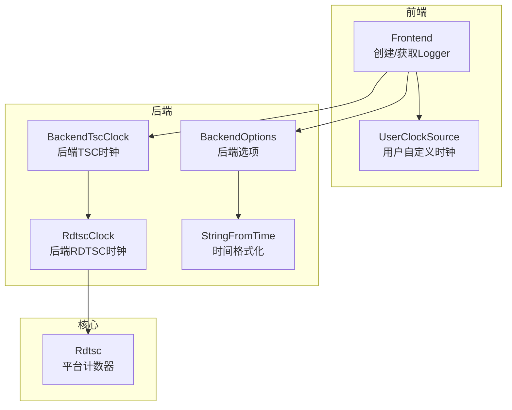
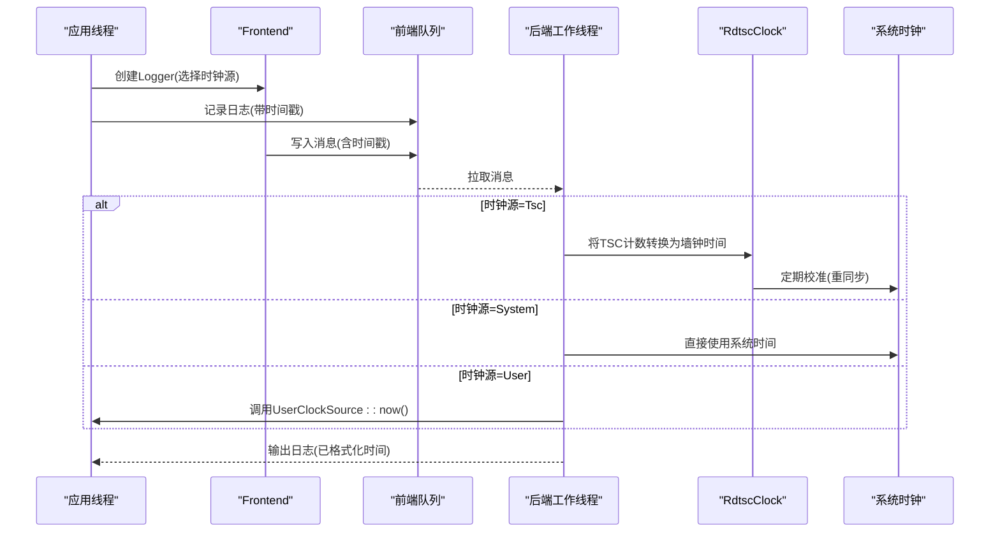
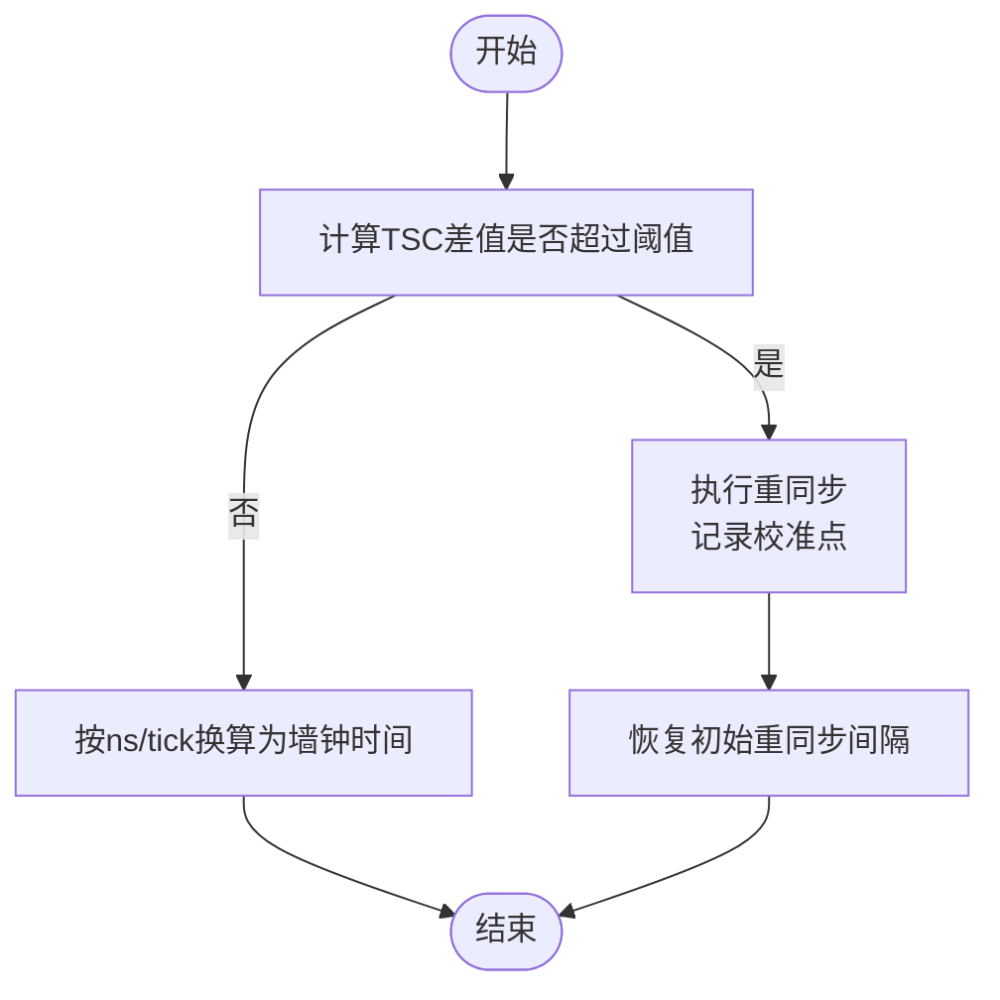
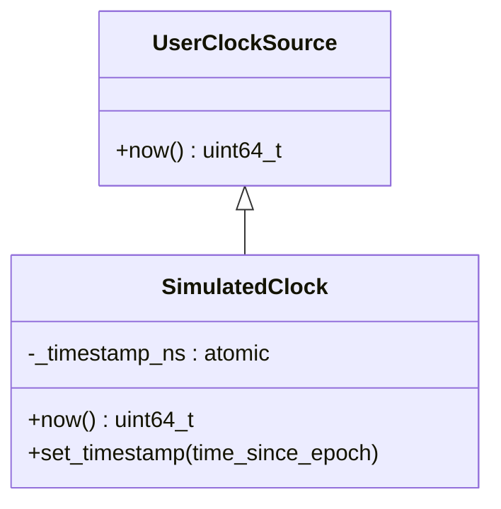
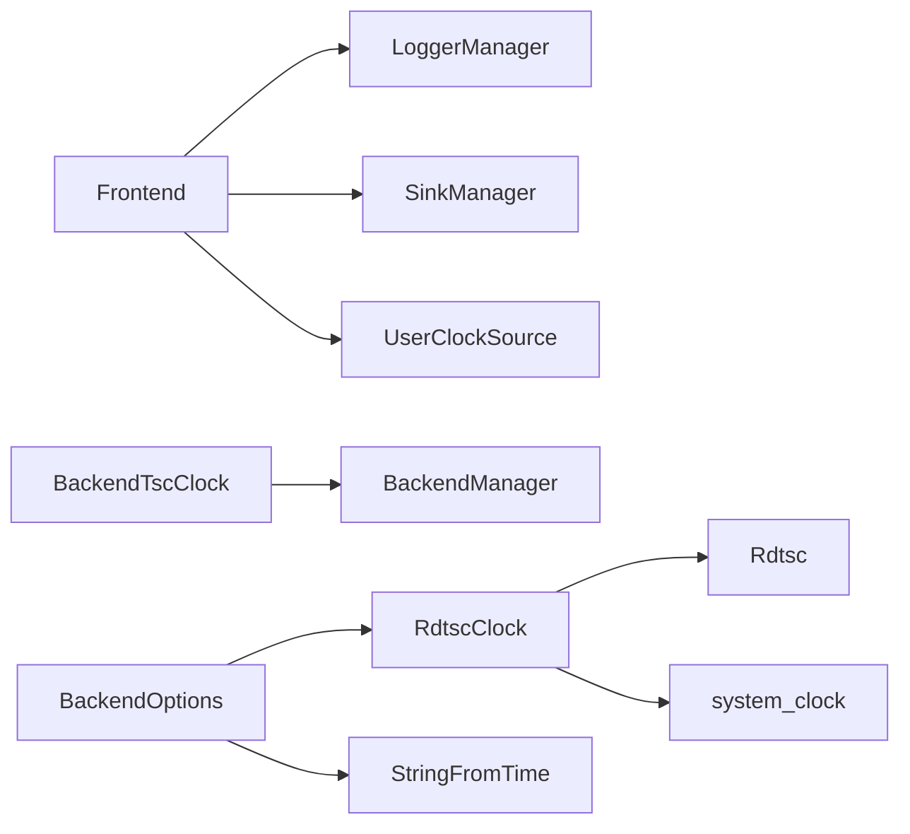

# 时钟源配置

<cite>
**本文引用的文件**
- [include/quill/UserClockSource.h](file://include/quill/UserClockSource.h)
- [include/quill/backend/RdtscClock.h](file://include/quill/backend/RdtscClock.h)
- [include/quill/core/Rdtsc.h](file://include/quill/core/Rdtsc.h)
- [include/quill/backend/BackendOptions.h](file://include/quill/backend/BackendOptions.h)
- [include/quill/backend/StringFromTime.h](file://include/quill/backend/StringFromTime.h)
- [include/quill/backend/BackendTscClock.h](file://include/quill/backend/BackendTscClock.h)
- [include/quill/Frontend.h](file://include/quill/Frontend.h)
- [docs/timestamp_types.rst](file://docs/timestamp_types.rst)
- [examples/user_clock_source.cpp](file://examples/user_clock_source.cpp)
- [examples/backend_tsc_clock.cpp](file://examples/backend_tsc_clock.cpp)
- [test/unit_tests/RdtscClockTest.cpp](file://test/unit_tests/RdtscClockTest.cpp)
- [test/integration_tests/UserClockSourceTest.cpp](file://test/integration_tests/UserClockSourceTest.cpp)
- [benchmarks/hot_path_latency/quill_hot_path_rdtsc_clock.cpp](file://benchmarks/hot_path_latency/quill_hot_path_rdtsc_clock.cpp)
- [benchmarks/hot_path_latency/quill_hot_path_system_clock.cpp](file://benchmarks/hot_path_latency/quill_hot_path_system_clock.cpp)
</cite>

## 目录
1. [简介](#简介)
2. [项目结构](#项目结构)
3. [核心组件](#核心组件)
4. [架构总览](#架构总览)
5. [详细组件分析](#详细组件分析)
6. [依赖关系分析](#依赖关系分析)
7. [性能考量](#性能考量)
8. [故障排查指南](#故障排查指南)
9. [结论](#结论)
10. [附录](#附录)

## 简介
本技术指南围绕 Quill 的时钟源配置展开，重点解释系统时钟与 RDTSC 时钟的工作原理、精度差异与适用场景；深入说明 UserClockSource 的实现机制与自定义时钟源的开发方法；阐述 RDTSC 时钟与系统时钟的同步策略、重新同步间隔配置；并讨论不同时间戳源对日志顺序与性能的影响。最后给出高精度时间戳在金融交易日志、实时监控与性能分析中的最佳实践，并覆盖时钟源切换与故障恢复机制。

## 项目结构
与时钟源相关的核心代码分布在以下模块：
- 后端时钟与同步：RdtscClock、BackendTscClock、BackendOptions
- 前端接口与用户时钟：Frontend、UserClockSource
- 平台特定计数器：Rdtsc（跨平台 rdtsc 实现）
- 文档与示例：timestamp_types.rst、示例程序与基准测试
- 测试：RdtscClockTest、UserClockSourceTest

**图示来源**
- [include/quill/Frontend.h](file://include/quill/Frontend.h)
- [include/quill/UserClockSource.h](file://include/quill/UserClockSource.h)
- [include/quill/backend/BackendTscClock.h](file://include/quill/backend/BackendTscClock.h)
- [include/quill/backend/RdtscClock.h](file://include/quill/backend/RdtscClock.h)
- [include/quill/backend/BackendOptions.h](file://include/quill/backend/BackendOptions.h)
- [include/quill/backend/StringFromTime.h](file://include/quill/backend/StringFromTime.h)
- [include/quill/core/Rdtsc.h](file://include/quill/core/Rdtsc.h)

**章节来源**
- [include/quill/Frontend.h](file://include/quill/Frontend.h)
- [include/quill/backend/RdtscClock.h](file://include/quill/backend/RdtscClock.h)
- [include/quill/backend/BackendTscClock.h](file://include/quill/backend/BackendTscClock.h)
- [include/quill/backend/BackendOptions.h](file://include/quill/backend/BackendOptions.h)
- [include/quill/backend/StringFromTime.h](file://include/quill/backend/StringFromTime.h)
- [include/quill/core/Rdtsc.h](file://include/quill/core/Rdtsc.h)

## 核心组件
- RdtscClock：后端维护的 RDTSC 时钟，周期性与系统时钟校准，将前端采集的 TSC 计数值转换为墙钟时间。
- BackendTscClock：提供与后端线程同步的 TSC 时间点，便于应用侧获得与日志一致的时间戳。
- UserClockSource：用户自定义时钟基类，派生类可提供任意时间源（如仿真时间）。
- Frontend：创建/获取 Logger 时指定时钟源类型（Tsc/System/User），并传入用户时钟实例。
- BackendOptions：控制后端行为，包括 RDTSC 校准频率与日志时间序宽容期。
- Rdtsc：跨平台读取 TSC 计数器的实现，含多架构分支与回退逻辑。
- StringFromTime：时间格式化与重计算策略，影响日志显示时间的刷新频率。

**章节来源**
- [include/quill/backend/RdtscClock.h](file://include/quill/backend/RdtscClock.h)
- [include/quill/backend/BackendTscClock.h](file://include/quill/backend/BackendTscClock.h)
- [include/quill/UserClockSource.h](file://include/quill/UserClockSource.h)
- [include/quill/Frontend.h](file://include/quill/Frontend.h)
- [include/quill/backend/BackendOptions.h](file://include/quill/backend/BackendOptions.h)
- [include/quill/core/Rdtsc.h](file://include/quill/core/Rdtsc.h)
- [include/quill/backend/StringFromTime.h](file://include/quill/backend/StringFromTime.h)

## 架构总览
下图展示从前端到后端的时钟路径与同步流程：

**图示来源**
- [include/quill/Frontend.h](file://include/quill/Frontend.h)
- [include/quill/backend/RdtscClock.h](file://include/quill/backend/RdtscClock.h)
- [include/quill/backend/BackendTscClock.h](file://include/quill/backend/BackendTscClock.h)
- [include/quill/backend/BackendOptions.h](file://include/quill/backend/BackendOptions.h)

## 详细组件分析

### 系统时钟与 RDTSC 时钟对比
- 系统时钟（System）
  - 前端直接调用系统时钟，后端无需额外初始化，时间精度高且单调。
  - 性能略低于 TSC，但保证严格的时间序。
- RDTSC 时钟（Tsc）
  - 前端仅读取 TSC 计数，后端通过 RdtscClock 将其转换为墙钟时间。
  - 需要定期与系统时钟校准（重同步），默认间隔约 500ms；若中断或延迟导致未及时重同步，会指数延长下次重同步阈值以降低开销。
  - 多核环境下，不同核心的 TSC 可能基于不同基准，导致极少数情况下出现微秒级乱序；如需严格顺序，建议使用 System 时钟。

**章节来源**
- [docs/timestamp_types.rst](file://docs/timestamp_types.rst)
- [include/quill/backend/RdtscClock.h](file://include/quill/backend/RdtscClock.h)
- [include/quill/backend/BackendOptions.h](file://include/quill/backend/BackendOptions.h)

### RdtscClock 同步机制与重新同步
- 初次构造：计算每纳秒对应的 TSC 采样率（中位数估计），并根据用户提供的重同步间隔换算为 TSC 间隔。
- 周期性校准：当 TSC 差值超过阈值时触发重同步，记录新的校准点（base_time/base_tsc），并恢复原始重同步间隔。
- 重同步失败保护：若多次尝试失败，不立即重试每次转换，而是指数增加重同步间隔，避免频繁系统调用。
- 安全查询：提供 time_since_epoch_safe，允许任何线程安全查询当前墙钟时间，但不触发重同步。

**图示来源**
- [include/quill/backend/RdtscClock.h](file://include/quill/backend/RdtscClock.h)

**章节来源**
- [include/quill/backend/RdtscClock.h](file://include/quill/backend/RdtscClock.h)
- [test/unit_tests/RdtscClockTest.cpp](file://test/unit_tests/RdtscClockTest.cpp)

### BackendTscClock：与后端线程同步的时间戳
- 提供与后端线程 TSC 保持一致的时间点，适合需要与日志时间完全对齐的应用场景。
- 首次使用前需确保至少有一个 Logger 使用 Tsc 时钟，以便后端完成初始化与第一次校准。

**章节来源**
- [include/quill/backend/BackendTscClock.h](file://include/quill/backend/BackendTscClock.h)
- [examples/backend_tsc_clock.cpp](file://examples/backend_tsc_clock.cpp)

### UserClockSource：自定义时钟源
- 用户派生类需实现 now() 返回纳秒级时间戳，线程安全由用户保证（单线程可不考虑）。
- 在创建 Logger 时指定 ClockSourceType::User，并传入派生类实例指针，即可将自定义时间写入日志。

**图示来源**
- [include/quill/UserClockSource.h](file://include/quill/UserClockSource.h)
- [examples/user_clock_source.cpp](file://examples/user_clock_source.cpp)

**章节来源**
- [include/quill/UserClockSource.h](file://include/quill/UserClockSource.h)
- [include/quill/Frontend.h](file://include/quill/Frontend.h)
- [examples/user_clock_source.cpp](file://examples/user_clock_source.cpp)
- [test/integration_tests/UserClockSourceTest.cpp](file://test/integration_tests/UserClockSourceTest.cpp)

### 平台 TSC 计数器实现
- Rdtsc 提供跨平台读取 TSC 的统一入口，针对不同架构采用专用内建/汇编指令，无法获取时回退到 steady_clock。
- 这保证了在 x86/x86_64、ARM、RISC-V、IBM Z、LoongArch 等平台上均能稳定获取高分辨率计数。

**章节来源**
- [include/quill/core/Rdtsc.h](file://include/quill/core/Rdtsc.h)

### 日志时间格式化与重计算
- StringFromTime 对本地时间采用固定周期重计算，以应对夏令时变化与午别格式需求，减少 strftime 调用次数。
- 与时间序无关，但会影响时间显示更新频率。

**章节来源**
- [include/quill/backend/StringFromTime.h](file://include/quill/backend/StringFromTime.h)

## 依赖关系分析
- Frontend 依赖 LoggerManager 与 SinkManager，创建 Logger 时可指定时钟源类型与用户时钟指针。
- BackendTscClock 依赖 BackendManager 的转换函数，将 TSC 计数转换为墙钟时间。
- RdtscClock 依赖 Rdtsc 获取 TSC 计数，并依赖系统时钟进行校准。
- BackendOptions 控制 RDTSC 校准频率与时间序宽容期，影响后端处理开销与顺序保障。

**图示来源**
- [include/quill/Frontend.h](file://include/quill/Frontend.h)
- [include/quill/backend/BackendTscClock.h](file://include/quill/backend/BackendTscClock.h)
- [include/quill/backend/RdtscClock.h](file://include/quill/backend/RdtscClock.h)
- [include/quill/core/Rdtsc.h](file://include/quill/core/Rdtsc.h)
- [include/quill/backend/BackendOptions.h](file://include/quill/backend/BackendOptions.h)
- [include/quill/backend/StringFromTime.h](file://include/quill/backend/StringFromTime.h)

**章节来源**
- [include/quill/Frontend.h](file://include/quill/Frontend.h)
- [include/quill/backend/RdtscClock.h](file://include/quill/backend/RdtscClock.h)
- [include/quill/backend/BackendTscClock.h](file://include/quill/backend/BackendTscClock.h)
- [include/quill/backend/BackendOptions.h](file://include/quill/backend/BackendOptions.h)
- [include/quill/backend/StringFromTime.h](file://include/quill/backend/StringFromTime.h)
- [include/quill/core/Rdtsc.h](file://include/quill/core/Rdtsc.h)

## 性能考量
- TSC 时钟路径
  - 前端仅读取 TSC，开销低；后端需进行校准与转换，存在系统调用与少量锁竞争。
  - 默认 500ms 重同步间隔，可在 BackendOptions 中调整；更短间隔提升精度但增加系统调用开销。
  - 基准测试显示 TSC 路径在热路径延迟上优于 System 时钟。
- System 时钟路径
  - 前端直接获取系统时间，后端无需校准，延迟略高但顺序更稳。
- 时间序宽容期
  - BackendOptions::log_timestamp_ordering_grace_period 可缓解前端延迟导致的微小乱序，但会引入轻微延迟与队列压力。

**章节来源**
- [docs/timestamp_types.rst](file://docs/timestamp_types.rst)
- [benchmarks/hot_path_latency/quill_hot_path_rdtsc_clock.cpp](file://benchmarks/hot_path_latency/quill_hot_path_rdtsc_clock.cpp)
- [benchmarks/hot_path_latency/quill_hot_path_system_clock.cpp](file://benchmarks/hot_path_latency/quill_hot_path_system_clock.cpp)
- [include/quill/backend/BackendOptions.h](file://include/quill/backend/BackendOptions.h)

## 故障排查指南
- RDTSC 校准失败
  - 现象：重同步尝试失败，后端打印错误提示；日志时间可能偏移。
  - 排查：检查系统时钟稳定性、中断处理、CPU 频率调节；适当增大重同步间隔或改用 System 时钟。
  - 参考：RdtscClock 构造与 resync 的失败处理逻辑。
- 多核乱序
  - 现象：极少数情况下 TSC 时钟出现微秒级乱序。
  - 排查：若严格顺序不可接受，切换至 System 时钟；或启用 BackendOptions::log_timestamp_ordering_grace_period。
- 用户时钟生命周期
  - 现象：日志输出异常或崩溃。
  - 排查：确保传入 Frontend::create_or_get_logger 的 UserClockSource 实例在 Logger 生命周期内有效。
- 后端 TSC 时间获取
  - 现象：首次调用 BackendTscClock::now() 返回系统时间。
  - 排查：确保至少有一个 Logger 使用 Tsc 时钟并已处理过一条日志，使后端完成初始化。

**章节来源**
- [include/quill/backend/RdtscClock.h](file://include/quill/backend/RdtscClock.h)
- [docs/timestamp_types.rst](file://docs/timestamp_types.rst)
- [test/integration_tests/UserClockSourceTest.cpp](file://test/integration_tests/UserClockSourceTest.cpp)
- [examples/backend_tsc_clock.cpp](file://examples/backend_tsc_clock.cpp)

## 结论
- 若追求极致低开销与高吞吐，优先选择 TSC 时钟，并合理设置重同步间隔；若需要严格时间序，优先选择 System 时钟。
- UserClockSource 适用于仿真、回放等需要自定义时间的场景，需自行保证线程安全与生命周期。
- BackendTscClock 可帮助应用侧获得与日志一致的时间戳，但需先确保后端完成初始化。
- 通过 BackendOptions 的时间序宽容期与重同步策略，可在性能与顺序之间取得平衡。

## 附录

### 配置与最佳实践
- 金融交易日志
  - 建议使用 System 时钟，确保严格顺序；或使用 TSC 时钟并开启 BackendOptions::log_timestamp_ordering_grace_period 以补偿前端延迟。
- 实时监控
  - 建议使用 TSC 时钟，配合较小重同步间隔；若出现乱序，适度提高宽容期。
- 性能分析
  - 使用 BackendTscClock 获取与日志一致的时间戳，便于事件关联分析。

**章节来源**
- [docs/timestamp_types.rst](file://docs/timestamp_types.rst)
- [include/quill/backend/BackendOptions.h](file://include/quill/backend/BackendOptions.h)
- [include/quill/backend/BackendTscClock.h](file://include/quill/backend/BackendTscClock.h)