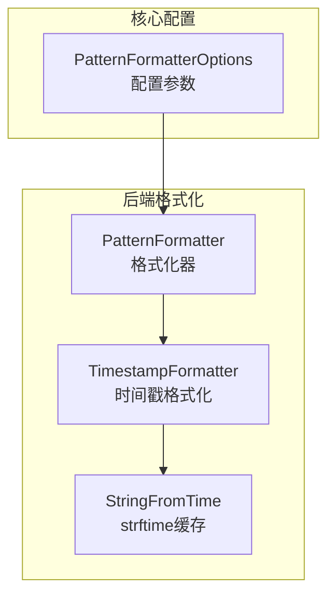
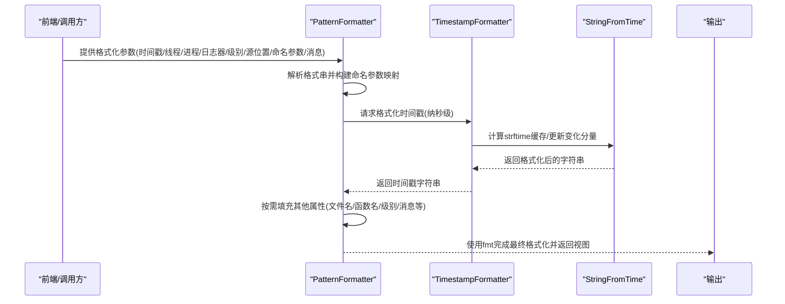
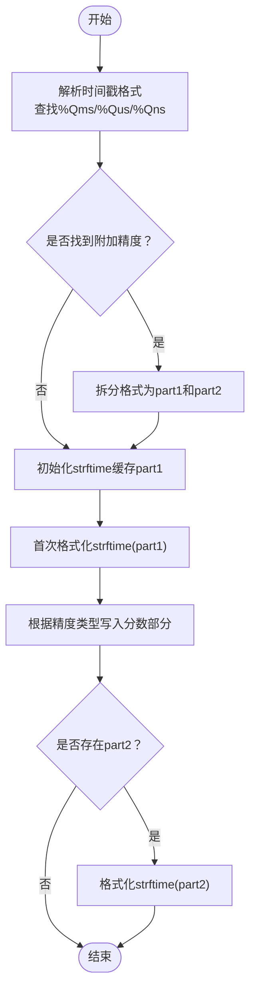
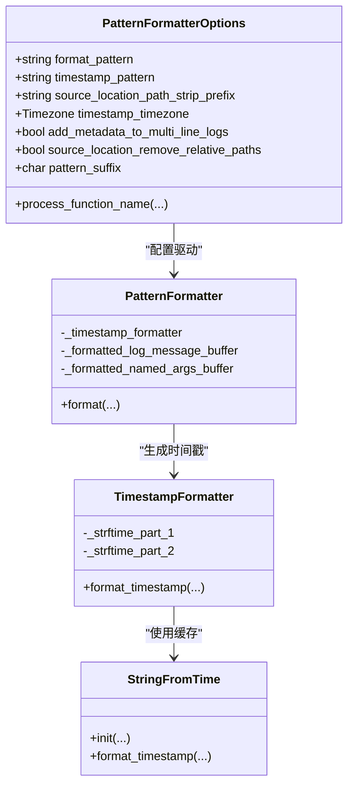

# 格式化器配置

<cite>
**本文引用的文件**
- [PatternFormatterOptions.h](file://include/quill/core/PatternFormatterOptions.h)
- [PatternFormatter.h](file://include/quill/backend/PatternFormatter.h)
- [TimestampFormatter.h](file://include/quill/backend/TimestampFormatter.h)
- [StringFromTime.h](file://include/quill/backend/StringFromTime.h)
- [formatters.rst](file://docs/formatters.rst)
- [PatternFormatterTest.cpp](file://test/unit_tests/PatternFormatterTest.cpp)
- [TimestampFormatterTest.cpp](file://test/unit_tests/TimestampFormatterTest.cpp)
- [custom_console_colours.cpp](file://examples/custom_console_colours.cpp)
- [sink_formatter_override.cpp](file://examples/sink_formatter_override.cpp)
- [json_console_logging.cpp](file://examples/json_console_logging.cpp)
- [console_logging.cpp](file://examples/console_logging.cpp)
</cite>

## 目录
1. [简介](#简介)
2. [项目结构](#项目结构)
3. [核心组件](#核心组件)
4. [架构总览](#架构总览)
5. [详细组件分析](#详细组件分析)
6. [依赖关系分析](#依赖关系分析)
7. [性能考量](#性能考量)
8. [故障排查指南](#故障排查指南)
9. [结论](#结论)
10. [附录](#附录)

## 简介
本指南面向Quill格式化器的配置与使用，重点围绕PatternFormatterOptions的配置参数进行系统讲解，涵盖：
- 时间戳格式化选项（含纳秒/微秒/毫秒精度）
- 日志级别显示格式
- 自定义格式模式
- 颜色主题配置（控制台颜色、ANSI转义序列、跨平台兼容）
- 性能优化（缓存策略、内存分配优化）
- 多种格式化场景示例（结构化日志、机器可读、人类可读）
- 自定义格式化器的开发与扩展点

## 项目结构
与格式化器直接相关的代码主要位于以下模块：
- 核心配置：PatternFormatterOptions（配置项定义）
- 后端格式化：PatternFormatter（格式化逻辑）
- 时间戳格式化：TimestampFormatter（含strftime缓存与分段处理）
- 时间戳字符串生成：StringFromTime（高性能strftime缓存）

图表来源
- [PatternFormatterOptions.h:23-168](file://include/quill/core/PatternFormatterOptions.h#L23-L168)
- [PatternFormatter.h:79-95](file://include/quill/backend/PatternFormatter.h#L79-L95)
- [TimestampFormatter.h:51-119](file://include/quill/backend/TimestampFormatter.h#L51-L119)
- [StringFromTime.h:53-70](file://include/quill/backend/StringFromTime.h#L53-L70)

章节来源
- [PatternFormatterOptions.h:23-168](file://include/quill/core/PatternFormatterOptions.h#L23-L168)
- [PatternFormatter.h:79-95](file://include/quill/backend/PatternFormatter.h#L79-L95)
- [TimestampFormatter.h:51-119](file://include/quill/backend/TimestampFormatter.h#L51-L119)
- [StringFromTime.h:53-70](file://include/quill/backend/StringFromTime.h#L53-L70)

## 核心组件
- PatternFormatterOptions：定义格式化模式、时间戳模式、时区、多行消息元数据处理、后缀字符等。
- PatternFormatter：解析格式串、按需懒加载属性、调用TimestampFormatter生成时间戳、使用fmt库进行最终格式化。
- TimestampFormatter：支持strftime格式与额外的%Qms/%Qus/%Qns精度指定；内部拆分为两段strftime以避免重复计算。
- StringFromTime：对strftime结果进行缓存，仅在必要时更新变化的时间分量，显著降低开销。

章节来源
- [PatternFormatterOptions.h:23-168](file://include/quill/core/PatternFormatterOptions.h#L23-L168)
- [PatternFormatter.h:234-261](file://include/quill/backend/PatternFormatter.h#L234-L261)
- [TimestampFormatter.h:51-119](file://include/quill/backend/TimestampFormatter.h#L51-L119)
- [StringFromTime.h:53-70](file://include/quill/backend/StringFromTime.h#L53-L70)

## 架构总览
下图展示了从配置到输出的关键路径：前端通过PatternFormatterOptions创建PatternFormatter，后者在format阶段解析占位符、按需填充属性、调用TimestampFormatter生成时间戳，再由fmt库完成最终拼接。

图表来源
- [PatternFormatter.h:97-177](file://include/quill/backend/PatternFormatter.h#L97-L177)
- [TimestampFormatter.h:122-174](file://include/quill/backend/TimestampFormatter.h#L122-L174)
- [StringFromTime.h:73-207](file://include/quill/backend/StringFromTime.h#L73-L207)

## 详细组件分析

### PatternFormatterOptions 配置详解
- format_pattern：定义整体日志格式，支持多种占位符，如%(time)、%(log_level)、%(message)、%(thread_id)、%(logger)、%(source_location)、%(short_source_location)、%(tags)、%(named_args)等。同一属性不可重复出现。
- timestamp_pattern：时间戳格式，遵循strftime规范并支持%Qms/%Qus/%Qns三选一的高精度指定。
- timestamp_timezone：本地时区或GMT时区。
- add_metadata_to_multi_line_logs：是否为多行消息的每一行添加元数据（默认开启）。
- source_location_path_strip_prefix：剥离源路径前缀，仅影响%(source_location)。
- source_location_remove_relative_paths：移除相对路径组件（如../），仅影响%(source_location)。
- process_function_name：自定义函数签名处理回调，适用于启用详细函数名时的二次加工。
- pattern_suffix：每条格式化记录末尾追加的字符，默认换行；可设为NO_SUFFIX禁用追加。

章节来源
- [PatternFormatterOptions.h:27-40](file://include/quill/core/PatternFormatterOptions.h#L27-L40)
- [PatternFormatterOptions.h:42-81](file://include/quill/core/PatternFormatterOptions.h#L42-L81)
- [PatternFormatterOptions.h:83-139](file://include/quill/core/PatternFormatterOptions.h#L83-L139)
- [PatternFormatterOptions.h:112-112](file://include/quill/core/PatternFormatterOptions.h#L112-L112)
- [PatternFormatterOptions.h:140-153](file://include/quill/core/PatternFormatterOptions.h#L140-L153)

### 时间戳格式化流程
- 支持strftime格式与%Qms/%Qus/%Qns三选一的高精度附加说明符。
- 内部将格式拆分为两段，分别缓存strftime结果，仅在变化时更新对应分量，避免重复计算。
- 当存在%Qms/%Qus/%Qns时，会插入相应长度的零并写入对应精度的分数部分。

图表来源
- [TimestampFormatter.h:51-119](file://include/quill/backend/TimestampFormatter.h#L51-L119)
- [TimestampFormatter.h:122-174](file://include/quill/backend/TimestampFormatter.h#L122-L174)
- [StringFromTime.h:255-318](file://include/quill/backend/StringFromTime.h#L255-L318)

章节来源
- [TimestampFormatter.h:51-119](file://include/quill/backend/TimestampFormatter.h#L51-L119)
- [TimestampFormatter.h:122-174](file://include/quill/backend/TimestampFormatter.h#L122-L174)
- [StringFromTime.h:255-318](file://include/quill/backend/StringFromTime.h#L255-L318)

### 多行消息与命名参数处理
- 多行消息：当add_metadata_to_multi_line_logs为true且无命名参数时，逐行重用元数据；否则按单行处理。
- 命名参数：将键值对拼接为“key: value[, key: value]...”形式，仅在命名参数存在时填充。
- 源路径处理：支持前缀剥离与相对路径清理，仅影响%(source_location)。

章节来源
- [PatternFormatter.h:124-177](file://include/quill/backend/PatternFormatter.h#L124-L177)
- [PatternFormatter.h:547-582](file://include/quill/backend/PatternFormatter.h#L547-L582)
- [PatternFormatter.h:184-231](file://include/quill/backend/PatternFormatter.h#L184-L231)

### 控制台颜色与ANSI转义
- 可通过ConsoleSinkConfig的Colours为不同日志级别设置颜色。
- ANSI转义序列用于终端高亮，跨平台时注意Windows兼容性（例如控制台API差异）。
- 示例展示了如何为INFO级别覆盖默认颜色。

章节来源
- [custom_console_colours.cpp:27-32](file://examples/custom_console_colours.cpp#L27-L32)
- [custom_console_colours.cpp:43-46](file://examples/custom_console_colours.cpp#L43-L46)

### 自定义格式化器与扩展点
- 单个Logger可挂多个Sink，每个Sink可独立覆盖格式化器选项（通过ConsoleSinkConfig::set_override_pattern_formatter_options）。
- 对于纯JSON输出，建议将format_pattern设为空以避免不必要的格式化开销。

章节来源
- [sink_formatter_override.cpp:27-30](file://examples/sink_formatter_override.cpp#L27-L30)
- [json_console_logging.cpp:22-24](file://examples/json_console_logging.cpp#L22-L24)

## 依赖关系分析
- PatternFormatterOptions驱动PatternFormatter的构造与行为。
- PatternFormatter依赖TimestampFormatter生成时间戳，后者依赖StringFromTime进行高效strftime缓存。
- 多行消息与命名参数处理在PatternFormatter内部完成，减少外部依赖。

图表来源
- [PatternFormatterOptions.h:23-168](file://include/quill/core/PatternFormatterOptions.h#L23-L168)
- [PatternFormatter.h:79-95](file://include/quill/backend/PatternFormatter.h#L79-L95)
- [TimestampFormatter.h:51-119](file://include/quill/backend/TimestampFormatter.h#L51-L119)
- [StringFromTime.h:53-70](file://include/quill/backend/StringFromTime.h#L53-L70)

章节来源
- [PatternFormatterOptions.h:23-168](file://include/quill/core/PatternFormatterOptions.h#L23-L168)
- [PatternFormatter.h:79-95](file://include/quill/backend/PatternFormatter.h#L79-L95)
- [TimestampFormatter.h:51-119](file://include/quill/backend/TimestampFormatter.h#L51-L119)
- [StringFromTime.h:53-70](file://include/quill/backend/StringFromTime.h#L53-L70)

## 性能考量
- 缓存策略
  - StringFromTime在构造时将格式拆分为若干片段并缓存，仅在时间变化时更新对应分量，避免每次调用strftime。
  - TimestampFormatter将包含%Qms/%Qus/%Qns的格式拆分为两段，分别缓存，减少重复计算。
- 内存分配优化
  - PatternFormatter内部维护固定大小的内存缓冲区（basic_memory_buffer），避免频繁分配与拷贝。
  - 多行消息处理中，逐行格式化并复用缓冲，减少临时对象数量。
- 时区与精度
  - 使用GMT时区可减少DST切换带来的额外计算；选择合适的精度（%Qms/%Qus/%Qns）平衡可观测性与性能。
- 空格式模式
  - 对于纯JSON输出，将format_pattern设为空可跳过格式化步骤，显著降低CPU开销。

章节来源
- [StringFromTime.h:73-207](file://include/quill/backend/StringFromTime.h#L73-L207)
- [TimestampFormatter.h:122-174](file://include/quill/backend/TimestampFormatter.h#L122-L174)
- [PatternFormatter.h:604-605](file://include/quill/backend/PatternFormatter.h#L604-L605)
- [json_console_logging.cpp:22-24](file://examples/json_console_logging.cpp#L22-L24)

## 故障排查指南
- 无效格式串
  - 若格式串缺少闭合括号或包含未知属性，构造PatternFormatter会抛出异常。
- 精度冲突
  - 同时使用%Qms、%Qus、%Qns中的多个会导致异常；应三选一。
- 路径前缀与相对路径
  - source_location_path_strip_prefix仅影响%(source_location)，不改变%(short_source_location)。
  - source_location_remove_relative_paths仅在存在相对路径组件时生效。
- 多行消息与命名参数
  - 当存在命名参数时，多行消息不会为续行添加元数据，以保持一致性。
- 控制台颜色
  - Windows平台的ANSI支持有限，建议在支持ANSI的终端或启用Windows控制台虚拟终端序列。

章节来源
- [PatternFormatterTest.cpp:328-344](file://test/unit_tests/PatternFormatterTest.cpp#L328-L344)
- [TimestampFormatterTest.cpp:14-23](file://test/unit_tests/TimestampFormatterTest.cpp#L14-L23)
- [PatternFormatter.h:184-231](file://include/quill/backend/PatternFormatter.h#L184-L231)
- [PatternFormatter.h:124-177](file://include/quill/backend/PatternFormatter.h#L124-L177)

## 结论
通过合理配置PatternFormatterOptions与利用底层缓存机制，可在保证可观测性的前提下获得优异的性能表现。对于纯结构化日志场景，建议关闭格式化步骤以最大化吞吐；对于人类可读日志，可通过占位符与颜色主题提升可读性与可诊断性。

## 附录

### 配置参数速查表
- format_pattern：日志主格式串，支持多种占位符。
- timestamp_pattern：时间戳格式（strftime + %Qms/%Qus/%Qns）。
- timestamp_timezone：LocalTime/GmtTime。
- add_metadata_to_multi_line_logs：多行消息是否重复元数据。
- source_location_path_strip_prefix：剥离源路径前缀。
- source_location_remove_relative_paths：移除相对路径。
- process_function_name：自定义函数名处理回调。
- pattern_suffix：记录后缀字符（默认换行）。

章节来源
- [PatternFormatterOptions.h:27-40](file://include/quill/core/PatternFormatterOptions.h#L27-L40)
- [PatternFormatterOptions.h:42-81](file://include/quill/core/PatternFormatterOptions.h#L42-L81)
- [PatternFormatterOptions.h:83-139](file://include/quill/core/PatternFormatterOptions.h#L83-L139)
- [PatternFormatterOptions.h:140-153](file://include/quill/core/PatternFormatterOptions.h#L140-L153)

### 场景化配置示例

- 人类可读格式
  - 使用默认或自定义格式串，包含时间、线程、源位置、级别、日志器与消息。
  - 示例参考：[console_logging.cpp:26-28](file://examples/console_logging.cpp#L26-L28)、[quill_docs_example_custom_format.cpp:11-15](file://docs/examples/quill_docs_example_custom_format.cpp#L11-L15)

- 机器可读格式（CSV/结构化）
  - 将format_pattern设为空，结合结构化输出（如JsonSink）。
  - 示例参考：[json_console_logging.cpp:22-24](file://examples/json_console_logging.cpp#L22-L24)

- 多Sink差异化格式
  - 通过ConsoleSinkConfig覆盖格式化器选项，实现同一Logger输出不同格式。
  - 示例参考：[sink_formatter_override.cpp:22-30](file://examples/sink_formatter_override.cpp#L22-L30)

- 控制台颜色主题
  - 为不同日志级别设置颜色，提升可读性。
  - 示例参考：[custom_console_colours.cpp:27-32](file://examples/custom_console_colours.cpp#L27-L32)

章节来源
- [console_logging.cpp:26-28](file://examples/console_logging.cpp#L26-L28)
- [quill_docs_example_custom_format.cpp:11-15](file://docs/examples/quill_docs_example_custom_format.cpp#L11-L15)
- [json_console_logging.cpp:22-24](file://examples/json_console_logging.cpp#L22-L24)
- [sink_formatter_override.cpp:22-30](file://examples/sink_formatter_override.cpp#L22-L30)
- [custom_console_colours.cpp:27-32](file://examples/custom_console_colours.cpp#L27-L32)