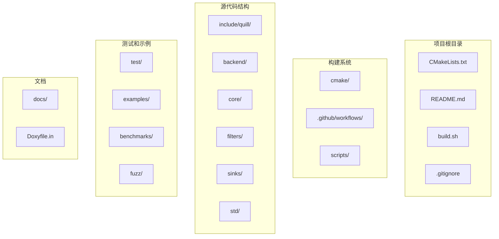
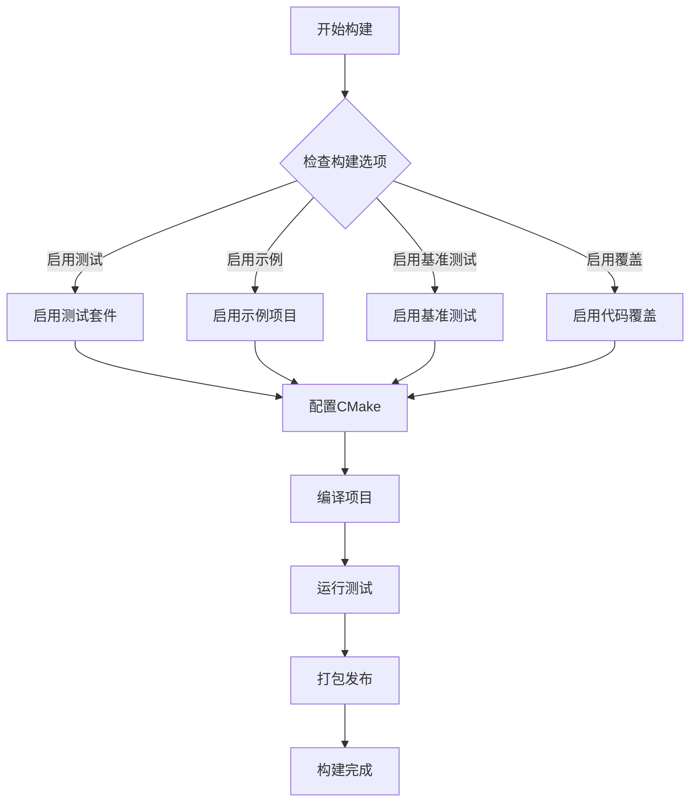
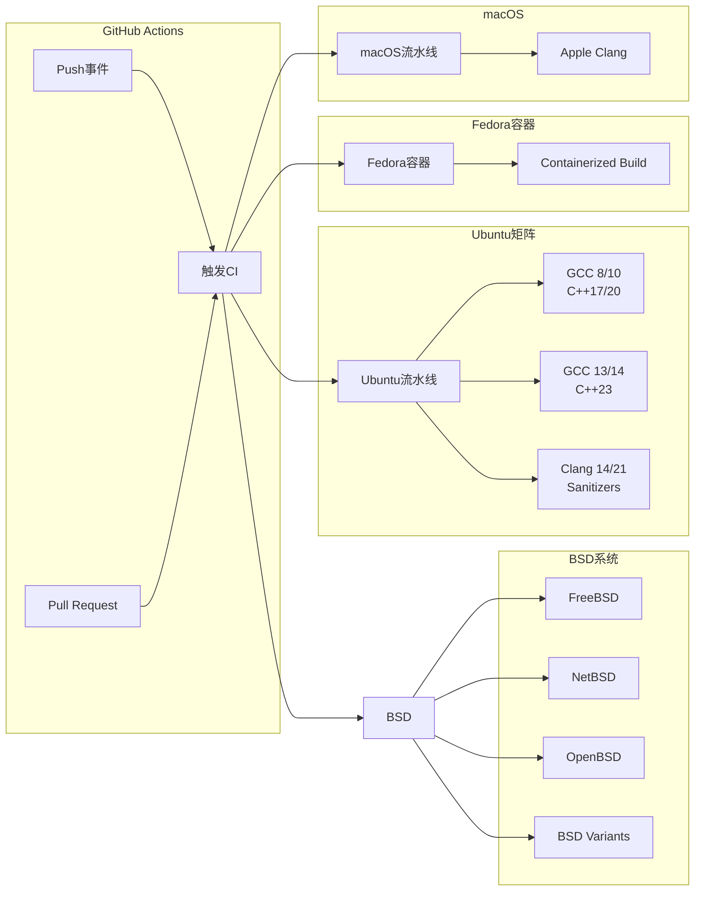
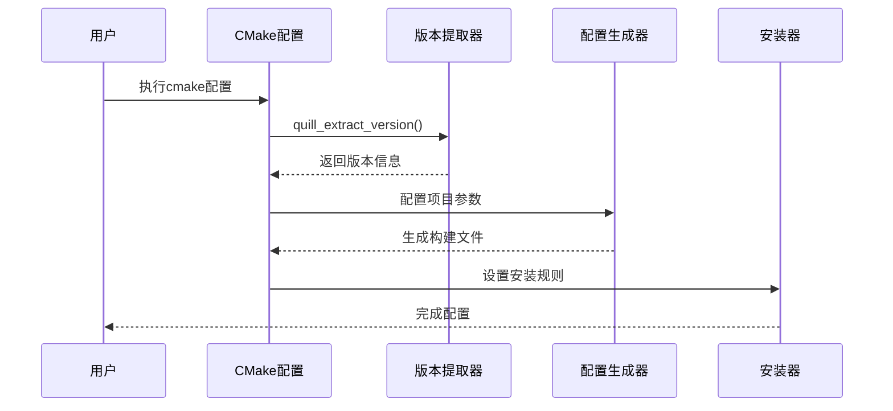
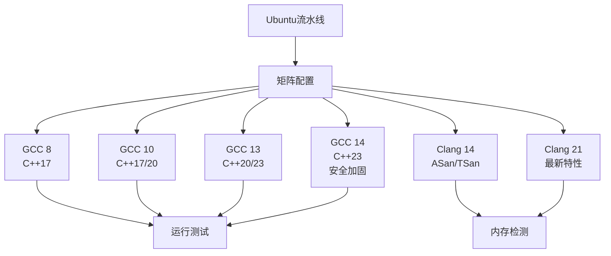
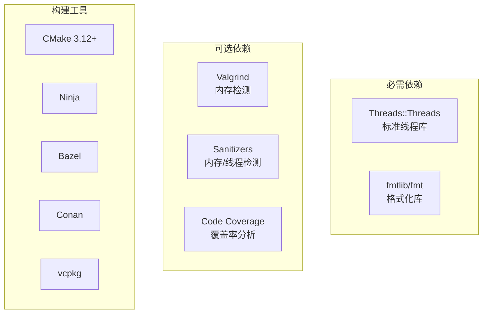

# 版本控制配置

<cite>
**本文档引用的文件**
- [CMakeLists.txt](file://CMakeLists.txt)
- [README.md](file://README.md)
- [build.sh](file://build.sh)
- [.clang-format](file://.clang-format)
- [.gitignore](file://.gitignore)
- [.github/workflows/ubuntu.yml](file://.github/workflows/ubuntu.yml)
- [.github/workflows/fedora.yml](file://.github/workflows/fedora.yml)
- [.github/workflows/bsd.yml](file://.github/workflows/bsd.yml)
- [.github/workflows/macos.yml](file://.github/workflows/macos.yml)
</cite>

## 目录
1. [简介](#简介)
2. [项目结构](#项目结构)
3. [核心组件](#核心组件)
4. [架构概览](#架构概览)
5. [详细组件分析](#详细组件分析)
6. [依赖关系分析](#依赖关系分析)
7. [性能考虑](#性能考虑)
8. [故障排除指南](#故障排除指南)
9. [结论](#结论)

## 简介

本文档详细分析了Quill日志库项目的版本控制配置和构建系统。Quill是一个高性能的异步C++日志库，专注于低延迟和高吞吐量应用。该项目采用现代化的版本控制系统和多平台CI/CD流水线，确保代码质量和跨平台兼容性。

## 项目结构

Quill项目采用了模块化的文件组织结构，主要包含以下关键目录：

**图表来源**
- [CMakeLists.txt:1-451](file://CMakeLists.txt#L1-L451)
- [README.md:1-767](file://README.md#L1-L767)

**章节来源**
- [CMakeLists.txt:1-451](file://CMakeLists.txt#L1-L451)
- [README.md:1-767](file://README.md#L1-L767)

## 核心组件

### 版本管理系统

Quill项目使用Git作为版本控制系统，配合GitHub进行代码托管和CI/CD集成。项目采用以下版本控制策略：

- **分支管理**: 主分支为master，遵循GitFlow工作流程
- **标签发布**: 每个版本发布时创建对应的Git标签
- **变更日志**: 维护详细的变更记录和版本说明

### 构建系统配置

项目采用CMake作为主要构建系统，支持多种构建选项和平台配置：

**图表来源**
- [CMakeLists.txt:68-180](file://CMakeLists.txt#L68-L180)

**章节来源**
- [CMakeLists.txt:68-180](file://CMakeLists.txt#L68-L180)

## 架构概览

### 多平台CI/CD架构

项目实现了全面的跨平台持续集成架构，支持多个操作系统和编译器组合：

**图表来源**
- [.github/workflows/ubuntu.yml:1-167](file://.github/workflows/ubuntu.yml#L1-L167)
- [.github/workflows/fedora.yml:1-71](file://.github/workflows/fedora.yml#L1-L71)
- [.github/workflows/bsd.yml:1-118](file://.github/workflows/bsd.yml#L1-L118)
- [.github/workflows/macos.yml:1-57](file://.github/workflows/macos.yml#L1-L57)

### 构建选项和配置

项目提供了丰富的构建选项，支持不同的使用场景和部署需求：

| 构建选项 | 默认值 | 描述 |
|---------|--------|------|
| QUILL_BUILD_TESTS | OFF | 启用测试套件构建 |
| QUILL_BUILD_EXAMPLES | OFF | 启用示例项目构建 |
| QUILL_BUILD_BENCHMARKS | OFF | 启用性能基准测试 |
| QUILL_NO_EXCEPTIONS | OFF | 禁用异常处理支持 |
| QUILL_SANITIZE_ADDRESS | OFF | 启用AddressSanitizer |
| QUILL_SANITIZE_THREAD | OFF | 启用ThreadSanitizer |
| QUILL_CODE_COVERAGE | OFF | 启用代码覆盖率分析 |

**章节来源**
- [CMakeLists.txt:8-47](file://CMakeLists.txt#L8-L47)

## 详细组件分析

### CMake构建系统

CMakeLists.txt文件定义了完整的构建配置，包括版本提取、编译器设置和安装规则：

**图表来源**
- [CMakeLists.txt:68-180](file://CMakeLists.txt#L68-L180)

#### 版本提取机制

项目采用自动版本提取机制，通过CMake函数从源代码中解析版本信息：

- **版本格式**: MAJOR.MINOR.PATCH
- **版本来源**: include/quill/Utility.h中的版本常量
- **自动生成**: 在配置阶段动态计算版本号

#### 编译器兼容性

项目支持多种编译器和标准版本：

- **GCC**: 8.0及以上版本
- **Clang**: 14.0及以上版本  
- **MSVC**: 19.29及以上版本
- **C++标准**: C++17及以上

**章节来源**
- [CMakeLists.txt:74-88](file://CMakeLists.txt#L74-L88)

### GitHub Actions工作流

每个工作流文件都针对特定的操作系统和编译器配置进行了优化：

#### Ubuntu流水线配置

Ubuntu流水线支持多版本编译器和标准库组合：

**图表来源**
- [.github/workflows/ubuntu.yml:29-76](file://.github/workflows/ubuntu.yml#L29-L76)

#### Fedora容器化构建

Fedora流水线使用容器化环境确保构建一致性：

- **基础镜像**: Fedora 40容器
- **编译器**: GCC C++
- **构建类型**: Debug和Release双模式
- **C++标准**: 支持C++23

#### BSD系统支持

项目对多种BSD变体提供原生支持：

- **FreeBSD 14.2**: 最新稳定版本
- **NetBSD 10.0**: 测试最新特性
- **OpenBSD 7.7**: 安全优先
- **DragonFlyBSD 6.4.2**: 高性能变体

**章节来源**
- [.github/workflows/bsd.yml:24-118](file://.github/workflows/bsd.yml#L24-L118)

### 开发工具链配置

#### 代码格式化

项目使用clang-format统一代码风格：

- **标准**: C++20
- **行长限制**: 100字符
- **缩进**: 2空格
- **对齐**: 右对齐限定符
- **换行**: LF结尾

#### 编译数据库

build.sh脚本自动生成compile_commands.json供IDE使用：

- **生成位置**: 项目根目录
- **工具支持**: clangd, VS Code等
- **并行构建**: 使用Ninja生成器

**章节来源**
- [.clang-format:1-48](file://.clang-format#L1-L48)
- [build.sh:66-87](file://build.sh#L66-L87)

## 依赖关系分析

### 外部依赖管理

项目采用最小化外部依赖策略：

**图表来源**
- [CMakeLists.txt:93-94](file://CMakeLists.txt#L93-L94)

### 内部模块依赖

项目内部模块之间保持松耦合设计：

- **frontend**: 仅依赖core和sinks模块
- **backend**: 依赖core和backend子模块
- **sinks**: 独立的输出模块
- **filters**: 可选的过滤模块

**章节来源**
- [CMakeLists.txt:186-289](file://CMakeLists.txt#L186-L289)

## 性能考虑

### 构建性能优化

项目在构建系统层面实现了多项性能优化：

- **增量构建**: CMake的智能依赖跟踪
- **并行编译**: 多核处理器充分利用
- **缓存机制**: CMake和编译器缓存
- **条件编译**: 基于选项的代码排除

### 测试执行效率

CI流水线优化了测试执行效率：

- **并行测试**: 多个测试同时执行
- **失败快速返回**: 错误发生时立即停止
- **资源隔离**: 每个作业独立的虚拟机
- **结果缓存**: 成功构建的结果缓存

## 故障排除指南

### 常见构建问题

#### 编译器版本不兼容

**问题**: 编译器版本过低导致编译失败

**解决方案**:
1. 升级到支持的编译器版本
2. 设置CMAKE_CXX_STANDARD变量
3. 检查系统依赖是否满足

#### 依赖库缺失

**问题**: 找不到必需的依赖库

**解决方案**:
1. 安装系统包管理器中的依赖
2. 使用包管理器如Conan或vcpkg
3. 手动指定库路径

#### 平台特定问题

**问题**: 在特定平台上构建失败

**解决方案**:
1. 检查平台支持矩阵
2. 使用容器化构建环境
3. 调整编译器标志

**章节来源**
- [CMakeLists.txt:85-88](file://CMakeLists.txt#L85-L88)

### CI/CD问题诊断

#### 工作流失败排查

**问题**: GitHub Actions工作流执行失败

**诊断步骤**:
1. 检查工作流日志中的错误信息
2. 验证构建选项配置
3. 确认依赖服务可用性
4. 检查网络连接状态

#### 并行测试冲突

**问题**: 多线程测试相互干扰

**解决方案**:
1. 使用独立的日志文件
2. 实现测试隔离机制
3. 调整测试执行顺序

## 结论

Quill项目的版本控制配置展现了现代C++项目的最佳实践。通过精心设计的CMake构建系统、全面的多平台CI/CD架构和严格的代码质量控制，项目确保了高度的可维护性和跨平台兼容性。

关键优势包括：
- **自动化程度高**: 完整的CI/CD流水线覆盖所有目标平台
- **灵活性强**: 丰富的构建选项适应不同使用场景
- **质量保证**: 全面的测试策略和代码检查
- **开发体验佳**: 完善的开发工具链支持

这些配置为项目的长期发展奠定了坚实基础，也为用户提供了可靠的使用体验。