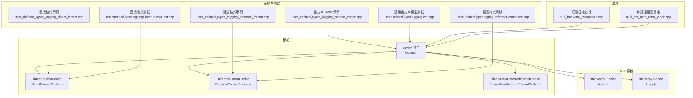
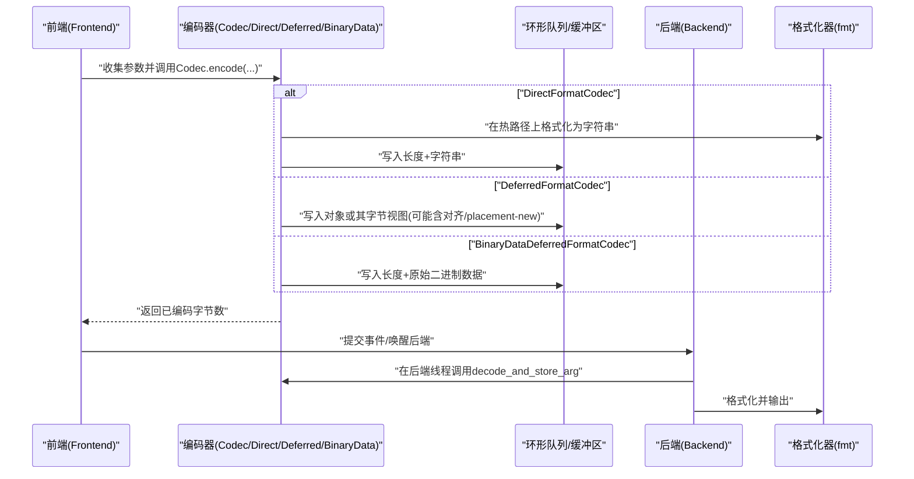
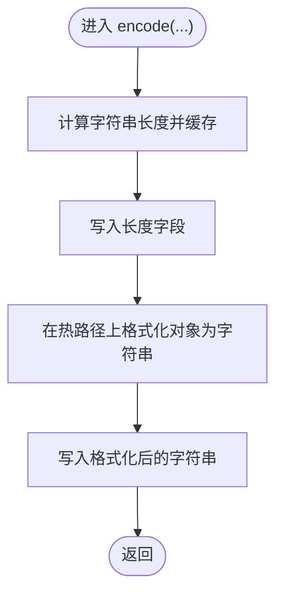
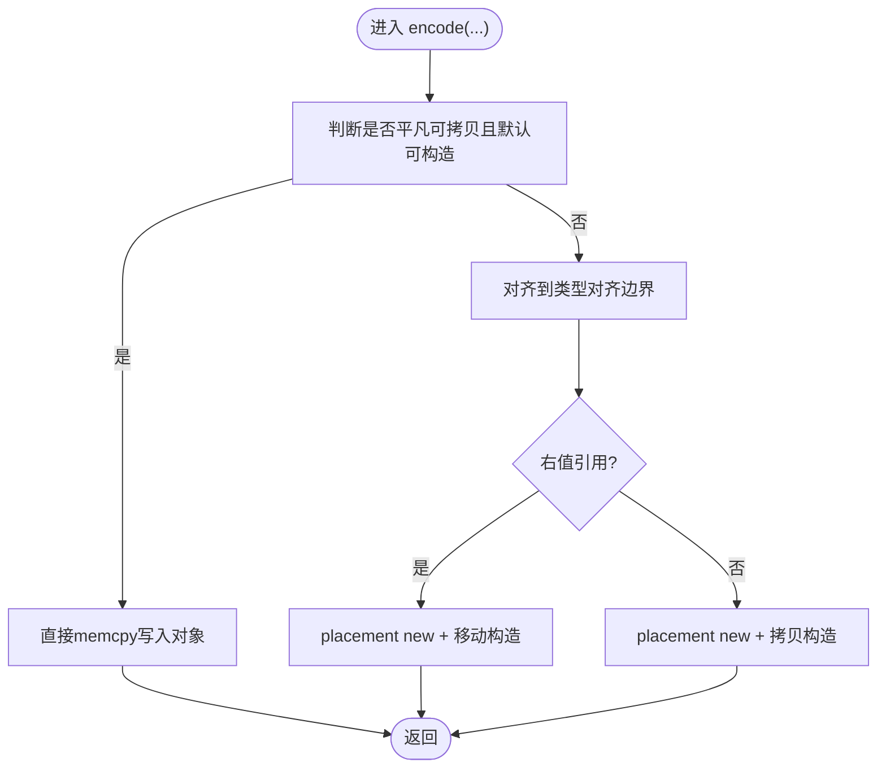
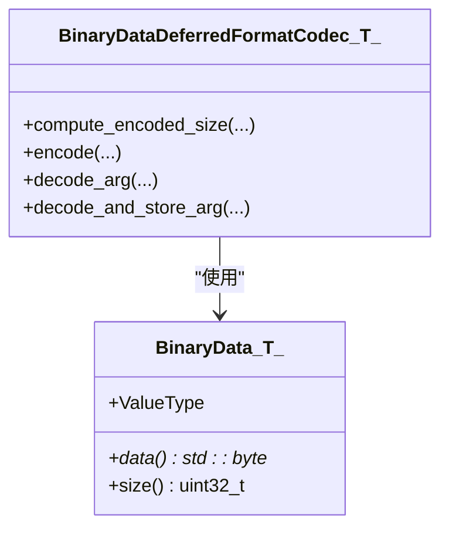
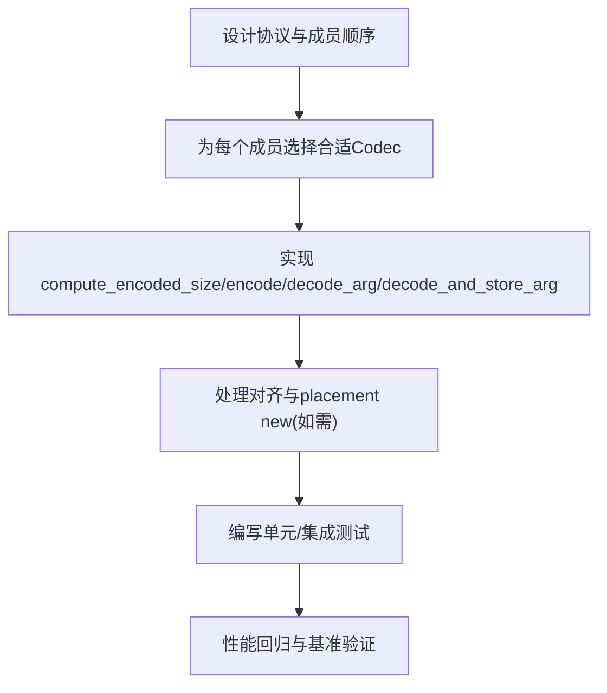
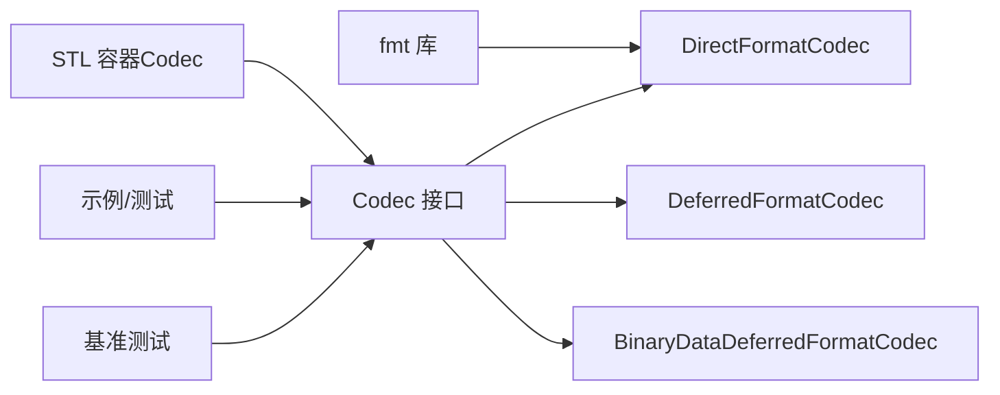

# 编码器定制

<cite>
**本文引用的文件**
- [DirectFormatCodec.h](file://include/quill/DirectFormatCodec.h)
- [DeferredFormatCodec.h](file://include/quill/DeferredFormatCodec.h)
- [BinaryDataDeferredFormatCodec.h](file://include/quill/BinaryDataDeferredFormatCodec.h)
- [Codec.h](file://include/quill/core/Codec.h)
- [Vector.h](file://include/quill/std/Vector.h)
- [Array.h](file://include/quill/std/Array.h)
- [user_defined_types_logging_direct_format.cpp](file://examples/user_defined_types_logging_direct_format.cpp)
- [user_defined_types_logging_deferred_format.cpp](file://examples/user_defined_types_logging_deferred_format.cpp)
- [user_defined_types_logging_custom_codec.cpp](file://examples/user_defined_types_logging_custom_codec.cpp)
- [UserDefinedTypeLoggingDirectFormatTest.cpp](file://test/integration_tests/UserDefinedTypeLoggingDirectFormatTest.cpp)
- [UserDefinedTypeLoggingDeferredFormatTest.cpp](file://test/integration_tests/UserDefinedTypeLoggingDeferredFormatTest.cpp)
- [UserDefinedTypeLoggingTest.cpp](file://test/integration_tests/UserDefinedTypeLoggingTest.cpp)
- [quill_backend_throughput.cpp](file://benchmarks/backend_throughput/quill_backend_throughput.cpp)
- [quill_hot_path_rdtsc_clock.cpp](file://benchmarks/hot_path_latency/quill_hot_path_rdtsc_clock.cpp)
</cite>

## 目录
1. [简介](#简介)
2. [项目结构](#项目结构)
3. [核心组件](#核心组件)
4. [架构总览](#架构总览)
5. [详细组件分析](#详细组件分析)
6. [依赖关系分析](#依赖关系分析)
7. [性能考量](#性能考量)
8. [故障排查指南](#故障排查指南)
9. [结论](#结论)
10. [附录](#附录)

## 简介
本文件面向需要为Quill定制编码器的开发者，系统性阐述Codec体系的设计与实现，重点对比“直接格式化”与“延迟格式化”的差异、适用场景与性能特征；深入解析DirectFormatCodec与DeferredFormatCodec的内部机制，并给出二进制数据编码的特殊处理与优化策略。同时提供自定义编码器的开发指南（协议设计、数据结构、性能优化），覆盖STL容器、自定义类与复合类型的支持方式，并给出性能测试与基准测试方法及高并发优化建议。

## 项目结构
围绕编码器的核心代码主要位于以下位置：
- 核心Codec接口与默认实现：include/quill/core/Codec.h
- 直接格式化编码器：include/quill/DirectFormatCodec.h
- 延迟格式化编码器：include/quill/DeferredFormatCodec.h
- 二进制数据编码器：include/quill/BinaryDataDeferredFormatCodec.h
- 常用STL容器Codec特化：include/quill/std/Vector.h、include/quill/std/Array.h
- 示例与测试：examples/ 与 test/integration_tests/ 下的用户自定义类型示例与测试
- 基准测试：benchmarks/ 下的吞吐与热路径延迟测试

**图表来源**
- [Codec.h](file://include/quill/core/Codec.h)
- [DirectFormatCodec.h](file://include/quill/DirectFormatCodec.h)
- [DeferredFormatCodec.h](file://include/quill/DeferredFormatCodec.h)
- [BinaryDataDeferredFormatCodec.h](file://include/quill/BinaryDataDeferredFormatCodec.h)
- [Vector.h](file://include/quill/std/Vector.h)
- [Array.h](file://include/quill/std/Array.h)
- [user_defined_types_logging_direct_format.cpp](file://examples/user_defined_types_logging_direct_format.cpp)
- [user_defined_types_logging_deferred_format.cpp](file://examples/user_defined_types_logging_deferred_format.cpp)
- [user_defined_types_logging_custom_codec.cpp](file://examples/user_defined_types_logging_custom_codec.cpp)
- [UserDefinedTypeLoggingDirectFormatTest.cpp](file://test/integration_tests/UserDefinedTypeLoggingDirectFormatTest.cpp)
- [UserDefinedTypeLoggingDeferredFormatTest.cpp](file://test/integration_tests/UserDefinedTypeLoggingDeferredFormatTest.cpp)
- [UserDefinedTypeLoggingTest.cpp](file://test/integration_tests/UserDefinedTypeLoggingTest.cpp)
- [quill_backend_throughput.cpp](file://benchmarks/backend_throughput/quill_backend_throughput.cpp)
- [quill_hot_path_rdtsc_clock.cpp](file://benchmarks/hot_path_latency/quill_hot_path_rdtsc_clock.cpp)

**章节来源**
- [Codec.h](file://include/quill/core/Codec.h)
- [DirectFormatCodec.h](file://include/quill/DirectFormatCodec.h)
- [DeferredFormatCodec.h](file://include/quill/DeferredFormatCodec.h)
- [BinaryDataDeferredFormatCodec.h](file://include/quill/BinaryDataDeferredFormatCodec.h)
- [Vector.h](file://include/quill/std/Vector.h)
- [Array.h](file://include/quill/std/Array.h)

## 核心组件
- Codec接口与默认实现
  - 提供通用的编码/解码能力，内置对基础标量、字符串、数组等的处理；当未找到对应Codec时会触发编译期错误提示，引导用户选择合适的方案。
  - 支持“条件长度缓存”以避免重复计算字符串长度，提升热路径性能。
- DirectFormatCodec
  - 在热路径上通过fmt进行字符串格式化，适合需要即时可读文本输出的场景；适用于对象可被fmt格式化的用户自定义类型。
- DeferredFormatCodec
  - 将对象按内存布局或构造方式直接写入队列缓冲，避免热路径上的昂贵格式化；在后端线程中完成格式化，适合高吞吐、低延迟敏感场景。
- BinaryDataDeferredFormatCodec
  - 针对二进制数据的高效编码：仅拷贝原始字节到队列，延迟在后端格式化为可读表示（如十六进制）。
- STL容器Codec特化
  - 对std::vector、std::array等提供高效的序列化/反序列化，支持算术类型与复杂类型的混合。

**章节来源**
- [Codec.h](file://include/quill/core/Codec.h)
- [DirectFormatCodec.h](file://include/quill/DirectFormatCodec.h)
- [DeferredFormatCodec.h](file://include/quill/DeferredFormatCodec.h)
- [BinaryDataDeferredFormatCodec.h](file://include/quill/BinaryDataDeferredFormatCodec.h)
- [Vector.h](file://include/quill/std/Vector.h)
- [Array.h](file://include/quill/std/Array.h)

## 架构总览
下图展示了日志消息从前端到后端的编码流程，以及不同Codec在其中的角色：

**图表来源**
- [Codec.h](file://include/quill/core/Codec.h)
- [DirectFormatCodec.h](file://include/quill/DirectFormatCodec.h)
- [DeferredFormatCodec.h](file://include/quill/DeferredFormatCodec.h)
- [BinaryDataDeferredFormatCodec.h](file://include/quill/BinaryDataDeferredFormatCodec.h)

## 详细组件分析

### DirectFormatCodec 分析
- 设计要点
  - 在热路径上使用fmt::format生成字符串，确保日志可读性。
  - 通过SizeCacheVector缓存字符串长度，避免重复strlen计算。
  - 编码时先写入长度字段，再写入格式化结果；解码时复用字符串视图避免额外分配。
- 性能特征
  - 优点：输出可读性强，实现简单，适合非高吞吐场景。
  - 成本：热路径存在字符串格式化开销；对复杂对象或大集合可能产生显著CPU消耗。
- 适用场景
  - 用户自定义类型具备良好fmt::formatter支持；
  - 对日志可读性要求高且吞吐压力适中的场景。

**图表来源**
- [DirectFormatCodec.h](file://include/quill/DirectFormatCodec.h)

**章节来源**
- [DirectFormatCodec.h](file://include/quill/DirectFormatCodec.h)
- [user_defined_types_logging_direct_format.cpp](file://examples/user_defined_types_logging_direct_format.cpp)
- [UserDefinedTypeLoggingDirectFormatTest.cpp](file://test/integration_tests/UserDefinedTypeLoggingDirectFormatTest.cpp)

### DeferredFormatCodec 分析
- 设计要点
  - 优先使用std::memcpy对“平凡可拷贝且默认可构造”的类型进行零拷贝写入。
  - 对非平凡类型，采用对齐指针与placement new/移动/拷贝构造，保证内存安全与对齐要求。
  - 解码时根据类型特性选择移动或拷贝，必要时显式析构以避免资源泄漏。
- 性能特征
  - 优点：热路径几乎无格式化开销，适合高吞吐、低延迟敏感场景。
  - 成本：需满足类型约束（可拷贝/可移动/默认构造），且需注意线程安全与生命周期。
- 适用场景
  - 高频日志、批量对象、二进制数据；
  - 用户可控制对象状态，确保复制/移动后的线程安全性。

**图表来源**
- [DeferredFormatCodec.h](file://include/quill/DeferredFormatCodec.h)

**章节来源**
- [DeferredFormatCodec.h](file://include/quill/DeferredFormatCodec.h)
- [user_defined_types_logging_deferred_format.cpp](file://examples/user_defined_types_logging_deferred_format.cpp)
- [UserDefinedTypeLoggingDeferredFormatTest.cpp](file://test/integration_tests/UserDefinedTypeLoggingDeferredFormatTest.cpp)

### BinaryDataDeferredFormatCodec 分析
- 设计要点
  - 使用BinaryData作为非拥有型二进制视图，携带数据指针与长度，支持模板标签区分协议类型。
  - 编码时写入长度+原始字节，解码时构造BinaryData视图，延迟在后端完成格式化（如转十六进制）。
- 性能特征
  - 优点：热路径只拷贝原始字节，避免昂贵的协议解析与格式化。
  - 成本：后端格式化仍需成本，但与热路径隔离。
- 适用场景
  - 协议报文、二进制帧、网络数据等需要人类可读输出但高频记录的场景。

**图表来源**
- [BinaryDataDeferredFormatCodec.h](file://include/quill/BinaryDataDeferredFormatCodec.h)

**章节来源**
- [BinaryDataDeferredFormatCodec.h](file://include/quill/BinaryDataDeferredFormatCodec.h)

### 自定义编码器开发指南
- 编码协议设计
  - 明确成员顺序与类型，确保encode/decode顺序一致。
  - 对复杂成员使用嵌套Codec，利用compute_total_encoded_size/encode_members辅助函数。
- 数据结构定义
  - 保持与成员类型一致的编码单元；对字符串/容器使用长度前缀。
  - 对齐与对齐边界：参考DeferredFormatCodec中的对齐策略，必要时使用align_pointer。
- 性能优化技巧
  - 复用SizeCacheVector减少字符串长度重复计算。
  - 优先使用平凡可拷贝类型或提供移动语义，降低热路径成本。
  - 对STL容器，尽量使用算术类型以避免逐元素遍历。
- 示例参考
  - 自定义Codec示例展示了如何为复合类型编写完整的编码/解码逻辑。

**图表来源**
- [user_defined_types_logging_custom_codec.cpp](file://examples/user_defined_types_logging_custom_codec.cpp)
- [Codec.h](file://include/quill/core/Codec.h)

**章节来源**
- [user_defined_types_logging_custom_codec.cpp](file://examples/user_defined_types_logging_custom_codec.cpp)
- [Codec.h](file://include/quill/core/Codec.h)

### 用户自定义类型支持（STL容器、自定义类、复合类型）
- STL容器
  - std::vector：存储size与元素，算术类型直接块拷贝，复杂类型逐元素编码。
  - std::array：固定大小，算术类型整块拷贝，复杂类型逐元素编码。
- 自定义类
  - 通过DirectFormatCodec或DeferredFormatCodec绑定，或实现自定义Codec。
  - 若使用DirectFormatCodec，需提供fmt::formatter特化。
- 复合类型
  - 使用compute_total_encoded_size/encode_members组合子成员编码，解码时同样顺序恢复。

**章节来源**
- [Vector.h](file://include/quill/std/Vector.h)
- [Array.h](file://include/quill/std/Array.h)
- [UserDefinedTypeLoggingTest.cpp](file://test/integration_tests/UserDefinedTypeLoggingTest.cpp)

## 依赖关系分析
- 组件耦合
  - Codec接口为所有特化提供统一契约；Direct/Deferred/BinaryData均基于此接口扩展。
  - DeferredFormatCodec内部依赖类型特性检测与对齐工具，确保跨平台兼容。
- 外部依赖
  - fmt库用于字符串格式化（DirectFormatCodec与默认Codec对字符串的处理）。
  - 测试与示例依赖Quill的Frontend/Backend/Sink生态。

**图表来源**
- [DirectFormatCodec.h](file://include/quill/DirectFormatCodec.h)
- [DeferredFormatCodec.h](file://include/quill/DeferredFormatCodec.h)
- [BinaryDataDeferredFormatCodec.h](file://include/quill/BinaryDataDeferredFormatCodec.h)
- [Vector.h](file://include/quill/std/Vector.h)
- [Array.h](file://include/quill/std/Array.h)

**章节来源**
- [Codec.h](file://include/quill/core/Codec.h)
- [DirectFormatCodec.h](file://include/quill/DirectFormatCodec.h)
- [DeferredFormatCodec.h](file://include/quill/DeferredFormatCodec.h)
- [BinaryDataDeferredFormatCodec.h](file://include/quill/BinaryDataDeferredFormatCodec.h)
- [Vector.h](file://include/quill/std/Vector.h)
- [Array.h](file://include/quill/std/Array.h)

## 性能考量
- 直接格式化 vs 延迟格式化
  - DirectFormatCodec：热路径CPU开销较高，适合低频、可读性优先场景。
  - DeferredFormatCodec：热路径开销极低，适合高频、批量化对象日志。
- 二进制数据
  - BinaryDataDeferredFormatCodec将昂贵的解析与格式化推迟至后端，显著降低热路径负担。
- 基准测试
  - 吞吐基准：测量后端线程处理速率，评估整体系统承载能力。
  - 热路径延迟基准：评估单次日志调用的最小延迟，关注CPU周期级指标。
- 高并发优化建议
  - 优先使用DeferredFormatCodec（满足类型约束）。
  - 合理设置队列容量与后端睡眠策略，平衡延迟与吞吐。
  - 对热点对象尽量使用平凡可拷贝类型，减少移动/拷贝成本。
  - 利用条件长度缓存与内联向量减少分支与分配。

**章节来源**
- [quill_backend_throughput.cpp](file://benchmarks/backend_throughput/quill_backend_throughput.cpp)
- [quill_hot_path_rdtsc_clock.cpp](file://benchmarks/hot_path_latency/quill_hot_path_rdtsc_clock.cpp)

## 故障排查指南
- “缺少Codec”错误
  - 当编译器定位到codec_not_found_for_type时，检查：
    - 是否为STL类型：确保包含对应头文件（如Vector.h、Array.h）。
    - 是否为用户自定义类型：选择DirectFormatCodec或DeferredFormatCodec，或实现自定义Codec。
- DirectFormatCodec异常
  - 若fmt格式化抛出异常，需在formatter中避免动态运行时格式化或捕获异常。
- DeferredFormatCodec注意事项
  - 类型必须满足可拷贝/可移动/默认构造之一；若对象包含共享资源，需确保复制/移动后的线程安全。
- 二进制数据
  - 确保BinaryData的size不超过uint32_t上限，且后端formatter正确处理二进制视图。

**章节来源**
- [Codec.h](file://include/quill/core/Codec.h)
- [UserDefinedTypeLoggingDirectFormatTest.cpp](file://test/integration_tests/UserDefinedTypeLoggingDirectFormatTest.cpp)
- [UserDefinedTypeLoggingDeferredFormatTest.cpp](file://test/integration_tests/UserDefinedTypeLoggingDeferredFormatTest.cpp)

## 结论
Quill的Codec体系通过“直接格式化”与“延迟格式化”的双轨设计，在可读性与吞吐之间提供了灵活的取舍空间。DirectFormatCodec适合低频、可读性优先场景；DeferredFormatCodec适合高频、批量化对象与二进制数据；BinaryDataDeferredFormatCodec则专门优化了二进制数据的高效记录。结合STL容器Codec与自定义Codec，开发者可以针对业务特点实现高性能、可维护的日志编码方案。配合完善的基准测试与高并发优化策略，可在生产环境中获得稳定、可观的性能表现。

## 附录
- 快速对照表
  - 直接格式化：适合对象可fmt格式化、低频、可读性优先。
  - 延迟格式化：适合高频、批量对象、二进制数据、对延迟敏感。
  - 二进制数据：仅拷贝原始字节，后端格式化为可读表示。
- 开发清单
  - 明确类型约束与线程安全假设。
  - 选择合适的Codec并提供fmt::formatter（如需）。
  - 编写测试覆盖典型容器与边界情况。
  - 进行基准测试并持续监控回归。