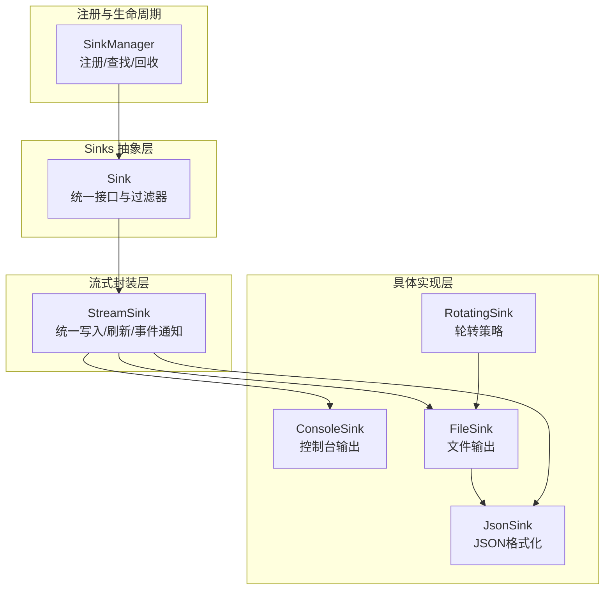
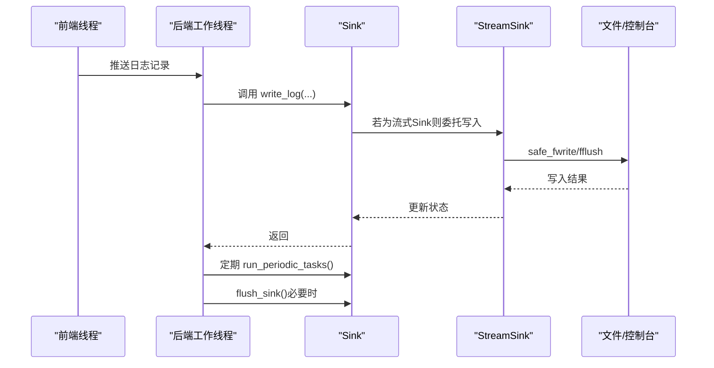
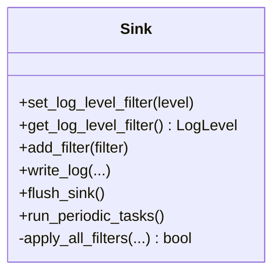
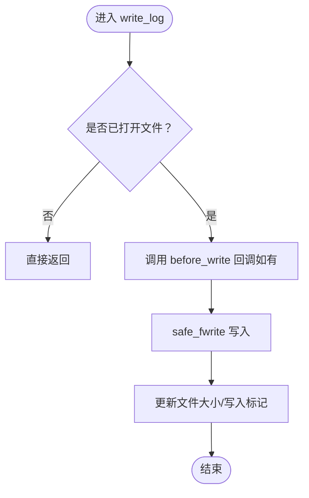
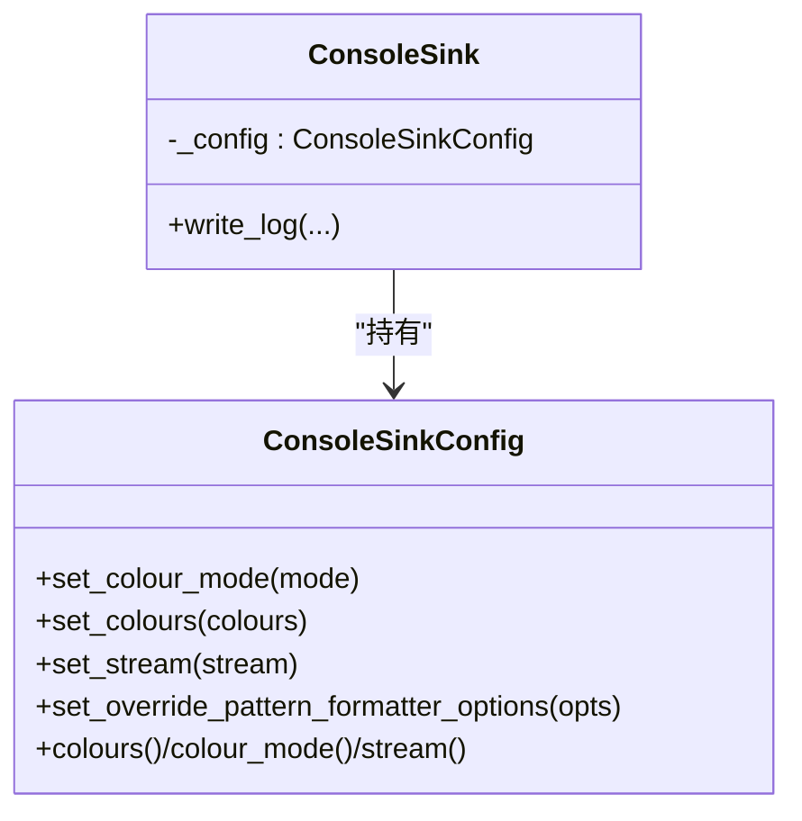
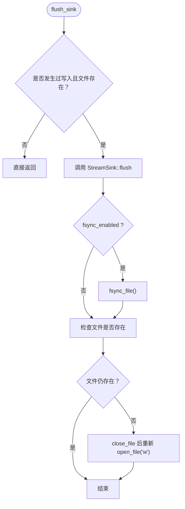
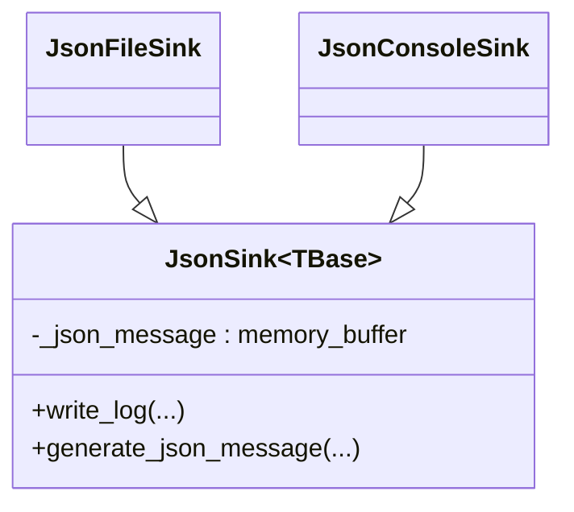
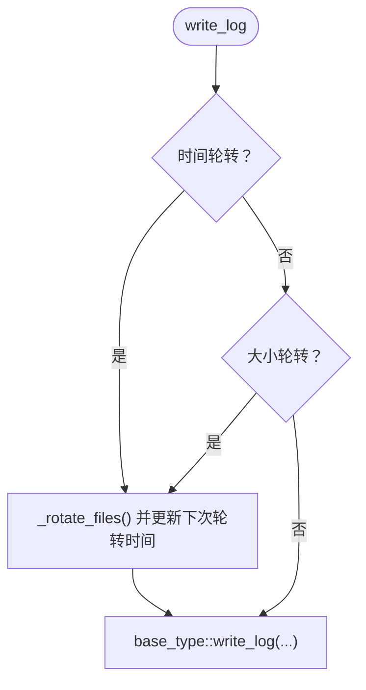
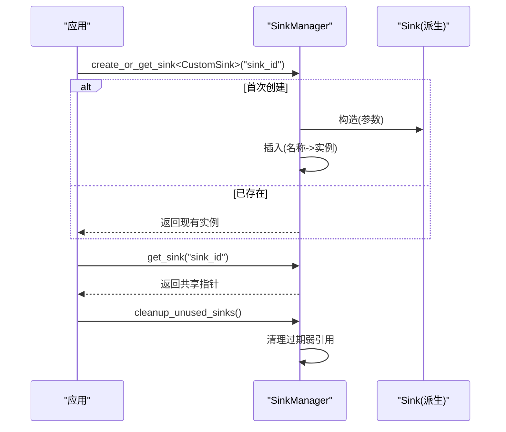
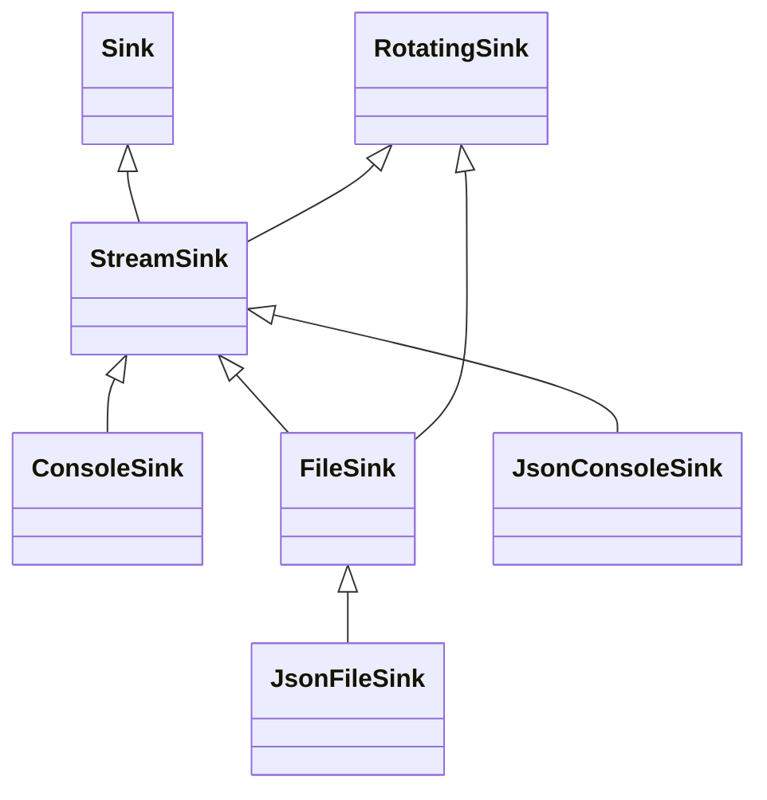

# 自定义Sinks开发

<cite>
**本文引用的文件**
- [Sink.h](file://include/quill/sinks/Sink.h)
- [StreamSink.h](file://include/quill/sinks/StreamSink.h)
- [ConsoleSink.h](file://include/quill/sinks/ConsoleSink.h)
- [FileSink.h](file://include/quill/sinks/FileSink.h)
- [JsonSink.h](file://include/quill/sinks/JsonSink.h)
- [RotatingSink.h](file://include/quill/sinks/RotatingSink.h)
- [RotatingFileSink.h](file://include/quill/sinks/RotatingFileSink.h)
- [SinkManager.h](file://include/quill/core/SinkManager.h)
- [user_defined_sink.cpp](file://examples/user_defined_sink.cpp)
- [sinks.rst](file://docs/sinks.rst)
- [README.md](file://README.md)
</cite>

## 目录
1. [简介](#简介)
2. [项目结构](#项目结构)
3. [核心组件](#核心组件)
4. [架构总览](#架构总览)
5. [详细组件分析](#详细组件分析)
6. [依赖关系分析](#依赖关系分析)
7. [性能考量](#性能考量)
8. [故障排查指南](#故障排查指南)
9. [结论](#结论)
10. [附录](#附录)

## 简介
本指南面向希望在Quill中开发自定义Sinks的工程师，系统讲解Sink基类的设计模式与接口规范、内置Sinks（ConsoleSink、FileSink等）的实现原理与设计取舍，并提供从零到一的自定义Sinks开发步骤、注册与生命周期管理、以及性能优化建议（批量写入、缓冲区管理、异步I/O）。文末给出网络日志、数据库日志、云存储日志的实现思路与落地要点。

## 项目结构
Quill的Sinks体系以“基类抽象 + 流式封装 + 具体目标实现”的分层方式组织：
- 基类：Sink（统一接口与过滤器框架）
- 流式基类：StreamSink（统一文件/控制台写入、缓冲与错误处理）
- 具体实现：ConsoleSink、FileSink、JsonSink、RotatingSink族等
- 注册与生命周期：SinkManager（集中注册、查找、回收）

图示来源
- [Sink.h:40-218](file://include/quill/sinks/Sink.h#L40-L218)
- [StreamSink.h:67-314](file://include/quill/sinks/StreamSink.h#L67-L314)
- [ConsoleSink.h:331-412](file://include/quill/sinks/ConsoleSink.h#L331-L412)
- [FileSink.h:226-527](file://include/quill/sinks/FileSink.h#L226-L527)
- [JsonSink.h:32-165](file://include/quill/sinks/JsonSink.h#L32-L165)
- [RotatingSink.h:262-800](file://include/quill/sinks/RotatingSink.h#L262-L800)
- [SinkManager.h:28-157](file://include/quill/core/SinkManager.h#L28-L157)

章节来源
- [README.md:679-703](file://README.md#L679-L703)
- [sinks.rst:1-66](file://docs/sinks.rst#L1-L66)

## 核心组件
- Sink基类
  - 虚函数接口：write_log、flush_sink、run_periodic_tasks
  - 过滤器框架：set_log_level_filter、add_filter、apply_all_filters
  - 模式格式化覆盖：支持按Sink覆盖全局PatternFormatterOptions
- StreamSink
  - 统一safe_fwrite、flush、文件大小统计、事件回调（before_write等）
  - 支持stdout/stderr/null与文件路径
- FileSink
  - 文件打开/关闭、缓冲设置、fsync策略、时间戳时区配置
- ConsoleSink
  - 控制台颜色、自动检测终端能力、输出流选择
- JsonSink
  - JSON字段生成与换行追加
- RotatingSink
  - 基于大小/时间/日期的轮转策略、命名方案、备份清理
- SinkManager
  - Sink注册、查找、弱引用回收

章节来源
- [Sink.h:40-218](file://include/quill/sinks/Sink.h#L40-L218)
- [StreamSink.h:67-314](file://include/quill/sinks/StreamSink.h#L67-L314)
- [FileSink.h:226-527](file://include/quill/sinks/FileSink.h#L226-L527)
- [ConsoleSink.h:331-412](file://include/quill/sinks/ConsoleSink.h#L331-L412)
- [JsonSink.h:32-165](file://include/quill/sinks/JsonSink.h#L32-L165)
- [RotatingSink.h:262-800](file://include/quill/sinks/RotatingSink.h#L262-L800)
- [SinkManager.h:28-157](file://include/quill/core/SinkManager.h#L28-L157)

## 架构总览
后端线程消费前端队列，调用Sink::write_log进行格式化与落盘；Sink内部可委托StreamSink完成实际写入；SinkManager负责集中注册与复用。

图示来源
- [Sink.h:123-141](file://include/quill/sinks/Sink.h#L123-L141)
- [StreamSink.h:152-193](file://include/quill/sinks/StreamSink.h#L152-L193)
- [README.md:697-702](file://README.md#L697-L702)

## 详细组件分析

### Sink基类：接口规范与线程安全
- 虚函数职责
  - write_log：接收格式化后的元数据与消息，执行落盘或转发
  - flush_sink：同步输出序列，确保可见性
  - run_periodic_tasks：后台周期性任务（避免重负载）
- 过滤器与日志级别
  - set_log_level_filter/get_log_level_filter：原子读写
  - add_filter：全局过滤器集合，线程安全（自旋锁保护）
  - apply_all_filters：先快速检查日志级别，再按需加载全局过滤器到本地集合，逐个判定
- 模式格式化覆盖
  - 可通过构造参数覆盖全局PatternFormatterOptions，仅影响该Sink

图示来源
- [Sink.h:65-197](file://include/quill/sinks/Sink.h#L65-L197)

章节来源
- [Sink.h:40-218](file://include/quill/sinks/Sink.h#L40-L218)

### StreamSink：统一写入与错误处理
- 构造逻辑
  - 解析stdout/stderr/null与文件路径，必要时创建目录
- 写入流程
  - safe_fwrite：跨平台可靠写入，Windows控制台使用WriteFile，非二进制流避免CRLF问题
  - before_write回调允许用户改写日志语句
- 刷新与状态
  - flush：fflush成功后清空写入标记
  - is_null/get_filename用于上层判断

图示来源
- [StreamSink.h:152-193](file://include/quill/sinks/StreamSink.h#L152-L193)
- [StreamSink.h:214-278](file://include/quill/sinks/StreamSink.h#L214-L278)

章节来源
- [StreamSink.h:67-314](file://include/quill/sinks/StreamSink.h#L67-L314)

### ConsoleSink：控制台彩色输出与终端检测
- 配置项
  - ConsoleSinkConfig：颜色模式（Always/Automatic/Never）、每级颜色映射、输出流（stdout/stderr）、格式化覆盖
- 实现要点
  - 自动检测终端与环境变量，启用ANSI颜色（Windows通过控制台句柄）
  - 在写入前追加颜色码，结束后重置

图示来源
- [ConsoleSink.h:44-328](file://include/quill/sinks/ConsoleSink.h#L44-L328)
- [ConsoleSink.h:331-412](file://include/quill/sinks/ConsoleSink.h#L331-L412)

章节来源
- [ConsoleSink.h:331-412](file://include/quill/sinks/ConsoleSink.h#L331-L412)

### FileSink：文件写入、缓冲与fsync
- 配置项
  - FileSinkConfig：文件名追加选项、时区、fsync开关、打开模式、写缓冲大小、最小fsync间隔、格式化覆盖
- 打开/关闭与缓冲
  - open_file：跨平台重试、共享读取（Windows SH_DENYNO）、O_CLOEXEC（Unix）
  - setvbuf自定义缓冲，减少系统调用
- 刷新与恢复
  - flush_sink：若文件存在且发生过写入，则调用StreamSink::flush并按需fsync
  - 若文件被删除，自动重新打开

图示来源
- [FileSink.h:264-288](file://include/quill/sinks/FileSink.h#L264-L288)
- [FileSink.h:362-463](file://include/quill/sinks/FileSink.h#L362-L463)

章节来源
- [FileSink.h:226-527](file://include/quill/sinks/FileSink.h#L226-L527)

### JsonSink：JSON格式化与扩展点
- 默认JSON字段：时间戳、文件名、行号、线程ID、logger名、日志等级、消息正文
- 可选命名参数键值对作为额外字段
- generate_json_message可被派生类覆盖以定制字段

图示来源
- [JsonSink.h:32-165](file://include/quill/sinks/JsonSink.h#L32-L165)

章节来源
- [JsonSink.h:32-165](file://include/quill/sinks/JsonSink.h#L32-L165)

### RotatingSink：轮转策略与命名
- 轮转触发条件
  - 基于大小：当前文件大小 + 日志长度超过阈值
  - 基于时间：分钟/小时/天到达下一个轮转点
- 命名方案
  - Index：.0/.1/.2...
  - Date：.YYYYMMDD
  - DateAndTime：.YYYYMMDD_HHMMSS
- 备份清理
  - 最大备份数限制，可选择覆盖最旧文件或停止轮转
  - 进程启动时可清理历史同名文件

图示来源
- [RotatingSink.h:335-369](file://include/quill/sinks/RotatingSink.h#L335-L369)
- [RotatingSink.h:396-487](file://include/quill/sinks/RotatingSink.h#L396-L487)

章节来源
- [RotatingSink.h:262-800](file://include/quill/sinks/RotatingSink.h#L262-L800)
- [RotatingFileSink.h:13-15](file://include/quill/sinks/RotatingFileSink.h#L13-L15)

### 自定义Sinks开发步骤
- 继承关系设计
  - 若目标为文件/控制台：建议继承StreamSink
  - 若目标为数据库/网络：建议直接继承Sink，自行实现write_log/flush_sink
- 构造函数实现
  - 保存配置（如缓冲大小、超时、认证信息等）
  - 初始化外部资源（连接池、句柄、事件回调）
- 核心方法重写
  - write_log：解析传入元数据，拼装目标格式，执行发送/写入
  - flush_sink：确保已提交的数据可见（网络需确认ACK，文件需fflush/fsync）
  - run_periodic_tasks：批量提交、心跳、重连等轻量任务
- 线程安全与异常
  - 避免在run_periodic_tasks中执行重负载操作
  - 对外抛出异常时遵循Quill错误约定，便于上层捕获

章节来源
- [user_defined_sink.cpp:18-73](file://examples/user_defined_sink.cpp#L18-L73)
- [Sink.h:123-141](file://include/quill/sinks/Sink.h#L123-L141)

### 注册机制与生命周期管理
- 注册入口
  - SinkManager::create_or_get_sink<TSink>()：按名称创建或复用Sink实例
  - FileSink特例：对FileSink及其派生类型做特殊构造处理
- 查找与回收
  - get_sink()：按名称查找，不存在抛错
  - cleanup_unused_sinks()：定期清理失效弱引用，释放资源
- 生命周期
  - Sink由SinkManager持有，随Logger销毁而逐步回收

图示来源
- [SinkManager.h:69-94](file://include/quill/core/SinkManager.h#L69-L94)
- [SinkManager.h:97-118](file://include/quill/core/SinkManager.h#L97-L118)

章节来源
- [SinkManager.h:28-157](file://include/quill/core/SinkManager.h#L28-L157)
- [sinks.rst:18-36](file://docs/sinks.rst#L18-L36)

## 依赖关系分析
- 继承与组合
  - ConsoleSink/JsonSink均组合StreamSink
  - FileSink直接继承StreamSink
  - RotatingSink模板包装任意TBase（通常为FileSink/StreamSink）
- 关键依赖
  - StreamSink依赖文件系统与错误处理
  - ConsoleSink依赖终端检测与颜色编码
  - FileSink依赖跨平台文件打开与缓冲策略
  - JsonSink依赖格式化库与内存缓冲

图示来源
- [ConsoleSink.h:331-412](file://include/quill/sinks/ConsoleSink.h#L331-L412)
- [FileSink.h:226-527](file://include/quill/sinks/FileSink.h#L226-L527)
- [JsonSink.h:140-165](file://include/quill/sinks/JsonSink.h#L140-L165)
- [RotatingSink.h:262-283](file://include/quill/sinks/RotatingSink.h#L262-L283)

章节来源
- [ConsoleSink.h:331-412](file://include/quill/sinks/ConsoleSink.h#L331-L412)
- [FileSink.h:226-527](file://include/quill/sinks/FileSink.h#L226-L527)
- [JsonSink.h:140-165](file://include/quill/sinks/JsonSink.h#L140-L165)
- [RotatingSink.h:262-283](file://include/quill/sinks/RotatingSink.h#L262-L283)

## 性能考量
- 批量写入
  - 将多个日志记录合并为单次发送/写入，减少系统调用次数
  - 使用缓冲聚合（参考FileSink的set_write_buffer_size）
- 缓冲区管理
  - 合理设置缓冲大小，避免频繁扩容与碎片化
  - 对网络/磁盘I/O采用不同策略：网络偏向小而频，磁盘偏向大块顺序写
- 异步I/O
  - 将阻塞写入放入后台线程池，主线程只做入队
  - 使用事件回调before_write进行预处理与压缩
- 刷新策略
  - 控制flush频率，结合fsync最小间隔降低磁盘磨损
  - run_periodic_tasks仅做轻量任务，避免阻塞后端主循环

## 故障排查指南
- 写入失败
  - safe_fwrite会抛出QuillError，包含errno与错误描述
  - 检查文件权限、磁盘空间、句柄有效性
- 文件被删除
  - flush后若文件不存在，FileSink会自动重新打开
  - 如需持久化，可在flush_sink中增加重连/重试
- 终端颜色不生效
  - 检查ConsoleSinkConfig的色模式与终端支持
  - Windows需启用虚拟终端处理
- 轮转异常
  - 检查命名方案与最大备份数，确认覆盖策略
  - 轮转期间可能短暂阻塞，避免在高并发下频繁触发

章节来源
- [StreamSink.h:214-278](file://include/quill/sinks/StreamSink.h#L214-L278)
- [FileSink.h:468-485](file://include/quill/sinks/FileSink.h#L468-L485)
- [ConsoleSink.h:154-250](file://include/quill/sinks/ConsoleSink.h#L154-L250)
- [RotatingSink.h:396-487](file://include/quill/sinks/RotatingSink.h#L396-L487)

## 结论
通过Sink基类的统一接口与StreamSink的通用写入能力，Quill为自定义Sinks提供了清晰的扩展路径。结合SinkManager的注册与生命周期管理、以及FileSink/ConsoleSink/JsonSink/RotatingSink等内置实现，开发者可以快速构建高性能、可维护的日志输出通道。建议优先复用StreamSink，其次再考虑直接继承Sink；在实现中严格遵守线程安全与异常处理规范，并根据目标介质特性优化缓冲与刷新策略。

## 附录

### 实战：自定义Sinks开发示例（思路）
- 网络日志
  - 继承Sink，实现write_log：将日志打包为协议帧，发送至远端服务
  - flush_sink：等待ACK或超时重试
  - run_periodic_tasks：心跳、重连、批量提交
- 数据库日志
  - 继承Sink，实现write_log：拼装SQL或预编译语句，写入队列
  - flush_sink：事务提交/批量插入
  - run_periodic_tasks：连接池健康检查
- 云存储日志
  - 继承StreamSink，实现safe_fwrite：对接SDK上传
  - flush_sink：确认上传完成或加入重试队列
  - 注意：避免在run_periodic_tasks中做重负载操作

章节来源
- [user_defined_sink.cpp:18-73](file://examples/user_defined_sink.cpp#L18-L73)
- [Sink.h:123-141](file://include/quill/sinks/Sink.h#L123-L141)
- [StreamSink.h:214-278](file://include/quill/sinks/StreamSink.h#L214-L278)