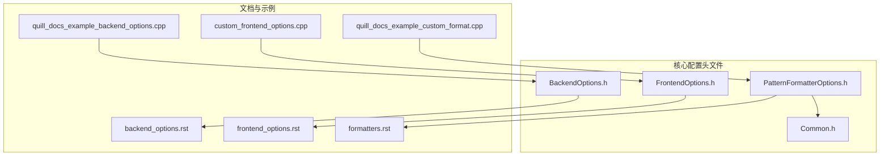
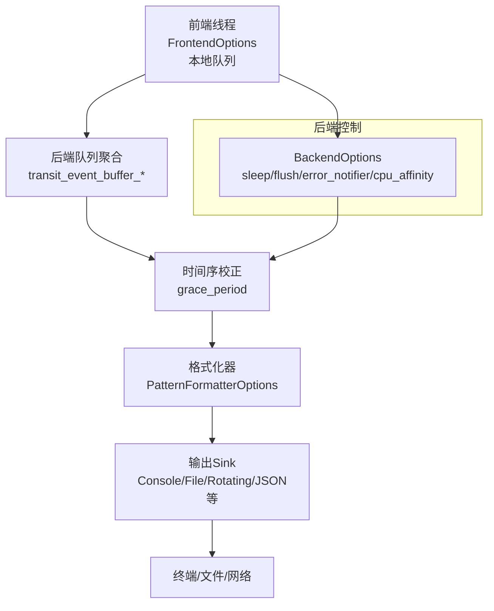
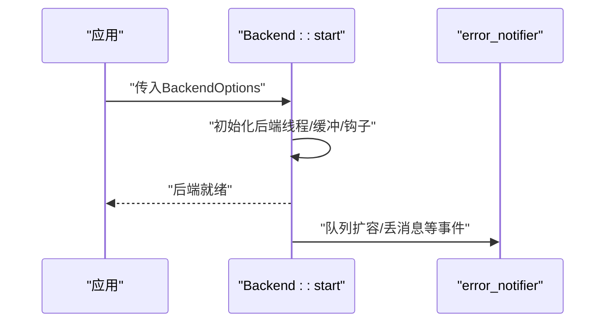
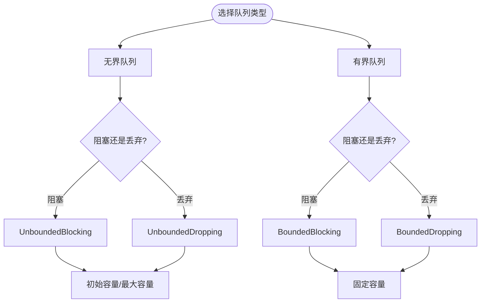
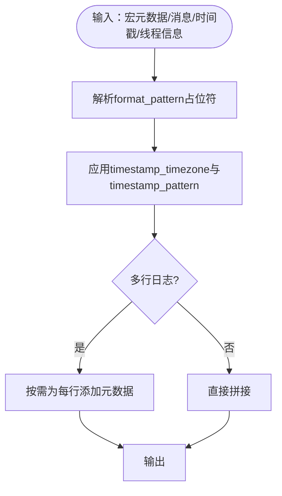
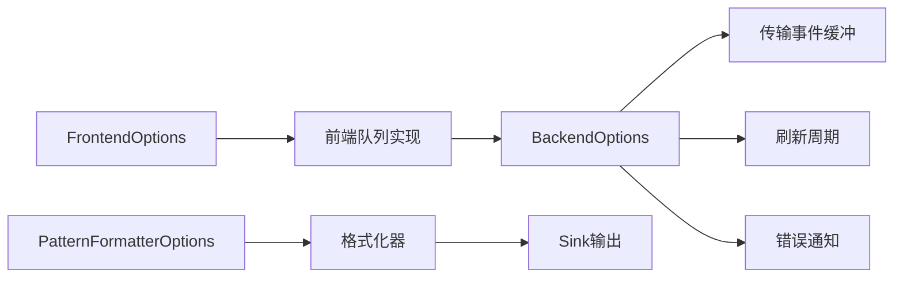

# 配置与定制

<cite>
**本文引用的文件**
- [BackendOptions.h](file://include/quill/backend/BackendOptions.h)
- [FrontendOptions.h](file://include/quill/core/FrontendOptions.h)
- [PatternFormatterOptions.h](file://include/quill/core/PatternFormatterOptions.h)
- [Common.h](file://include/quill/core/Common.h)
- [backend_options.rst](file://docs/backend_options.rst)
- [frontend_options.rst](file://docs/frontend_options.rst)
- [formatters.rst](file://docs/formatters.rst)
- [quill_docs_example_backend_options.cpp](file://docs/examples/quill_docs_example_backend_options.cpp)
- [quill_docs_example_custom_format.cpp](file://docs/examples/quill_docs_example_custom_format.cpp)
- [custom_frontend_options.cpp](file://examples/custom_frontend_options.cpp)
- [PatternFormatterTest.cpp](file://test/unit_tests/PatternFormatterTest.cpp)
- [BoundedDroppingQueueTest.cpp](file://test/integration_tests/BoundedDroppingQueueTest.cpp)
- [UnboundedUnlimitedQueueTest.cpp](file://test/integration_tests/UnboundedUnlimitedQueueTest.cpp)
</cite>

## 目录
1. [简介](#简介)
2. [项目结构](#项目结构)
3. [核心组件](#核心组件)
4. [架构总览](#架构总览)
5. [详细组件分析](#详细组件分析)
6. [依赖关系分析](#依赖关系分析)
7. [性能考量](#性能考量)
8. [故障排查指南](#故障排查指南)
9. [结论](#结论)
10. [附录](#附录)

## 简介
本指南聚焦于Quill日志库的配置与定制能力，围绕以下三类配置对象展开：
- 后端配置：BackendOptions，用于控制后端线程行为、缓冲区与刷新策略、错误通知、时钟同步等。
- 前端配置：FrontendOptions，用于定义前端线程本地队列类型、容量与内存策略（含Linux巨页）。
- 格式化配置：PatternFormatterOptions，用于自定义日志消息格式、时间戳格式与时区、多行日志元数据处理等。

文档将逐项解析关键参数、默认值、适用场景与调优建议，并提供可直接参考的示例路径与最佳实践，帮助在不同负载与平台下实现稳定、高效且可读性强的日志输出。

## 项目结构
与配置相关的核心代码位于以下头文件与文档中：
- 后端配置：include/quill/backend/BackendOptions.h
- 前端配置：include/quill/core/FrontendOptions.h
- 格式化配置：include/quill/core/PatternFormatterOptions.h
- 通用枚举与类型：include/quill/core/Common.h
- 文档与示例：docs/*.rst 与 examples/*、test/* 中的相关示例与测试

**图表来源**
- [BackendOptions.h:1-283](file://include/quill/backend/BackendOptions.h#L1-L283)
- [FrontendOptions.h:1-52](file://include/quill/core/FrontendOptions.h#L1-L52)
- [PatternFormatterOptions.h:1-170](file://include/quill/core/PatternFormatterOptions.h#L1-L170)
- [Common.h:145-183](file://include/quill/core/Common.h#L145-L183)
- [backend_options.rst:1-46](file://docs/backend_options.rst#L1-L46)
- [frontend_options.rst:1-103](file://docs/frontend_options.rst#L1-L103)
- [formatters.rst:1-186](file://docs/formatters.rst#L1-L186)
- [quill_docs_example_backend_options.cpp:1-9](file://docs/examples/quill_docs_example_backend_options.cpp#L1-L9)
- [quill_docs_example_custom_format.cpp:1-18](file://docs/examples/quill_docs_example_custom_format.cpp#L1-L18)
- [custom_frontend_options.cpp:1-42](file://examples/custom_frontend_options.cpp#L1-L42)

**章节来源**
- [BackendOptions.h:1-283](file://include/quill/backend/BackendOptions.h#L1-L283)
- [FrontendOptions.h:1-52](file://include/quill/core/FrontendOptions.h#L1-L52)
- [PatternFormatterOptions.h:1-170](file://include/quill/core/PatternFormatterOptions.h#L1-L170)
- [Common.h:145-183](file://include/quill/core/Common.h#L145-L183)
- [backend_options.rst:1-46](file://docs/backend_options.rst#L1-L46)
- [frontend_options.rst:1-103](file://docs/frontend_options.rst#L1-L103)
- [formatters.rst:1-186](file://docs/formatters.rst#L1-L186)

## 核心组件
本节对三大配置对象的关键字段进行系统性梳理，覆盖语义、默认值、取值范围与典型调优方向。

- BackendOptions（后端配置）
  - 线程与调度
    - thread_name：后端线程名称，默认“QuillBackend”，便于调试器与进程名查询。
    - enable_yield_when_idle：空闲时是否让步，有助于降低调度优先级但可能影响低延迟唤醒。
    - sleep_duration：无工作时后端睡眠时长，默认约100微秒。
    - cpu_affinity：后端线程CPU亲和性，默认未设置（由系统调度），建议绑定到非关键业务CPU。
  - 缓冲与限流
    - transit_event_buffer_initial_capacity：每个前端线程的传输事件环形缓冲初始容量（项数，需为2的幂）。
    - transit_events_soft_limit：跨所有前端线程的软上限，达到后批量处理缓存事件。
    - transit_events_hard_limit：每条前端线程的硬上限，超过则停止读取队列直至缓冲释放空间。
    - log_timestamp_ordering_grace_period：严格时间序容忍窗口（微秒），0表示禁用严格排序；默认较小值以平衡延迟与顺序性。
  - 刷新与退出
    - sink_min_flush_interval：全局最小刷新间隔（毫秒），0表示无强制间隔；默认约200毫秒。
    - wait_for_queues_to_empty_before_exit：应用退出前等待前端队列清空，默认启用。
  - 错误与可观测性
    - error_notifier：后端异常回调，用于报告队列扩容、丢消息等事件。
    - backend_worker_on_poll_begin/end：轮询迭代前后钩子，可用于外部工具（如Tracy）标注。
  - 时钟与字符过滤
    - rdtsc_resync_interval：当使用TSC时钟源时，与系统时钟重同步频率（毫秒）。
    - check_printable_char：字符过滤谓词，用于仅保留可打印字符；默认ASCII+换行制表符；可禁用或自定义。
  - 日志级别显示
    - log_level_descriptions、log_level_short_codes：日志级别文本与短码映射数组。
  - 单实例检测
    - check_backend_singleton_instance：运行时检测后端单例冲突（Windows命名互斥/POSIX命名信号量）。

- FrontendOptions（前端配置）
  - 队列类型与容量
    - queue_type：默认UnboundedBlocking；可选UnboundedDropping、BoundedBlocking、BoundedDropping。
    - initial_queue_capacity：初始容量，默认约128 KiB。
    - unbounded_queue_max_capacity：无界队列最大容量，默认约2 GiB。
    - blocking_queue_retry_interval_ns：阻塞型队列重试间隔（纳秒），适用于BoundedBlocking/UnboundedBlocking。
  - 内存策略
    - huge_pages_policy：Linux巨页策略（Never/Always/Try），用于减少TLB抖动。

- PatternFormatterOptions（格式化配置）
  - format_pattern：日志格式模板字符串，默认包含时间、线程ID、短源位置、日志级别、记录器名与消息。
  - timestamp_pattern：时间戳格式串，遵循strftime风格并支持%Qms/%Qus/%Qns；默认“%H:%M:%S.%Qns”。
  - timestamp_timezone：时间戳时区（LocalTime/GmtTime），默认本地时间。
  - add_metadata_to_multi_line_logs：多行日志是否为每行添加元数据，默认开启。
  - source_location_path_strip_prefix：剥离源路径前缀，仅影响%(source_location)。
  - process_function_name：自定义函数名处理回调（需配合编译宏启用详细函数签名）。
  - source_location_remove_relative_paths：移除相对路径段（如../），仅影响%(source_location)。
  - pattern_suffix：每条格式化后的模式后缀字符，默认换行；可用NO_SUFFIX禁用追加。
  - NO_SUFFIX：特殊值，指示不追加后缀。

**章节来源**
- [BackendOptions.h:30-281](file://include/quill/backend/BackendOptions.h#L30-L281)
- [FrontendOptions.h:16-51](file://include/quill/core/FrontendOptions.h#L16-L51)
- [PatternFormatterOptions.h:23-168](file://include/quill/core/PatternFormatterOptions.h#L23-L168)
- [Common.h:145-183](file://include/quill/core/Common.h#L145-L183)

## 架构总览
后端与前端通过无锁队列连接，后端负责聚合来自各前端线程的消息，按时间序与缓冲策略写入各类Sink；格式化阶段依据PatternFormatterOptions生成最终输出。

**图表来源**
- [BackendOptions.h:30-281](file://include/quill/backend/BackendOptions.h#L30-L281)
- [FrontendOptions.h:16-51](file://include/quill/core/FrontendOptions.h#L16-L51)
- [PatternFormatterOptions.h:23-168](file://include/quill/core/PatternFormatterOptions.h#L23-L168)

## 详细组件分析

### BackendOptions 详解
- 关键参数与调优要点
  - 睡眠与让步：在高并发低吞吐场景，适当增大sleep_duration可降低CPU占用；enable_yield_when_idle在sleep_duration=0时有效，避免后台线程抢占前台。
  - 传输缓冲：transit_event_buffer_initial_capacity应为2的幂；软/硬上限决定批处理与背压策略，建议结合峰值流量与延迟目标调整。
  - 时间序宽容度：log_timestamp_ordering_grace_period越大，越能保证时间序，但可能增加队列积压风险；默认微秒级已兼顾大多数场景。
  - 刷新策略：sink_min_flush_interval控制全局最小刷新周期；0表示无强制间隔，适合低频写入场景。
  - 字符过滤：check_printable_char默认ASCII+换行制表符；若需要UTF-8，请按文档说明禁用或自定义过滤规则。
  - 单实例检测：在混合静态/共享库链接时建议保持默认开启，避免重复后端实例导致崩溃。

- 典型配置示例路径
  - 后端启动与CPU亲和性设置：[quill_docs_example_backend_options.cpp:1-9](file://docs/examples/quill_docs_example_backend_options.cpp#L1-L9)
  - 字符过滤与UTF-8支持：[backend_options.rst:17-46](file://docs/backend_options.rst#L17-L46)

- 调用序列（启动后端）

**图表来源**
- [quill_docs_example_backend_options.cpp:5-8](file://docs/examples/quill_docs_example_backend_options.cpp#L5-L8)
- [BackendOptions.h:170-178](file://include/quill/backend/BackendOptions.h#L170-L178)

**章节来源**
- [BackendOptions.h:30-281](file://include/quill/backend/BackendOptions.h#L30-L281)
- [backend_options.rst:17-46](file://docs/backend_options.rst#L17-L46)
- [quill_docs_example_backend_options.cpp:1-9](file://docs/examples/quill_docs_example_backend_options.cpp#L1-L9)

### FrontendOptions 详解
- 队列类型选择
  - UnboundedBlocking：动态扩容至上限后阻塞，适合高吞吐突发但允许阻塞的场景。
  - UnboundedDropping：动态扩容后丢弃，适合追求吞吐的实时系统。
  - BoundedBlocking：固定容量阻塞，适合资源受限且必须保证稳定性。
  - BoundedDropping：固定容量丢弃，适合对延迟敏感的实时系统。
- 容量与重试
  - initial_queue_capacity与unbounded_queue_max_capacity决定内存占用与弹性；blocking_queue_retry_interval_ns影响阻塞重试频率。
- 巨页策略
  - huge_pages_policy在Linux上可降低TLB缺失，提升高频写入性能。

- 示例与测试
  - 自定义前端选项与BoundedDropping队列：[custom_frontend_options.cpp:14-27](file://examples/custom_frontend_options.cpp#L14-L27)
  - 集成测试：BoundedDropping队列行为验证：[BoundedDroppingQueueTest.cpp:14-25](file://test/integration_tests/BoundedDroppingQueueTest.cpp#L14-L25)
  - 集成测试：UnboundedBlocking无限容量行为验证：[UnboundedUnlimitedQueueTest.cpp:14-25](file://test/integration_tests/UnboundedUnlimitedQueueTest.cpp#L14-L25)

- 队列类型与容量流程

**图表来源**
- [FrontendOptions.h:16-51](file://include/quill/core/FrontendOptions.h#L16-L51)
- [Common.h:145-151](file://include/quill/core/Common.h#L145-L151)
- [custom_frontend_options.cpp:14-27](file://examples/custom_frontend_options.cpp#L14-L27)
- [BoundedDroppingQueueTest.cpp:14-25](file://test/integration_tests/BoundedDroppingQueueTest.cpp#L14-L25)
- [UnboundedUnlimitedQueueTest.cpp:14-25](file://test/integration_tests/UnboundedUnlimitedQueueTest.cpp#L14-L25)

**章节来源**
- [FrontendOptions.h:16-51](file://include/quill/core/FrontendOptions.h#L16-L51)
- [Common.h:145-151](file://include/quill/core/Common.h#L145-L151)
- [frontend_options.rst:10-31](file://docs/frontend_options.rst#L10-L31)
- [custom_frontend_options.cpp:14-27](file://examples/custom_frontend_options.cpp#L14-L27)
- [BoundedDroppingQueueTest.cpp:14-25](file://test/integration_tests/BoundedDroppingQueueTest.cpp#L14-L25)
- [UnboundedUnlimitedQueueTest.cpp:14-25](file://test/integration_tests/UnboundedUnlimitedQueueTest.cpp#L14-L25)

### PatternFormatterOptions 详解
- 模板与占位符
  - format_pattern默认包含时间、线程ID、短源位置、日志级别、记录器名与消息；支持多种占位符，详见文档。
- 时间戳与时区
  - timestamp_pattern支持strftime风格及%Qms/%Qus/%Qns；timestamp_timezone支持LocalTime/GmtTime。
- 多行日志元数据
  - add_metadata_to_multi_line_logs控制是否为多行日志的每一行附加元数据，便于对齐与检索。
- 源路径与函数名
  - source_location_path_strip_prefix与source_location_remove_relative_paths简化源路径展示；
  - process_function_name在启用详细函数签名时自定义函数名处理逻辑。
- 后缀与比较
  - pattern_suffix与NO_SUFFIX控制输出后缀；提供operator==便于配置比较。

- 示例与测试
  - 自定义格式与GMT时间戳：[quill_docs_example_custom_format.cpp:11-15](file://docs/examples/quill_docs_example_custom_format.cpp#L11-L15)
  - 单元测试：默认格式、消息仅格式、纳秒精度、微秒精度、毫秒精度等多场景验证：[PatternFormatterTest.cpp:20-200](file://test/unit_tests/PatternFormatterTest.cpp#L20-L200)

- 格式化流程

**图表来源**
- [PatternFormatterOptions.h:23-168](file://include/quill/core/PatternFormatterOptions.h#L23-L168)
- [formatters.rst:17-186](file://docs/formatters.rst#L17-L186)
- [quill_docs_example_custom_format.cpp:11-15](file://docs/examples/quill_docs_example_custom_format.cpp#L11-L15)
- [PatternFormatterTest.cpp:20-200](file://test/unit_tests/PatternFormatterTest.cpp#L20-L200)

**章节来源**
- [PatternFormatterOptions.h:23-168](file://include/quill/core/PatternFormatterOptions.h#L23-L168)
- [formatters.rst:17-186](file://docs/formatters.rst#L17-L186)
- [quill_docs_example_custom_format.cpp:1-18](file://docs/examples/quill_docs_example_custom_format.cpp#L1-L18)
- [PatternFormatterTest.cpp:20-200](file://test/unit_tests/PatternFormatterTest.cpp#L20-L200)

## 依赖关系分析
- BackendOptions 依赖
  - 与后端工作线程、传输缓冲、刷新周期、错误通知、时钟同步等模块耦合。
- FrontendOptions 依赖
  - 与前端队列实现（无界/有界、阻塞/丢弃）、巨页策略（Linux）耦合。
- PatternFormatterOptions 依赖
  - 与格式化器实现、时间戳格式化器、占位符解析器耦合。

**图表来源**
- [FrontendOptions.h:16-51](file://include/quill/core/FrontendOptions.h#L16-L51)
- [BackendOptions.h:30-281](file://include/quill/backend/BackendOptions.h#L30-L281)
- [PatternFormatterOptions.h:23-168](file://include/quill/core/PatternFormatterOptions.h#L23-L168)

**章节来源**
- [FrontendOptions.h:16-51](file://include/quill/core/FrontendOptions.h#L16-L51)
- [BackendOptions.h:30-281](file://include/quill/backend/BackendOptions.h#L30-L281)
- [PatternFormatterOptions.h:23-168](file://include/quill/core/PatternFormatterOptions.h#L23-L168)

## 性能考量
- 后端线程与调度
  - 适度增大sleep_duration可降低CPU占用；在低延迟场景下保持较小睡眠值。
  - 合理设置cpu_affinity，将后端绑定到非关键CPU核，避免与热路径竞争。
- 传输缓冲
  - transit_event_buffer_initial_capacity应为2的幂；软/硬上限需结合峰值流量与延迟目标调优。
  - log_timestamp_ordering_grace_period过大可能导致队列堆积，过小可能引发轻微乱序。
- 刷新策略
  - sink_min_flush_interval过小会频繁刷盘/刷屏，过大可能延迟可见性；建议根据Sink类型与IO特性权衡。
- 前端队列
  - 无界队列在突发场景吞吐高但内存占用大；有界队列更可控但可能丢消息。
  - 在Linux上启用巨页可降低TLB缺失，提升高频写入性能。
- 格式化
  - 多行日志添加元数据会增加输出长度；在高吞吐场景可考虑关闭以减少I/O。
  - 时间戳精度越高，格式化开销越大；按需选择%Qms/%Qus/%Qns。

[本节为通用指导，无需列出章节来源]

## 故障排查指南
- 后端异常与通知
  - 使用error_notifier捕获队列扩容、丢消息等事件；可在自定义回调中记录到安全位置，避免在回调内执行可能阻塞的操作。
  - 参考：[BackendOptions.h:170-178](file://include/quill/backend/BackendOptions.h#L170-L178)、[backend_options.rst:23-71](file://docs/backend_options.rst#L23-L71)
- 字符过滤与UTF-8
  - 若日志包含非ASCII字符被转义，检查check_printable_char；必要时禁用或自定义过滤规则。
  - 参考：[backend_options.rst:17-46](file://docs/backend_options.rst#L17-L46)
- 队列行为验证
  - 使用集成测试思路验证队列类型与容量行为：BoundedDropping与UnboundedBlocking的行为差异。
  - 参考：[BoundedDroppingQueueTest.cpp:27-81](file://test/integration_tests/BoundedDroppingQueueTest.cpp#L27-L81)、[UnboundedUnlimitedQueueTest.cpp:27-91](file://test/integration_tests/UnboundedUnlimitedQueueTest.cpp#L27-L91)
- 格式化问题定位
  - 通过单元测试中的断言与期望字符串定位格式化异常；对比不同精度的时间戳与多行元数据开关。
  - 参考：[PatternFormatterTest.cpp:20-200](file://test/unit_tests/PatternFormatterTest.cpp#L20-L200)
- 配置验证
  - 使用operator==比较PatternFormatterOptions以确认配置一致性；或在启动后端时打印关键选项值进行交叉验证。

**章节来源**
- [BackendOptions.h:170-178](file://include/quill/backend/BackendOptions.h#L170-L178)
- [backend_options.rst:23-71](file://docs/backend_options.rst#L23-L71)
- [BoundedDroppingQueueTest.cpp:27-81](file://test/integration_tests/BoundedDroppingQueueTest.cpp#L27-L81)
- [UnboundedUnlimitedQueueTest.cpp:27-91](file://test/integration_tests/UnboundedUnlimitedQueueTest.cpp#L27-L91)
- [PatternFormatterTest.cpp:20-200](file://test/unit_tests/PatternFormatterTest.cpp#L20-L200)

## 结论
- BackendOptions、FrontendOptions与PatternFormatterOptions分别从“后端调度/缓冲/刷新”、“前端队列/内存”、“格式化/时间戳/布局”三个维度提供了强大的可定制能力。
- 实践中应结合业务负载特征（吞吐、延迟、内存约束、I/O类型）与平台特性（Linux巨页、时钟源）进行参数组合调优。
- 建议以文档与示例为起点，逐步验证配置效果，并通过测试用例与错误通知机制持续监控运行状态。

[本节为总结，无需列出章节来源]

## 附录
- 快速参考：示例与测试路径
  - 后端CPU亲和性示例：[quill_docs_example_backend_options.cpp:1-9](file://docs/examples/quill_docs_example_backend_options.cpp#L1-L9)
  - 自定义格式与GMT时间戳：[quill_docs_example_custom_format.cpp:1-18](file://docs/examples/quill_docs_example_custom_format.cpp#L1-L18)
  - 自定义前端选项（BoundedDropping）：[custom_frontend_options.cpp:1-42](file://examples/custom_frontend_options.cpp#L1-L42)
  - 队列行为测试（BoundedDropping）：[BoundedDroppingQueueTest.cpp:1-81](file://test/integration_tests/BoundedDroppingQueueTest.cpp#L1-L81)
  - 队列行为测试（UnboundedBlocking）：[UnboundedUnlimitedQueueTest.cpp:1-91](file://test/integration_tests/UnboundedUnlimitedQueueTest.cpp#L1-L91)
  - 格式化单元测试：[PatternFormatterTest.cpp:1-200](file://test/unit_tests/PatternFormatterTest.cpp#L1-L200)

[本节为索引，无需列出章节来源]