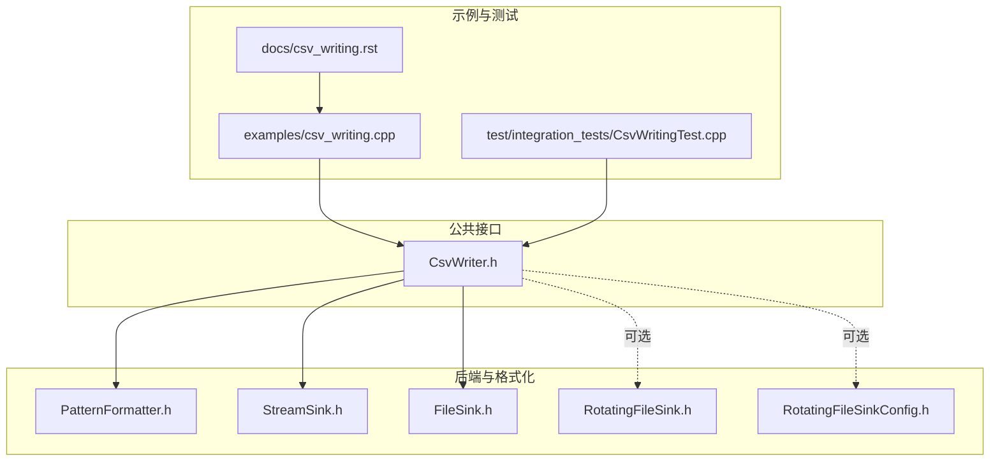
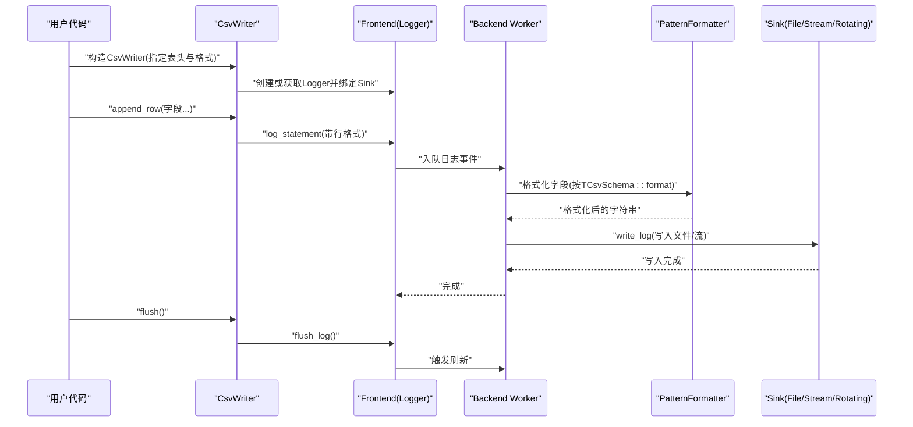
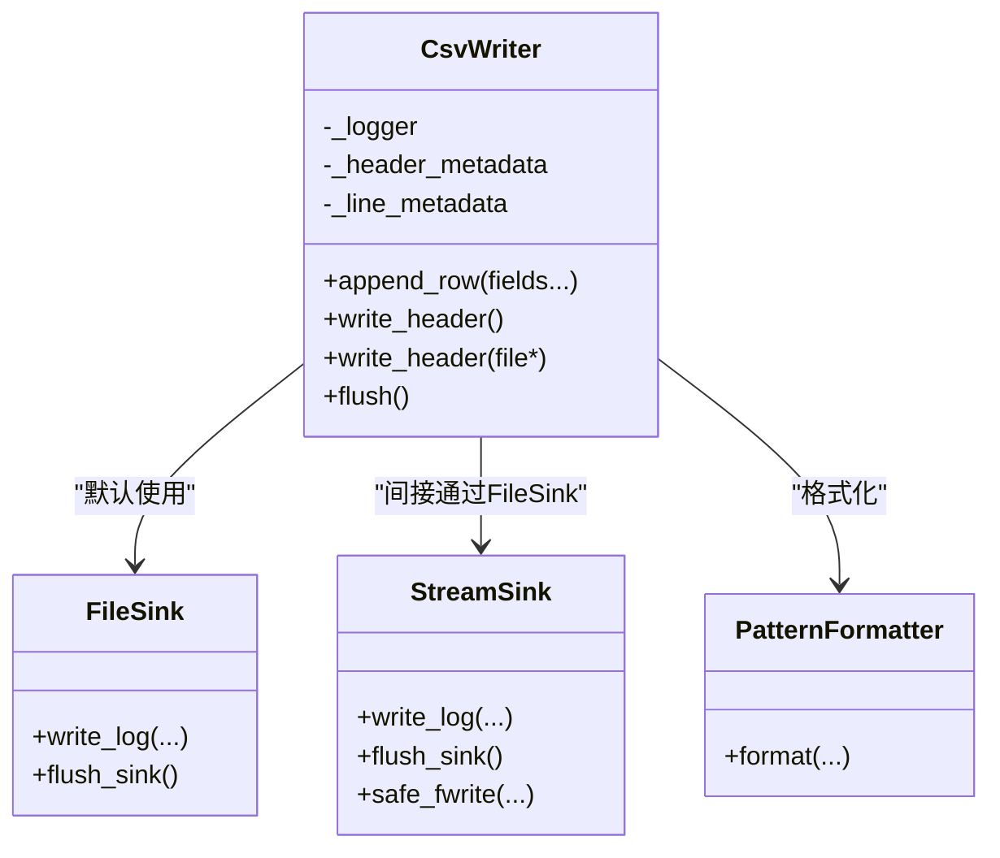
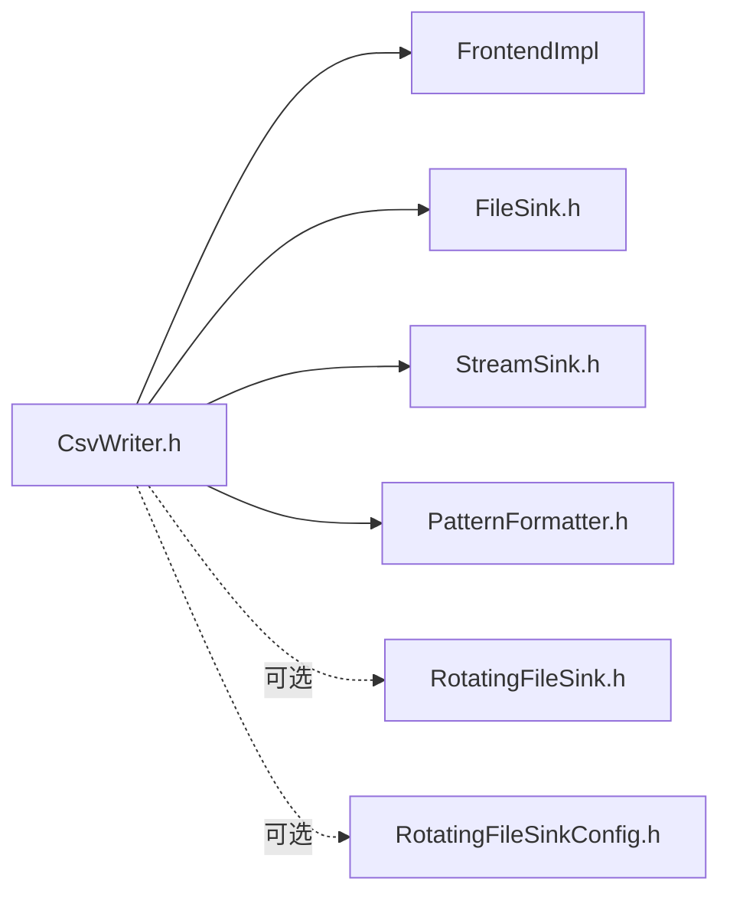

# CSV写入功能

<cite>
**本文引用的文件**
- [CsvWriter.h](file://include/quill/CsvWriter.h)
- [csv_writing.cpp](file://examples/csv_writing.cpp)
- [CsvWritingTest.cpp](file://test/integration_tests/CsvWritingTest.cpp)
- [csv_writing.rst](file://docs/csv_writing.rst)
- [FileSink.h](file://include/quill/sinks/FileSink.h)
- [StreamSink.h](file://include/quill/sinks/StreamSink.h)
- [PatternFormatter.h](file://include/quill/backend/PatternFormatter.h)
- [RotatingFileSink.h](file://include/quill/sinks/RotatingFileSink.h)
- [RotatingFileSinkConfig.h](file://include/quill/sinks/RotatingFileSinkConfig.h)
</cite>

## 目录
1. [简介](#简介)
2. [项目结构](#项目结构)
3. [核心组件](#核心组件)
4. [架构总览](#架构总览)
5. [详细组件分析](#详细组件分析)
6. [依赖关系分析](#依赖关系分析)
7. [性能考虑](#性能考虑)
8. [故障排查指南](#故障排查指南)
9. [结论](#结论)
10. [附录](#附录)

## 简介
本文件面向希望在Quill中使用CSV写入能力的开发者，系统性阐述CsvWriter类的设计与实现原理，覆盖以下主题：
- CSV格式化规则、字段分隔符与换行符处理
- 转义与引号策略（基于底层格式化库）
- 配置选项：表头控制、数据类型处理、编码支持
- 将结构化日志数据转换为CSV格式的方法
- 完整示例：不同场景下的配置与使用
- 性能优化：批量写入与内存管理
- 扩展性：自定义分隔符、引号处理与特殊字符转义

## 项目结构
围绕CSV写入功能的相关文件组织如下：
- 头文件：CsvWriter.h（CSV写入器）、FileSink.h（文件输出）、StreamSink.h（通用流写入）、PatternFormatter.h（格式化引擎）
- 示例与测试：examples/csv_writing.cpp（基础用法）、test/integration_tests/CsvWritingTest.cpp（多场景验证）
- 文档：docs/csv_writing.rst（官方文档）

图表来源
- [CsvWriter.h:1-233](file://include/quill/CsvWriter.h#L1-L233)
- [FileSink.h:1-200](file://include/quill/sinks/FileSink.h#L1-L200)
- [StreamSink.h:1-200](file://include/quill/sinks/StreamSink.h#L1-L200)
- [PatternFormatter.h:1-200](file://include/quill/backend/PatternFormatter.h#L1-L200)
- [csv_writing.cpp:1-33](file://examples/csv_writing.cpp#L1-L33)
- [CsvWritingTest.cpp:1-227](file://test/integration_tests/CsvWritingTest.cpp#L1-L227)
- [csv_writing.rst:1-33](file://docs/csv_writing.rst#L1-L33)

章节来源
- [CsvWriter.h:1-233](file://include/quill/CsvWriter.h#L1-L233)
- [csv_writing.cpp:1-33](file://examples/csv_writing.cpp#L1-L33)
- [CsvWritingTest.cpp:1-227](file://test/integration_tests/CsvWritingTest.cpp#L1-L227)
- [csv_writing.rst:1-33](file://docs/csv_writing.rst#L1-L33)

## 核心组件
- CsvWriter模板类：负责异步CSV写入，通过前端Logger与后端工作线程协作完成格式化与I/O。
- 文件与流式输出：FileSink/StreamSink提供底层文件写入与事件通知；可选RotatingFileSink用于轮转。
- 格式化引擎：PatternFormatter负责将参数按格式字符串进行格式化，最终由Sink写入。

关键点
- 表头与行格式：通过TCsvSchema::header与TCsvSchema::format分别指定CSV首行与每行格式。
- 写入路径：append_row将参数传递给Logger，经PatternFormatter格式化后由Sink写入。
- 头部写入策略：构造时根据打开模式与文件是否存在决定是否写入表头；轮转场景下通过回调在合适时机追加表头。

章节来源
- [CsvWriter.h:44-233](file://include/quill/CsvWriter.h#L44-L233)
- [PatternFormatter.h:79-177](file://include/quill/backend/PatternFormatter.h#L79-L177)
- [StreamSink.h:152-180](file://include/quill/sinks/StreamSink.h#L152-L180)

## 架构总览
CsvWriter的运行时架构如下：

图表来源
- [CsvWriter.h:191-195](file://include/quill/CsvWriter.h#L191-L195)
- [PatternFormatter.h:97-177](file://include/quill/backend/PatternFormatter.h#L97-L177)
- [StreamSink.h:152-180](file://include/quill/sinks/StreamSink.h#L152-L180)

## 详细组件分析

### CsvWriter类设计与实现
- 模板参数
  - TCsvSchema：编译期定义CSV的header与format。
  - TFrontendOptions：前端选项类型，默认使用FrontendOptions。
- 构造函数族
  - 直接以文件名构造：可选择打开模式与文件名追加策略。
  - 使用FileSinkConfig/RotatingFileSinkConfig构造：更精细地控制文件行为。
  - 使用现有Sink或多Sink构造：便于复用已有Sink或同时输出到多个目标。
- 关键成员
  - append_row：线程安全地追加一行CSV。
  - write_header/write_header(FILE*)：写入表头；轮转场景下直接写入文件。
  - flush：阻塞式刷新，确保数据落盘。
- 内部元数据
  - _header_metadata/_line_metadata：分别承载表头与行格式的宏元数据。

图表来源
- [CsvWriter.h:44-233](file://include/quill/CsvWriter.h#L44-L233)
- [FileSink.h:1-200](file://include/quill/sinks/FileSink.h#L1-L200)
- [StreamSink.h:152-180](file://include/quill/sinks/StreamSink.h#L152-L180)
- [PatternFormatter.h:79-177](file://include/quill/backend/PatternFormatter.h#L79-L177)

章节来源
- [CsvWriter.h:44-233](file://include/quill/CsvWriter.h#L44-L233)

### CSV格式化规则与字段分隔符
- 表头与行格式来源于TCsvSchema：
  - header：CSV首行文本。
  - format：每行的格式字符串，遵循底层格式化库语法。
- 字段分隔符与换行符
  - 分隔符由format中的占位符顺序决定；换行符由写入流程自动添加。
- 引号与转义
  - 引号与转义策略由底层格式化库负责；CsvWriter不额外做CSV专用转义，而是依赖格式化库的转义机制。

章节来源
- [CsvWriter.h:34-43](file://include/quill/CsvWriter.h#L34-L43)
- [PatternFormatter.h:97-177](file://include/quill/backend/PatternFormatter.h#L97-L177)

### 配置选项与数据类型处理
- 表头设置
  - 通过TCsvSchema::header控制；构造时根据打开模式与文件存在性决定是否写入。
- 数据类型处理
  - append_row接收可变参数，交由PatternFormatter按format进行格式化；数值、字符串等均按格式串解析。
- 编码支持
  - 底层使用C风格字符串与fwrite写入；建议确保上游数据编码一致，避免跨编码问题。
- 文件名追加与打开模式
  - 支持按日期/时间追加文件名，以及写入/追加模式；追加模式下若文件已存在则跳过表头。

章节来源
- [CsvWriter.h:57-83](file://include/quill/CsvWriter.h#L57-L83)
- [FileSink.h:81-105](file://include/quill/sinks/FileSink.h#L81-L105)
- [FileSink.h:126-133](file://include/quill/sinks/FileSink.h#L126-L133)

### 将结构化日志数据转换为CSV
- 步骤
  - 定义TCsvSchema（header与format）。
  - 创建CsvWriter实例。
  - 调用append_row传入对应字段。
- 复杂数据类型
  - 通过格式化库对复杂类型进行序列化；确保format与字段类型匹配，避免格式化错误。

章节来源
- [csv_writing.cpp:12-32](file://examples/csv_writing.cpp#L12-L32)
- [CsvWritingTest.cpp:10-14](file://test/integration_tests/CsvWritingTest.cpp#L10-L14)

### 完整CSV写入示例
- 基础文件写入
  - 参考示例：[csv_writing.cpp:18-32](file://examples/csv_writing.cpp#L18-L32)
- 多种Sink与配置
  - FileSinkConfig/RotatingFileSinkConfig使用：参考测试用例中对多种场景的覆盖。
  - 多Sink输出：同一CsvWriter同时写入多个文件。
- 输出验证
  - 测试断言CSV内容包含表头与各行数据，验证不同打开模式与轮转场景的行为。

章节来源
- [csv_writing.cpp:18-32](file://examples/csv_writing.cpp#L18-L32)
- [CsvWritingTest.cpp:33-128](file://test/integration_tests/CsvWritingTest.cpp#L33-L128)
- [CsvWritingTest.cpp:135-225](file://test/integration_tests/CsvWritingTest.cpp#L135-L225)

### 轮转与表头写入时机
- 轮转场景
  - 通过FileEventNotifier.after_open回调，在首次旋转时跳过表头，后续旋转再追加表头。
- 刷新策略
  - flush()会阻塞等待后端刷新，确保数据落盘。

章节来源
- [CsvWriter.h:111-142](file://include/quill/CsvWriter.h#L111-L142)
- [CsvWriter.h:209-213](file://include/quill/CsvWriter.h#L209-L213)
- [CsvWriter.h:219](file://include/quill/CsvWriter.h#L219)

## 依赖关系分析
CsvWriter的依赖关系如下：

图表来源
- [CsvWriter.h:9-14](file://include/quill/CsvWriter.h#L9-L14)
- [CsvWriter.h:48](file://include/quill/CsvWriter.h#L48)
- [FileSink.h:1-200](file://include/quill/sinks/FileSink.h#L1-L200)
- [StreamSink.h:1-200](file://include/quill/sinks/StreamSink.h#L1-L200)
- [PatternFormatter.h:1-200](file://include/quill/backend/PatternFormatter.h#L1-L200)

章节来源
- [CsvWriter.h:9-14](file://include/quill/CsvWriter.h#L9-L14)

## 性能考虑
- 异步写入
  - CsvWriter通过后端工作线程执行格式化与I/O，降低调用方开销。
- 缓冲与刷新
  - FileSinkConfig支持自定义写缓冲大小；可通过flush()显式刷新。
- 轮转与fsync
  - 轮转场景下注意fsync策略与最小间隔设置，避免频繁同步导致性能下降。
- 批量写入
  - 在业务侧合并多次append_row调用，减少后端事件数量。

章节来源
- [FileSink.h:146-149](file://include/quill/sinks/FileSink.h#L146-L149)
- [FileSink.h:170-173](file://include/quill/sinks/FileSink.h#L170-L173)
- [CsvWriter.h:219](file://include/quill/CsvWriter.h#L219)

## 故障排查指南
- 表头未出现
  - 检查打开模式与文件是否存在；追加模式且文件已存在时不会写入表头。
- 轮转后表头缺失
  - 确认after_open回调逻辑正确，仅在非首次旋转时追加表头。
- 内容异常或乱码
  - 确保上游数据编码一致；检查format与字段类型匹配。
- 刷新不生效
  - 显式调用flush()，确认后端线程正常运行。

章节来源
- [CsvWriter.h:62-65](file://include/quill/CsvWriter.h#L62-L65)
- [CsvWriter.h:115-130](file://include/quill/CsvWriter.h#L115-L130)
- [CsvWritingTest.cpp:135-142](file://test/integration_tests/CsvWritingTest.cpp#L135-L142)

## 结论
CsvWriter通过模板化表头与格式定义、结合PatternFormatter与Sink体系，提供了高性能、易扩展的CSV写入能力。其异步特性与灵活的Sink配置使其适用于多种场景，从单文件到轮转与多Sink输出均可满足。在实际使用中，应关注表头写入时机、格式化规则与刷新策略，以获得稳定可靠的CSV输出。

## 附录
- 相关文档与示例
  - 官方文档：[csv_writing.rst:1-33](file://docs/csv_writing.rst#L1-L33)
  - 示例程序：[csv_writing.cpp:1-33](file://examples/csv_writing.cpp#L1-L33)
  - 集成测试：[CsvWritingTest.cpp:1-227](file://test/integration_tests/CsvWritingTest.cpp#L1-L227)