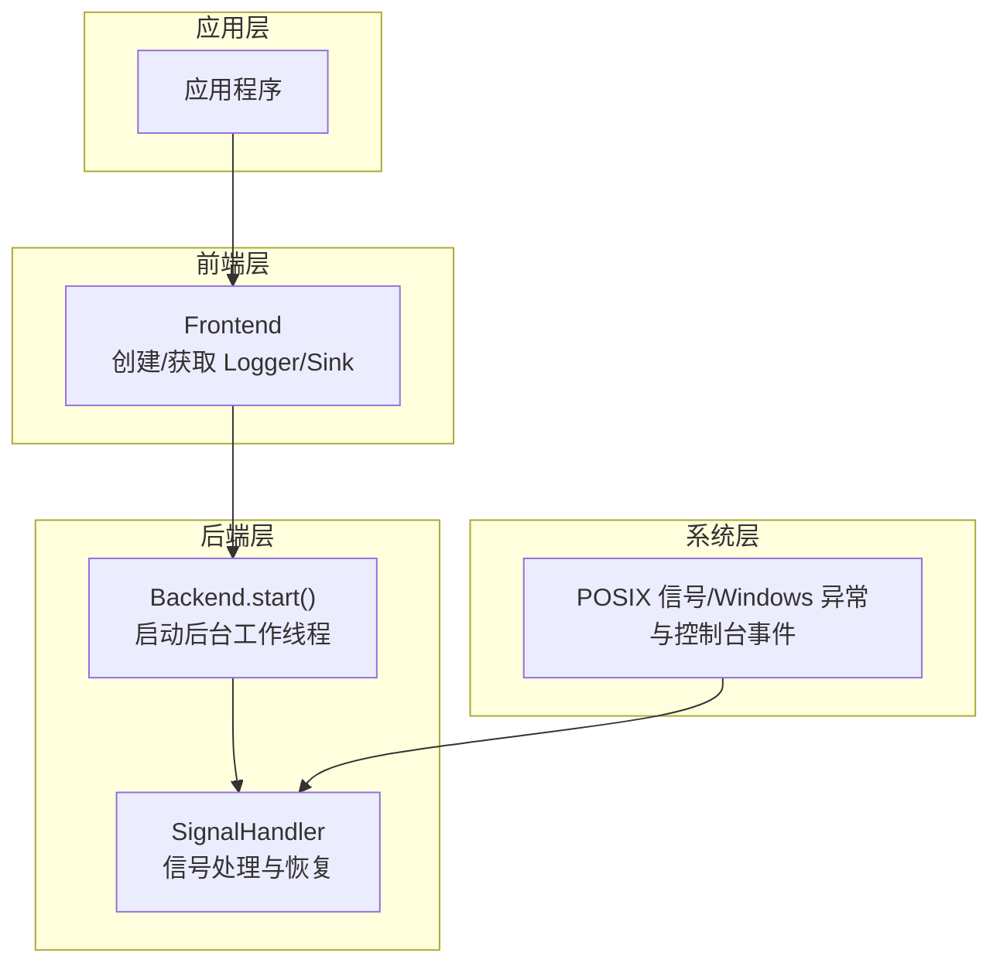
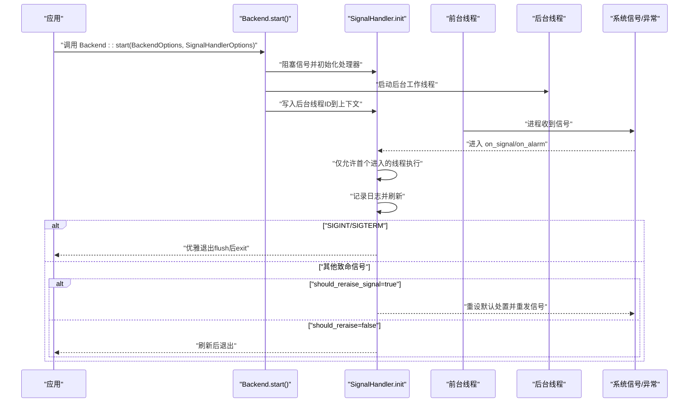
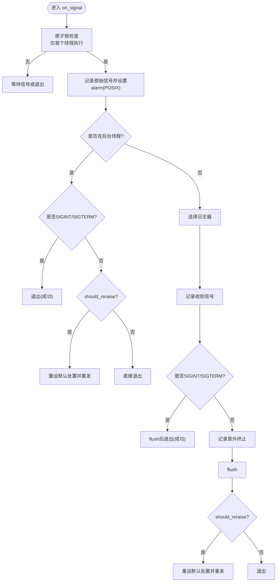
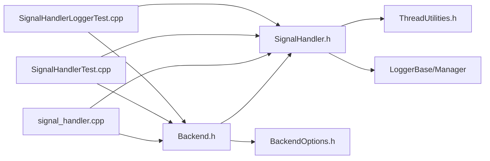

# 信号处理机制

<cite>
**本文引用的文件**
- [SignalHandler.h](file://include/quill/backend/SignalHandler.h)
- [Backend.h](file://include/quill/Backend.h)
- [BackendOptions.h](file://include/quill/backend/BackendOptions.h)
- [ThreadUtilities.h](file://include/quill/backend/ThreadUtilities.h)
- [signal_handler.cpp](file://examples/signal_handler.cpp)
- [SignalHandlerTest.cpp](file://test/integration_tests/SignalHandlerTest.cpp)
- [SignalHandlerLoggerTest.cpp](file://test/integration_tests/SignalHandlerLoggerTest.cpp)
</cite>

## 目录
1. [简介](#简介)
2. [项目结构与定位](#项目结构与定位)
3. [核心组件](#核心组件)
4. [架构总览](#架构总览)
5. [详细组件分析](#详细组件分析)
6. [依赖关系分析](#依赖关系分析)
7. [性能考量](#性能考量)
8. [故障排除指南](#故障排除指南)
9. [结论](#结论)
10. [附录：配置与使用示例](#附录配置与使用示例)

## 简介
本文件系统化阐述 Quill 的信号处理机制，重点围绕 SignalHandler 类的实现原理，覆盖信号捕获、处理与恢复流程、支持的信号类型、优雅关闭过程、多线程环境注意事项、与其他信号处理器的兼容性，以及故障排除与最佳实践。目标是帮助开发者在生产环境中安全、可靠地集成并使用 Quill 的内置信号处理能力。

## 项目结构与定位
- 信号处理核心位于后端模块，对外通过 Backend 启动接口暴露配置入口，并在启动过程中初始化信号处理器。
- 示例与测试分别演示了跨平台（Linux/macOS/Windows）的信号处理行为与验证策略。

图表来源
- [Backend.h:86-119](file://include/quill/Backend.h#L86-L119)
- [SignalHandler.h:391-488](file://include/quill/backend/SignalHandler.h#L391-L488)

章节来源
- [Backend.h:86-119](file://include/quill/Backend.h#L86-L119)
- [SignalHandler.h:391-488](file://include/quill/backend/SignalHandler.h#L391-L488)

## 核心组件
- SignalHandlerOptions：用于配置信号处理器的行为，包括可捕获信号列表、超时秒数、日志器名称、排除子串等。
- SignalHandlerContext：单例上下文，保存当前注册的信号、日志器选择策略、超时秒数、是否重发信号、后台线程 ID 等状态。
- on_signal/on_alarm：信号回调函数，负责记录日志、刷新缓冲、必要时重发信号或直接退出。
- init_signal_handler/deinit_signal_handler：安装/卸载信号处理器；Windows 下还包含异常与控制台事件处理器。
- Backend.start/stop：在启动时阻塞信号、初始化处理器并在停止时恢复默认处置并清理。

章节来源
- [SignalHandler.h:48-88](file://include/quill/backend/SignalHandler.h#L48-L88)
- [SignalHandler.h:93-138](file://include/quill/backend/SignalHandler.h#L93-L138)
- [SignalHandler.h:153-248](file://include/quill/backend/SignalHandler.h#L153-L248)
- [SignalHandler.h:391-488](file://include/quill/backend/SignalHandler.h#L391-L488)
- [Backend.h:86-144](file://include/quill/Backend.h#L86-L144)

## 架构总览
下图展示从应用启动到信号触发再到优雅关闭的整体流程，包括后台线程 ID 检测、日志器选择、刷新与退出路径。

图表来源
- [Backend.h:86-119](file://include/quill/Backend.h#L86-L119)
- [SignalHandler.h:153-248](file://include/quill/backend/SignalHandler.h#L153-L248)
- [SignalHandler.h:442-484](file://include/quill/backend/SignalHandler.h#L442-L484)

## 详细组件分析

### SignalHandlerOptions 与 SignalHandlerContext
- SignalHandlerOptions
  - catchable_signals：默认包含 SIGTERM、SIGINT、SIGABRT、SIGFPE、SIGILL、SIGSEGV。
  - timeout_seconds：Linux/macOS 上用于 alarm 超时保护，默认 20 秒。
  - logger_name：指定信号处理器使用的日志器名称；为空则自动选择第一个有效日志器且排除包含特定子串的日志器。
  - excluded_logger_substrings：默认排除包含 "__csv__" 的日志器，避免将崩溃信息写入非标准格式。
- SignalHandlerContext
  - 单例，保存已注册信号列表、日志器选择策略、超时秒数、是否重发信号、后台线程 ID、互斥锁等。
  - get_logger()：优先按 logger_name 获取，否则自动遍历并排除子串后选择第一个有效日志器。

章节来源
- [SignalHandler.h:48-88](file://include/quill/backend/SignalHandler.h#L48-L88)
- [SignalHandler.h:93-138](file://include/quill/backend/SignalHandler.h#L93-L138)

### 信号捕获与处理流程（on_signal）
- 并发保护：使用原子计数器确保仅首个进入的线程执行处理逻辑；其他线程在 Windows 上睡眠，在 POSIX 上 pause。
- 超时保护（POSIX）：记录原始信号号并设置 alarm，若超时未完成则重发原信号，防止死锁或挂起。
- 后台线程检测：若在后台线程中被触发，对 SIGINT/SIGTERM 直接退出；否则根据 should_reraise_signal 决定是否重发。
- 前台线程处理：记录“收到信号”日志；对 SIGINT/SIGTERM 执行 flush 后退出；否则记录“意外终止”并刷新后重发信号。

图表来源
- [SignalHandler.h:153-248](file://include/quill/backend/SignalHandler.h#L153-L248)

章节来源
- [SignalHandler.h:153-248](file://include/quill/backend/SignalHandler.h#L153-L248)

### Windows 特殊处理（异常与控制台事件）
- 控制台事件：当在前台线程收到 CTRL+C 或 CTRL+BREAK 时，记录中断日志并 flush 后退出。
- 未处理异常：记录异常代码与描述，最后返回继续搜索（若无其他处理器会最终退出）。

章节来源
- [SignalHandler.h:308-384](file://include/quill/backend/SignalHandler.h#L308-L384)

### 初始化与反初始化（init/deinit）
- init_signal_handler：
  - Linux/macOS：安装 catchable_signals 的处理器，并注册 SIGALRM 处理器；将 SIGALRM 加入已注册列表。
  - Windows：安装异常过滤器与控制台事件处理器。
- deinit_signal_handler：
  - 将所有已注册信号重置为默认处置并清空列表。

章节来源
- [SignalHandler.h:391-488](file://include/quill/backend/SignalHandler.h#L391-L488)

### 后台线程与信号掩码
- Backend.start 在 Linux/macOS 上先阻塞所有信号，再启动后台线程，使后台线程继承阻塞掩码；随后在主线程解除阻塞，避免后续前台线程继承阻塞。
- Backend.stop 会将后台线程 ID 清零并调用 deinit_signal_handler，恢复默认处置。

章节来源
- [Backend.h:86-119](file://include/quill/Backend.h#L86-L119)
- [Backend.h:139-144](file://include/quill/Backend.h#L139-L144)

### 支持的信号类型
- 默认捕获：SIGTERM、SIGINT、SIGABRT、SIGFPE、SIGILL、SIGSEGV。
- Windows：由异常与控制台事件处理替代，对应非法指令、访问违例、栈溢出等。
- 注意：SIGALRM 不允许加入 catchable_signals，因为内部已专门处理。

章节来源
- [SignalHandler.h:56-56](file://include/quill/backend/SignalHandler.h#L56-L56)
- [SignalHandler.h:452-455](file://include/quill/backend/SignalHandler.h#L452-L455)

### 优雅关闭过程
- SIGINT/SIGTERM：前台线程记录日志并 flush 后直接退出；后台线程中收到同样路径。
- 其他致命信号：若 should_reraise_signal 为真，则记录“意外终止”并 flush 后重发原信号；否则仅 flush 后退出。
- Backend.stop：清理后台线程 ID、停止后台线程并反初始化信号处理器。

章节来源
- [SignalHandler.h:192-247](file://include/quill/backend/SignalHandler.h#L192-L247)
- [Backend.h:139-144](file://include/quill/Backend.h#L139-L144)

### 多线程环境注意事项
- 首个进入的线程独占处理：通过原子计数器保证并发安全。
- Windows 每线程需安装信号处理器：示例注释明确要求在每个新线程安装。
- 后台线程 ID 检测：避免在后台线程中重复记录或错误处理。
- 线程 ID 获取：统一通过 ThreadUtilities 提供的 get_thread_id 接口。

章节来源
- [SignalHandler.h:157-171](file://include/quill/backend/SignalHandler.h#L157-L171)
- [SignalHandler.h:184-187](file://include/quill/backend/SignalHandler.h#L184-L187)
- [ThreadUtilities.h:198-226](file://include/quill/backend/ThreadUtilities.h#L198-L226)
- [signal_handler.cpp:46-68](file://examples/signal_handler.cpp#L46-L68)

### 与其他信号处理器的兼容性
- 启用内置信号处理器会覆盖进程级信号处理器；如需保留用户自定义处理器，请谨慎配置 catchable_signals 或在应用层面自行管理。
- 测试用例展示了禁用重发信号以保持进程运行并验证日志落盘的行为。

章节来源
- [Backend.h:65-66](file://include/quill/Backend.h#L65-L66)
- [SignalHandlerTest.cpp:42-42](file://test/integration_tests/SignalHandlerTest.cpp#L42-L42)

## 依赖关系分析
- SignalHandler 依赖：
  - LoggerBase/LoggerManager：用于选择与写入日志。
  - ThreadUtilities：获取线程 ID。
  - 标准信号 API：std::signal、std::raise、alarm/pause、sigaction/sigprocmask。
- Backend 与 SignalHandler：
  - Backend.start 在 Linux/macOS 上阻塞信号并初始化处理器；在 Windows 上安装异常与控制台事件处理器。
  - Backend.stop 反初始化处理器并停止后台线程。

图表来源
- [SignalHandler.h:9-26](file://include/quill/backend/SignalHandler.h#L9-L26)
- [Backend.h:86-119](file://include/quill/Backend.h#L86-L119)
- [BackendOptions.h:30-281](file://include/quill/backend/BackendOptions.h#L30-L281)
- [signal_handler.cpp:1-90](file://examples/signal_handler.cpp#L1-L90)
- [SignalHandlerTest.cpp:1-141](file://test/integration_tests/SignalHandlerTest.cpp#L1-L141)
- [SignalHandlerLoggerTest.cpp:1-109](file://test/integration_tests/SignalHandlerLoggerTest.cpp#L1-L109)

章节来源
- [SignalHandler.h:9-26](file://include/quill/backend/SignalHandler.h#L9-L26)
- [Backend.h:86-119](file://include/quill/Backend.h#L86-L119)
- [BackendOptions.h:30-281](file://include/quill/backend/BackendOptions.h#L30-L281)

## 性能考量
- alarm 超时保护：在 POSIX 平台上避免长时间卡死，但会引入一次额外的信号往返。
- 原子锁与互斥：仅在首次进入时加锁，其余线程快速让路，降低竞争开销。
- flush 次数：仅在关键路径（SIGINT/SIGTERM 或致命信号）进行 flush，减少频繁 IO。
- 后台线程 ID 缓存：避免每次处理都做昂贵查询。

[本节为通用指导，不直接分析具体文件]

## 故障排除指南
- 日志未落盘或丢失
  - 确认在前台线程中收到信号时会 flush；若后台线程中触发，也会在后台线程中退出前 flush。
  - 检查 should_reraise_signal 是否为 false 导致进程提前退出。
- Windows 控制台事件无效
  - 确保在每个新线程调用 init_signal_handler；示例中已明确标注。
- 自定义日志器未被选中
  - 检查 logger_name 是否存在；若不存在将回退到自动选择并排除包含 "__csv__" 的日志器。
- 信号未被捕获
  - 确认 Backend::start 已传入 SignalHandlerOptions；确认 catchable_signals 包含目标信号。
  - 注意 SIGALRM 不可加入 catchable_signals。
- 多线程并发问题
  - 确保仅首个进入的线程执行处理逻辑；其他线程会等待或休眠，避免竞态。

章节来源
- [SignalHandlerLoggerTest.cpp:34-38](file://test/integration_tests/SignalHandlerLoggerTest.cpp#L34-L38)
- [signal_handler.cpp:46-68](file://examples/signal_handler.cpp#L46-L68)
- [SignalHandler.h:452-455](file://include/quill/backend/SignalHandler.h#L452-L455)

## 结论
Quill 的信号处理机制通过统一的 SignalHandlerOptions 与 SignalHandlerContext 实现了跨平台的一致行为：在前台线程中记录并刷新日志，在后台线程中优雅退出；在 POSIX 平台上通过 alarm 保障不会无限期挂起；在 Windows 平台上通过异常与控制台事件处理器提供等价能力。配合 Backend.start/stop 的信号掩码与线程 ID 管理，能够在多线程环境下安全、可靠地处理各类致命信号，确保日志完整落盘与资源清理。

[本节为总结性内容，不直接分析具体文件]

## 附录：配置与使用示例

### 基本配置步骤
- 创建 BackendOptions 与 SignalHandlerOptions，设置 catchable_signals、timeout_seconds、logger_name、excluded_logger_substrings。
- 调用 Backend::start 启动后台线程并初始化信号处理器。
- 在每个新线程（Windows）调用 init_signal_handler 安装处理器。
- 在应用退出时调用 Backend::stop，确保恢复默认处置并清理。

章节来源
- [Backend.h:86-119](file://include/quill/Backend.h#L86-L119)
- [Backend.h:139-144](file://include/quill/Backend.h#L139-L144)
- [signal_handler.cpp:43-90](file://examples/signal_handler.cpp#L43-L90)

### 自定义信号处理器与信号掩码设置
- 自定义信号处理器：通过 SignalHandlerOptions.catchable_signals 指定需要捕获的信号集合；注意 SIGALRM 不可加入。
- 信号掩码：Backend.start 在 Linux/macOS 上会阻塞所有信号，后台线程继承掩码，主线程随后解除阻塞，避免前台线程继承阻塞。

章节来源
- [SignalHandler.h:452-455](file://include/quill/backend/SignalHandler.h#L452-L455)
- [Backend.h:86-119](file://include/quill/Backend.h#L86-L119)

### 优雅关闭与日志落盘验证
- SIGINT/SIGTERM：记录日志并 flush 后退出。
- 致命信号：记录“意外终止”并 flush 后重发或直接退出，取决于 should_reraise_signal。
- 测试用例展示了禁用重发信号以验证日志落盘与自动选择日志器的行为。

章节来源
- [SignalHandlerTest.cpp:36-93](file://test/integration_tests/SignalHandlerTest.cpp#L36-L93)
- [SignalHandlerLoggerTest.cpp:34-76](file://test/integration_tests/SignalHandlerLoggerTest.cpp#L34-L76)