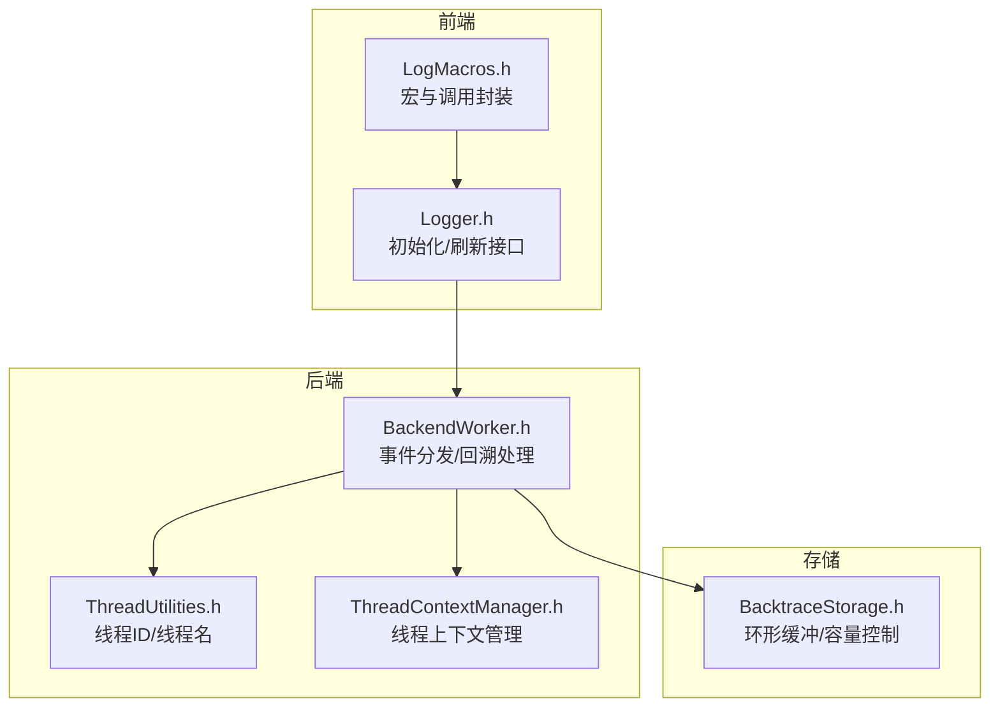
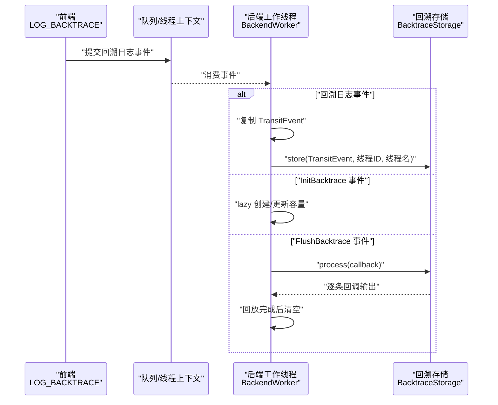
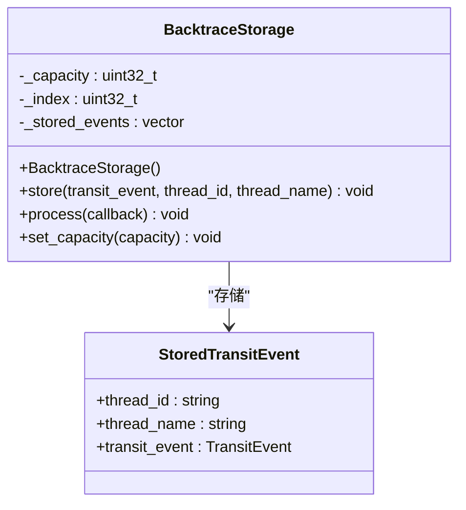
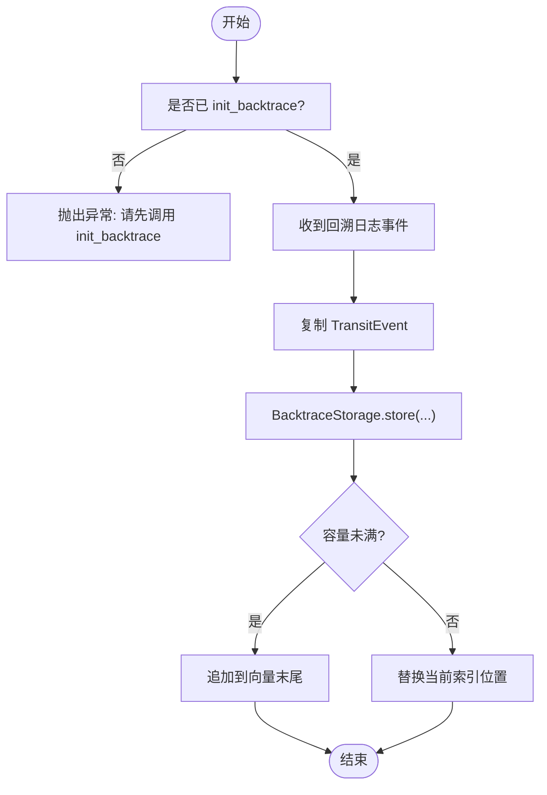
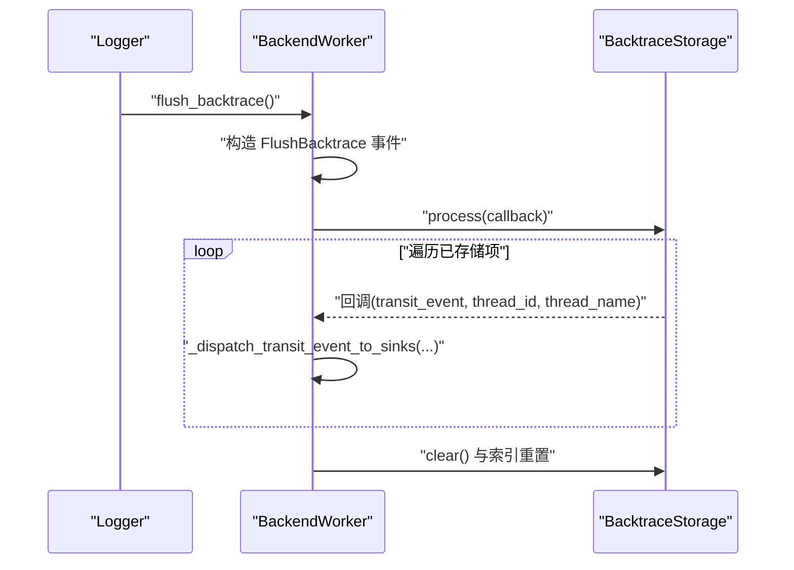
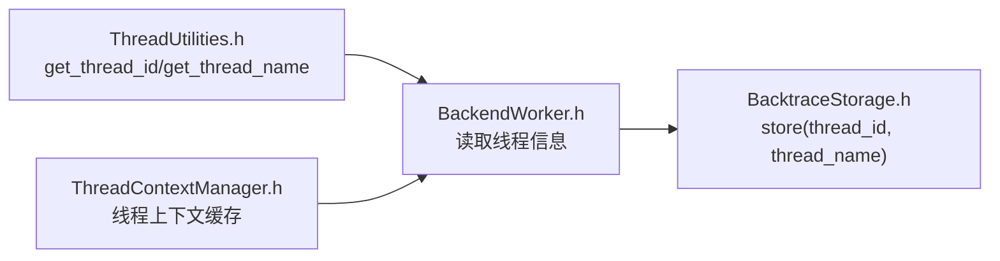
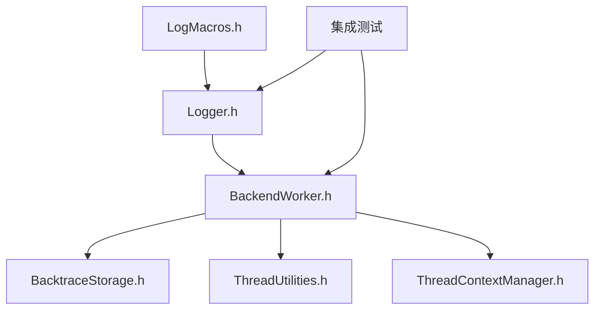

# 回溯日志功能

<cite>
**本文引用的文件**
- [BacktraceStorage.h](file://include/quill/backend/BacktraceStorage.h)
- [BackendWorker.h](file://include/quill/backend/BackendWorker.h)
- [Logger.h](file://include/quill/Logger.h)
- [LogMacros.h](file://include/quill/LogMacros.h)
- [backtrace_logging.cpp](file://examples/backtrace_logging.cpp)
- [ThreadUtilities.h](file://include/quill/backend/ThreadUtilities.h)
- [ThreadContextManager.h](file://include/quill/core/ThreadContextManager.h)
- [BacktraceDynamicLogLevelTest.cpp](file://test/integration_tests/BacktraceDynamicLogLevelTest.cpp)
- [BacktraceFlushOnErrorTest.cpp](file://test/integration_tests/BacktraceFlushOnErrorTest.cpp)
- [BacktraceManualFlushTest.cpp](file://test/integration_tests/BacktraceManualFlushTest.cpp)
</cite>

## 目录
1. [简介](#简介)
2. [项目结构](#项目结构)
3. [核心组件](#核心组件)
4. [架构总览](#架构总览)
5. [组件详解](#组件详解)
6. [依赖关系分析](#依赖关系分析)
7. [性能考量](#性能考量)
8. [故障排查指南](#故障排查指南)
9. [结论](#结论)
10. [附录：使用示例与最佳实践](#附录使用示例与最佳实践)

## 简介
本文件系统性阐述 Quill 的回溯日志（Backtrace Logging）功能，重点围绕 BacktraceStorage 类的实现原理展开，包括其环形缓冲区机制、内存管理策略与容量限制；详细说明回溯日志的触发条件、存储机制与恢复流程；介绍如何配置容量、设置触发条件以及处理存储的事件；提供完整使用示例以覆盖不同场景；解释在多线程环境中的交互模式（线程ID与线程名的采集与传递）；最后给出性能与内存优化建议。

## 项目结构
回溯日志功能涉及前端宏、后端工作线程、回溯存储器以及线程上下文工具等模块。核心路径如下：
- 前端宏与日志接口：LogMacros.h、Logger.h
- 后端处理与调度：BackendWorker.h
- 回溯存储器：BacktraceStorage.h
- 线程信息工具：ThreadUtilities.h、ThreadContextManager.h
- 示例与测试：examples/backtrace_logging.cpp、integration tests

**图示来源**
- [LogMacros.h:363-371](file://include/quill/LogMacros.h#L363-L371)
- [Logger.h:269-284](file://include/quill/Logger.h#L269-L284)
- [BackendWorker.h:893-939](file://include/quill/backend/BackendWorker.h#L893-L939)
- [ThreadUtilities.h:148-188](file://include/quill/backend/ThreadUtilities.h#L148-L188)
- [ThreadContextManager.h:53-97](file://include/quill/core/ThreadContextManager.h#L53-L97)
- [BacktraceStorage.h:28-124](file://include/quill/backend/BacktraceStorage.h#L28-L124)

**章节来源**
- [LogMacros.h:1-200](file://include/quill/LogMacros.h#L1-L200)
- [Logger.h:269-300](file://include/quill/Logger.h#L269-L300)
- [BackendWorker.h:893-939](file://include/quill/backend/BackendWorker.h#L893-L939)
- [BacktraceStorage.h:28-124](file://include/quill/backend/BacktraceStorage.h#L28-L124)
- [ThreadUtilities.h:148-188](file://include/quill/backend/ThreadUtilities.h#L148-L188)
- [ThreadContextManager.h:53-97](file://include/quill/core/ThreadContextManager.h#L53-L97)

## 核心组件
- BacktraceStorage：按每个 Logger 维护一个固定容量的环形缓冲区，用于暂存回溯日志消息，支持设置容量、追加存储与顺序遍历输出。
- Logger 接口：提供 init_backtrace 与 flush_backtrace 两个关键方法，分别用于启用回溯存储与手动触发回放。
- BackendWorker：负责接收前端事件，识别回溯事件并写入 BacktraceStorage；同时处理 InitBacktrace/FlushBacktrace 事件，驱动回放与清理。
- 线程信息：通过 ThreadUtilities 提供线程ID与线程名的采集能力，并由 BackendWorker 在存储时传入。

**章节来源**
- [BacktraceStorage.h:28-124](file://include/quill/backend/BacktraceStorage.h#L28-L124)
- [Logger.h:269-300](file://include/quill/Logger.h#L269-L300)
- [BackendWorker.h:893-939](file://include/quill/backend/BackendWorker.h#L893-L939)
- [ThreadUtilities.h:148-188](file://include/quill/backend/ThreadUtilities.h#L148-L188)

## 架构总览
回溯日志的端到端流程如下：
- 前端：通过 LOG_BACKTRACE 宏生成回溯日志事件，经队列投递至后端。
- 后端：BackendWorker 检测事件类型，若为回溯日志则复制 TransitEvent 并写入 BacktraceStorage；若为 InitBacktrace 则创建或更新 BacktraceStorage 容量；若为 FlushBacktrace 则遍历并回放所有已存储事件。
- 存储：BacktraceStorage 使用 vector 实现环形缓冲，记录每次存储时的线程ID与线程名，保证回放时能正确标识来源。

**图示来源**
- [LogMacros.h:363-371](file://include/quill/LogMacros.h#L363-L371)
- [BackendWorker.h:893-939](file://include/quill/backend/BackendWorker.h#L893-L939)
- [BacktraceStorage.h:34-87](file://include/quill/backend/BacktraceStorage.h#L34-L87)

## 组件详解

### BacktraceStorage 类
- 角色与职责
  - 为每个 Logger 维持最多 N 条回溯消息的环形缓冲区。
  - 仅由后端工作线程访问，避免并发竞争。
- 数据结构
  - 内部使用 vector 存储“已存储的 TransitEvent + 对应线程ID/线程名”。
  - 使用 _index 作为写入位置的环形索引，_capacity 控制上限。
- 关键方法
  - store：当容量未达上限时直接追加；否则替换当前索引位置并循环前进。
  - process：从当前索引开始顺序遍历所有已存储项，回调输出，随后清空容器并重置索引。
  - set_capacity：动态调整容量，必要时重新分配并清空历史数据。
- 复杂度
  - 存储：O(1) 均摊（emplace_back 或覆盖写入）
  - 回放：O(N)，N 为已存储数量
  - 清理：O(1) 清空与重置

**图示来源**
- [BacktraceStorage.h:28-124](file://include/quill/backend/BacktraceStorage.h#L28-L124)

**章节来源**
- [BacktraceStorage.h:28-124](file://include/quill/backend/BacktraceStorage.h#L28-L124)

### 触发条件与存储机制
- 触发条件
  - 显式调用 init_backtrace(max_capacity, flush_level) 启用回溯存储，并设定“达到某严重级别即自动刷新”的阈值。
  - 调用 flush_backtrace() 手动触发回放。
- 存储机制
  - 后端在收到回溯日志事件时，先复制一份 TransitEvent（避免复用导致的数据竞争），再调用 BacktraceStorage::store 写入。
  - 存储时附带当前线程ID与线程名，确保回放时可识别来源。
- 自动刷新
  - 当 flush_level 非 None 且后续日志达到该级别及以上时，后端会自动触发回放。

**图示来源**
- [BackendWorker.h:893-916](file://include/quill/backend/BackendWorker.h#L893-L916)
- [BacktraceStorage.h:34-58](file://include/quill/backend/BacktraceStorage.h#L34-L58)

**章节来源**
- [Logger.h:269-284](file://include/quill/Logger.h#L269-L284)
- [BackendWorker.h:893-916](file://include/quill/backend/BackendWorker.h#L893-L916)
- [BacktraceStorage.h:34-58](file://include/quill/backend/BacktraceStorage.h#L34-L58)

### 恢复与回放流程
- 触发方式
  - 手动：调用 flush_backtrace()，后端收到 FlushBacktrace 事件后调用 BacktraceStorage::process。
  - 自动：当后续日志级别达到 flush_level 时，后端同样触发回放。
- 回放过程
  - BacktraceStorage::process 从当前索引开始顺序遍历，逐条回调输出，最后清空容器并重置索引。
  - 输出时携带原始线程ID与线程名，便于定位。

**图示来源**
- [Logger.h:289-300](file://include/quill/Logger.h#L289-L300)
- [BackendWorker.h:930-939](file://include/quill/backend/BackendWorker.h#L930-L939)
- [BacktraceStorage.h:61-87](file://include/quill/backend/BacktraceStorage.h#L61-L87)

**章节来源**
- [Logger.h:289-300](file://include/quill/Logger.h#L289-L300)
- [BackendWorker.h:930-939](file://include/quill/backend/BackendWorker.h#L930-L939)
- [BacktraceStorage.h:61-87](file://include/quill/backend/BacktraceStorage.h#L61-L87)

### 多线程交互与线程标识
- 线程ID与线程名采集
  - 通过 ThreadUtilities::get_thread_id 与 ThreadUtilities::get_thread_name 获取当前线程的 OS 线程ID与线程名。
- 传递与存储
  - BackendWorker 在存储回溯事件时，将线程ID与线程名一并传入 BacktraceStorage::store。
- 线程上下文
  - ThreadContextManager 管理线程上下文集合，支持新增、失效标记与清理，确保后端能正确识别线程生命周期。

**图示来源**
- [ThreadUtilities.h:148-188](file://include/quill/backend/ThreadUtilities.h#L148-L188)
- [BackendWorker.h:893-916](file://include/quill/backend/BackendWorker.h#L893-L916)
- [BacktraceStorage.h:34-58](file://include/quill/backend/BacktraceStorage.h#L34-L58)
- [ThreadContextManager.h:53-97](file://include/quill/core/ThreadContextManager.h#L53-L97)

**章节来源**
- [ThreadUtilities.h:148-188](file://include/quill/backend/ThreadUtilities.h#L148-L188)
- [BackendWorker.h:893-916](file://include/quill/backend/BackendWorker.h#L893-L916)
- [ThreadContextManager.h:53-97](file://include/quill/core/ThreadContextManager.h#L53-L97)

### 配置与使用要点
- 初始化容量与刷新策略
  - init_backtrace(max_capacity, flush_level)：设置最大容量与达到某级别自动刷新。
  - flush_backtrace()：手动触发回放。
- 前端宏
  - LOG_BACKTRACE(...)：生成回溯日志事件。
- 示例参考
  - examples/backtrace_logging.cpp 展示了典型启用、自动刷新与手动刷新的场景。

**章节来源**
- [Logger.h:269-300](file://include/quill/Logger.h#L269-L300)
- [LogMacros.h:363-371](file://include/quill/LogMacros.h#L363-L371)
- [backtrace_logging.cpp:25-54](file://examples/backtrace_logging.cpp#L25-L54)

## 依赖关系分析
- Logger 依赖 Frontend 队列与 BackendWorker，通过事件类型区分回溯初始化、回放与普通日志。
- BackendWorker 依赖 ThreadUtilities 与 ThreadContextManager 获取线程信息与上下文状态。
- BacktraceStorage 仅被 BackendWorker 使用，避免跨线程竞争。
- 测试用例覆盖动态日志级别、错误级别触发刷新与手动刷新等场景。

**图示来源**
- [Logger.h:269-300](file://include/quill/Logger.h#L269-L300)
- [BackendWorker.h:893-939](file://include/quill/backend/BackendWorker.h#L893-L939)
- [BacktraceStorage.h:28-124](file://include/quill/backend/BacktraceStorage.h#L28-L124)
- [ThreadUtilities.h:148-188](file://include/quill/backend/ThreadUtilities.h#L148-L188)
- [ThreadContextManager.h:53-97](file://include/quill/core/ThreadContextManager.h#L53-L97)

**章节来源**
- [Logger.h:269-300](file://include/quill/Logger.h#L269-L300)
- [BackendWorker.h:893-939](file://include/quill/backend/BackendWorker.h#L893-L939)
- [BacktraceStorage.h:28-124](file://include/quill/backend/BacktraceStorage.h#L28-L124)
- [ThreadUtilities.h:148-188](file://include/quill/backend/ThreadUtilities.h#L148-L188)
- [ThreadContextManager.h:53-97](file://include/quill/core/ThreadContextManager.h#L53-L97)

## 性能考量
- 存储成本
  - store 为 O(1)，但 vector 可能发生扩容（均摊 O(1)）；容量固定后无扩容开销。
- 回放成本
  - process 为 O(N)，N 为已存储数量；建议合理设置 max_capacity，避免过长回放链。
- 内存占用
  - 每条回溯消息包含一份 TransitEvent 的拷贝与线程标识字符串，容量越大内存占用越高。
- 线程安全
  - BacktraceStorage 仅由后端线程访问，避免锁竞争；但需确保 init_backtrace 与 LOG_BACKTRACE 的调用顺序正确。
- 缓冲区容量与队列策略
  - 若使用有界队列，Frontend 在空间不足时可能丢弃或阻塞；回溯初始化与刷新事件采用不丢弃策略，确保回溯功能可用。

[本节为通用性能讨论，无需列出具体文件来源]

## 故障排查指南
- 症状：使用 LOG_BACKTRACE 前未调用 init_backtrace
  - 现象：后端抛出异常，提示需先调用 init_backtrace。
  - 处理：在首次使用 LOG_BACKTRACE 前调用 init_backtrace。
- 症状：flush_backtrace 无效
  - 现象：调用后未见回溯消息输出。
  - 处理：确认已调用 init_backtrace；检查 flush_level 设置是否与后续日志级别匹配；或直接调用 flush_backtrace。
- 症状：回溯消息过多导致回放耗时
  - 现象：process 遍历时耗时较长。
  - 处理：降低 max_capacity；或在高负载场景下减少回溯日志频率。
- 症状：线程名/线程ID显示为空
  - 现象：回放时线程标识缺失。
  - 处理：确认 ThreadUtilities 能正常获取线程名与ID；检查平台支持情况。

**章节来源**
- [BackendWorker.h:912-915](file://include/quill/backend/BackendWorker.h#L912-L915)
- [Logger.h:289-300](file://include/quill/Logger.h#L289-L300)
- [ThreadUtilities.h:148-188](file://include/quill/backend/ThreadUtilities.h#L148-L188)

## 结论
BacktraceStorage 通过固定容量的环形缓冲区与后端单线程访问模型，提供了高效、可控的回溯日志能力。结合 Logger 的 init_backtrace 与 flush_backtrace 接口，用户可在多种场景下灵活启用与触发回放。配合线程ID/线程名的采集与传递，回溯日志具备良好的可追溯性。在实际应用中，应根据业务负载合理设置容量与刷新策略，以平衡可观测性与性能。

[本节为总结性内容，无需列出具体文件来源]

## 附录：使用示例与最佳实践

### 示例一：启用回溯并在错误级别自动刷新
- 步骤
  - 启动后端线程
  - 创建 ConsoleSink 与 Logger
  - 调用 init_backtrace(max_capacity, LogLevel::Error)
  - 连续记录若干 LOG_BACKTRACE 日志
  - 记录一条 ERROR 级别日志，触发自动回放
  - 可选：再次调用 flush_backtrace 手动回放
- 参考
  - [backtrace_logging.cpp:25-54](file://examples/backtrace_logging.cpp#L25-L54)

**章节来源**
- [backtrace_logging.cpp:25-54](file://examples/backtrace_logging.cpp#L25-L54)

### 示例二：动态日志级别下的回溯
- 场景
  - 使用动态日志级别记录回溯消息，在达到特定级别时才刷新。
- 参考
  - [BacktraceDynamicLogLevelTest.cpp:39-54](file://test/integration_tests/BacktraceDynamicLogLevelTest.cpp#L39-L54)

**章节来源**
- [BacktraceDynamicLogLevelTest.cpp:39-54](file://test/integration_tests/BacktraceDynamicLogLevelTest.cpp#L39-L54)

### 示例三：手动刷新回溯
- 场景
  - 先记录若干回溯日志，随后调用 flush_backtrace 手动回放。
- 参考
  - [BacktraceManualFlushTest.cpp:39-54](file://test/integration_tests/BacktraceManualFlushTest.cpp#L39-L54)

**章节来源**
- [BacktraceManualFlushTest.cpp:39-54](file://test/integration_tests/BacktraceManualFlushTest.cpp#L39-L54)

### 最佳实践
- 合理设置 max_capacity：避免过大导致内存压力与回放延迟。
- 选择合适的 flush_level：在错误或致命级别自动刷新，兼顾可观测性与性能。
- 控制回溯日志频率：仅在异常路径或关键路径记录回溯日志。
- 多线程注意：BacktraceStorage 仅由后端线程访问，确保初始化与使用顺序正确。
- 平台兼容：线程名获取在部分平台受限，需关注 ThreadUtilities 的返回值与异常。

[本节为通用实践建议，无需列出具体文件来源]