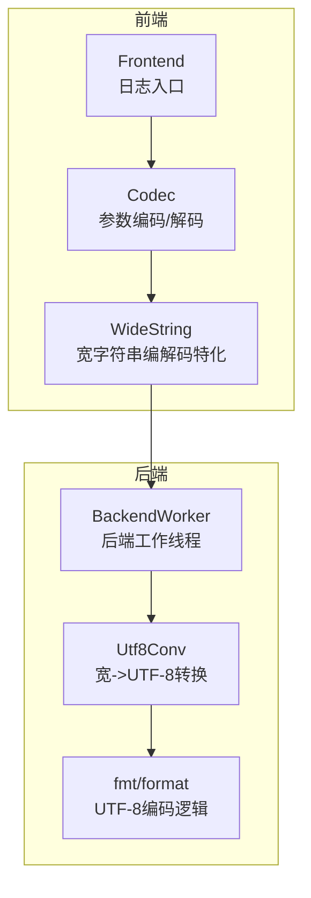
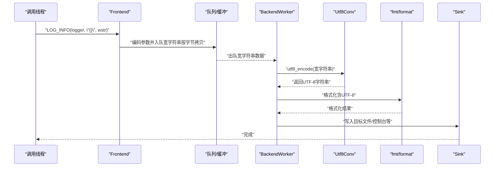
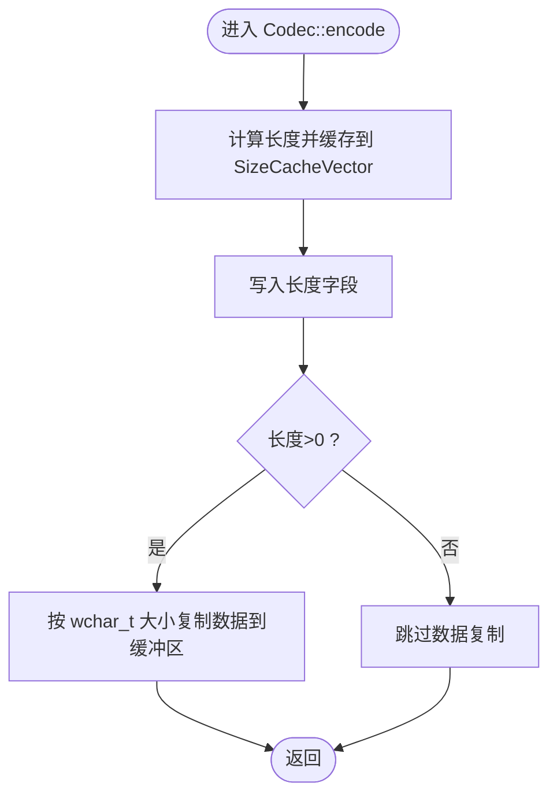
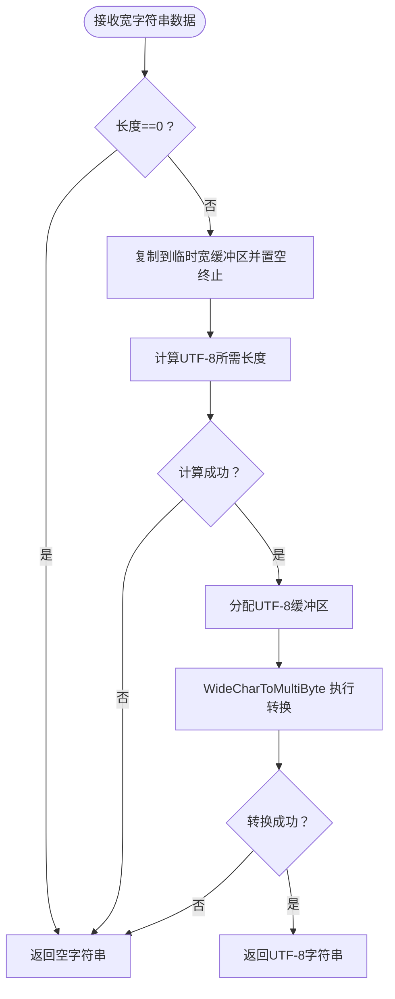
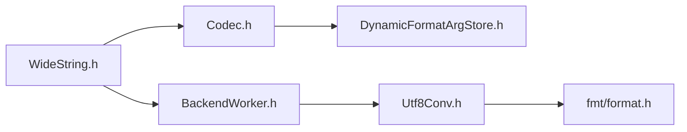

# 宽字符支持

<cite>
**本文引用的文件**
- [WideString.h](file://include/quill/std/WideString.h)
- [Utf8Conv.h](file://include/quill/backend/Utf8Conv.h)
- [Codec.h](file://include/quill/core/Codec.h)
- [BackendWorker.h](file://include/quill/backend/BackendWorker.h)
- [wide_strings.rst](file://docs/wide_strings.rst)
- [backend_options.rst](file://docs/backend_options.rst)
- [WideStringLoggingTest.cpp](file://test/integration_tests/WideStringLoggingTest.cpp)
- [WideStdTypesLoggingTest.cpp](file://test/integration_tests/WideStdTypesLoggingTest.cpp)
- [format.h](file://include/quill/bundled/fmt/format.h)
- [ThreadUtilities.h](file://include/quill/backend/ThreadUtilities.h)
- [DynamicFormatArgStore.h](file://include/quill/core/DynamicFormatArgStore.h)
</cite>

## 目录
1. [简介](#简介)
2. [项目结构](#项目结构)
3. [核心组件](#核心组件)
4. [架构总览](#架构总览)
5. [详细组件分析](#详细组件分析)
6. [依赖关系分析](#依赖关系分析)
7. [性能考量](#性能考量)
8. [故障排查指南](#故障排查指南)
9. [结论](#结论)
10. [附录](#附录)

## 简介
本文件系统化阐述 Quill 的宽字符支持能力，重点围绕 WideString 类型的实现与工作流展开，覆盖以下主题：
- WideString 类在 Windows 平台上的编码处理（UTF-16）与传输机制
- 后端线程中的 UTF-8 转换流程
- 宽字符日志记录的配置方法（编译器与运行时）
- 宽窄字符混合使用的注意事项与兼容性处理
- 跨平台差异与解决方案（Windows、Linux、macOS）
- 性能影响与优化策略

## 项目结构
与宽字符支持直接相关的代码主要分布在如下模块：
- 核心序列化与编解码：core/Codec.h
- 宽字符串类型支持：std/WideString.h
- 后端 UTF-8 转换：backend/Utf8Conv.h
- 后端工作线程：backend/BackendWorker.h
- 文档与示例：docs/wide_strings.rst、backend_options.rst
- 测试用例：test/integration_tests 下的 WideStringLoggingTest.cpp、WideStdTypesLoggingTest.cpp
- 字符串格式化库：bundled/fmt/format.h
- 平台工具：backend/ThreadUtilities.h
- 动态参数存储：core/DynamicFormatArgStore.h

**图表来源**
- [Codec.h:28-97](file://include/quill/core/Codec.h#L28-L97)
- [WideString.h:26-97](file://include/quill/std/WideString.h#L26-L97)
- [Utf8Conv.h:40-83](file://include/quill/backend/Utf8Conv.h#L40-L83)
- [format.h:1359-1385](file://include/quill/bundled/fmt/format.h#L1359-L1385)

**章节来源**
- [WideString.h:1-101](file://include/quill/std/WideString.h#L1-L101)
- [Utf8Conv.h:1-88](file://include/quill/backend/Utf8Conv.h#L1-L88)
- [Codec.h:1-438](file://include/quill/core/Codec.h#L1-L438)
- [wide_strings.rst:1-49](file://docs/wide_strings.rst#L1-L49)

## 核心组件
- WideString 类型特化（std::wstring、std::wstring_view、wchar_t*）通过 Codec 模板特化进行编码与解码，确保在调用线程中仅复制宽字符串缓冲区，不进行字符集转换。
- 后端线程负责从队列读取宽字符串数据，执行 UTF-8 编码，再交由格式化器输出到目标 sink。
- 文档明确指出默认仅 ASCII 支持，若需正确输出 UTF-8 或其他 Unicode 文本，需在 BackendOptions 中禁用字符净化。

**章节来源**
- [WideString.h:26-97](file://include/quill/std/WideString.h#L26-L97)
- [Codec.h:144-342](file://include/quill/core/Codec.h#L144-L342)
- [wide_strings.rst:6-21](file://docs/wide_strings.rst#L6-L21)

## 架构总览
下图展示了从调用线程到后端完成 UTF-8 转换并写入日志的完整流程。

**图表来源**
- [WideString.h:55-96](file://include/quill/std/WideString.h#L55-L96)
- [Utf8Conv.h:40-83](file://include/quill/backend/Utf8Conv.h#L40-L83)
- [format.h:1359-1385](file://include/quill/bundled/fmt/format.h#L1359-L1385)
- [BackendWorker.h:1-200](file://include/quill/backend/BackendWorker.h#L1-L200)

## 详细组件分析

### WideString 类型特化与编码流程
- 特化范围：wchar_t*、wchar_t const*、std::wstring、std::wstring_view
- 计算编码大小：先计算长度，写入长度字段，再写入宽字符串字节数据（不包含空终止符）
- 解码与存储：后端读取长度与数据，生成 std::wstring_view；随后通过 utf8_encode 将其转换为 UTF-8 字节视图并存入动态参数存储，供格式化器使用

**图表来源**
- [WideString.h:32-80](file://include/quill/std/WideString.h#L32-L80)

**章节来源**
- [WideString.h:26-97](file://include/quill/std/WideString.h#L26-L97)
- [Codec.h:144-342](file://include/quill/core/Codec.h#L144-L342)

### 后端 UTF-8 转换与格式化
- Windows 平台使用系统 API 将宽字符串转换为 UTF-8
- 转换失败或空字符串时返回空字符串，避免异常传播
- 转换后的 UTF-8 数据交由 fmt/format 进行后续格式化与输出

**图表来源**
- [Utf8Conv.h:40-83](file://include/quill/backend/Utf8Conv.h#L40-L83)

**章节来源**
- [Utf8Conv.h:1-88](file://include/quill/backend/Utf8Conv.h#L1-L88)
- [format.h:1359-1385](file://include/quill/bundled/fmt/format.h#L1359-L1385)

### 宽窄字符混合使用与兼容性
- 在 Windows 上可直接传入宽字符、宽字符串与宽字符串视图，但默认仅 ASCII 输出；如需显示 UTF-8 或其他 Unicode 文本，需在 BackendOptions 中禁用字符净化
- Linux/macOS 默认行为与 Windows 不同，文档强调仅 ASCII 支持，非 ASCII 字符会被转义为十六进制表示
- 建议在多平台环境中统一以 UTF-8 文本进行日志记录，必要时在 Windows 上启用 UTF-8 转换并在其他平台保持默认行为

**章节来源**
- [wide_strings.rst:6-21](file://docs/wide_strings.rst#L6-L21)
- [backend_options.rst:17-45](file://docs/backend_options.rst#L17-L45)

### 跨平台差异与解决方案
- Windows：支持宽字符串，后端线程负责 UTF-8 转换；可通过 BackendOptions 控制字符净化
- Linux/macOS：默认仅 ASCII 输出，非 ASCII 字符会转义；建议统一使用 UTF-8 文本并禁用字符净化
- 平台工具：Windows 提供 s2ws/ws2s 辅助函数用于字符串与宽字符串互转（测试与工具用途）

**章节来源**
- [wide_strings.rst:6-21](file://docs/wide_strings.rst#L6-L21)
- [ThreadUtilities.h:68-95](file://include/quill/backend/ThreadUtilities.h#L68-L95)

### 完整宽字符日志示例（路径指引）
- 基础宽字符串日志示例（Windows 限定）：[wide_strings.rst 示例:23-49](file://docs/wide_strings.rst#L23-L49)
- 综合宽字符串与容器日志测试（Windows 限定）：[WideStringLoggingTest.cpp:44-88](file://test/integration_tests/WideStringLoggingTest.cpp#L44-L88)
- 宽标准类型集合日志测试（Windows 限定）：[WideStdTypesLoggingTest.cpp:69-193](file://test/integration_tests/WideStdTypesLoggingTest.cpp#L69-L193)

**章节来源**
- [wide_strings.rst:23-49](file://docs/wide_strings.rst#L23-L49)
- [WideStringLoggingTest.cpp:1-138](file://test/integration_tests/WideStringLoggingTest.cpp#L1-L138)
- [WideStdTypesLoggingTest.cpp:1-331](file://test/integration_tests/WideStdTypesLoggingTest.cpp#L1-L331)

## 依赖关系分析
- WideString 特化依赖 Codec 接口与动态参数存储，确保在前端只做轻量级编码
- 后端线程在 Windows 上依赖 Utf8Conv 完成 UTF-8 转换
- fmt/format 提供 UTF-8 编码细节（如代理对处理），保证转换质量
- BackendWorker 负责调度与执行转换与格式化

**图表来源**
- [WideString.h:26-97](file://include/quill/std/WideString.h#L26-L97)
- [Codec.h:144-342](file://include/quill/core/Codec.h#L144-L342)
- [DynamicFormatArgStore.h:77-155](file://include/quill/core/DynamicFormatArgStore.h#L77-L155)
- [BackendWorker.h:1-200](file://include/quill/backend/BackendWorker.h#L1-L200)
- [Utf8Conv.h:40-83](file://include/quill/backend/Utf8Conv.h#L40-L83)
- [format.h:1359-1385](file://include/quill/bundled/fmt/format.h#L1359-L1385)

**章节来源**
- [Codec.h:1-438](file://include/quill/core/Codec.h#L1-L438)
- [DynamicFormatArgStore.h:1-157](file://include/quill/core/DynamicFormatArgStore.h#L1-L157)
- [Utf8Conv.h:1-88](file://include/quill/backend/Utf8Conv.h#L1-L88)
- [format.h:1359-1385](file://include/quill/bundled/fmt/format.h#L1359-L1385)

## 性能考量
- 热路径无字符集转换：前端仅复制宽字符串缓冲区，不进行编码转换，避免在高频日志路径上引入额外开销
- 后端转换：UTF-8 转换发生在后端线程，不影响前端吞吐
- 字符净化与转义：默认字符净化会将非 ASCII 字符转义为十六进制，可能增加输出体积；在需要正确显示 Unicode 的场景，应按需禁用净化
- fmt/format 的 UTF-8 编码逻辑包含代理对处理等细节，确保转换正确性

**章节来源**
- [wide_strings.rst:12-21](file://docs/wide_strings.rst#L12-L21)
- [backend_options.rst:17-45](file://docs/backend_options.rst#L17-L45)
- [format.h:1359-1385](file://include/quill/bundled/fmt/format.h#L1359-L1385)

## 故障排查指南
- 日志中出现十六进制而非中文/Unicode：确认 BackendOptions 是否启用了字符净化；如需显示 UTF-8，请禁用净化
- Windows 上宽字符串未正确显示：确认已包含宽字符串头文件并使用支持的类型（std::wstring、std::wstring_view、wchar_t*）
- 转换失败或空输出：检查 Utf8Conv 的返回值与输入长度；确保传入的宽字符串有效且长度非零
- 多平台一致性问题：Linux/macOS 默认仅 ASCII 输出，非 ASCII 字符会被转义；建议统一使用 UTF-8 文本并禁用净化

**章节来源**
- [wide_strings.rst:6-21](file://docs/wide_strings.rst#L6-L21)
- [backend_options.rst:17-45](file://docs/backend_options.rst#L17-L45)
- [Utf8Conv.h:40-83](file://include/quill/backend/Utf8Conv.h#L40-L83)

## 结论
Quill 的宽字符支持以“前端轻量、后端转换”为核心设计：在 Windows 平台上，通过 WideString 类型特化与 Codec 接口，前端仅复制宽字符串缓冲区；后端线程利用系统 API 将宽字符串转换为 UTF-8，再由格式化器输出。默认情况下仅 ASCII 输出，若需正确显示 UTF-8 或其他 Unicode 文本，应在 BackendOptions 中禁用字符净化。跨平台环境下，Linux/macOS 默认行为与 Windows 不同，建议统一采用 UTF-8 文本并按需调整净化策略，以获得一致的日志输出体验。

## 附录
- 配置参考
  - 禁用字符净化以输出 UTF-8：[backend_options.rst 示例:24-32](file://docs/backend_options.rst#L24-L32)
- 示例参考
  - 基础宽字符串日志示例：[wide_strings.rst 示例:23-49](file://docs/wide_strings.rst#L23-L49)
  - 综合宽字符串与容器日志测试：[WideStringLoggingTest.cpp:44-88](file://test/integration_tests/WideStringLoggingTest.cpp#L44-L88)、[WideStdTypesLoggingTest.cpp:69-193](file://test/integration_tests/WideStdTypesLoggingTest.cpp#L69-L193)