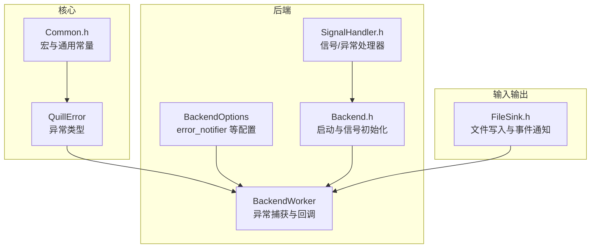
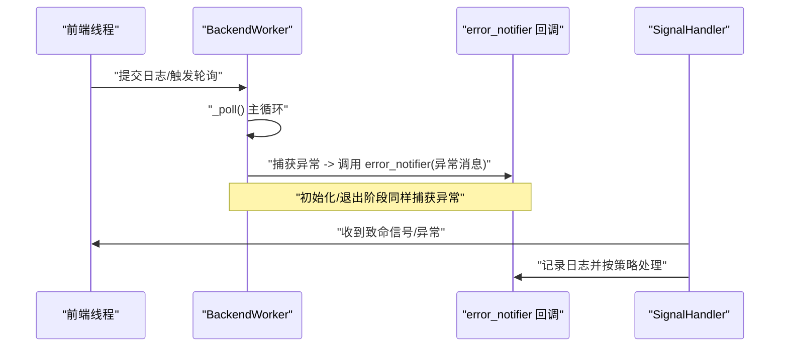
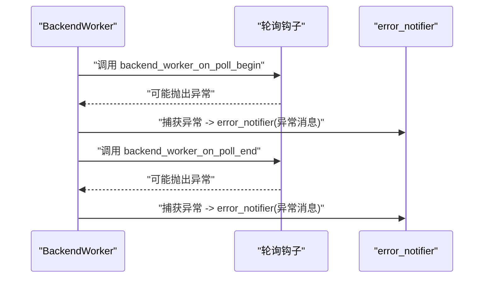
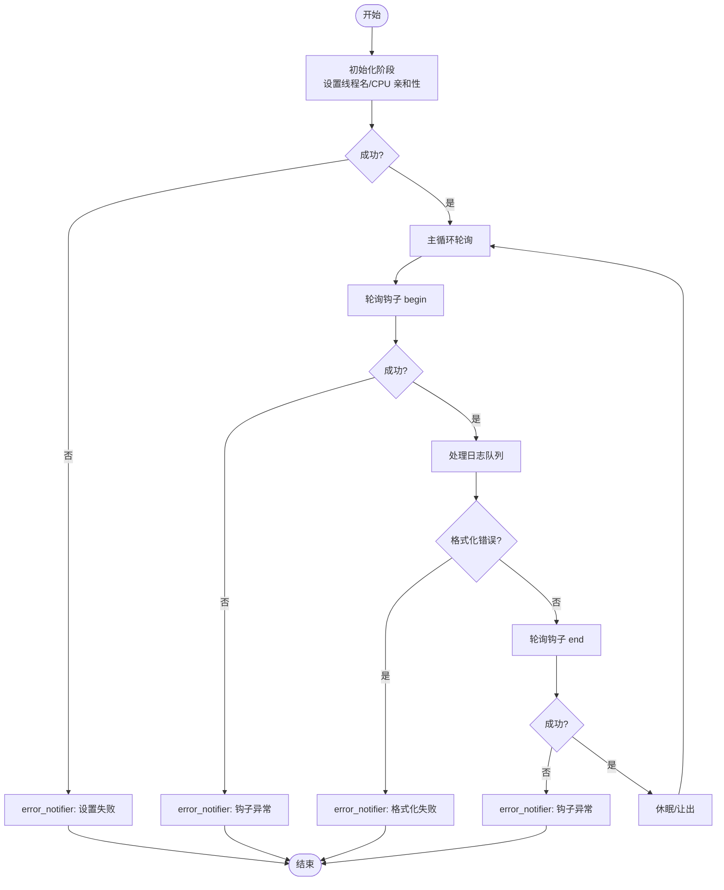
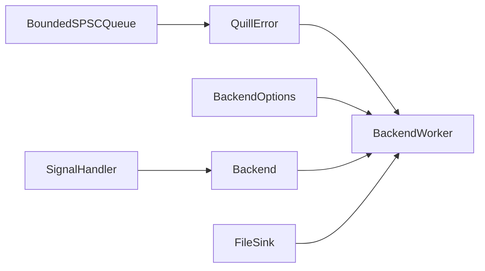

# 异常处理配置

<cite>
**本文引用的文件**
- [QuillError.h](file://include/quill/core/QuillError.h)
- [BackendOptions.h](file://include/quill/backend/BackendOptions.h)
- [BackendWorker.h](file://include/quill/backend/BackendWorker.h)
- [Backend.h](file://include/quill/Backend.h)
- [SignalHandler.h](file://include/quill/backend/SignalHandler.h)
- [FileSink.h](file://include/quill/sinks/FileSink.h)
- [BackendExceptionNotifierTest.cpp](file://test/integration_tests/BackendExceptionNotifierTest.cpp)
- [Common.h](file://include/quill/core/Common.h)
- [BoundedSPSCQueue.h](file://include/quill/core/BoundedSPSCQueue.h)
- [signal_handler.cpp](file://examples/signal_handler.cpp)
</cite>

## 目录
1. [简介](#简介)
2. [项目结构](#项目结构)
3. [核心组件](#核心组件)
4. [架构总览](#架构总览)
5. [组件详解](#组件详解)
6. [依赖关系分析](#依赖关系分析)
7. [性能考量](#性能考量)
8. [故障排查指南](#故障排查指南)
9. [结论](#结论)
10. [附录](#附录)

## 简介
本文件系统性阐述 Quill 的异常处理配置与机制，重点覆盖以下方面：
- QuillError 类设计与异常类型分类、错误码约定
- 异常通知系统（error_notifier）的配置与回调流程
- 后端异常检测与恢复（含文件操作、内存不足、权限错误等）
- 完整异常处理示例与最佳实践（恢复策略与降级）
- 异常处理对性能的影响与监控建议

## 项目结构
围绕异常处理的关键代码分布在如下模块：
- 核心异常类型：QuillError
- 后端选项与通知：BackendOptions
- 后端线程与异常捕获：BackendWorker
- 信号处理与致命错误：SignalHandler
- 文件写入与事件通知：FileSink
- 测试与示例：BackendExceptionNotifierTest、signal_handler.cpp

**图示来源**
- [QuillError.h:1-57](file://include/quill/core/QuillError.h#L1-L57)
- [BackendOptions.h:1-283](file://include/quill/backend/BackendOptions.h#L1-L283)
- [BackendWorker.h:138-197](file://include/quill/backend/BackendWorker.h#L138-L197)
- [Backend.h:86-111](file://include/quill/Backend.h#L86-L111)
- [SignalHandler.h:442-471](file://include/quill/backend/SignalHandler.h#L442-L471)
- [FileSink.h:362-390](file://include/quill/sinks/FileSink.h#L362-L390)
- [Common.h:119-183](file://include/quill/core/Common.h#L119-L183)

**章节来源**
- [QuillError.h:1-57](file://include/quill/core/QuillError.h#L1-L57)
- [BackendOptions.h:1-283](file://include/quill/backend/BackendOptions.h#L1-L283)
- [BackendWorker.h:138-197](file://include/quill/backend/BackendWorker.h#L138-L197)
- [Backend.h:86-111](file://include/quill/Backend.h#L86-L111)
- [SignalHandler.h:442-471](file://include/quill/backend/SignalHandler.h#L442-L471)
- [FileSink.h:362-390](file://include/quill/sinks/FileSink.h#L362-L390)
- [Common.h:119-183](file://include/quill/core/Common.h#L119-L183)

## 核心组件
- QuillError：自定义异常类型，提供统一的错误描述接口，支持在禁用异常模式下以致命错误路径终止进程。
- BackendOptions：后端配置项，包含 error_notifier 回调、线程名与亲和性设置、轮询钩子等。
- BackendWorker：后端工作线程，负责捕获异常并通过 error_notifier 通知用户；在初始化、主循环、退出阶段均进行异常捕获。
- SignalHandler：跨平台信号/异常处理，Linux/macOS 使用信号，Windows 使用 SEH/Ctrl-C 处理器；可抛出 QuillError 并记录日志。
- FileSink：文件写入与事件通知，包含 before_open/after_open 等钩子，具备重试与继承控制等健壮性措施。

**章节来源**
- [QuillError.h:45-55](file://include/quill/core/QuillError.h#L45-L55)
- [BackendOptions.h:169-178](file://include/quill/backend/BackendOptions.h#L169-L178)
- [BackendWorker.h:138-197](file://include/quill/backend/BackendWorker.h#L138-L197)
- [SignalHandler.h:442-471](file://include/quill/backend/SignalHandler.h#L442-L471)
- [FileSink.h:362-390](file://include/quill/sinks/FileSink.h#L362-L390)

## 架构总览
后端线程在运行期通过统一的异常捕获机制，将异常转化为字符串消息并交由 error_notifier 处理。同时，信号处理器在发生致命信号或异常时，负责记录日志并按策略决定是否重新投递信号或直接退出。

**图示来源**
- [BackendWorker.h:184-196](file://include/quill/backend/BackendWorker.h#L184-L196)
- [BackendOptions.h:169-178](file://include/quill/backend/BackendOptions.h#L169-L178)
- [SignalHandler.h:178-215](file://include/quill/backend/SignalHandler.h#L178-L215)

## 组件详解

### QuillError 类与异常类型
- 设计要点
  - 继承自标准异常基类，提供统一的错误描述接口。
  - 在禁用异常模式下，使用致命错误宏替代抛出，避免未处理异常导致的未定义行为。
- 错误码与分类
  - 无显式错误码枚举；异常消息以字符串形式传递，便于携带上下文。
  - 建议在业务层为不同场景定义语义化错误码映射，结合 error_notifier 进行统一上报。

**章节来源**
- [QuillError.h:15-38](file://include/quill/core/QuillError.h#L15-L38)
- [QuillError.h:45-55](file://include/quill/core/QuillError.h#L45-L55)

### 异常通知系统（error_notifier）
- 配置入口
  - BackendOptions 提供 error_notifier 字段，默认打印到标准错误；可在启动前注入自定义回调。
  - 支持轮询钩子 backend_worker_on_poll_begin / backend_worker_on_poll_end，异常会转发至 error_notifier。
- 回调执行时机
  - 初始化阶段：设置线程名、CPU 亲和性失败时触发。
  - 主循环阶段：轮询过程中抛出的异常被捕获并通知。
  - 退出阶段：清理阶段异常同样被通知。
- 注意事项
  - 回调中允许异步日志，但禁止在回调内调用 flush_log，避免死锁。
  - 回调在后端线程执行，需保证线程安全与最小阻塞。

**图示来源**
- [BackendWorker.h:260-267](file://include/quill/backend/BackendWorker.h#L260-L267)
- [BackendWorker.h:305-395](file://include/quill/backend/BackendWorker.h#L305-L395)
- [BackendOptions.h:180-192](file://include/quill/backend/BackendOptions.h#L180-L192)

**章节来源**
- [BackendOptions.h:169-178](file://include/quill/backend/BackendOptions.h#L169-L178)
- [BackendWorker.h:154-196](file://include/quill/backend/BackendWorker.h#L154-L196)
- [BackendWorker.h:260-267](file://include/quill/backend/BackendWorker.h#L260-L267)

### 后端异常检测与恢复
- 检测范围
  - 线程名设置失败、CPU 亲和性设置失败、格式化错误、轮询钩子异常、内存映射失败等。
- 恢复策略
  - 对于文件打开等瞬态失败，FileSink 内部采用重试与继承控制等手段提升稳定性。
  - 对于内存不足与大页分配失败，抛出 QuillError 并通过 error_notifier 上报。
  - 对于格式化错误，触发 error_notifier 并记录“无法格式化日志”的提示信息。
- 典型场景
  - 设置无效线程名或亲和性：触发 error_notifier 并记录对应错误。
  - 轮询钩子抛出异常：在 begin/end 钩子中捕获并通知。
  - 调用回溯但未初始化：触发 error_notifier 并记录提示。

**图示来源**
- [BackendWorker.h:154-196](file://include/quill/backend/BackendWorker.h#L154-L196)
- [BackendWorker.h:305-395](file://include/quill/backend/BackendWorker.h#L305-L395)
- [BackendExceptionNotifierTest.cpp:41-121](file://test/integration_tests/BackendExceptionNotifierTest.cpp#L41-L121)

**章节来源**
- [BackendWorker.h:154-196](file://include/quill/backend/BackendWorker.h#L154-L196)
- [BackendWorker.h:305-395](file://include/quill/backend/BackendWorker.h#L305-L395)
- [BackendExceptionNotifierTest.cpp:41-121](file://test/integration_tests/BackendExceptionNotifierTest.cpp#L41-L121)

### 文件操作异常与权限错误
- 文件打开重试与继承控制
  - FileSink 在打开文件时支持有限次数重试，以应对杀毒软件锁定等瞬态冲突。
  - Windows 下通过句柄标志控制继承属性，避免子进程继承文件句柄。
- 事件通知链路
  - before_open/after_open/before_close/after_close/before_write 等钩子可用于审计与降级。
- 权限与资源限制
  - 当 mmap 或内存分配失败时，抛出 QuillError 并携带 errno 与错误描述，error_notifier 将接收该消息。

**章节来源**
- [FileSink.h:362-390](file://include/quill/sinks/FileSink.h#L362-L390)
- [BoundedSPSCQueue.h:280-318](file://include/quill/core/BoundedSPSCQueue.h#L280-L318)

### 信号处理与致命错误
- 跨平台策略
  - Linux/macOS：注册信号处理器，记录日志并按策略决定是否重新投递信号。
  - Windows：安装未处理异常过滤器与控制台信号处理器，记录异常并尝试安全退出。
- 错误抛出与日志
  - 信号处理器在必要时抛出 QuillError，并通过 error_notifier 记录关键信息。
- 示例参考
  - 示例程序展示了如何在多线程场景下安装信号处理器并触发不同类型的崩溃，验证日志落盘与退出行为。

**章节来源**
- [SignalHandler.h:178-215](file://include/quill/backend/SignalHandler.h#L178-L215)
- [SignalHandler.h:442-471](file://include/quill/backend/SignalHandler.h#L442-L471)
- [Backend.h:86-111](file://include/quill/Backend.h#L86-L111)
- [signal_handler.cpp:43-90](file://examples/signal_handler.cpp#L43-L90)

### 异常处理示例与最佳实践
- 示例一：轮询钩子异常与格式化错误
  - 注册 error_notifier，在回调中记录异常消息；触发轮询钩子异常与格式化错误，验证回调被调用。
- 示例二：线程名/CPU 亲和性设置失败
  - 设置无效参数，验证 error_notifier 被调用并记录相应错误。
- 最佳实践
  - 在 error_notifier 中仅做轻量日志与统计，避免阻塞后端线程。
  - 对于可恢复的瞬态错误（如文件打开），采用指数退避或固定重试。
  - 对于不可恢复错误（如内存映射失败），快速失败并上报，避免继续消耗资源。
  - 结合回溯功能在生产环境启用，以便定位问题根因。

**章节来源**
- [BackendExceptionNotifierTest.cpp:41-121](file://test/integration_tests/BackendExceptionNotifierTest.cpp#L41-L121)
- [BackendOptions.h:169-178](file://include/quill/backend/BackendOptions.h#L169-L178)

## 依赖关系分析
- BackendWorker 依赖 BackendOptions 的 error_notifier 与轮询钩子，确保异常统一上报。
- SignalHandler 依赖 Backend 启动流程，负责在致命信号/异常时记录日志并按策略处理。
- FileSink 与 BoundedSPSCQueue 在底层资源分配失败时抛出 QuillError，向上游 error_notifier 传播。

**图示来源**
- [BackendWorker.h:138-197](file://include/quill/backend/BackendWorker.h#L138-L197)
- [BackendOptions.h:169-178](file://include/quill/backend/BackendOptions.h#L169-L178)
- [Backend.h:86-111](file://include/quill/Backend.h#L86-L111)
- [SignalHandler.h:442-471](file://include/quill/backend/SignalHandler.h#L442-L471)
- [FileSink.h:362-390](file://include/quill/sinks/FileSink.h#L362-L390)
- [BoundedSPSCQueue.h:280-318](file://include/quill/core/BoundedSPSCQueue.h#L280-L318)

**章节来源**
- [BackendWorker.h:138-197](file://include/quill/backend/BackendWorker.h#L138-L197)
- [BackendOptions.h:169-178](file://include/quill/backend/BackendOptions.h#L169-L178)
- [Backend.h:86-111](file://include/quill/Backend.h#L86-L111)
- [SignalHandler.h:442-471](file://include/quill/backend/SignalHandler.h#L442-L471)
- [FileSink.h:362-390](file://include/quill/sinks/FileSink.h#L362-L390)
- [BoundedSPSCQueue.h:280-318](file://include/quill/core/BoundedSPSCQueue.h#L280-L318)

## 性能考量
- 异常捕获开销
  - 异常捕获发生在后端线程的初始化、主循环与退出阶段，通常为低频路径，对热路径影响较小。
  - 轮询钩子中的异常捕获与回调应尽量避免昂贵操作，以免放大延迟。
- 资源分配与内存压力
  - 内存映射失败或大页分配失败会触发异常，建议在高负载场景下适当降低队列容量或启用降级策略。
- 文件写入抖动
  - 文件打开重试与句柄继承控制有助于减少外部工具干扰带来的抖动，但频繁重试仍会带来额外开销。

**章节来源**
- [BackendWorker.h:305-395](file://include/quill/backend/BackendWorker.h#L305-L395)
- [FileSink.h:362-390](file://include/quill/sinks/FileSink.h#L362-L390)
- [BoundedSPSCQueue.h:280-318](file://include/quill/core/BoundedSPSCQueue.h#L280-L318)

## 故障排查指南
- 如何确认 error_notifier 生效
  - 在测试中通过原子计数器验证回调被调用次数，并检查日志文件内容确认消息正确落盘。
- 常见问题定位
  - 线程名过长或亲和性非法：检查 BackendOptions 配置，确认 error_notifier 是否收到对应错误。
  - 轮询钩子异常：在钩子中加入最小化逻辑，逐步排查具体抛出点。
  - 格式化错误：检查日志格式串与参数类型匹配情况。
- 信号/异常场景
  - 在多线程中分别安装信号处理器，验证日志在崩溃前被刷新，必要时调整超时与排除规则。

**章节来源**
- [BackendExceptionNotifierTest.cpp:41-159](file://test/integration_tests/BackendExceptionNotifierTest.cpp#L41-L159)
- [BackendOptions.h:169-178](file://include/quill/backend/BackendOptions.h#L169-L178)
- [signal_handler.cpp:43-90](file://examples/signal_handler.cpp#L43-L90)

## 结论
Quill 的异常处理体系以 QuillError 为核心，配合 BackendOptions 的 error_notifier 与轮询钩子，实现了对后端线程异常的统一捕获与上报。通过 SignalHandler 的跨平台策略与 FileSink 的稳健性设计，系统能够在文件操作、内存与权限等异常场景下保持稳定与可观测。建议在生产环境中结合回溯、降级与监控策略，持续优化异常处理的性能与可靠性。

## 附录
- 关键宏与通用常量
  - 包含断言、文件/行号信息、缓存行大小等，为异常处理与调试提供基础支撑。

**章节来源**
- [Common.h:119-183](file://include/quill/core/Common.h#L119-L183)