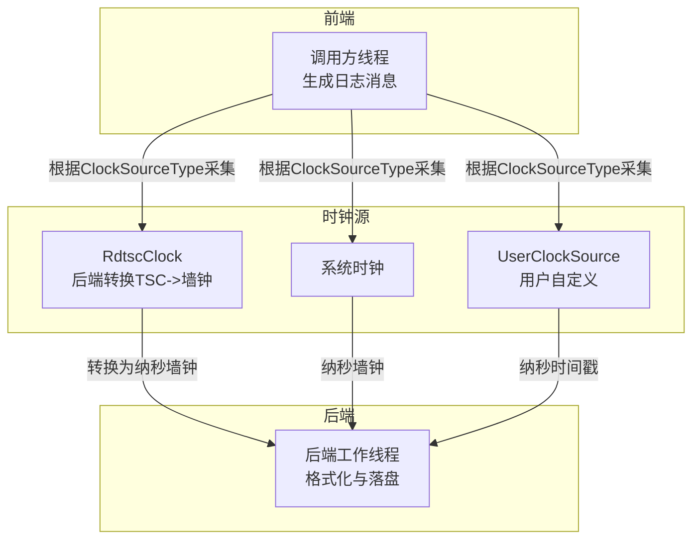
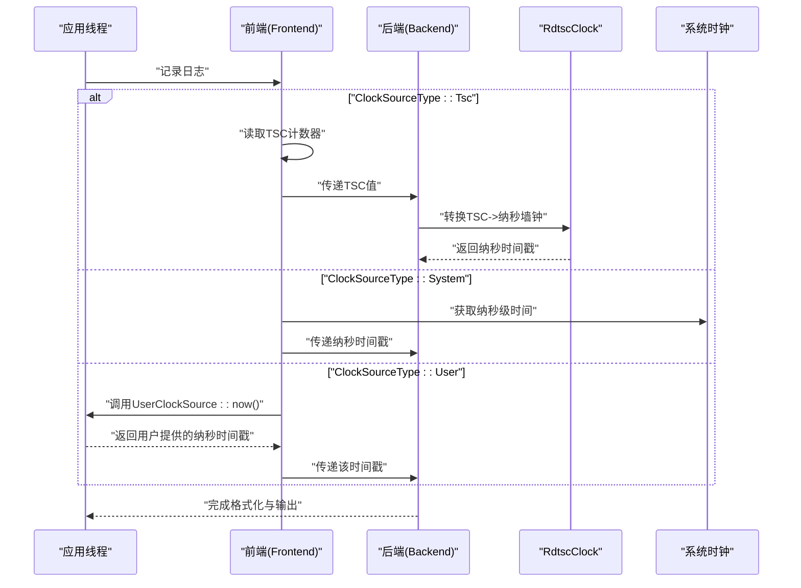
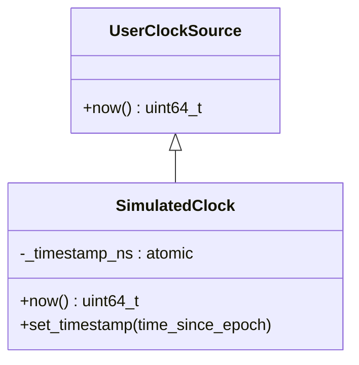
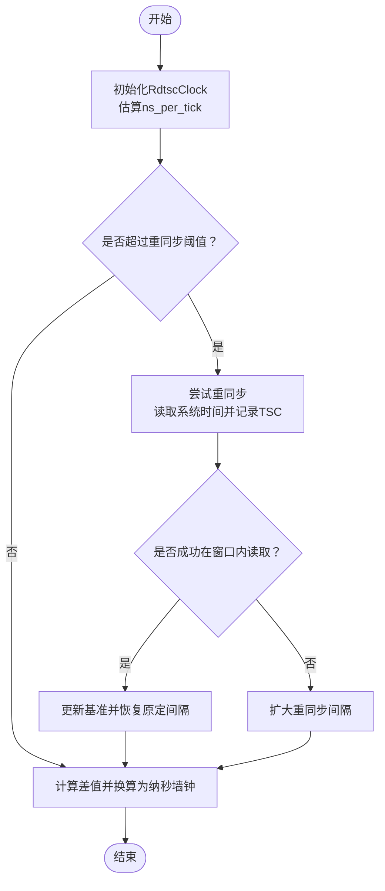
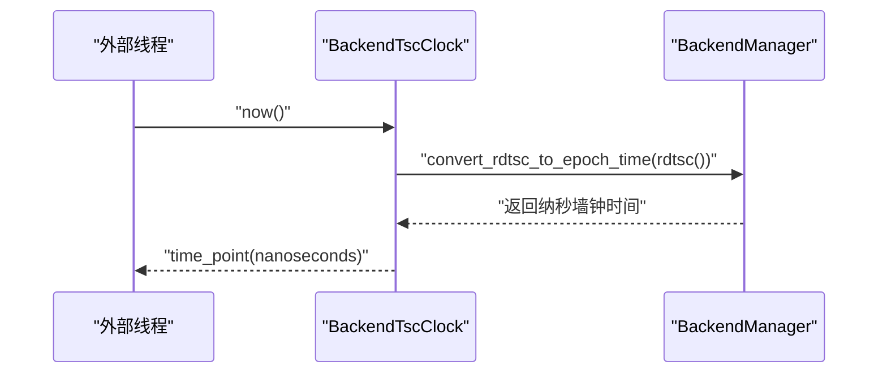
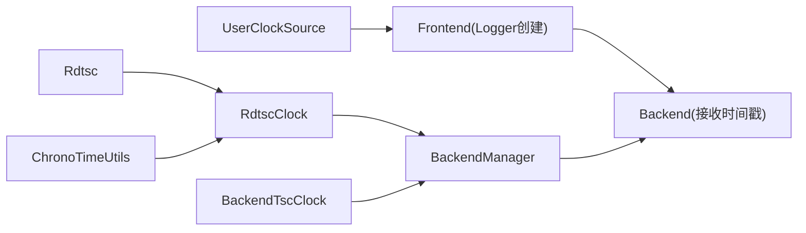

# 自定义时钟源

<cite>
**本文引用的文件**
- [UserClockSource.h](file://include/quill/UserClockSource.h)
- [RdtscClock.h](file://include/quill/backend/RdtscClock.h)
- [Rdtsc.h](file://include/quill/core/Rdtsc.h)
- [BackendTscClock.h](file://include/quill/BackendTscClock.h)
- [ChronoTimeUtils.h](file://include/quill/core/ChronoTimeUtils.h)
- [Common.h](file://include/quill/core/Common.h)
- [user_clock_source.cpp](file://examples/user_clock_source.cpp)
- [UserClockSourceTest.cpp](file://test/integration_tests/UserClockSourceTest.cpp)
- [RdtscClockTest.cpp](file://test/unit_tests/RdtscClockTest.cpp)
- [timestamp_types.rst](file://docs/timestamp_types.rst)
- [quill_hot_path_rdtsc_clock.cpp](file://benchmarks/hot_path_latency/quill_hot_path_rdtsc_clock.cpp)
- [quill_hot_path_system_clock.cpp](file://benchmarks/hot_path_latency/quill_hot_path_system_clock.cpp)
</cite>

## 目录
1. [简介](#简介)
2. [项目结构与定位](#项目结构与定位)
3. [核心组件](#核心组件)
4. [架构总览](#架构总览)
5. [组件详解](#组件详解)
6. [依赖关系分析](#依赖关系分析)
7. [性能考量](#性能考量)
8. [故障排查指南](#故障排查指南)
9. [结论](#结论)
10. [附录：开发与集成指南](#附录开发与集成指南)

## 简介
本文件面向需要在Quill中实现自定义时钟源的开发者，系统阐述以下内容：
- UserClockSource接口的设计与实现要点（时间获取函数定义、精度要求、线程安全）。
- RDTSC时钟的高精度特性与使用场景（硬件计数器优势与局限性）。
- 完整的自定义时钟源开发指南（接口实现、性能优化、线程安全）。
- 时钟源选择策略与切换方法（TSC、System、User三类时钟源的最佳实践）。
- 时钟源对日志性能的影响与优化技巧（缓存策略、测量开销控制）。

## 项目结构与定位
Quill在前端（调用方线程）与后端（写入线程）之间通过统一的时间戳机制协作。时钟源类型由枚举指定，支持：
- Tsc：基于RDTSC的高性能时钟，前端仅读取计数器，后端转换为墙钟时间。
- System：使用系统时钟，简单可靠。
- User：用户自定义时钟，常用于仿真或需要固定/可控时间的场景。

图示来源
- [Common.h:164-170](file://include/quill/core/Common.h#L164-L170)
- [RdtscClock.h:36-166](file://include/quill/backend/RdtscClock.h#L36-L166)
- [BackendTscClock.h:64-73](file://include/quill/BackendTscClock.h#L64-L73)

章节来源
- [Common.h:164-170](file://include/quill/core/Common.h#L164-L170)
- [timestamp_types.rst:17-25](file://docs/timestamp_types.rst#L17-L25)

## 核心组件
- UserClockSource：用户自定义时钟的抽象基类，提供纯虚的now()接口，返回自Epoch以来的纳秒时间戳。
- RdtscClock：后端维护的RDTSC转墙钟转换器，包含校准、周期换算、无锁同步与重同步机制。
- BackendTscClock：后端线程暴露的TSC访问工具，提供与后端同步的纳秒墙钟时间点。
- Rdtsc：跨平台的rdtsc读取封装，针对不同架构选择最优路径。
- ClockSourceType：时钟源类型枚举，决定前端采集方式与后端处理流程。

章节来源
- [UserClockSource.h:25-39](file://include/quill/UserClockSource.h#L25-L39)
- [RdtscClock.h:36-265](file://include/quill/backend/RdtscClock.h#L36-L265)
- [BackendTscClock.h:33-99](file://include/quill/BackendTscClock.h#L33-L99)
- [Rdtsc.h:40-114](file://include/quill/core/Rdtsc.h#L40-L114)
- [Common.h:164-170](file://include/quill/core/Common.h#L164-L170)

## 架构总览
下图展示三种时钟源在Quill中的工作流差异与关键路径：

图示来源
- [Common.h:164-170](file://include/quill/core/Common.h#L164-L170)
- [RdtscClock.h:147-166](file://include/quill/backend/RdtscClock.h#L147-L166)
- [BackendTscClock.h:64-73](file://include/quill/BackendTscClock.h#L64-L73)

## 组件详解

### UserClockSource 接口设计与实现
- 设计目标：允许用户注入任意时间源，特别适用于仿真或需要“过去时间”显示的场景。
- 接口定义：提供纯虚函数now()，返回纳秒级时间戳；派生类需保证线程安全（若Logger跨线程使用）。
- 精度要求：返回值必须为纳秒级时间戳，确保与Quill内部时间处理一致。
- 实现建议：
  - 使用原子变量存储当前时间，避免竞态。
  - 提供setter以更新时间，始终转换为纳秒。
  - 在多线程环境下，确保读写操作的内存序正确。

图示来源
- [UserClockSource.h:25-39](file://include/quill/UserClockSource.h#L25-L39)
- [user_clock_source.cpp:23-47](file://examples/user_clock_source.cpp#L23-L47)

章节来源
- [UserClockSource.h:14-39](file://include/quill/UserClockSource.h#L14-L39)
- [user_clock_source.cpp:13-47](file://examples/user_clock_source.cpp#L13-L47)
- [UserClockSourceTest.cpp:18-45](file://test/integration_tests/UserClockSourceTest.cpp#L18-L45)

### RDTSC 时钟：高精度特性与使用场景
- 高性能：前端仅读取TSC计数器，避免系统调用开销；后端通过RdtscClock进行转换。
- 校准与换算：RdtscClock在首次使用时估算ns_per_tick，并周期性重同步以修正漂移。
- 重同步策略：检测到中断导致无法在限定窗口内读取到系统时间时，会退让并扩大重同步间隔，保证稳定性。
- 线程安全：提供time_since_epoch_safe以供任意线程调用，内部采用无锁版本控制。
- 平台适配：Rdtsc.h针对x86、ARM、RISC-V、IBM Z、LoongArch等平台选择最优实现。

图示来源
- [RdtscClock.h:119-144](file://include/quill/backend/RdtscClock.h#L119-L144)
- [RdtscClock.h:196-230](file://include/quill/backend/RdtscClock.h#L196-L230)
- [RdtscClock.h:147-166](file://include/quill/backend/RdtscClock.h#L147-L166)

章节来源
- [RdtscClock.h:36-265](file://include/quill/backend/RdtscClock.h#L36-L265)
- [Rdtsc.h:40-114](file://include/quill/core/Rdtsc.h#L40-L114)
- [RdtscClockTest.cpp:10-47](file://test/unit_tests/RdtscClockTest.cpp#L10-L47)

### 后端TSC访问工具 BackendTscClock
- 提供与后端线程同步的纳秒墙钟时间点，便于外部在其他线程获取与日志一致的时间。
- 若未使用TSC时钟源，则回退到系统时钟。
- 提供to_time_point将TSC值转换为墙钟时间点。

图示来源
- [BackendTscClock.h:64-73](file://include/quill/BackendTscClock.h#L64-L73)
- [BackendTscClock.h:93-97](file://include/quill/BackendTscClock.h#L93-L97)

章节来源
- [BackendTscClock.h:33-99](file://include/quill/BackendTscClock.h#L33-L99)

### 时间获取工具与平台适配
- ChronoTimeUtils：提供通用的纳秒时间获取模板，便于在不同平台上统一接口。
- Rdtsc：跨平台读取TSC的封装，针对不同CPU架构选择最优路径，必要时回退到系统时钟。

章节来源
- [ChronoTimeUtils.h:18-28](file://include/quill/core/ChronoTimeUtils.h#L18-L28)
- [Rdtsc.h:40-114](file://include/quill/core/Rdtsc.h#L40-L114)

## 依赖关系分析
- UserClockSource被Frontend在创建Logger时作为ClockSourceType::User使用，直接提供纳秒时间戳。
- RdtscClock依赖Rdtsc读取与ChronoTimeUtils进行系统时间获取，通过BackendManager在后端线程中执行转换。
- BackendTscClock依赖BackendManager进行TSC到墙钟的转换，并在未初始化时回退到系统时钟。

图示来源
- [UserClockSource.h:25-39](file://include/quill/UserClockSource.h#L25-L39)
- [RdtscClock.h:119-144](file://include/quill/backend/RdtscClock.h#L119-L144)
- [BackendTscClock.h:64-73](file://include/quill/BackendTscClock.h#L64-L73)
- [ChronoTimeUtils.h:18-28](file://include/quill/core/ChronoTimeUtils.h#L18-L28)

章节来源
- [Common.h:164-170](file://include/quill/core/Common.h#L164-L170)

## 性能考量
- TSC时钟源
  - 前端极低开销：仅读取TSC计数器，避免系统调用。
  - 后端转换：RdtscClock采用无锁版本控制与快速平均算法，降低同步成本。
  - 初始校准：首次使用时进行收敛估计，随后周期性重同步以抑制漂移。
  - 参考基准测试：热路径延迟对比文件展示了TSC与System两种模式的基准差异。
- System时钟源
  - 简单稳定，适合不需要极致低延迟的场景。
- User时钟源
  - 无系统调用开销，但需确保派生类线程安全与时间单调性。
- 日志格式化与时间缓存
  - 时间格式化模块采用缓存策略，减少重复计算；当时间变化较小时可直接复用缓存结果。

章节来源
- [timestamp_types.rst:17-25](file://docs/timestamp_types.rst#L17-L25)
- [quill_hot_path_rdtsc_clock.cpp:26-92](file://benchmarks/hot_path_latency/quill_hot_path_rdtsc_clock.cpp#L26-L92)
- [quill_hot_path_system_clock.cpp:26-98](file://benchmarks/hot_path_latency/quill_hot_path_system_clock.cpp#L26-L98)
- [RdtscClock.h:196-230](file://include/quill/backend/RdtscClock.h#L196-L230)

## 故障排查指南
- 自定义时钟源不生效
  - 确认已将ClockSourceType设置为User，并传入UserClockSource实例。
  - 检查派生类now()返回值是否为纳秒级时间戳。
- 多线程问题
  - 若Logger跨线程使用，确保UserClockSource派生类线程安全（如使用原子变量）。
- TSC时钟异常
  - 若出现时间戳不正确提示，检查系统是否支持不变TSC，以及是否发生长时间中断导致重同步失败。
  - 调整BackendOptions中的重同步间隔以提升鲁棒性。
- 时间格式化异常
  - 若时间格式化出现偏差，检查时区与夏令时设置，确认缓存刷新逻辑正常。

章节来源
- [user_clock_source.cpp:52-70](file://examples/user_clock_source.cpp#L52-L70)
- [UserClockSourceTest.cpp:48-119](file://test/integration_tests/UserClockSourceTest.cpp#L48-L119)
- [RdtscClock.h:136-143](file://include/quill/backend/RdtscClock.h#L136-L143)

## 结论
- UserClockSource提供了灵活的自定义时间注入能力，适用于仿真、回放与特殊时间控制场景。
- RDTSC时钟源在低延迟与高吞吐方面具有显著优势，配合后端的无锁转换与重同步机制，可在多数场景下获得稳定且高性能的时间戳。
- 选择策略建议：
  - 对延迟敏感且支持不变TSC的环境优先选择TSC。
  - 对简单性与兼容性要求高的环境可选择System。
  - 对需要固定/可控时间的场景选择User。
- 性能优化重点在于：减少系统调用、利用缓存、合理设置重同步间隔、确保线程安全。

## 附录：开发与集成指南

### 自定义时钟源开发步骤
- 继承UserClockSource并实现now()，返回纳秒级时间戳。
- 如需动态调整时间，提供线程安全的setter，始终转换为纳秒。
- 将ClockSourceType设置为User，并将自定义对象指针传递给Logger创建流程。
- 确保对象生命周期覆盖Logger存在期。

章节来源
- [UserClockSource.h:25-39](file://include/quill/UserClockSource.h#L25-L39)
- [user_clock_source.cpp:23-47](file://examples/user_clock_source.cpp#L23-L47)
- [UserClockSourceTest.cpp:18-45](file://test/integration_tests/UserClockSourceTest.cpp#L18-L45)

### 时钟源选择与切换
- 通过ClockSourceType枚举在创建Logger时指定：
  - Tsc：高性能，需后端初始化与校准。
  - System：简单可靠，适合一般场景。
  - User：自定义时间，适合仿真与回放。
- 可在运行时通过重新创建Logger并更换ClockSourceType实现切换（注意日志顺序与格式一致性）。

章节来源
- [Common.h:164-170](file://include/quill/core/Common.h#L164-L170)
- [timestamp_types.rst:17-25](file://docs/timestamp_types.rst#L17-L25)

### 性能优化与测量开销控制
- 优先使用TSC时钟源以降低前端开销。
- 控制重同步频率：在BackendOptions中调整重同步间隔，平衡精度与开销。
- 利用时间格式化缓存：减少重复格式化计算。
- 避免在高频路径中进行昂贵的时间转换或格式化。

章节来源
- [RdtscClock.h:119-144](file://include/quill/backend/RdtscClock.h#L119-L144)
- [RdtscClock.h:196-230](file://include/quill/backend/RdtscClock.h#L196-L230)
- [timestamp_types.rst:17-25](file://docs/timestamp_types.rst#L17-L25)