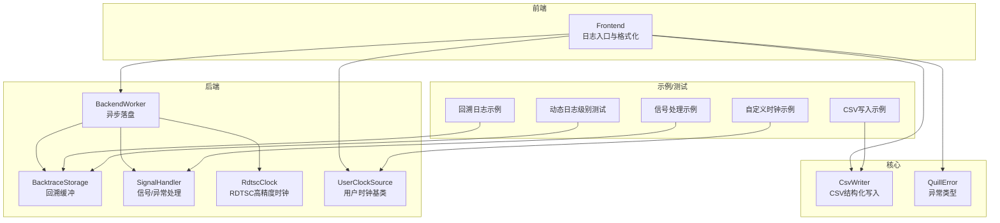
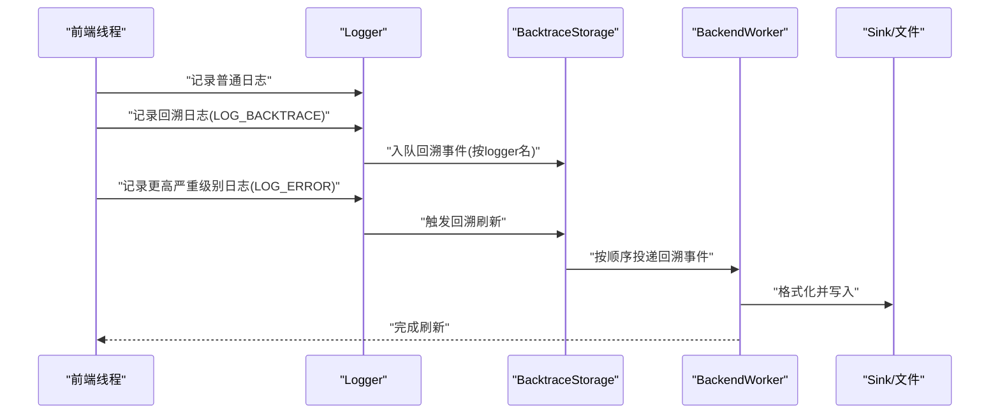
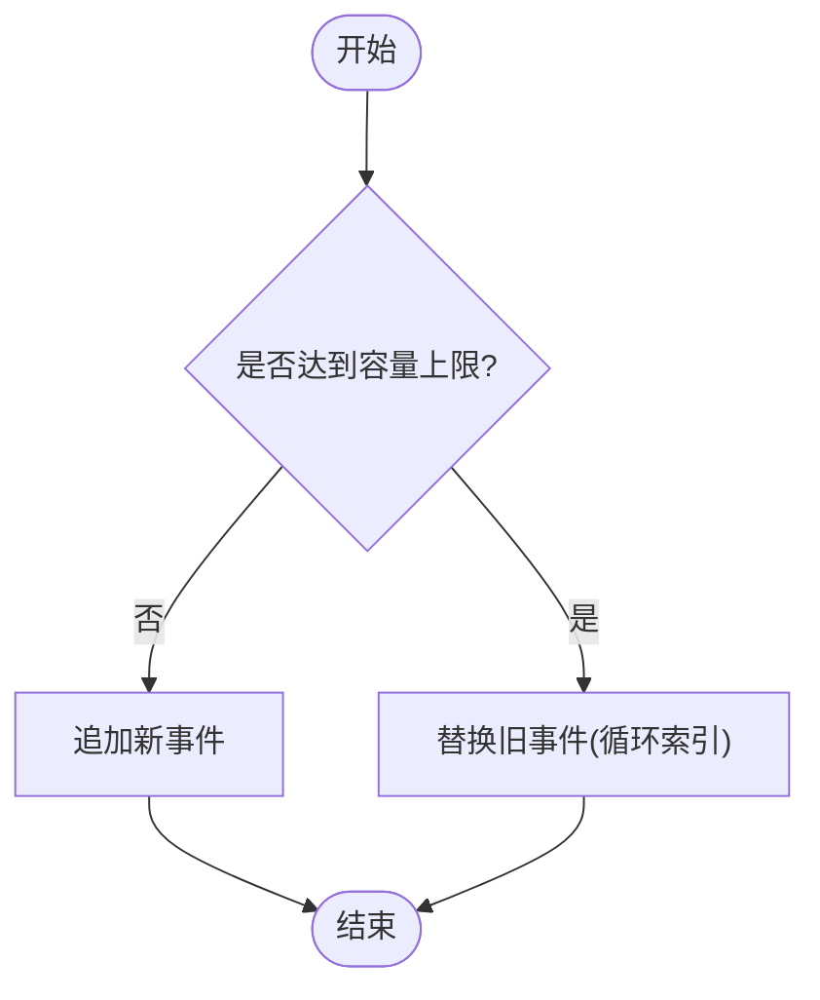
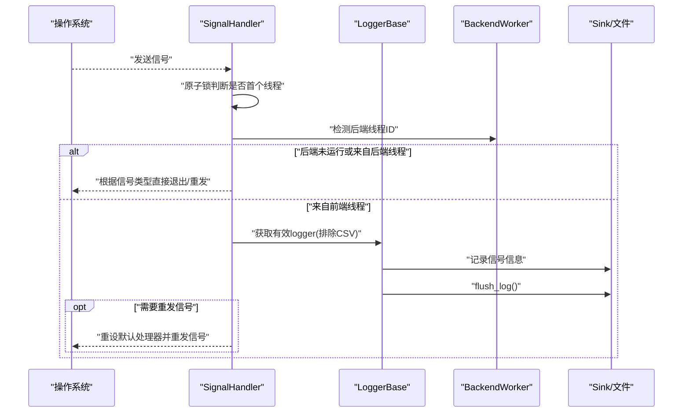
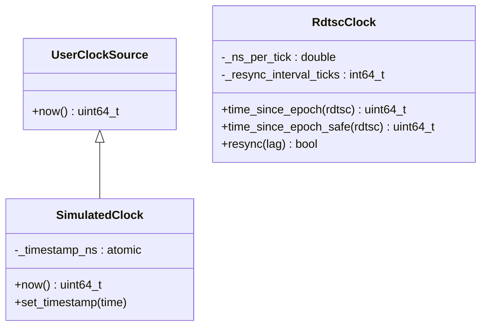
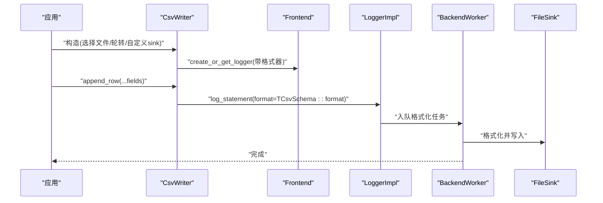
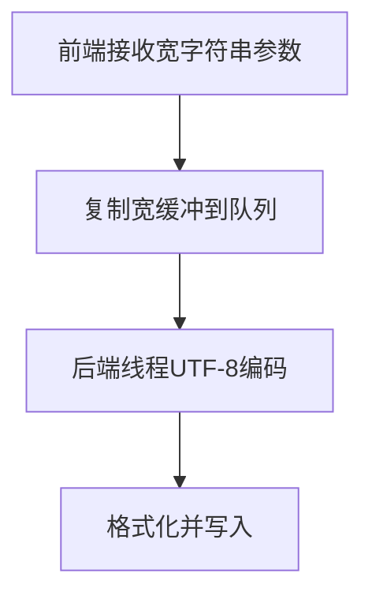
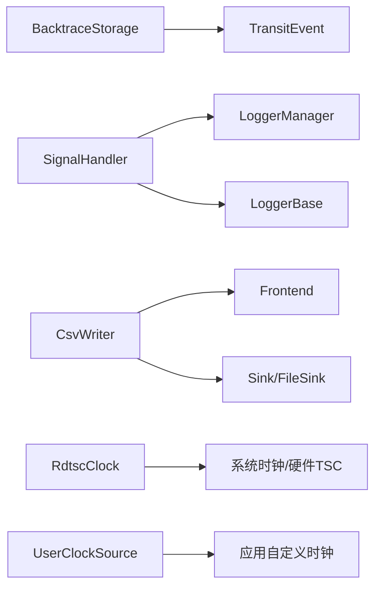

# 高级功能

<cite>
**本文引用的文件**
- [BacktraceStorage.h](file://include/quill/backend/BacktraceStorage.h)
- [SignalHandler.h](file://include/quill/backend/SignalHandler.h)
- [CsvWriter.h](file://include/quill/CsvWriter.h)
- [UserClockSource.h](file://include/quill/UserClockSource.h)
- [RdtscClock.h](file://include/quill/backend/RdtscClock.h)
- [backtrace_logging.cpp](file://examples/backtrace_logging.cpp)
- [csv_writing.cpp](file://examples/csv_writing.cpp)
- [user_clock_source.cpp](file://examples/user_clock_source.cpp)
- [signal_handler.cpp](file://examples/signal_handler.cpp)
- [BacktraceDynamicLogLevelTest.cpp](file://test/integration_tests/BacktraceDynamicLogLevelTest.cpp)
- [wide_strings.rst](file://docs/wide_strings.rst)
- [WideString.h](file://include/quill/std/WideString.h)
- [QuillError.h](file://include/quill/core/QuillError.h)
- [macro_free_mode.rst](file://docs/macro_free_mode.rst)
</cite>

## 目录
1. [简介](#简介)
2. [项目结构](#项目结构)
3. [核心组件](#核心组件)
4. [架构总览](#架构总览)
5. [详细组件分析](#详细组件分析)
6. [依赖关系分析](#依赖关系分析)
7. [性能考量](#性能考量)
8. [故障排查指南](#故障排查指南)
9. [结论](#结论)
10. [附录](#附录)

## 简介
本文件面向Quill的高级功能，系统性阐述以下主题：回溯日志（Backtrace）的实现与触发策略、内存管理与容量控制；信号处理机制与崩溃时的日志落盘；自定义时钟源与RDTSC高精度时间戳；CSV写入与结构化导出；宽字符支持与跨平台差异；异常处理与宏自由模式（Macro-Free）等。文档以代码级分析为基础，辅以流程图与时序图，帮助读者在不同应用场景下进行定制化集成。

## 项目结构
Quill采用前后端分离的异步日志架构：前端负责格式化与入队，后端工作线程负责落盘与同步。高级功能主要分布在后端模块与核心API中：
- 后端：Backtrace存储、信号处理器、RDTSC时钟、UTF-8转换工具
- 核心：用户时钟基类、CSV写入器、错误类型与异常宏
- 示例与测试：覆盖回溯日志、CSV写入、自定义时钟、信号处理、动态日志级别等场景

**图表来源**
- [BacktraceStorage.h:28-124](file://include/quill/backend/BacktraceStorage.h#L28-L124)
- [SignalHandler.h:50-88](file://include/quill/backend/SignalHandler.h#L50-L88)
- [RdtscClock.h:36-265](file://include/quill/backend/RdtscClock.h#L36-L265)
- [UserClockSource.h:25-41](file://include/quill/UserClockSource.h#L25-L41)
- [CsvWriter.h:44-233](file://include/quill/CsvWriter.h#L44-L233)
- [QuillError.h:45-57](file://include/quill/core/QuillError.h#L45-L57)

**章节来源**
- [BacktraceStorage.h:1-127](file://include/quill/backend/BacktraceStorage.h#L1-L127)
- [SignalHandler.h:1-488](file://include/quill/backend/SignalHandler.h#L1-L488)
- [CsvWriter.h:1-233](file://include/quill/CsvWriter.h#L1-L233)
- [UserClockSource.h:1-41](file://include/quill/UserClockSource.h#L1-L41)
- [RdtscClock.h:1-265](file://include/quill/backend/RdtscClock.h#L1-L265)

## 核心组件
- 回溯日志（Backtrace）
  - 存储结构：环形缓冲，按logger名分组，支持设置容量上限与顺序遍历
  - 触发条件：可按严重级别（如Error）触发回溯刷新；也可手动调用flush_backtrace
  - 内存策略：容量增长到上限后循环覆盖，避免无限增长
- 信号处理（SignalHandler）
  - 跨平台：Linux/Unix注册POSIX信号；Windows注册控制台事件与未处理异常
  - 安全进入：仅首个进入的线程执行日志与清理，其余线程阻塞或等待
  - 超时保护：Linux通过SIGALRM确保异常卡死时能强制退出
  - 日志选择：优先使用指定logger，否则自动选择非CSV类有效logger
- 自定义时钟源（UserClockSource）
  - 接口：返回纳秒级时间戳
  - 应用：模拟时间推进、历史回放、一致性对齐
- RDTSC时钟（RdtscClock）
  - 高精度：基于硬件TSC，结合系统时钟校准，提供纳秒级时间戳
  - 容错：周期性重同步，失败时扩大间隔，保证可用性
- CSV写入（CsvWriter）
  - 结构化：通过编译期Schema定义表头与行格式
  - 异步：由后端线程统一格式化与I/O
  - 多目标：支持单/多sink输出，含轮转文件
- 宽字符支持（WideString）
  - 平台差异：默认ASCII/十六进制；Windows支持宽字符串编码至UTF-8
  - 编解码：前端拷贝宽缓冲，后端线程UTF-8编码，避免热路径开销
- 异常处理与宏自由模式
  - 异常宏：在启用异常时抛出QuillError，禁用时以致命错误终止
  - 宏自由：函数式接口替代宏，具备运行时安全检查但有额外开销

**章节来源**
- [BacktraceStorage.h:28-124](file://include/quill/backend/BacktraceStorage.h#L28-L124)
- [SignalHandler.h:50-88](file://include/quill/backend/SignalHandler.h#L50-L88)
- [UserClockSource.h:25-41](file://include/quill/UserClockSource.h#L25-L41)
- [RdtscClock.h:36-265](file://include/quill/backend/RdtscClock.h#L36-L265)
- [CsvWriter.h:44-233](file://include/quill/CsvWriter.h#L44-L233)
- [wide_strings.rst:1-49](file://docs/wide_strings.rst#L1-L49)
- [WideString.h:26-101](file://include/quill/std/WideString.h#L26-L101)
- [QuillError.h:15-38](file://include/quill/core/QuillError.h#L15-L38)
- [macro_free_mode.rst:1-51](file://docs/macro_free_mode.rst#L1-L51)

## 架构总览
下图展示回溯日志从产生到落盘的关键交互，以及信号处理在崩溃时的落盘保障。

**图表来源**
- [BacktraceStorage.h:34-87](file://include/quill/backend/BacktraceStorage.h#L34-L87)
- [backtrace_logging.cpp:25-54](file://examples/backtrace_logging.cpp#L25-L54)

**章节来源**
- [BacktraceStorage.h:28-124](file://include/quill/backend/BacktraceStorage.h#L28-L124)
- [backtrace_logging.cpp:14-55](file://examples/backtrace_logging.cpp#L14-L55)

## 详细组件分析

### 回溯日志（Backtrace）实现与内存管理
- 数据结构
  - 每个logger维护独立的环形缓冲，元素包含线程ID、线程名与TransitEvent
  - 容量达到上限后循环覆盖，索引随写入前进
- 写入与读取
  - 写入：store在容量未满时扩容，满后替换旧项并更新索引
  - 读取：process按插入顺序回调，最后清空缓存
- 触发与刷新
  - 可按严重级别（如Error）触发刷新
  - 支持手动flush_backtrace
- 测试验证
  - 动态日志级别下，Backtrace消息在满足条件时被落盘

**图表来源**
- [BacktraceStorage.h:34-58](file://include/quill/backend/BacktraceStorage.h#L34-L58)

**章节来源**
- [BacktraceStorage.h:28-124](file://include/quill/backend/BacktraceStorage.h#L28-L124)
- [BacktraceDynamicLogLevelTest.cpp:16-83](file://test/integration_tests/BacktraceDynamicLogLevelTest.cpp#L16-L83)
- [backtrace_logging.cpp:25-54](file://examples/backtrace_logging.cpp#L25-L54)

### 信号处理与崩溃日志保存
- 跨平台策略
  - Linux/Unix：注册POSIX信号处理器，安装SIGALRM作为超时保护
  - Windows：注册控制台事件与未处理异常过滤器
- 并发与安全
  - 使用原子锁确保仅首个进入的线程执行日志与清理
  - 后端线程检测：若信号来自后端线程或后端未启动，则直接退出
- 日志选择与超时
  - 优先使用指定logger；否则自动排除CSV类logger
  - Linux设置alarm，超时后重发原始信号
- 示例与行为
  - Ctrl+C/SIGINT：优雅关闭并刷新
  - 其他致命信号：记录关键信息后刷新并重新抛出信号

**图表来源**
- [SignalHandler.h:154-248](file://include/quill/backend/SignalHandler.h#L154-L248)

**章节来源**
- [SignalHandler.h:50-88](file://include/quill/backend/SignalHandler.h#L50-L88)
- [SignalHandler.h:154-248](file://include/quill/backend/SignalHandler.h#L154-L248)
- [signal_handler.cpp:43-90](file://examples/signal_handler.cpp#L43-L90)

### 自定义时钟源与RDTSC高精度特性
- 用户时钟源
  - 继承UserClockSource，实现now()返回纳秒级时间戳
  - 线程安全要求：多线程共享实例需保证原子访问
- RDTSC时钟
  - 初始化：采样稳定后计算ns_per_tick，建立ticks换算基准
  - 时间换算：time_since_epoch将rdtsc差值映射为纳秒时间戳
  - 安全查询：time_since_epoch_safe允许任意线程调用，不触发重同步
  - 重同步：周期性校准，失败时扩大间隔，保证可用性

**图表来源**
- [UserClockSource.h:25-41](file://include/quill/UserClockSource.h#L25-L41)
- [RdtscClock.h:36-265](file://include/quill/backend/RdtscClock.h#L36-L265)
- [user_clock_source.cpp:23-47](file://examples/user_clock_source.cpp#L23-L47)

**章节来源**
- [UserClockSource.h:14-41](file://include/quill/UserClockSource.h#L14-L41)
- [RdtscClock.h:36-265](file://include/quill/backend/RdtscClock.h#L36-L265)
- [user_clock_source.cpp:19-83](file://examples/user_clock_source.cpp#L19-L83)

### CSV写入与结构化数据导出
- Schema驱动
  - 通过TCsvSchema定义header与format，编译期确定列与格式
- 多构造方式
  - 文件/轮转文件/指定sink/多sink，支持首旋转时自动追加表头
- 异步写入
  - 后端线程统一格式化与I/O，避免前端阻塞
- 示例与行为
  - 创建CsvWriter并append_row，自动写入表头（可配置）

**图表来源**
- [CsvWriter.h:44-233](file://include/quill/CsvWriter.h#L44-L233)
- [csv_writing.cpp:18-32](file://examples/csv_writing.cpp#L18-L32)

**章节来源**
- [CsvWriter.h:25-233](file://include/quill/CsvWriter.h#L25-L233)
- [csv_writing.cpp:1-33](file://examples/csv_writing.cpp#L1-L33)

### 宽字符支持与跨平台差异
- 默认行为
  - 非ASCII字符（含UTF-8）默认转为十六进制表示
- Windows支持
  - 前端复制宽字符串缓冲，后端线程进行UTF-8编码，避免热路径开销
  - 支持STL容器中的宽字符串（部分组合受限）
- 文档与示例
  - 提供宽字符串日志示例与注意事项

**图表来源**
- [wide_strings.rst:12-22](file://docs/wide_strings.rst#L12-L22)
- [WideString.h:55-96](file://include/quill/std/WideString.h#L55-L96)

**章节来源**
- [wide_strings.rst:1-49](file://docs/wide_strings.rst#L1-L49)
- [WideString.h:26-101](file://include/quill/std/WideString.h#L26-L101)

### 异常处理与宏自由模式
- 异常处理
  - 启用异常：抛出QuillError；禁用异常：致命错误打印并终止
- 宏自由模式
  - 函数式接口替代宏，具备运行时logger空指针检查
  - 性能代价：元数据运行时复制、参数总是求值、后端负载增加

**章节来源**
- [QuillError.h:15-38](file://include/quill/core/QuillError.h#L15-L38)
- [macro_free_mode.rst:10-26](file://docs/macro_free_mode.rst#L10-L26)

## 依赖关系分析
- 组件耦合
  - BacktraceStorage与TransitEvent紧密耦合，仅后端线程使用
  - SignalHandler依赖LoggerManager与LoggerBase，提供全局上下文
  - CsvWriter依赖Frontend与Sink体系，封装异步写入细节
  - RdtscClock与UserClockSource分别面向高性能与可定制场景
- 外部依赖
  - 平台信号API（POSIX/Linux与Windows）
  - 文件系统与轮转机制（FileSink/RotatingFileSink）
  - 编解码与格式化库（fmt）

**图表来源**
- [BacktraceStorage.h:9-17](file://include/quill/backend/BacktraceStorage.h#L9-L17)
- [SignalHandler.h:11-17](file://include/quill/backend/SignalHandler.h#L11-L17)
- [CsvWriter.h:9-14](file://include/quill/CsvWriter.h#L9-L14)
- [RdtscClock.h:10-12](file://include/quill/backend/RdtscClock.h#L10-L12)
- [UserClockSource.h:25-39](file://include/quill/UserClockSource.h#L25-L39)

**章节来源**
- [BacktraceStorage.h:1-127](file://include/quill/backend/BacktraceStorage.h#L1-L127)
- [SignalHandler.h:1-488](file://include/quill/backend/SignalHandler.h#L1-L488)
- [CsvWriter.h:1-233](file://include/quill/CsvWriter.h#L1-L233)
- [RdtscClock.h:1-265](file://include/quill/backend/RdtscClock.h#L1-L265)
- [UserClockSource.h:1-41](file://include/quill/UserClockSource.h#L1-L41)

## 性能考量
- 回溯日志
  - 环形缓冲避免频繁分配；按严重级别触发减少I/O压力
  - 建议合理设置容量，避免覆盖过多历史
- 信号处理
  - 首个线程快速路径与锁保护；Linux超时避免死锁
  - 崩溃时尽量缩短后端工作线程存活时间，降低资源竞争
- 自定义时钟
  - UserClockSource需保证原子访问；RdtscClock内部已做线程安全查询
- CSV写入
  - 后端统一格式化与I/O，建议批量写入与合适的轮转策略
- 宽字符
  - 后端编码避免热路径开销；谨慎使用深层嵌套容器

[本节为通用指导，无需具体文件引用]

## 故障排查指南
- 回溯日志未刷新
  - 检查是否设置了按严重级别触发或手动调用了flush_backtrace
  - 确认logger初始化了回溯容量与级别
- 信号处理无效
  - Windows需在每个线程安装信号处理器
  - Linux请确认SIGALRM未被纳入catchable_signals
- RDTSC时间不准
  - 观察重同步失败日志；必要时增大resync间隔或切换系统时钟源
- CSV写入无表头
  - 确认构造时should_write_header为true，且非追加模式首次写入
- 宽字符显示异常
  - 默认非ASCII转十六进制；Windows可启用UTF-8编码；其他平台请在后端开启相应选项

**章节来源**
- [BacktraceStorage.h:89-99](file://include/quill/backend/BacktraceStorage.h#L89-L99)
- [SignalHandler.h:442-471](file://include/quill/backend/SignalHandler.h#L442-L471)
- [RdtscClock.h:196-230](file://include/quill/backend/RdtscClock.h#L196-L230)
- [CsvWriter.h:57-83](file://include/quill/CsvWriter.h#L57-L83)
- [wide_strings.rst:6-11](file://docs/wide_strings.rst#L6-L11)

## 结论
Quill的高级功能围绕“高性能、可定制、可扩展”设计：回溯日志提供问题定位的上下文链路；信号处理保障崩溃时的数据完整性；自定义时钟与RDTSC满足高精度与模拟需求；CSV写入实现结构化数据导出；宽字符支持兼顾跨平台兼容性；异常处理与宏自由模式则提供了灵活的工程化选择。通过合理的配置与调优，可在不同业务场景下获得稳定的日志能力。

[本节为总结性内容，无需具体文件引用]

## 附录
- 关键API与示例路径
  - 回溯日志：[回溯示例:14-55](file://examples/backtrace_logging.cpp#L14-L55)，[动态日志级别测试:16-83](file://test/integration_tests/BacktraceDynamicLogLevelTest.cpp#L16-L83)
  - 信号处理：[信号示例:43-90](file://examples/signal_handler.cpp#L43-L90)
  - 自定义时钟：[自定义时钟示例:49-83](file://examples/user_clock_source.cpp#L49-L83)
  - CSV写入：[CSV示例:18-32](file://examples/csv_writing.cpp#L18-L32)
  - 宽字符：[宽字符文档:1-49](file://docs/wide_strings.rst#L1-L49)，[宽字符串编解码:26-101](file://include/quill/std/WideString.h#L26-L101)
  - 异常与宏自由：[异常类型:45-57](file://include/quill/core/QuillError.h#L45-L57)，[宏自由模式:1-51](file://docs/macro_free_mode.rst#L1-L51)

[本节为参考清单，无需具体文件引用]